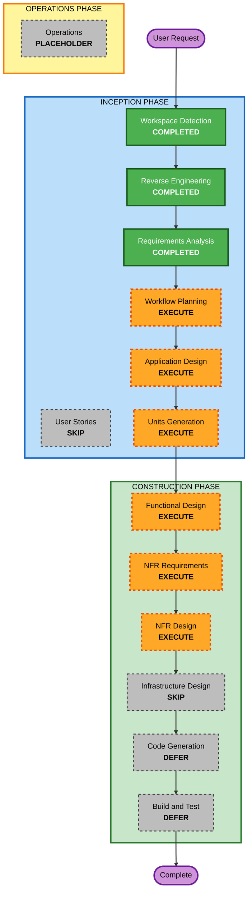

# Execution Plan

## Detailed Analysis Summary

### Transformation Scope (Brownfield Only)
- **Transformation Type**: Architectural transformation
- **Primary Changes**: Current `claude-code` integration must be refactored into an extensible runtime architecture using persistence boundaries, shim wrappers, adapter contracts, and runtime capability validation.
- **Related Components**:
  - `src/core/api/providers/claude-code.ts`
  - `src/integrations/claude-code/`
  - `src/core/api/index.ts`
  - `src/shared/api.ts`
  - `src/shared/storage/state-keys.ts`
  - `src/shared/proto-conversions/models/api-configuration-conversion.ts`
  - `src/shared/providers/providers.json`
  - `webview-ui/src/components/settings/`
  - runtime validation and configured-provider utilities

### Change Impact Assessment
- **User-facing changes**: Yes
  - Existing Claude Code UX should remain stable, but runtime configuration architecture and future provider onboarding path will be redesigned.
- **Structural changes**: Yes
  - Provider-centric runtime integration will be reshaped toward runtime adapter boundaries.
- **Data model changes**: Yes
  - Configuration schema and runtime metadata ownership boundaries will likely need extension.
- **API changes**: Yes
  - Internal adapter contracts, runtime invocation contracts, and validation interfaces will be introduced or reworked.
- **NFR impact**: Yes
  - Extensibility, security, testability, observability, and maintainability are all first-order concerns.

### Component Relationships (Brownfield Only)
## Component Relationships
- **Primary Component**: `claude-code` runtime integration path
- **Infrastructure Components**: None required at cloud/IaC level for this planning effort
- **Shared Components**:
  - shared provider/model contracts
  - state and proto conversion layers
  - configuration UI and validation layers
- **Dependent Components**:
  - CLI runtime behavior
  - settings UI
  - provider selection and configuration persistence
  - future runtime onboarding paths
- **Supporting Components**:
  - tests
  - logging
  - capability validation

For each related component:
- `src/core/api/providers/claude-code.ts`
  - **Change Type**: Major
  - **Change Reason**: Extract Claude-specific logic behind extensible adapter boundaries
  - **Change Priority**: Critical
- `src/integrations/claude-code/`
  - **Change Type**: Major
  - **Change Reason**: Convert direct runtime shelling logic into shim-layer reference implementation
  - **Change Priority**: Critical
- `src/core/api/index.ts`
  - **Change Type**: Major
  - **Change Reason**: Replace or encapsulate provider-switch wiring with runtime resolution structure
  - **Change Priority**: Critical
- `src/shared/api.ts`
  - **Change Type**: Major
  - **Change Reason**: Introduce clearer runtime/provider identity boundaries
  - **Change Priority**: Important
- `src/shared/storage/state-keys.ts`
  - **Change Type**: Minor to Major
  - **Change Reason**: Define persistence ownership for runtime config and credentials
  - **Change Priority**: Important
- `src/shared/proto-conversions/models/api-configuration-conversion.ts`
  - **Change Type**: Minor to Major
  - **Change Reason**: Preserve cross-process and UI compatibility for runtime settings
  - **Change Priority**: Important
- `webview-ui/src/components/settings/`
  - **Change Type**: Major
  - **Change Reason**: Support a stable UX on top of a new runtime architecture
  - **Change Priority**: Important
- test suites
  - **Change Type**: Major
  - **Change Reason**: Add TDD-oriented skeleton and regression coverage for runtime boundaries
  - **Change Priority**: Critical

### Risk Assessment
- **Risk Level**: High
- **Rollback Complexity**: Moderate to Difficult
- **Testing Complexity**: Complex

Risk rationale:
- The work affects multiple cross-cutting layers.
- Claude Code is the baseline external runtime and regression risk is high.
- Later MVP stages depend on the correctness of the first abstraction.

## Module Update Strategy
- **Update Approach**: Hybrid
- **Critical Path**:
  - Requirements -> Workflow Planning -> Application Design -> Units Generation
  - Runtime architecture contract definition
  - Claude Code reference adapter definition
  - Test strategy and skeleton-first validation plan
- **Coordination Points**:
  - shared provider and runtime identity definitions
  - storage schema boundaries
  - proto/UI configuration mapping
  - stream translation contracts
- **Testing Checkpoints**:
  - adapter contract design checkpoint
  - shim parser test design checkpoint
  - Claude Code regression matrix checkpoint
  - future runtime capability checklist checkpoint

Affected module strategy:
- Shared contracts and runtime registry concepts must be updated first
- Claude Code adapter and shim design follow after contract definition
- UI and proto/storage mapping update after runtime contract is stable
- Test skeletons and contract fixtures are designed in parallel with module boundaries

## Workflow Visualization

### Text Alternative
Phase 1: INCEPTION
- Workspace Detection: COMPLETED
- Reverse Engineering: COMPLETED
- Requirements Analysis: COMPLETED
- User Stories: SKIP
- Workflow Planning: EXECUTE
- Application Design: EXECUTE
- Units Generation: EXECUTE

Phase 2: CONSTRUCTION
- Functional Design: EXECUTE
- NFR Requirements: EXECUTE
- NFR Design: EXECUTE
- Infrastructure Design: SKIP
- Code Generation: DEFER
- Build and Test: DEFER

Phase 3: OPERATIONS
- Operations: PLACEHOLDER

## Phases to Execute

### Inception Phase
- [x] Workspace Detection
- [x] Reverse Engineering
- [x] Requirements Analysis
- [ ] User Stories - SKIP
  - **Rationale**: The request is architecture and implementation planning for a technical integration framework, not a user workflow feature definition.
- [x] Workflow Planning
- [ ] Application Design - EXECUTE
  - **Rationale**: New runtime-facing components, boundaries, and module relationships must be designed explicitly.
- [ ] Units Generation - EXECUTE
  - **Rationale**: The work naturally decomposes into multiple units such as runtime contract layer, Claude Code migration unit, future runtime compatibility unit, and test harness unit.

### Construction Phase
- [ ] Functional Design - EXECUTE
  - **Rationale**: Detailed contract, boundary, and per-unit behavior design is required before code work.
- [ ] NFR Requirements - EXECUTE
  - **Rationale**: Extensibility, security, observability, and regression containment are core constraints.
- [ ] NFR Design - EXECUTE
  - **Rationale**: The design must translate NFRs into runtime boundary and test architecture choices.
- [ ] Infrastructure Design - SKIP
  - **Rationale**: No new cloud or deployment infrastructure is being requested in this planning scope.
- [ ] Code Generation - DEFER
  - **Rationale**: The current request asks for planning artifacts. Code generation should begin only after design-stage approvals.
- [ ] Build and Test - DEFER
  - **Rationale**: Build and test execution belongs after actual code generation.

### Operations Phase
- [ ] Operations - PLACEHOLDER
  - **Rationale**: Not part of the current workflow scope.

## Recommended Next Execution Sequence
1. Execute Application Design to define the target runtime architecture, boundaries, and ownership.
2. Execute Units Generation to decompose the architecture into implementation-ready work units.
3. If the user wants to continue into construction, perform per-unit Functional Design, NFR Requirements, and NFR Design.
4. Defer actual code generation until design approvals are complete.

## User Control Notes
- The recommended plan keeps the work inside planning and design stages for now.
- If you want to collapse the process and move directly toward code scaffolding after Application Design and Units Generation, that can be chosen in the next approval step.
