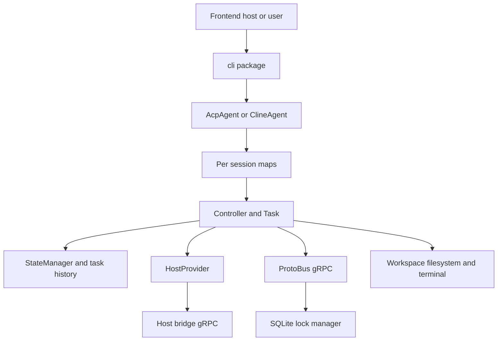
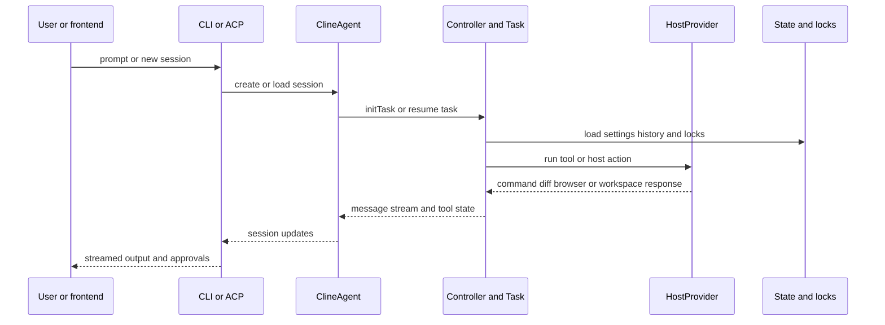

# System Architecture

## System Overview
This repository is a TypeScript monorepo centered on a shared agent engine. The root package supplies the VS Code extension and core controller stack, the `cli` workspace exposes a terminal and ACP-facing agent, `src/standalone` packages a detached runtime with gRPC services, and `webview-ui` renders the interactive frontend. For the requested focus area, `cline cli 2.0` is best understood as an agent control plane layered on top of the shared controller and task engine.

## Architecture Diagram

### Text Alternative
- `cli` accepts user input or ACP traffic.
- `ClineAgent` creates a session record, session state, and event emitter per session.
- Each session owns a `Controller`, which creates and runs a `Task`.
- The controller uses `StateManager` for persisted settings and history, `HostProvider` for tool access, and workspace detection plus task locking for safe execution.
- In standalone mode, `cline-core` starts ProtoBus and uses a SQLite lock registry plus host bridge gRPC clients.

## Component Descriptions
### Root extension package
- **Purpose**: Houses the shared controller, task, host abstractions, storage, and extension shell.
- **Responsibilities**: Core runtime, persistence, MCP, telemetry, prompts, hooks, and workspace management.
- **Dependencies**: Shared contracts, host implementations, storage, task engine, generated gRPC bindings.
- **Type**: Application foundation

### `cli`
- **Purpose**: Terminal UX and ACP-compatible agent entrypoint.
- **Responsibilities**: CLI command parsing, mode selection, task bootstrap, session abstraction, and ACP transport over stdio.
- **Dependencies**: Core controller, host provider, state manager, ACP SDK, React Ink UI.
- **Type**: Application

### `src/standalone`
- **Purpose**: Detached runtime for external hosts.
- **Responsibilities**: Process startup, host bridge readiness checks, ProtoBus service hosting, and instance registration via SQLite.
- **Dependencies**: Controller, external host bridge clients, gRPC, SQLite lock manager.
- **Type**: Application runtime

### `webview-ui`
- **Purpose**: IDE-facing frontend.
- **Responsibilities**: Render task stream, settings, onboarding, diffs, and review actions using shared message contracts.
- **Dependencies**: Shared contracts and Vite-based frontend tooling.
- **Type**: Application

### `testing-platform` and `evals`
- **Purpose**: Validation and benchmark infrastructure.
- **Responsibilities**: E2E tests, scenario harnesses, benchmark tasks, and analytics.
- **Dependencies**: Root runtime contracts plus test frameworks.
- **Type**: Test and support

## Data Flow

### Text Alternative
1. The frontend or user starts a new session or sends a prompt.
2. The CLI control plane creates or resumes a session and associates it with a controller.
3. The controller loads state, initializes a task, and acquires task or folder locks.
4. The task invokes tools through the host provider, which reaches terminals, diff views, browser helpers, or the standalone host bridge.
5. Messages are translated into session updates and streamed back to the caller.

## Integration Points
- **External APIs**:
  - Model provider APIs through the shared API layer.
  - OpenRouter model discovery in CLI model selection paths.
  - OAuth browser flows for Cline and ChatGPT auth.
- **Databases**:
  - Local SQLite database for standalone lock management.
- **Third-party Services**:
  - ACP SDK for agent protocol integration.
  - gRPC for standalone host bridge and ProtoBus communication.
  - PostHog and OpenTelemetry for telemetry paths.

## Infrastructure Components
- **Standalone services**:
  - ProtoBus gRPC server at default port `26040`.
  - Host bridge health-checked at default port `26041`.
- **Deployment Model**: Local process model. VS Code extension, CLI process, and standalone runtime can run independently while sharing common code.
- **Networking**: Localhost gRPC only in the inspected standalone runtime path.
