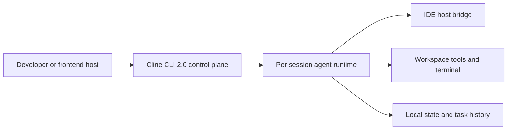

# Business Overview

## Business Context Diagram

### Text Alternative
- User-facing hosts such as Cline, Codex, and Claude Code connect to the `cline cli 2.0` control plane.
- The CLI creates an isolated runtime per session, coordinates permissions and streaming updates, and routes execution into workspace tools, host bridge APIs, and persisted local state.

## Business Description
- **Business Description**: This system provides an agent runtime platform for interactive coding assistants. In this repository, `cline cli 2.0` acts as the frontend-agent control plane that accepts user prompts, creates isolated sessions, maps them to task controllers, brokers tool permissions, and streams agent progress back to the caller.
- **Business Transactions**:
  - Start a CLI or ACP agent session for a workspace.
  - Initialize or resume a coding task with task history and settings.
  - Stream model reasoning, tool calls, command output, and plan updates to the frontend.
  - Request and process permission decisions before file edits, commands, or browser actions.
  - Route host interactions through a standalone host bridge and ProtoBus runtime when running outside VS Code.
  - Acquire and release workspace or folder locks so multiple runtimes do not collide.
  - Persist state, history, auth, and task settings across sessions.
- **Business Dictionary**:
  - **Session**: A single conversational execution context with its own controller, status, event emitter, and prompt lifecycle.
  - **Task**: The concrete agent job running inside a session, backed by task history and workspace context.
  - **ACP**: Agent Client Protocol interface used to expose the CLI as a programmatic or stdio agent.
  - **Host Bridge**: External gRPC bridge used to access host capabilities such as diff views, windows, environment, and workspace actions.
  - **ProtoBus**: Standalone gRPC service that exposes controller-backed operations for remote clients.
  - **Control Plane**: The orchestration layer that owns session creation, permission gating, prompt routing, and runtime wiring.

## Component Level Business Descriptions
### CLI package
- **Purpose**: Presents the terminal UI and ACP entrypoints that expose Cline as a session-driven agent runtime.
- **Responsibilities**: Start tasks, select output modes, manage CLI state overrides, and expose `ClineAgent` for embedding.

### Core controller and task engine
- **Purpose**: Execute coding tasks inside a workspace-aware controller.
- **Responsibilities**: Build task context, manage prompts and tools, persist task history, and coordinate approvals and telemetry.

### Standalone runtime
- **Purpose**: Host the agent engine outside IDE extension boundaries.
- **Responsibilities**: Start ProtoBus, connect to host bridge, register instance locks, and keep runtime services alive.

### Host bridge and external providers
- **Purpose**: Abstract editor, diff, terminal, and environment capabilities.
- **Responsibilities**: Provide a uniform host interface for CLI, ACP, and standalone execution modes.

### Webview UI and extension shell
- **Purpose**: Provide the primary interactive UI when running as an IDE extension.
- **Responsibilities**: Render task state, settings, history, and review flows using shared message contracts.
