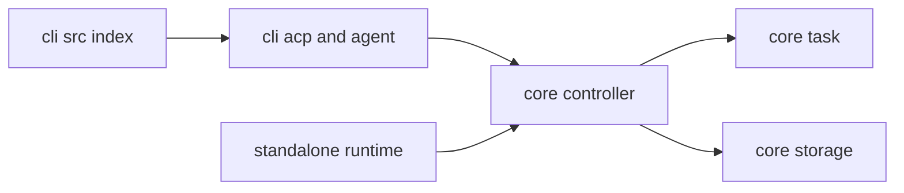

# Code Structure

## Build System
- **Type**: npm workspaces with TypeScript, esbuild, Vite, and Biome
- **Configuration**:
  - Root package coordinates extension builds, linting, formatting, and Playwright E2E.
  - `cli/package.json` builds the distributable CLI and ACP library.
  - `webview-ui/package.json` builds the UI bundle and Storybook artifacts.

## Key Modules

### Text Alternative
- `cli/src/index.ts` is the command-line bootstrap.
- `cli/src/agent/ClineAgent.ts` provides the decoupled session control plane.
- `cli/src/acp/AcpAgent.ts` bridges ACP transport to the agent.
- `src/core/controller/index.ts` owns task lifecycle and workspace wiring.
- `src/core/task` contains the runtime behavior for agent tasks.
- `src/standalone` hosts the detached service process.

### Existing Files Inventory
- `cli/src/index.ts` - CLI bootstrap, mode selection, and runtime initialization.
- `cli/src/acp/index.ts` - ACP stdio entrypoint and exports for embedded agent use.
- `cli/src/acp/AcpAgent.ts` - ACP wrapper that forwards permissions and session updates.
- `cli/src/agent/ClineAgent.ts` - Session-oriented control plane that maps ACP requests to controllers and tasks.
- `cli/src/agent/ClineSessionEmitter.ts` - Per-session event emitter abstraction.
- `src/core/controller/index.ts` - Central controller for task lifecycle, state, auth, MCP, and workspace operations.
- `src/core/task/*` - Agent execution engine, tools, prompts, checkpoints, and message state.
- `src/core/storage/StateManager.ts` - In-memory plus file-backed settings and task-history cache.
- `src/shared/services/Session.ts` - Per-controller resource and timing metrics.
- `src/standalone/cline-core.ts` - Detached runtime entrypoint for starting services.
- `src/standalone/protobus-service.ts` - gRPC service that exposes controller-backed operations.
- `src/standalone/hostbridge-client.ts` - Health checks and connectivity to host bridge.
- `src/core/locks/SqliteLockManager.ts` - SQLite-backed instance and folder lock coordination.
- `src/hosts/external/host-bridge-client-manager.ts` - Reusable gRPC clients for external host APIs.
- `webview-ui/src/*` - User interface for task history, messages, settings, reviews, and onboarding.

## Design Patterns
### Session isolation via maps
- **Location**: `cli/src/agent/ClineAgent.ts`
- **Purpose**: Give each session its own controller handle, emitter, runtime state, and activity timestamps.
- **Implementation**: `Map` and `WeakMap` collections keyed by `sessionId` or session objects.

### Host abstraction
- **Location**: `HostProvider` initialization paths in CLI, extension, and standalone runtime
- **Purpose**: Keep core task logic independent of whether it runs in VS Code, CLI, or standalone mode.
- **Implementation**: Dependency injection of webview, diff, terminal, comment review, and host-bridge clients.

### File-backed cache with in-memory reads
- **Location**: `src/core/storage/StateManager.ts`
- **Purpose**: Fast reads with debounced persistence and natural isolation between concurrently running instances.
- **Implementation**: Load-once caches plus async write-back and selective watchers.

### Process-paired runtime services
- **Location**: `src/standalone/cline-core.ts`
- **Purpose**: Separate control-plane orchestration from host-specific execution channels.
- **Implementation**: Dedicated process startup, host bridge readiness checks, gRPC service hosting, and lock registration.

## Critical Dependencies
### `@agentclientprotocol/sdk`
- **Version**: `^0.13.1`
- **Usage**: ACP session lifecycle, stdio transport, permission requests, and session update contracts in the CLI package.
- **Purpose**: Make the CLI embeddable as a structured agent runtime.

### `@grpc/grpc-js` and reflection packages
- **Version**: Root package-managed
- **Usage**: ProtoBus service and host bridge clients in standalone mode.
- **Purpose**: Local RPC transport between control plane and host capabilities.

### `better-sqlite3`
- **Version**: `^12.4.1`
- **Usage**: Lock registry for runtime instances and folder locks.
- **Purpose**: Coordinate isolated standalone runtimes safely on a single machine.

### `ink`
- **Version**: `npm:@jrichman/ink@6.4.7`
- **Usage**: Terminal UI rendering for CLI mode.
- **Purpose**: Provide a rich interactive frontend for the control plane.
