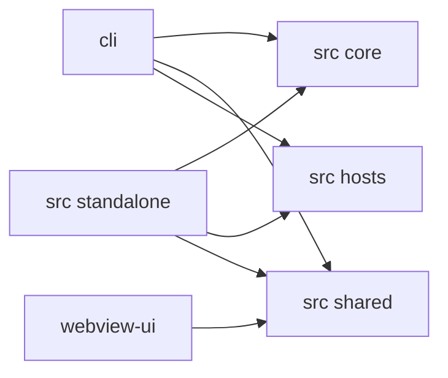

# Dependencies

## Internal Dependencies

### Text Alternative
- `cli` depends on core controller, shared contracts, and host abstractions.
- `standalone` depends on core controller, shared contracts, and external host clients.
- `webview-ui` depends primarily on shared message and state contracts.

### `cli` depends on `src/core`
- **Type**: Runtime
- **Reason**: Uses `Controller`, task initialization, prompts, storage, and host-provider integration.

### `cli` depends on `src/shared`
- **Type**: Runtime
- **Reason**: Uses message contracts, API provider types, storage keys, and session metrics.

### `src/standalone` depends on `src/core`
- **Type**: Runtime
- **Reason**: Starts controller-backed services and lock handling.

### `webview-ui` depends on `src/shared`
- **Type**: Compile and runtime contract dependency
- **Reason**: Uses shared webview and extension message schemas.

## External Dependencies
### `@agentclientprotocol/sdk`
- **Version**: `^0.13.1`
- **Purpose**: ACP transport, request, response, and session-update contracts.
- **License**: Not verified in this pass

### `ink`
- **Version**: `npm:@jrichman/ink@6.4.7`
- **Purpose**: Rich terminal UI rendering.
- **License**: Not verified in this pass

### `@grpc/grpc-js`
- **Version**: Root package-managed
- **Purpose**: Local RPC transport for standalone host bridge and ProtoBus.
- **License**: Not verified in this pass

### `better-sqlite3`
- **Version**: `^12.4.1`
- **Purpose**: Fast local lock registry for instance and folder coordination.
- **License**: Not verified in this pass

### `react`
- **Version**: `19.x`
- **Purpose**: UI rendering for both terminal and webview surfaces.
- **License**: Not verified in this pass
