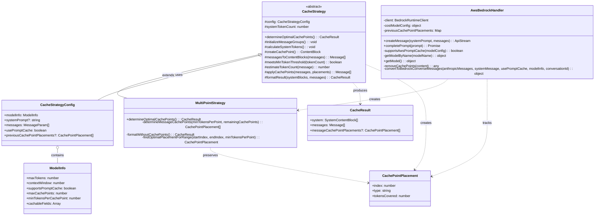
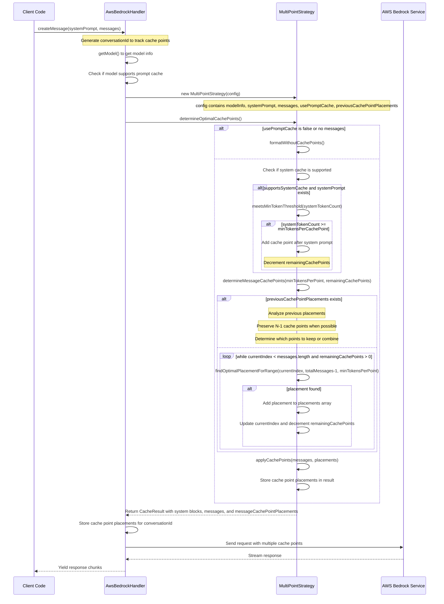

# Cache Strategy Documentation

This document provides an overview of the cache strategy implementation for AWS Bedrock in the Roo-Code project, including class relationships and sequence diagrams.

## Class Relationship Diagram



## Sequence Diagram: Multi-Point Strategy

This diagram illustrates the process flow when using the MultiPointStrategy with multiple cache points in messages.



## Key Concepts

### Cache Strategy

The cache strategy system is designed to optimize the placement of cache points in AWS Bedrock API requests. Cache points allow the service to reuse previously processed parts of the prompt, reducing token usage and improving response times.

- **MultiPointStrategy**: Upon first MR of Bedrock caching, this strategy is used for all cache point placement scenarios. It distributes cache points throughout the conversation to maximize caching efficiency, whether the model supports one or multiple cache points.

### MultiPointStrategy Placement Logic

- **System Prompt Caching**: If the system prompt is large enough (exceeds minTokensPerCachePoint), a cache point is placed after it.

- **Message Caching**: The strategy uses a simplified approach for placing cache points in messages:

    1. For new conversations (no previous cache points):

        - It iteratively finds the last user message in each range
        - It ensures each placement covers at least the minimum token threshold
        - It continues until all available cache points are used or no more valid placements can be found

    2. For growing conversations (with previous cache points):
        - It preserves previous cache points when possible
        - It analyzes the token distribution between existing cache points
        - It compares the token count of new messages with the smallest gap between existing cache points
        - It only combines cache points if the new messages have more tokens than the smallest gap

A key challenge in cache point placement is maintaining consistency across consecutive messages in a growing conversation. When new messages are added to a conversation, we want to ensure that:

1. Cache points from previous messages are reused as much as possible to maximize cache hits
2. New cache points are placed optimally for the new messages

The simplified approach ensures that:

- Cache points are always placed after user messages, which are natural conversation boundaries
- Each cache point covers at least the minimum token threshold
- N-1 cache points remain in the same location when possible in growing conversations
- Cache points are combined only when it makes sense to do so (when the benefit outweighs the cost)
- New messages receive cache points only when they contain enough tokens to justify the reallocation

The examples in this document reflect this optimized implementation.

### Integration with AWS Bedrock

The AwsBedrockHandler class integrates with the cache strategies by:

1. Determining if the model supports prompt caching
2. Creating the appropriate strategy based on model capabilities
3. Applying the strategy to format messages with optimal cache points
4. Sending the formatted request to AWS Bedrock
5. Processing and returning the response

## Usage Considerations

- Cache points are only effective if the same content is reused across multiple requests
- The minimum token threshold ensures cache points are only placed where they provide meaningful benefits
- System prompt caching is prioritized when available, as it's typically static across requests
- Message caching is more complex and depends on conversation structure and token distribution

## Examples: Multi-Point Strategy Cache Point Placement

### Example 1: Initial Cache Point Placement

In this example, we'll demonstrate how the `determineMessageCachePoints` method places cache points in a new conversation.

**Input Configuration:**

```javascript
const config = {
	modelInfo: {
		maxTokens: 4096,
		contextWindow: 200000,
		supportsPromptCache: true,
		maxCachePoints: 3,
		minTokensPerCachePoint: 100,
		cachableFields: ["system", "messages"],
	},
	systemPrompt: "You are a helpful assistant.", // ~10 tokens
	messages: [
		{ role: "user", content: "Tell me about machine learning." }, // ~50 tokens
		{ role: "assistant", content: "Machine learning is a field of study..." }, // ~150 tokens
		{ role: "user", content: "What about deep learning?" }, // ~40 tokens
		{ role: "assistant", content: "Deep learning is a subset of machine learning..." }, // ~160 tokens
	],
	usePromptCache: true,
}
```

**Execution Process:**

1. First, the system prompt is evaluated for caching (10 tokens < minTokensPerCachePoint of 100), so no cache point is used there.
2. The `determineMessageCachePoints` method is called with `minTokensPerPoint = 100` and `remainingCachePoints = 3`.
3. Since there are no previous cache point placements, it enters the special case for new conversations.
4. It calls `findOptimalPlacementForRange` with the entire message range.
5. The method finds the last user message in the range (index 2: "What about deep learning?").
6. It calculates the total tokens covered (240) and verifies it exceeds the minimum threshold (100).
7. It adds this placement to the placements array and continues the process for the next range.
8. Since there are no more user messages after this point that would cover enough tokens, no more cache points are placed.

**Output Cache Point Placements:**

```javascript
;[
	{
		index: 2, // After the second user message (What about deep learning?)
		type: "message",
		tokensCovered: 240, // ~240 tokens covered (first 3 messages)
	},
]
```

**Resulting Message Structure:**

```
[User]: Tell me about machine learning.
[Assistant]: Machine learning is a field of study...
[User]: What about deep learning?
[CACHE POINT]
[Assistant]: Deep learning is a subset of machine learning...
```

**Note**: The algorithm places a cache point after the second user message (the last user message in the range) because it's the optimal placement and the accumulated tokens (240) exceed the minimum threshold (100).

### Example 2: Adding One Exchange with Cache Point Preservation

Now, let's see what happens when we add one more exchange (user-assistant pair) to the conversation and use the cache point preservation logic:

**Updated Input Configuration with Previous Cache Points:**

```javascript
const config = {
	// Same modelInfo and systemPrompt as before
	messages: [
		// Previous 4 messages...
		{ role: "user", content: "How do neural networks work?" }, // ~50 tokens
		{ role: "assistant", content: "Neural networks are composed of layers of nodes..." }, // ~180 tokens
	],
	usePromptCache: true,
	// Pass the previous cache point placements from Example 1
	previousCachePointPlacements: [
		{
			index: 2, // After the second user message (What about deep learning?)
			type: "message",
			tokensCovered: 240,
		},
	],
}
```

**Execution Process for Example 2 with Cache Point Preservation:**

1. The system prompt evaluation remains the same (no cache point used).
2. The algorithm detects that `previousCachePointPlacements` is provided in the config.
3. It analyzes the previous cache point placements and the current message structure.
4. Since we have 3 total cache points available and used 1 in the previous conversation, we can preserve the previous cache point and still have 2 remaining for the new messages.
5. The algorithm preserves the cache point from the previous conversation:
    - The cache point at index 2 (after "What about deep learning?")
6. It then calculates the optimal placement for the remaining cache points based on the new messages.
7. Since there are 2 new messages with significant token count (230 tokens), it places a second cache point after the new user message.

**Output Cache Point Placements with Preservation:**

```javascript
;[
	{
		index: 2, // After the second user message (What about deep learning?) - PRESERVED
		type: "message",
		tokensCovered: 240, // ~240 tokens covered (first 3 messages)
	},
	{
		index: 4, // After the third user message (How do neural networks work?) - NEW PLACEMENT
		type: "message",
		tokensCovered: 230, // ~230 tokens covered (messages between cache points)
	},
]
```

**Resulting Message Structure with Preservation:**

```
[User]: Tell me about machine learning.
[Assistant]: Machine learning is a field of study...
[User]: What about deep learning?
[CACHE POINT 1] - PRESERVED FROM PREVIOUS
[Assistant]: Deep learning is a subset of machine learning...
[User]: How do neural networks work?
[CACHE POINT 2] - NEW PLACEMENT
[Assistant]: Neural networks are composed of layers of nodes...
```

**Note**: The algorithm preserved the cache point from the previous conversation and placed a new cache point for the new messages. This ensures maximum cache hit rates while still adapting to the growing conversation.

### Example 3: Adding Another Exchange with Cache Point Preservation

Let's add one more exchange to see how the cache strategy continues to adapt:

**Updated Input Configuration with Previous Cache Points:**

```javascript
const config = {
	// Same modelInfo and systemPrompt as before
	messages: [
		// Previous 6 messages...
		{ role: "user", content: "Can you explain backpropagation?" }, // ~40 tokens
		{ role: "assistant", content: "Backpropagation is an algorithm used to train neural networks..." }, // ~170 tokens
	],
	usePromptCache: true,
	// Pass the previous cache point placements from Example 2
	previousCachePointPlacements: [
		{
			index: 2, // After the second user message (What about deep learning?)
			type: "message",
			tokensCovered: 240,
		},
		{
			index: 4, // After the third user message (How do neural networks work?)
			type: "message",
			tokensCovered: 230,
		},
	],
}
```

**Execution Process for Example 3 with Cache Point Preservation:**

1. The system prompt evaluation remains the same (no cache point used).
2. The algorithm detects that `previousCachePointPlacements` is provided in the config.
3. It analyzes the previous cache point placements and the current message structure.
4. Following the N-1 preservation rule, it decides to keep both previous cache points (at indices 2 and 4) since there are 3 total cache points available.
5. It then calculates the optimal placement for the remaining cache point based on the new messages.
6. Since there are 2 new messages with significant token count (210 tokens), it places a new cache point after the new user message.

**Output Cache Point Placements with Preservation:**

```javascript
;[
	{
		index: 2, // After the second user message (What about deep learning?) - PRESERVED
		type: "message",
		tokensCovered: 240, // ~240 tokens covered (first 3 messages)
	},
	{
		index: 4, // After the third user message (How do neural networks work?) - PRESERVED
		type: "message",
		tokensCovered: 230, // ~230 tokens covered (messages between cache points)
	},
	{
		index: 6, // After the fourth user message (Can you explain backpropagation?) - NEW PLACEMENT
		type: "message",
		tokensCovered: 210, // ~210 tokens covered (messages between cache points)
	},
]
```

**Resulting Message Structure with Preservation:**

```
[User]: Tell me about machine learning.
[Assistant]: Machine learning is a field of study...
[User]: What about deep learning?
[CACHE POINT 1] - PRESERVED FROM PREVIOUS
[Assistant]: Deep learning is a subset of machine learning...
[User]: How do neural networks work?
[CACHE POINT 2] - PRESERVED FROM PREVIOUS
[Assistant]: Neural networks are composed of layers of nodes...
[User]: Can you explain backpropagation?
[CACHE POINT 3] - NEW PLACEMENT
[Assistant]: Backpropagation is an algorithm used to train neural networks...
```

**Note**: The algorithm preserved both cache points from the previous conversation and placed a new cache point for the new messages. This ensures maximum cache hit rates while still adapting to the growing conversation.

### Example 4: Adding Messages (With Token Comparison)

In this example, we'll demonstrate how the algorithm handles the case when new messages have a token count small enough that cache points should not be changed:

**Updated Input Configuration with Previous Cache Points:**

```javascript
const config = {
	// Same modelInfo and systemPrompt as before
	messages: [
		// Previous 10 messages...
		{
			role: "user",
			content: "Can you explain the difference between supervised and unsupervised learning in detail?",
		}, // ~80 tokens
		{
			role: "assistant",
			content:
				"Certainly! Supervised learning and unsupervised learning are two fundamental paradigms in machine learning with..",
		}, // ~130 tokens
	],
	usePromptCache: true,
	// Pass the previous cache point placements from Example 3
	previousCachePointPlacements: [
		{
			index: 2, // After the second user message
			type: "message",
			tokensCovered: 240,
		},
		{
			index: 6, // After the fourth user message
			type: "message",
			tokensCovered: 440,
		},
		{
			index: 8, // After the fifth user message
			type: "message",
			tokensCovered: 260,
		},
	],
}
```

**Execution Process for Example 4 with Token Comparison:**

1. The algorithm detects that all cache points are used and new messages have been added.
2. It calculates the token count of the new messages (210 tokens).
3. It analyzes the token distribution between existing cache points and finds the smallest gap (260 tokens).
4. It compares the token count of new messages (210) with the smallest gap (260).
5. Since the new messages have less tokens than the smallest gap (210 < 260), it decides not to re-allocate cache points
6. All existing cache points are preserved, and no cache point is allocated for the new messages.

**Output Cache Point Placements (Unchanged):**

```javascript
;[
	{
		index: 2, // After the second user message - PRESERVED
		type: "message",
		tokensCovered: 240,
	},
	{
		index: 6, // After the fourth user message - PRESERVED
		type: "message",
		tokensCovered: 440,
	},
	{
		index: 8, // After the fifth user message - PRESERVED
		type: "message",
		tokensCovered: 260,
	},
]
```

**Resulting Message Structure:**

```
[User]: Tell me about machine learning.
[Assistant]: Machine learning is a field of study...
[User]: What about deep learning?
[CACHE POINT 1] - PRESERVED
[Assistant]: Deep learning is a subset of machine learning...
[User]: How do neural networks work?
[Assistant]: Neural networks are composed of layers of nodes...
[User]: Can you explain backpropagation?
[CACHE POINT 2] - PRESERVED
[Assistant]: Backpropagation is an algorithm used to train neural networks...
[User]: What are some applications of deep learning?
[CACHE POINT 3] - PRESERVED
[Assistant]: Deep learning has many applications including...
[User]: Can you explain the difference between supervised and unsupervised learning in detail?
[Assistant]: Certainly! Supervised learning and unsupervised learning are two fundamental paradigms in machine learning with...
```

**Note**: In this case, the algorithm determined that the new messages are the smallest portion of the message history in comparison to existing cache points. Restructuring the cache points to make room to cache the new messages would be a net negative since it would not make use of 2 previously cached blocks, would have to re-write those 2 as a single cache point, and would write a new small cache point that would be chosen to be merged in the next round of messages.

### Example 5: Adding Messages that reallocate cache points

Now let's see what happens when we add messages with a larger token count:

**Updated Input Configuration with Previous Cache Points:**

```javascript
const config = {
	// Same modelInfo and systemPrompt as before
	messages: [
		// Previous 10 messages...
		{
			role: "user",
			content: "Can you provide a detailed example of implementing a neural network for image classification?",
		}, // ~100 tokens
		{
			role: "assistant",
			content:
				"Certainly! Here's a detailed example of implementing a convolutional neural network (CNN) for image classification using TensorFlow and Keras...",
		}, // ~300 tokens
	],
	usePromptCache: true,
	// Pass the previous cache point placements from Example 3
	previousCachePointPlacements: [
		{
			index: 2, // After the second user message
			type: "message",
			tokensCovered: 240,
		},
		{
			index: 6, // After the fourth user message
			type: "message",
			tokensCovered: 440,
		},
		{
			index: 8, // After the fifth user message
			type: "message",
			tokensCovered: 260,
		},
	],
}
```

**Execution Process for Example 5 with Token Comparison:**

1. The algorithm detects that all cache points are used and new messages have been added.
2. It calculates the token count of the new messages (400 tokens).
3. It analyzes the token distribution between existing cache points and finds the smallest gap (260 tokens).
4. It calculates the required token threshold by applying a 20% increase to the smallest gap (260 \* 1.2 = 312).
5. It compares the token count of new messages (400) with this threshold (312).
6. Since the new messages have significantly more tokens than the threshold (400 > 312), it decides to combine cache points.
7. It identifies that the cache point at index 8 has the smallest token coverage (260 tokens).
8. It removes this cache point and places a new one after the new user message.

**Output Cache Point Placements with Reallocation:**

```javascript
;[
	{
		index: 2, // After the second user message - PRESERVED
		type: "message",
		tokensCovered: 240,
	},
	{
		index: 6, // After the fourth user message - PRESERVED
		type: "message",
		tokensCovered: 440,
	},
	{
		index: 10, // After the sixth user message - NEW PLACEMENT
		type: "message",
		tokensCovered: 660, // Tokens from messages 7 through 10 (260 + 400)
	},
]
```

**Resulting Message Structure:**

```
[User]: Tell me about machine learning.
[Assistant]: Machine learning is a field of study...
[User]: What about deep learning?
[CACHE POINT 1] - PRESERVED
[Assistant]: Deep learning is a subset of machine learning...
[User]: How do neural networks work?
[Assistant]: Neural networks are composed of layers of nodes...
[User]: Can you explain backpropagation?
[CACHE POINT 2] - PRESERVED
[Assistant]: Backpropagation is an algorithm used to train neural networks...
[User]: What are some applications of deep learning?
[Assistant]: Deep learning has many applications including...
[User]: Can you provide a detailed example of implementing a neural network for image classification?
[CACHE POINT 3] - NEW PLACEMENT
[Assistant]: Certainly! Here's a detailed example of implementing a convolutional neural network (CNN) for image classification using TensorFlow and Keras...
```

**Note**: In this case, the algorithm determined that it would be beneficial to reallocate a cache point for the new messages since they contain more tokens than the smallest gap between existing cache points. This optimization ensures that the most token-heavy parts of the conversation are cached.

**Important**: The `tokensCovered` value for each cache point represents the total number of tokens from the previous cache point (or the beginning of the conversation for the first cache point) up to the current cache point. For example, the cache point at index 10 covers 660 tokens, which includes all tokens from messages 7 through 10 (after the cache point at index 6 up to and including the cache point at index 10).

### Key Observations

1. **Simple Initial Placement Logic**: The last user message in the range that meets the minimum token threshold is set as a cache point.

2. **User Message Boundary Requirement**: Cache points are placed exclusively after user messages, not after assistant messages. This ensures cache points are placed at natural conversation boundaries where the user has provided input.

3. **Token Threshold Enforcement**: Each segment between cache points must meet the minimum token threshold (100 tokens in our examples) to be considered for caching. This is enforced by a guard clause that checks if the total tokens covered by a placement meets the minimum threshold.

4. **Adaptive Placement for Growing Conversations**: As the conversation grows, the strategy adapts by preserving previous cache points when possible and only reallocating them when beneficial.

5. **Token Comparison Optimization with Required Increase**: When all cache points are used and new messages are added, the algorithm compares the token count of new messages with the smallest combined token count of contiguous existing cache points, applying a required percentage increase (20%) to ensure reallocation is worth it. Cache points are only combined if the new messages have significantly more tokens than this threshold, ensuring that reallocation is only done when it results in a substantial net positive effect on caching efficiency.

This adaptive approach ensures that as conversations grow, the caching strategy continues to optimize token usage and response times by strategically placing cache points at the most effective positions, while avoiding inefficient reallocations that could result in a net negative effect on caching performance.
