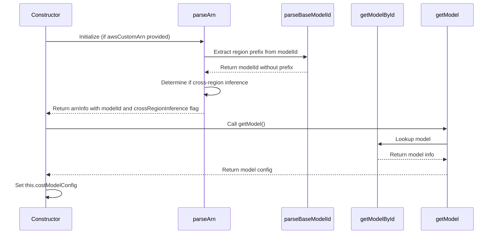
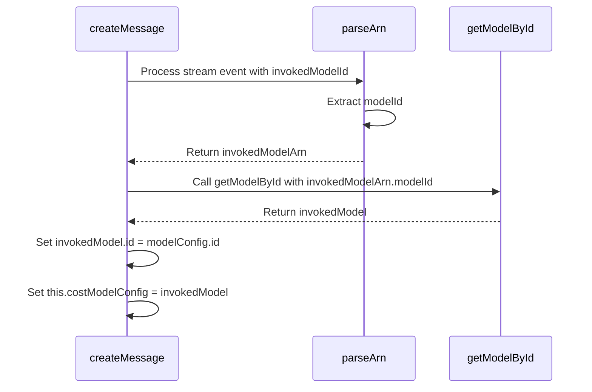

# Bedrock Model Identification

This document explains how model information is identified and managed in the Amazon Bedrock provider implementation (`bedrock.ts`). It focuses on the sequence of operations that determine the `costModelConfig` property, which is crucial for token counting, pricing, and other features.

## Model Identification Flow

The `costModelConfig` property is set through different paths depending on the input configuration and response data from Bedrock. Below is a sequence diagram of how model identification works:



### During Stream Processing (with Prompt Router)



## Input Examples and Resulting Values

### Example 1: Standard Model Selection

**Input:**

```javascript
const handler = new AwsBedrockHandler({
	apiModelId: "anthropic.claude-3-5-sonnet-20241022-v2:0",
	awsAccessKey: "ACCESS_KEY",
	awsSecretKey: "SECRET_KEY",
	awsRegion: "us-east-1",
})
```

**Sequence:**

1. Constructor initializes with options
2. Constructor calls `getModel()`
3. `getModel()` calls `getModelById("anthropic.claude-3-5-sonnet-20241022-v2:0")`
4. `getModelById()` looks up the model in `bedrockModels`
5. `this.costModelConfig` is set to:
    ```javascript
    {
      id: "anthropic.claude-3-5-sonnet-20241022-v2:0",
      info: {
        maxTokens: 4096,
        contextWindow: 128000,
        inputPrice: 3,
        outputPrice: 15,
        // other model properties...
      }
    }
    ```

### Example 2: Custom ARN for Foundation Model

**Input:**

```javascript
const handler = new AwsBedrockHandler({
	apiModelId: "anthropic.claude-3-5-sonnet-20241022-v2:0",
	awsAccessKey: "ACCESS_KEY",
	awsSecretKey: "SECRET_KEY",
	awsRegion: "us-east-1",
	awsCustomArn: "arn:aws:bedrock:us-east-1::foundation-model/anthropic.claude-3-5-sonnet-20241022-v2:0",
})
```

**Sequence:**

1. Constructor initializes with options
2. Constructor calls `parseArn("arn:aws:bedrock:us-east-1::foundation-model/anthropic.claude-3-5-sonnet-20241022-v2:0")`
3. `parseArn()` extracts:
    ```javascript
    {
      isValid: true,
      region: "us-east-1",
      modelType: "foundation-model",
      modelId: "anthropic.claude-3-5-sonnet-20241022-v2:0",
      crossRegionInference: false
    }
    ```
4. Constructor sets `this.arnInfo` to the result
5. Constructor calls `getModel()`
6. `getModel()` calls `getModelById("anthropic.claude-3-5-sonnet-20241022-v2:0")`
7. `getModelById()` looks up the model in `bedrockModels`
8. `this.costModelConfig` is set to:
    ```javascript
    {
      id: "anthropic.claude-3-5-sonnet-20241022-v2:0", // Note: ID is not the ARN since it's a foundation-model
      info: {
        maxTokens: 4096,
        contextWindow: 128000,
        inputPrice: 3,
        outputPrice: 15,
        // other model properties...
      }
    }
    ```

### Example 3: Custom ARN for Prompt Router

**Input:**

```javascript
const handler = new AwsBedrockHandler({
	apiModelId: "anthropic.claude-3-5-sonnet-20241022-v2:0",
	awsAccessKey: "ACCESS_KEY",
	awsSecretKey: "SECRET_KEY",
	awsRegion: "us-west-2",
	awsCustomArn: "arn:aws:bedrock:us-west-2:123456789012:prompt-router/my-router",
})
```

**Sequence:**

1. Constructor initializes with options
2. Constructor calls `parseArn("arn:aws:bedrock:us-west-2:123456789012:prompt-router/my-router")`
3. `parseArn()` extracts:
    ```javascript
    {
      isValid: true,
      region: "us-west-2",
      modelType: "prompt-router",
      modelId: "my-router",
      crossRegionInference: false
    }
    ```
4. Constructor sets `this.arnInfo` to the result
5. Constructor calls `getModel()`
6. `getModel()` calls `getModelById("my-router")`
7. `getModelById()` doesn't find "my-router" in `bedrockModels`, returns default model info
8. Since `this.arnInfo.modelType` is "prompt-router" (not "foundation-model"), `getModel()` sets the ID to the full ARN
9. `this.costModelConfig` is set to:
    ```javascript
    {
      id: "arn:aws:bedrock:us-west-2:123456789012:prompt-router/my-router", // Full ARN as ID
      info: {
        // Default model info for prompt routers
        maxTokens: 4096,
        contextWindow: 128000,
        inputPrice: 3,
        outputPrice: 15,
        // other model properties...
      }
    }
    ```

### Example 4: Cross-Region Inference

**Input:**

```javascript
const handler = new AwsBedrockHandler({
	apiModelId: "anthropic.claude-3-5-sonnet-20241022-v2:0",
	awsAccessKey: "ACCESS_KEY",
	awsSecretKey: "SECRET_KEY",
	awsRegion: "eu-west-1",
	awsUseCrossRegionInference: true,
})
```

**Sequence:**

1. Constructor initializes with options
2. Constructor calls `getModel()`
3. `getModel()` calls `getModelById("anthropic.claude-3-5-sonnet-20241022-v2:0")`
4. `getModelById()` looks up the model in `bedrockModels`
5. Since `awsUseCrossRegionInference` is true, `getModel()` gets the prefix for "eu-west-1" (which is "eu.")
6. `getModel()` prepends "eu." to the model ID
7. `this.costModelConfig` is set to:
    ```javascript
    {
      id: "eu.anthropic.claude-3-5-sonnet-20241022-v2:0", // Note the "eu." prefix
      info: {
        maxTokens: 4096,
        contextWindow: 128000,
        inputPrice: 3,
        outputPrice: 15,
        // other model properties...
      }
    }
    ```

### Example 5: Prompt Router with invokedModelId in Stream

**Initial Input:**

```javascript
const handler = new AwsBedrockHandler({
	awsAccessKey: "ACCESS_KEY",
	awsSecretKey: "SECRET_KEY",
	awsRegion: "us-west-2",
	awsCustomArn: "arn:aws:bedrock:us-west-2:123456789012:prompt-router/my-router",
})
```

**Initial Sequence (same as Example 3):**

1. `this.costModelConfig` is initially set to:
    ```javascript
    {
      id: "arn:aws:bedrock:us-west-2:123456789012:prompt-router/my-router",
      info: {
        // Default model info for prompt routers
        maxTokens: 4096,
        contextWindow: 128000,
        inputPrice: 3,
        outputPrice: 15,
        // other properties...
      }
    }
    ```

**Stream Event with invokedModelId:**

```javascript
{
  trace: {
    promptRouter: {
      invokedModelId: "arn:aws:bedrock:us-west-2:123456789012:inference-profile/anthropic.claude-3-5-sonnet-20241022-v2:0",
      usage: {
        inputTokens: 150,
        outputTokens: 250
      }
    }
  }
}
```

**Stream Processing Sequence:**

1. `createMessage()` encounters the stream event with `invokedModelId`
2. It calls `parseArn("arn:aws:bedrock:us-west-2:123456789012:inference-profile/anthropic.claude-3-5-sonnet-20241022-v2:0")`
3. `parseArn()` extracts:
    ```javascript
    {
      isValid: true,
      region: "us-west-2",
      modelType: "inference-profile",
      modelId: "anthropic.claude-3-5-sonnet-20241022-v2:0",
      crossRegionInference: false
    }
    ```
4. `createMessage()` calls `getModelById("anthropic.claude-3-5-sonnet-20241022-v2:0")`
5. `getModelById()` looks up the model in `bedrockModels` and returns the model info
6. `createMessage()` sets `invokedModel.id` to the original router ID
7. `this.costModelConfig` is updated to:
    ```javascript
    {
      id: "arn:aws:bedrock:us-west-2:123456789012:prompt-router/my-router", // Keeps router ID
      info: {
        // Claude 3.5 Sonnet model info
        maxTokens: 4096,
        contextWindow: 128000,
        inputPrice: 3,
        outputPrice: 15,
        // other Claude-specific properties...
      }
    }
    ```

This ensures that:

1. Subsequent requests continue to use the prompt router
2. Token counting and pricing use the actual model's rates
3. Context window and other model-specific properties are correctly set

### Example 6: Cross-Region ARN with Region Prefix

**Input:**

```javascript
const handler = new AwsBedrockHandler({
	apiModelId: "anthropic.claude-3-5-sonnet-20241022-v2:0",
	awsAccessKey: "ACCESS_KEY",
	awsSecretKey: "SECRET_KEY",
	awsRegion: "us-east-1",
	awsCustomArn:
		"arn:aws:bedrock:us-west-2:123456789012:inference-profile/us.anthropic.claude-3-5-sonnet-20241022-v2:0",
})
```

**Sequence:**

1. Constructor initializes with options
2. Constructor calls `parseArn("arn:aws:bedrock:us-west-2:123456789012:inference-profile/us.anthropic.claude-3-5-sonnet-20241022-v2:0")`
3. `parseArn()` extracts region and calls `parseBaseModelId("us.anthropic.claude-3-5-sonnet-20241022-v2:0")`
4. `parseBaseModelId()` recognizes "us." as a region prefix and removes it
5. `parseArn()` returns:
    ```javascript
    {
      isValid: true,
      region: "us-west-2",
      modelType: "inference-profile",
      modelId: "anthropic.claude-3-5-sonnet-20241022-v2:0", // Note: prefix removed
      crossRegionInference: true // Detected cross-region
    }
    ```
6. Constructor sets `this.arnInfo` to the result and updates `this.options.awsRegion` to "us-west-2"
7. Constructor calls `getModel()`
8. `getModel()` calls `getModelById("anthropic.claude-3-5-sonnet-20241022-v2:0")`
9. `getModelById()` looks up the model in `bedrockModels`
10. Since `this.arnInfo.modelType` is "inference-profile" (not "foundation-model"), `getModel()` sets the ID to the full ARN
11. `this.costModelConfig` is set to:
    ```javascript
    {
      id: "arn:aws:bedrock:us-west-2:123456789012:inference-profile/us.anthropic.claude-3-5-sonnet-20241022-v2:0", // Full ARN
      info: {
        maxTokens: 4096,
        contextWindow: 128000,
        inputPrice: 3,
        outputPrice: 15,
        // other model properties...
      }
    }
    ```

### Example 7: Single-Region ARN with Region Prefix (apne3)

**Input:**

```javascript
const handler = new AwsBedrockHandler({
	apiModelId: "anthropic.claude-3-5-sonnet-20241022-v2:0",
	awsAccessKey: "ACCESS_KEY",
	awsSecretKey: "SECRET_KEY",
	awsRegion: "ap-northeast-3", // Osaka region
	awsCustomArn:
		"arn:aws:bedrock:ap-northeast-3:123456789012:inference-profile/apne3.anthropic.claude-3-5-sonnet-20241022-v2:0",
})
```

**Sequence:**

1. Constructor initializes with options
2. Constructor calls `parseArn("arn:aws:bedrock:ap-northeast-3:123456789012:inference-profile/apne3.anthropic.claude-3-5-sonnet-20241022-v2:0")`
3. `parseArn()` extracts region and calls `parseBaseModelId("apne3.anthropic.claude-3-5-sonnet-20241022-v2:0")`
4. `parseBaseModelId()` recognizes "apne3." as a region prefix and removes it
5. `parseArn()` returns:
    ```javascript
    {
      isValid: true,
      region: "ap-northeast-3",
      modelType: "inference-profile",
      modelId: "anthropic.claude-3-5-sonnet-20241022-v2:0", // Note: prefix removed
      crossRegionInference: false // Not a cross-region prefix since apne3 maps to a single region
    }
    ```
6. Constructor sets `this.arnInfo` to the result
7. Constructor calls `getModel()`
8. `getModel()` calls `getModelById("anthropic.claude-3-5-sonnet-20241022-v2:0")`
9. `getModelById()` looks up the model in `bedrockModels`
10. Since `this.arnInfo.modelType` is "inference-profile" (not "foundation-model"), `getModel()` sets the ID to the full ARN
11. `this.costModelConfig` is set to:
    ```javascript
    {
      id: "arn:aws:bedrock:ap-northeast-3:123456789012:inference-profile/apne3.anthropic.claude-3-5-sonnet-20241022-v2:0", // Full ARN
      info: {
        maxTokens: 4096,
        contextWindow: 128000,
        inputPrice: 3,
        outputPrice: 15,
        // other model properties...
      }
    }
    ```

## Region Prefixes

The system recognizes these region prefixes for cross-region inference:

| Prefix   | Region ID        | Description               | Multi-Region |
| -------- | ---------------- | ------------------------- | ------------ |
| "us."    | "us-east-1"      | US East (N. Virginia)     | Yes          |
| "use1."  | "us-east-1"      | US East (N. Virginia)     | No           |
| "use2."  | "us-east-2"      | US East (Ohio)            | No           |
| "usw2."  | "us-west-2"      | US West (Oregon)          | No           |
| "eu."    | "eu-west-1"      | Europe (Ireland)          | Yes          |
| "euw1."  | "eu-west-1"      | Europe (Ireland)          | No           |
| "ap."    | "ap-southeast-1" | Asia Pacific (Singapore)  | Yes          |
| "apne1." | "ap-northeast-1" | Asia Pacific (Tokyo)      | No           |
| "apne3." | "ap-northeast-3" | Asia Pacific (Osaka)      | No           |
| "ca."    | "ca-central-1"   | Canada (Central)          | Yes          |
| "sa."    | "sa-east-1"      | South America (São Paulo) | Yes          |
| "apac."  | "ap-southeast-1" | Default APAC region       | Yes          |
| "emea."  | "eu-west-1"      | Default EMEA region       | Yes          |
| "amer."  | "us-east-1"      | Default Americas region   | Yes          |

These prefixes are used to:

1. Identify and strip region prefixes from model IDs in `parseBaseModelId()`
2. Add appropriate region prefixes when cross-region inference is enabled in `getModel()`

**Note on Multi-Region Prefixes:**

- Prefixes marked as "Multi-Region" (like "us.", "eu.", "ap.", etc.) set the `crossRegionInference` flag to `true` when detected in an ARN
- These prefixes typically represent a geographic area with multiple AWS regions
- Single-region prefixes (like "apne3.", "use1.", etc.) set the `crossRegionInference` flag to `false`
- The `crossRegionInference` flag affects how the system handles region-specific model configurations

## Summary

The Bedrock provider's model identification system follows these key principles:

1. **ARN Parsing**: Extracts model ID, region, and resource type from ARNs
2. **Model Lookup**: Uses the extracted model ID to find model information
3. **ID Preservation**:
    - For foundation models: Uses the model ID directly
    - For other resources (prompt routers, inference profiles): Uses the full ARN as the ID
4. **Cross-Region Handling**: Adds or removes region prefixes as needed
5. **Dynamic Updates**: Updates model information when a prompt router provides an invokedModelId

This system ensures that:

- The correct model ID is used for API requests
- Accurate model information is used for token counting and pricing
- Cross-region inference works correctly
- Prompt routers can dynamically select models while maintaining proper tracking
