# Cline.ts 核心类文档

## 概述
Cline 是系统的核心类，负责处理与 AI 的交互、工具使用、文件操作等核心功能。主要职责包括：
1. 管理任务生命周期（创建、恢复、检查点等）
2. 处理与 AI 的对话流
3. 执行各种工具操作（文件读写、命令执行、浏览器操作等）
4. 管理终端会话和浏览器会话
5. 处理用户反馈和自动批准设置

## 主要功能模块

### 1. 任务生命周期管理
- `startTask()`: 启动新任务
- `resumeTaskFromHistory()`: 从历史记录恢复任务
- `restoreCheckpoint()`: 恢复到指定检查点
- `saveCheckpoint()`: 保存当前任务状态为检查点

### 2. 工具操作管理
- `executeCommandTool()`: 执行命令行工具
- `shouldAutoApproveTool()`: 判断工具是否自动批准
- `presentAssistantMessage()`: 处理AI返回的消息和工具调用

### 3. 文件操作
- `readFile()`: 读取文件
- `writeFile()`: 写入文件
- `replaceInFile()`: 替换文件内容
- `constructNewFileContent()`: 构建新文件内容

### 4. 浏览器操作
- `browserSession`: 管理浏览器会话
- `navigateToUrl()`: 导航到指定URL
- `click()`: 点击页面元素
- `type()`: 输入文本
- `scroll()`: 滚动页面

### 5. 终端管理
- `terminalManager`: 管理终端会话
- `runCommand()`: 在终端执行命令
- `getTerminalOutput()`: 获取终端输出

## 核心方法流程分析

### 任务启动流程
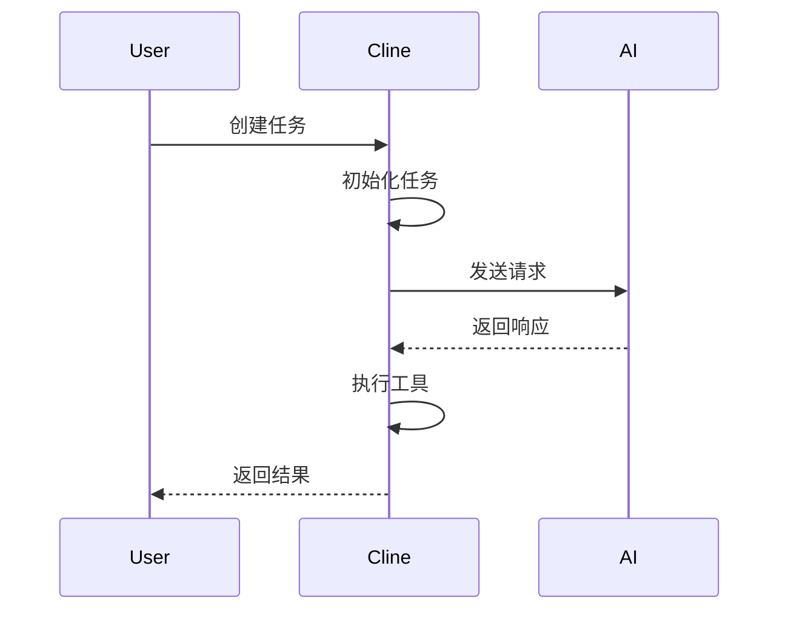

### 工具调用流程
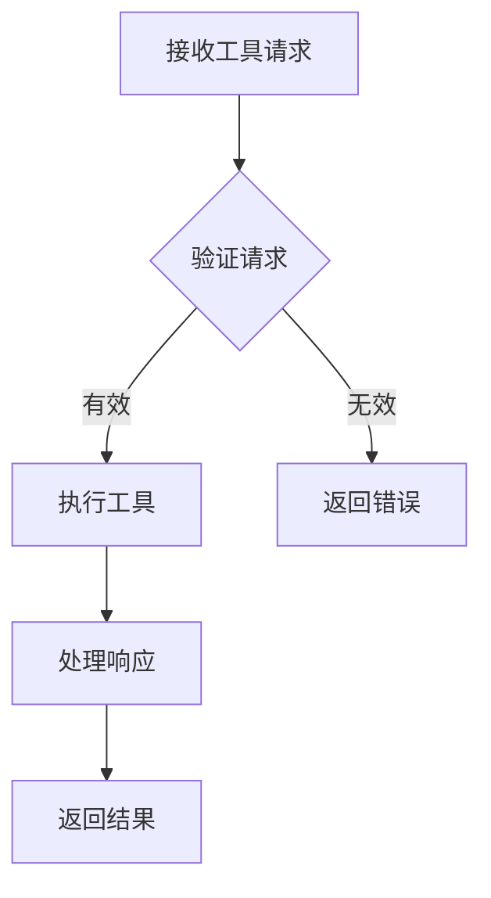

### 文件操作流程
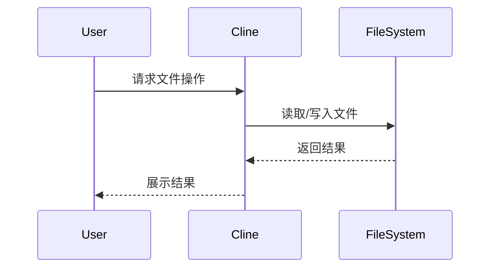

### 浏览器操作流程
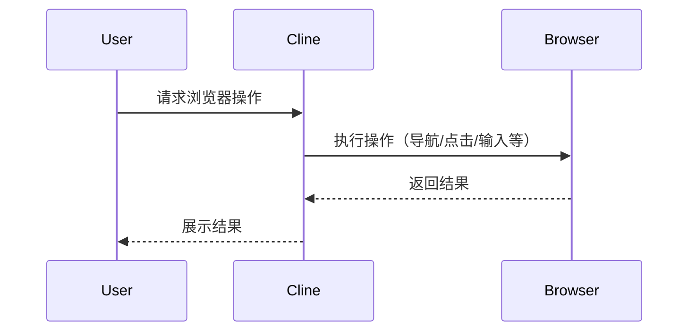

## 时序图

### 完整任务执行时序
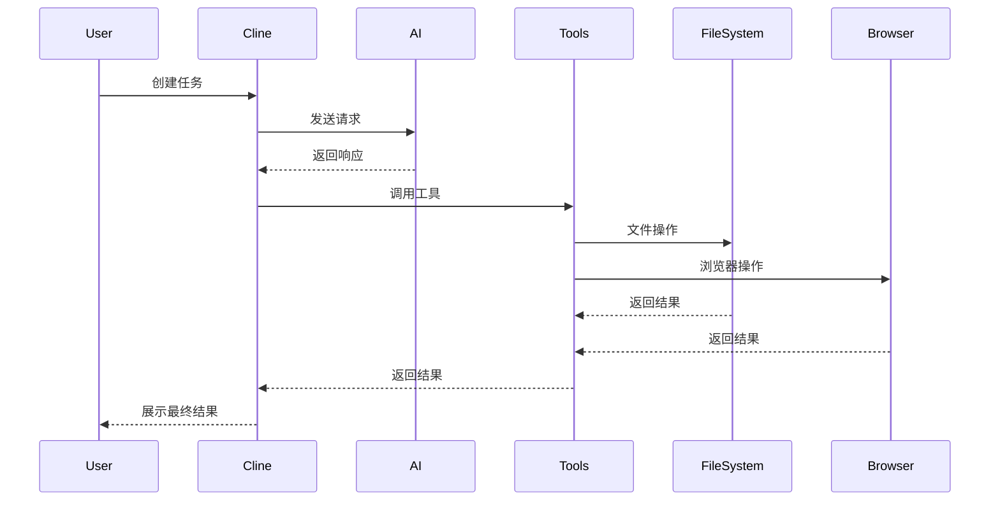

## 关键方法说明

### 1. `startTask()`
- 功能：启动新任务
- 详细流程：
  1. 初始化任务ID
  2. 设置初始状态
  3. 创建任务上下文
  4. 初始化工具管理器
  5. 发送初始请求给AI
  6. 开始任务循环
  7. 注册任务生命周期钩子

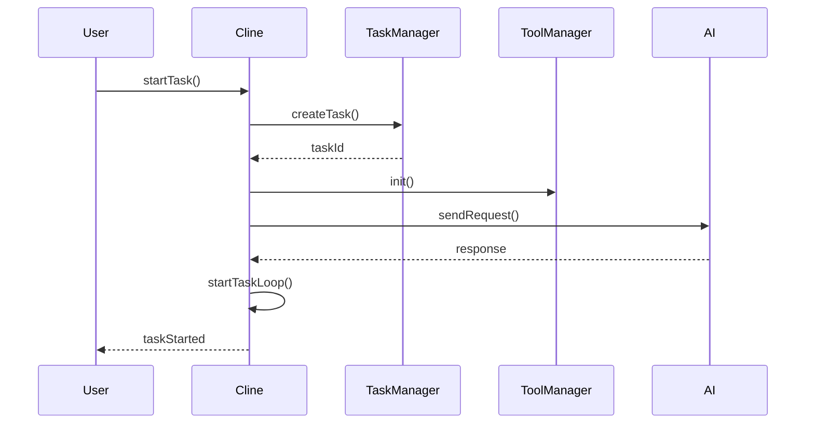

### 2. `executeCommandTool()`
- 功能：执行命令行工具
- 详细流程：
  1. 验证工具参数
  2. 创建或获取终端实例
  3. 初始化命令执行环境
  4. 执行命令
  5. 捕获输出
  6. 处理用户反馈
  7. 记录执行日志
  8. 返回执行结果

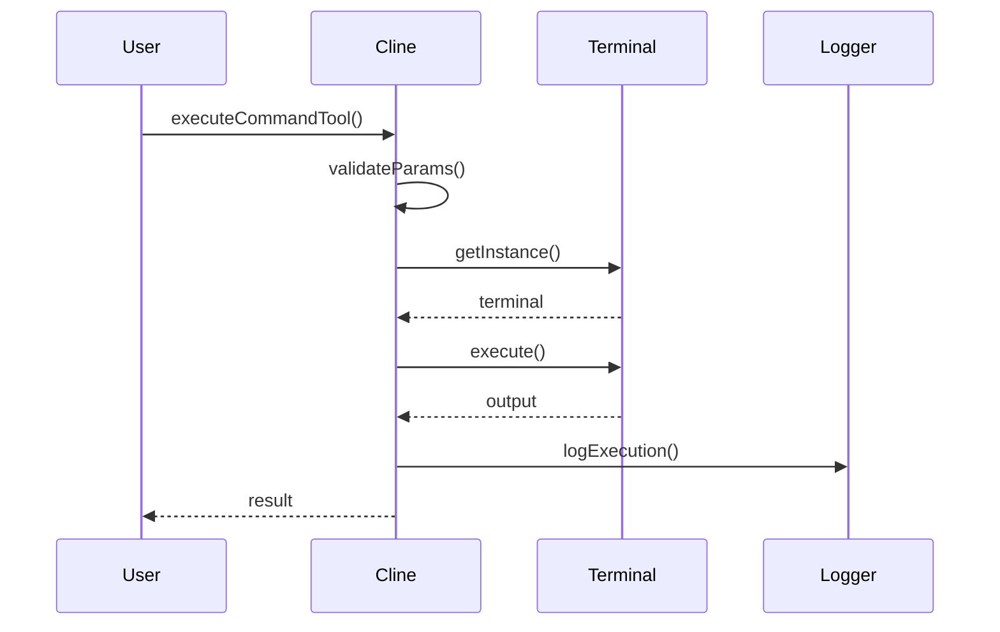

### 3. `presentAssistantMessage()`
- 功能：处理AI返回的消息
- 详细流程：
  1. 解析消息内容
  2. 验证消息格式
  3. 处理文本内容
  4. 解析工具调用
  5. 验证工具调用
  6. 执行工具
  7. 收集工具结果
  8. 格式化响应
  9. 返回工具结果

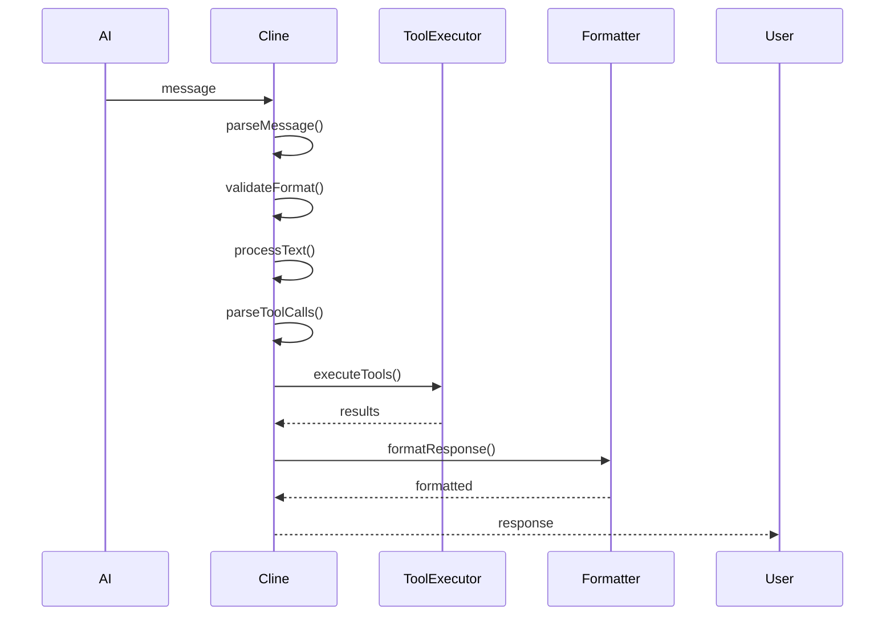

### 4. `saveCheckpoint()`
- 功能：保存任务检查点
- 详细流程：
  1. 验证任务状态
  2. 创建检查点
  3. 序列化任务数据
  4. 保存到存储
  5. 更新任务历史
  6. 触发检查点事件
  7. 返回检查点信息

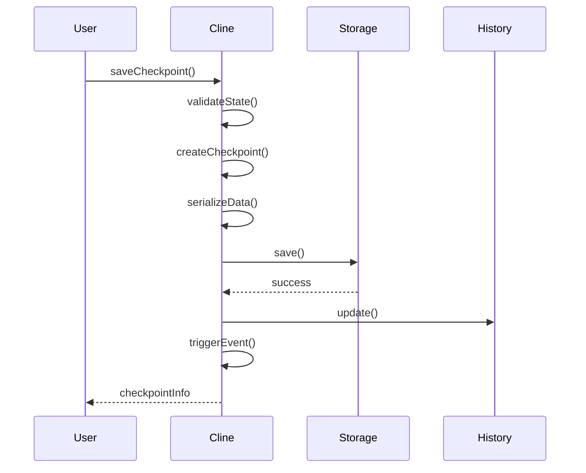

### 5. `restoreCheckpoint()`
- 功能：恢复任务检查点
- 详细流程：
  1. 验证检查点ID
  2. 从存储加载检查点
  3. 反序列化任务数据
  4. 恢复任务状态
  5. 初始化相关组件
  6. 触发恢复事件
  7. 返回恢复结果

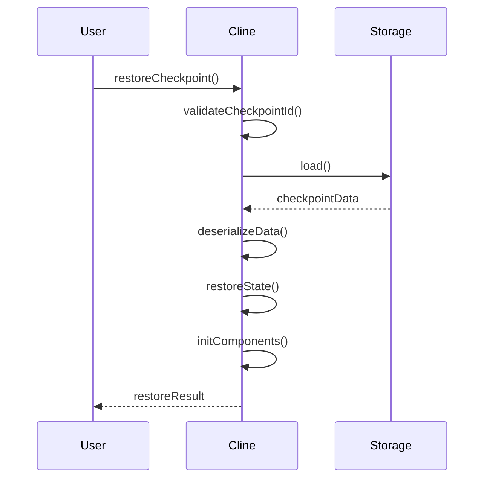

### 6. `resumeTaskFromHistory()`
- 功能：从历史记录恢复任务
- 详细流程：
  1. 获取任务历史
  2. 验证历史记录
  3. 加载任务上下文
  4. 恢复工具状态
  5. 重建任务循环
  6. 触发恢复事件
  7. 返回恢复结果

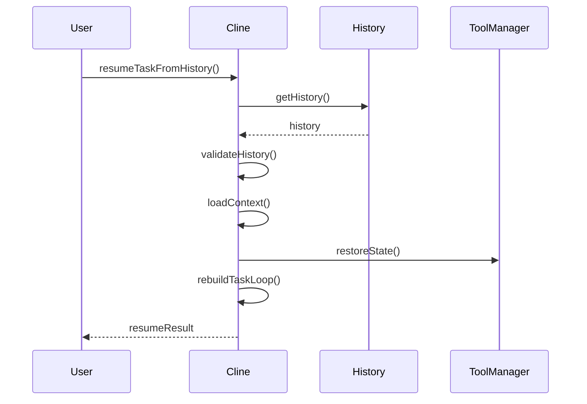

## 注意事项
1. 工具调用需要用户批准，除非启用了自动批准
2. 文件操作会自动创建必要的目录
3. 浏览器操作需要先启动浏览器会话
4. 终端操作会保持会话状态，直到任务完成
