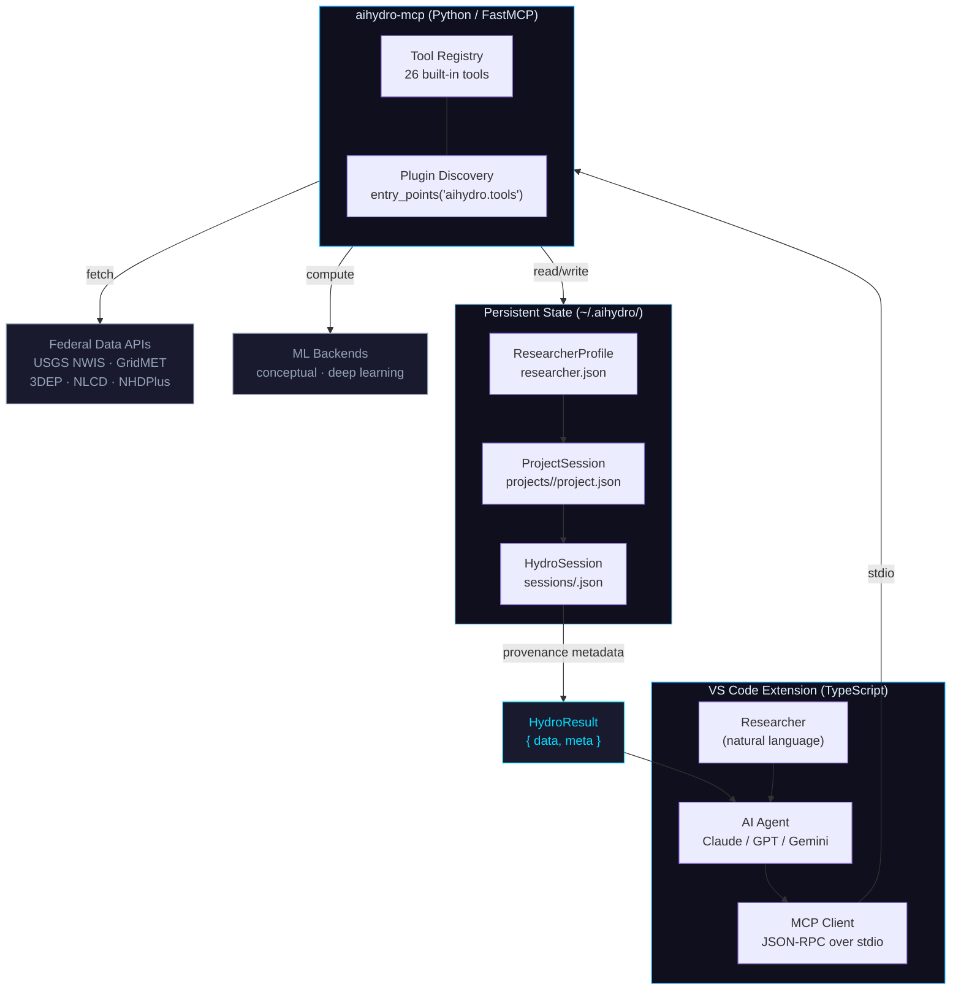
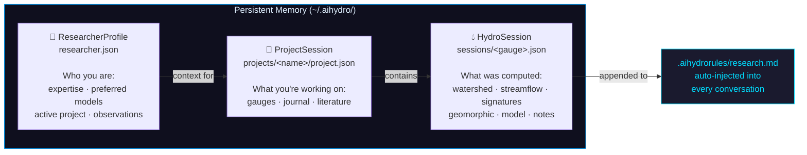
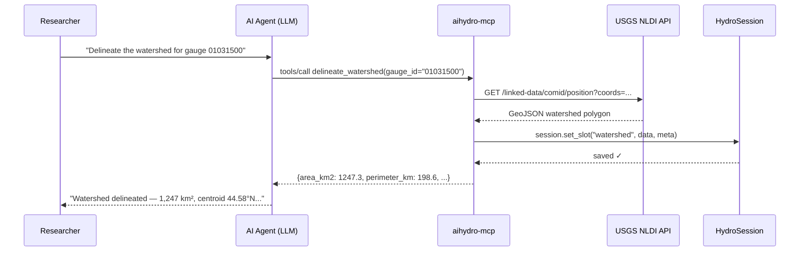

# Architecture

AI-Hydro is designed as an open platform for autonomous hydrological and earth science research. Its architecture separates agent interaction, tool orchestration, and domain computation so that AI models can reason over trustworthy scientific workflows instead of improvising brittle scripts from scratch.

---

## System Overview



**The flow in plain English:**

1. Researcher describes intent in natural language
2. The LLM agent decides which tools to call (no user code required)
3. Tool calls go via JSON-RPC stdio to the Python MCP server
4. The server fetches data from federal APIs, runs computation, and saves results to `~/.aihydro/`
5. Every result carries `HydroResult` provenance metadata (source, parameters, timestamp)
6. The agent interprets results and responds — or writes a standalone script if no tool exists

---

## Memory Hierarchy



Each tier survives VS Code restarts, new conversations, and weeks between sessions. The researcher never re-explains their context — it is always present.

---

## MCP Communication Flow



---

## Layer 1 — VS Code Extension

**Language:** TypeScript  
**Lineage:** Built on top of the open-source [Cline](https://github.com/cline/cline) base (Apache 2.0), then specialized for hydrological and earth science research workflows

Responsibilities:
- Renders the chat interface and tool call log
- Manages AI provider connections and API keys
- Acts as an MCP **client** — sends tool call requests, receives results
- Handles file reads/writes and terminal execution for standalone scripts
- Auto-registers the `ai-hydro` MCP server on activation

When no tool exists for a task, the agent writes a standalone Python script and executes it via the integrated terminal — combining the reliability of structured tools with the flexibility of the full Python ecosystem.

---

## Layer 2 — MCP Server

**Language:** Python  
**Framework:** [FastMCP](https://github.com/jlowin/fastmcp)  
**Protocol:** [Model Context Protocol](https://modelcontextprotocol.io/) (JSON-RPC over stdio)

```
python/ai_hydro/mcp/
├── app.py             — FastMCP singleton + agent instructions
├── __init__.py        — imports all tool modules (triggers registration)
├── tools_analysis.py  — analysis tools
├── tools_session.py   — session tools
├── tools_modelling.py — modelling tools
├── tools_project.py   — project/literature/persona tools
├── tools_docs.py      — version helpers
├── helpers.py         — shared validation, caching, session utilities
└── registry.py        — entry-point plugin discovery
```

Tool registration happens at import time via `@mcp.tool()` decorators. Plugin discovery scans `aihydro.tools` entry points and registers community tools automatically.

---

## Layer 3 — Python Backend

**Package:** `aihydro-tools` (PyPI)

### Data retrieval

| Module | Source |
|--------|--------|
| `data/streamflow.py` | USGS NWIS |
| `data/forcing.py` | GridMET |
| `data/landcover.py` | NLCD |
| `data/soil.py` | POLARIS |

### Analysis

| Module | What |
|--------|------|
| `analysis/watershed.py` | NHDPlus delineation |
| `analysis/signatures.py` | Flow statistics |
| `analysis/twi.py` | Terrain analysis |
| `analysis/geomorphic.py` | Basin morphometry |
| `analysis/curve_number.py` | CN grid |

### Session persistence

| Class | Storage |
|-------|---------|
| `HydroSession` | `~/.aihydro/sessions/<gauge>.json` |
| `ProjectSession` | `~/.aihydro/projects/<name>/project.json` |
| `ResearcherProfile` | `~/.aihydro/researcher.json` |

---

## Dependency Management

Heavy dependencies are lazy-loaded — the server starts successfully even if only the `[data]` extra is installed:

```python
try:
    import geopandas as gpd
    import pynhd
    _GEO_AVAILABLE = True
except ImportError:
    _GEO_AVAILABLE = False

def delineate_watershed(gauge_id: str) -> dict:
    if not _GEO_AVAILABLE:
        return {"error": "Install aihydro-tools[analysis] for watershed tools."}
    # ... proceed ...
```

Tools return informative errors for missing extras rather than crashing the server.
