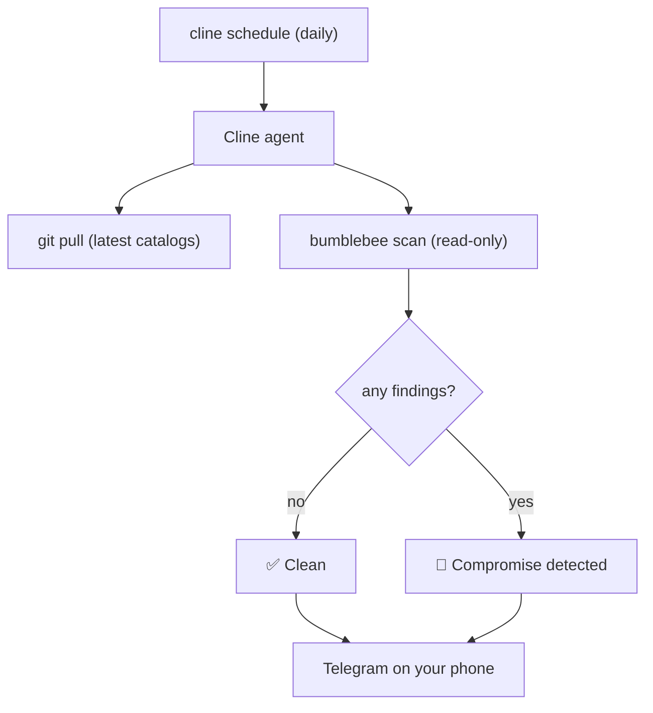

npm worms like Shai-Hulud spread through install scripts: the moment you run `npm install`, a `preinstall` hook executes and steals your npm, GitHub, AWS, and SSH credentials. New campaigns are reported almost every week.

This guide wires three pieces together so your machine checks itself automatically and pings your phone only when it matters:

- [Bumblebee](https://github.com/perplexityai/bumblebee), Perplexity's open-source, read-only supply-chain scanner. It maintains catalogs of recent campaigns and checks whether any compromised package or version is present on disk.
- The Cline CLI scheduler, which runs an agent on a cron schedule.
- The Cline CLI Telegram connector, which delivers the result to a chat.

The end result: every morning, a Cline agent pulls the latest threat intelligence, runs a read-only scan, and texts you a green check if you are clean or a red alert with details if you are exposed.



## How Bumblebee works

Bumblebee answers one narrow question fast: when an advisory names a package and version, is it present on this machine right now?

The important design choice is that it is read-only. A scanner that runs `npm`, `pnpm`, or `pip` to enumerate your dependencies would trigger the very install-script payload it is looking for. Bumblebee never does that. It only reads metadata files directly:

| Surface | What it reads |
|---|---|
| npm / pnpm / yarn / bun | lockfiles and installed `package.json` metadata |
| PyPI | `*.dist-info/METADATA`, `*.egg-info/PKG-INFO` |
| Go modules | `go.sum`, `go.mod` |
| RubyGems | `Gemfile.lock`, installed gemspecs |
| Composer | `composer.lock`, `vendor/composer/installed.json` |
| MCP servers | `mcp.json`, `claude_desktop_config.json`, and similar configs |
| Editor extensions | VS Code-family extension manifests |
| Browser extensions | Chromium-family and Firefox extension manifests |

It never runs package managers, never executes install scripts or lifecycle hooks, and never reads your application source. It ships no bundled threat intelligence either: you point it at an exposure catalog, and it reports exact `(ecosystem, name, version)` matches.

The catalogs live in the repo under `threat_intel/`, maintained by Perplexity and updated via pull requests as new campaigns are reported. That is why this automation simply pulls the latest before each scan: a `git pull` is all it takes to stay current.

Read the announcement: [Perplexity is open-sourcing Bumblebee](https://www.perplexity.ai/hub/blog/perplexity-is-open-sourcing-bumblebee).

## Prerequisites

- Node.js 22 or newer (for the Cline CLI).
- Go 1.22 or newer (to build Bumblebee).
- A Telegram account.
- An AI provider key, or a Cline account.

## 1. Install and authenticate the Cline CLI

```bash
npm install -g cline
```

Authenticate a provider. Swap in whichever you use:

```bash
cline auth --provider anthropic --apikey "$ANTHROPIC_API_KEY" --modelid claude-sonnet-4-6
```

## 2. Clone and build Bumblebee

Clone the repository somewhere stable. The clone is both the scanner and the catalog source, so the scheduled job will run from inside it.

```bash
mkdir -p ~/tools
git clone https://github.com/perplexityai/bumblebee.git ~/tools/bumblebee
cd ~/tools/bumblebee
go build -o bumblebee ./cmd/bumblebee
```

Confirm it works with the built-in self test, which runs embedded fixtures and makes no network calls:

```bash
./bumblebee selftest
# selftest OK (2 findings in 1ms)
```

## 3. Run a scan manually

Point `--exposure-catalog` at the whole `threat_intel/` directory to use every maintained catalog at once. The `--findings-only` flag suppresses the full inventory so you only get matches.

```bash
cd ~/tools/bumblebee
./bumblebee scan --profile deep --root "$HOME" \
  --exposure-catalog ./threat_intel/ \
  --findings-only
```

Output is NDJSON, one JSON object per line. A match looks like this:

```json
{ "record_type": "finding", "severity": "critical", "ecosystem": "npm",
  "package_name": "example-pkg", "version": "1.2.3",
  "source_file": "/Users/you/code/app/pnpm-lock.yaml",
  "evidence": "exact name+version match (version=1.2.3)" }
```

If you are clean, you get no `finding` records. Exit code is `0` on a successful run, `1` if the scan hit errors, `2` for bad arguments.

<Note>
Scan profiles control where Bumblebee looks. `baseline` checks standard global tool, editor, and browser locations. `project` scans your development directories (pass `--root ~/code`). `deep` walks whatever roots you give it, typically your whole home directory. Use `deep` for the most thorough "am I exposed anywhere" check, or `project` for a faster daily scan of your repos.
</Note>

## 4. Create a Telegram bot and start the connector

<Steps>
  <Step title="Create a bot">
    Open Telegram, start a chat with [@BotFather](https://t.me/BotFather), send `/newbot`, and follow the prompts. Copy the bot token it gives you (it looks like `7123456789:AAH...`). Treat it like a password.
  </Step>

  <Step title="Start the connector">
    Run the connector and point its working directory at your Bumblebee clone, so the scheduled agent runs there:

    ```bash
    cline connect telegram -k "<BOT-TOKEN>" --cwd ~/tools/bumblebee
    ```

    Leave this process running. It polls Telegram and delivers scheduled results, so it must stay alive.
  </Step>

  <Step title="Open the chat">
    In Telegram, search for your bot's username and send it any message (for example `/whereami`). This creates the thread binding that delivery needs. Then enable auto-approval so the scheduled scan can run commands without waiting:

    ```text
    /yolo on
    ```
  </Step>
</Steps>

<Warning>
By default, anyone who finds your bot can message it and it will run tasks on your machine. Lock it down. Message [@userinfobot](https://t.me/userinfobot) to get your Telegram user ID, then restart the connector with an access-control hook:

```bash
cline connect telegram -k "<BOT-TOKEN>" --cwd ~/tools/bumblebee \
  --hook-command 'jq -r ".payload.actor.participantKey" | grep -q "telegram:id:12345" && echo "{\"action\":\"allow\"}" || echo "{\"action\":\"deny\",\"message\":\"unauthorized\"}"'
```

Replace `12345` with your user ID.
</Warning>

## 5. Schedule the scan

The simplest way to wire up delivery is to create the schedule from the Telegram chat itself. Schedules created this way automatically target that thread, so results come straight back to you.

Send this to your bot (one message):

```text
/schedule create "supply-chain-watch" --cron "0 8 * * *" --prompt "Pull the latest Bumblebee catalogs and scan this machine for compromised packages. Run: git pull --quiet && go build -o bumblebee ./cmd/bumblebee && ./bumblebee scan --profile deep --root $HOME --exposure-catalog ./threat_intel/ --findings-only. Read the NDJSON output. If any line has record_type set to finding, reply starting with '🚨 COMPROMISE DETECTED' and list each package name, version, ecosystem, and source_file. If there are no findings, reply with exactly '✅ Clean: no compromised packages found.'"
```

That schedules a daily scan at 8am. The bot replies with the new schedule id.

<Note>
Prefer to manage schedules from the terminal? Send `/whereami` in Telegram to get the thread id, then create the schedule with explicit delivery flags:

```bash
cline schedule create "supply-chain-watch" \
  --cron "0 8 * * *" \
  --workspace ~/tools/bumblebee \
  --prompt "Pull the latest Bumblebee catalogs and scan this machine ..." \
  --delivery-adapter telegram \
  --delivery-bot <bot-username> \
  --delivery-thread telegram:<chat-id>
```
</Note>

## Why the green check matters

Scheduled delivery always sends the run's final reply, so the prompt is written to make that reply meaningful either way:

- Clean run: one line, `✅ Clean: no compromised packages found.` You get a daily heartbeat confirming the scan actually ran.
- Exposure: `🚨 COMPROMISE DETECTED` followed by the package, version, and the file where it was found, so you can act immediately (rotate credentials, remove the package, pin a safe version).

## Test it

Trigger the schedule immediately instead of waiting for 8am. From Telegram:

```text
/schedule trigger <schedule-id>
```

Or from the terminal: `cline schedule trigger <schedule-id>`. Within a few seconds you should get the result in your chat.

To see a real alert, add a package and version that matches a catalog entry to a throwaway project's lockfile and run the scan against it. Bumblebee reports the match, and the agent texts you the red alert.

## Keep it running

- The connector process (`cline connect telegram`) must stay running for delivery to work. Run it under a process manager (systemd, launchd, `pm2`, or a `tmux`/`screen` session) so it survives reboots.
- The hub runs the schedule and starts automatically when you create one. If it is not running, start it with `cline hub start`.
- Manage schedules anytime with `cline schedule list`, `cline schedule pause <id>`, `cline schedule resume <id>`, and `cline schedule delete <id>`.

## Customize

- Cadence: change the cron expression. `0 */6 * * *` scans every six hours; `0 8 * * MON-FRI` runs on weekdays only.
- Scope: swap `--profile deep --root $HOME` for `--profile project --root ~/code` for a faster scan of just your repos, or `--profile baseline` for global tools, editors, and browser extensions.
- Channels: the same delivery pattern works for Slack, Discord, WhatsApp, and Google Chat. See [Connectors](/cli/connectors).
- Fleet use: Bumblebee can `POST` NDJSON to an ingest endpoint with `--output http --http-url <url>` if you want to centralize findings across many machines.

## Credits

Bumblebee is built and open-sourced by Perplexity. See the [announcement](https://www.perplexity.ai/hub/blog/perplexity-is-open-sourcing-bumblebee) and the [repository](https://github.com/perplexityai/bumblebee).
