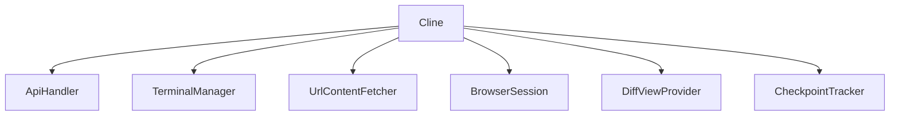
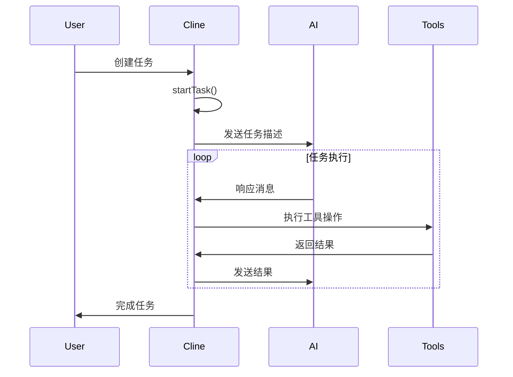
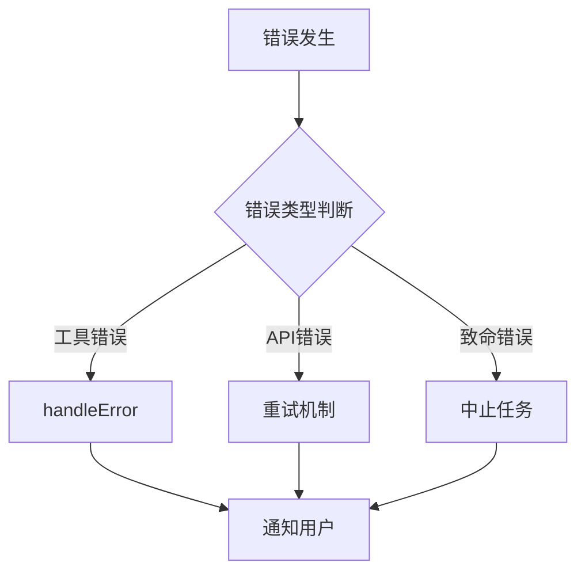

# Cline 类学习指南

## 1. 概述

Cline 是一个核心类，负责处理与 AI 的交互、工具使用、文件操作等核心功能。它是整个系统的中枢，协调各个组件的工作。

### 主要职责
- 管理任务生命周期
- 处理与 AI 的对话流
- 执行各种工具操作
- 管理终端和浏览器会话
- 处理用户反馈和自动批准设置

## 2. 核心组件

### 2.1 关键属性
- `taskId`: 当前任务的唯一标识符
- `api`: API 处理器，用于与 AI 模型交互
- `terminalManager`: 终端管理器，用于执行命令
- `browserSession`: 浏览器会话管理器
- `apiConversationHistory`: API 对话历史记录
- `clineMessages`: Cline 消息记录

## 3. 任务生命周期

### 3.1 任务创建
1. 通过构造函数创建新任务或恢复历史任务
2. 初始化必要的组件和设置
3. 开始任务循环

### 3.2 消息处理
- `presentAssistantMessage()`: 处理 AI 助手消息
- `say()`: 发送消息到用户界面
- `ask()`: 处理用户输入

## 4. 文件操作

### 4.1 文件保存机制

### 4.2 关键方法
- `ensureTaskDirectoryExists()`: 确保任务目录存在
- `saveClineMessages()`: 保存消息记录
- `getSavedApiConversationHistory()`: 获取保存的对话历史

## 5. 工具使用流程

### 5.1 工具执行流程
1. 接收 AI 的工具使用请求
2. 验证工具参数
3. 执行工具操作
4. 返回结果给 AI

### 5.2 支持的工具类型
- 文件操作（write_to_file, replace_in_file）
- 浏览器操作
- 终端命令执行

## 6. 错误处理

### 6.1 错误类型
- 工具参数错误
- API 调用错误
- 文件操作错误
- 浏览器操作错误

### 6.2 错误处理机制

## 7. 最佳实践

### 7.1 使用建议
- 合理设置自动批准规则
- 定期保存检查点
- 监控错误计数器
- 适时清理历史记录

### 7.2 性能优化
- 使用 WeakRef 管理引用
- 合理控制流式处理
- 及时关闭未使用的浏览器会话

## 8. 调试技巧

### 8.1 关键调试点
- 消息流转过程
- 工具执行状态
- 文件操作结果
- 错误处理过程

### 8.2 常见问题排查
- 检查任务状态标志
- 验证消息历史完整性
- 确认文件保存路径
- 监控自动批准计数
