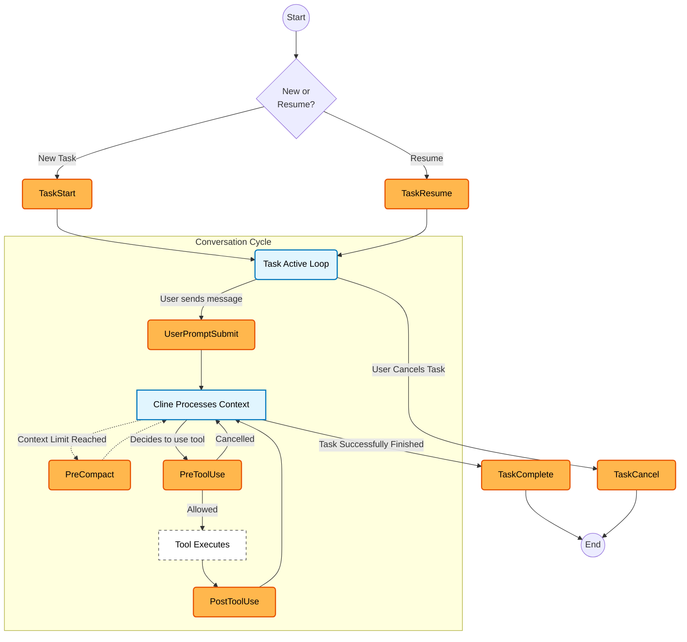

Hooks are scripts that run at key moments in Cline's workflow. Because they execute at known points with consistent inputs and outputs, hooks bring determinism to the non-deterministic nature of AI models by enforcing guardrails, validations, and context injection. You can validate operations before they execute, monitor tool usage, and shape how Cline makes decisions.

## What You Can Build

- Stop operations before they cause problems (like creating `.js` files in a TypeScript project)
- Run linters or custom validators before files get saved
- Prevent operations that violate security policies
- Track everything for analytics or compliance
- Trigger external tools or services at the right moments
- Add context to the conversation based on what Cline is doing

## Hook Types

Cline supports 8 hook types that run at different points in the task lifecycle:

| Hook Type | When It Runs | 
|-----------|--------------|
| TaskStart | When you start a new task |
| TaskResume | When you resume an interrupted task |
| TaskCancel | When you cancel a running task |
| TaskComplete | When a task finishes successfully |
| PreToolUse | Before Cline executes a tool (read_file, write_to_file, etc.) |
| PostToolUse | After a tool execution completes |
| UserPromptSubmit | When you submit a message to Cline |
| PreCompact | Before Cline truncates conversation history to free up context |

## Hook Lifecycle



The diagram shows the complete hook lifecycle:

1. **Entry**: When you start a task, either **TaskStart** (new task) or **TaskResume** (interrupted task) runs first
2. **Conversation Cycle**: Each time you send a message, **UserPromptSubmit** runs, then Cline processes your request
3. **Tool Execution**: When Cline decides to use a tool, **PreToolUse** runs first-if allowed, the tool executes, then **PostToolUse** runs
4. **Context Management**: If the conversation approaches context limits, **PreCompact** runs before truncation
5. **Exit**: The task ends with either **TaskComplete** (success) or **TaskCancel** (user cancellation)

Orange nodes represent hooks where you can inject custom logic. The cycle repeats as you continue the conversation.

## Hook Locations

Hooks can be stored globally or in a project workspace. See [Storage Locations](/customization/overview#storage-locations) for guidance on when to use each.

- **Global hooks**: `~/Documents/Cline/Hooks/`
- **Project hooks**: `.clinerules/hooks/` in your repo (can be committed to version control)

When both global and workspace hooks exist for the same hook type, both run. Global hooks execute first, then workspace hooks. If either returns `cancel: true`, the operation stops.

## Creating a Hook

<Steps>
  <Step title="Open the Hooks tab">
    Click the scale icon at the bottom of the Cline panel, to the left of the model selector. Switch to the Hooks tab.
  </Step>
  <Step title="Create a new hook">
    Click **"New hook..."** dropdown and select a hook type (e.g., PreToolUse, TaskStart).
  </Step>
  <Step title="Review the hook's code">
    Click the pencil icon to open and edit the hook script. Cline generates a template with examples.
  </Step>
  <Step title="Enable the hook">
    Toggle the switch to activate the hook once you understand what it does.
  </Step>
</Steps>

<Warning>
Always review a hook's code before enabling it. Hooks execute automatically during your workflow and can block operations or run shell commands.
</Warning>

## Quick Start: Your First Hook

Let's create a simple hook that logs every file Cline reads or writes. You'll see results in seconds.

### The Hook

Create a file called `file-logger` in your hooks directory with this content:

```bash
#!/bin/bash
# Logs all file operations to ~/cline-activity.log

INPUT=$(cat)
TOOL=$(echo "$INPUT" | jq -r '.preToolUse.tool')
FILE_PATH=$(echo "$INPUT" | jq -r '.preToolUse.parameters.path // "N/A"')

# Log to file
echo "$(date '+%H:%M:%S') - $TOOL: $FILE_PATH" >> ~/cline-activity.log

# Always allow the operation
echo '{"cancel":false}'
```

### Setup

<Steps>
  <Step title="Create the hook file">
    Save the script above as `~/Documents/Cline/Hooks/file-logger` (macOS/Linux) or create it through the Hooks UI.
  </Step>
  <Step title="Make it executable">
    Run `chmod +x ~/Documents/Cline/Hooks/file-logger` in your terminal.
  </Step>
  <Step title="Enable it">
    In Cline's Hooks tab, find "file-logger" under PreToolUse hooks and toggle it on.
  </Step>
</Steps>

### Test It

Ask Cline to read any file in your project: "What's in package.json?"

Then check the log:

```bash
cat ~/cline-activity.log
```

You'll see entries like:
```text
14:23:45 - read_file: /path/to/package.json
14:23:47 - search_files: /path/to/src
```

### Customize It

Try modifying the hook to:
- Filter specific file types (only log `.ts` files)
- Add the task ID to each log entry
- Send notifications for write operations
- Block operations on certain paths

The sections below explain how hooks receive input and return output, plus more examples.

## How Hooks Work

Hooks are executable scripts that receive JSON input via stdin and return JSON output via stdout.

### Input Structure

Every hook receives a JSON object with common fields plus hook-specific data:

```json
{
  "taskId": "abc123",
  "clineVersion": "3.17.0",
  "timestamp": 1736654400000,
  "workspacePath": "/path/to/project",
  
  // Hook-specific field (name matches hook type in camelCase)
  "taskStart": {
    "task": "Add authentication to the API"
  }
}
```

The hook-specific field name matches the hook type:
- `taskStart`, `taskResume`, `taskCancel`, `taskComplete` contain `{ task: string }`
- `preToolUse` contains `{ tool: string, parameters: object }`
- `postToolUse` contains `{ tool: string, parameters: object, result: string, success: boolean, durationMs: number }`
- `userPromptSubmit` contains `{ prompt: string }`
- `preCompact` contains `{ conversationLength: number, estimatedTokens: number }`

### Output Structure

Hooks return a JSON object to stdout:

```json
{
  "cancel": false,
  "contextModification": "Optional text to add to the conversation",
  "errorMessage": ""
}
```

| Field | Type | Description |
|-------|------|-------------|
| `cancel` | boolean | If `true`, stops the operation (blocks the tool, cancels the task start, etc.) |
| `contextModification` | string | Optional text that gets injected into the conversation as context for Cline |
| `errorMessage` | string | Shown to the user if `cancel` is `true` |

### Context Modification

The `contextModification` field lets hooks inject information into the conversation. This is useful for:

- Adding project-specific context when a task starts
- Providing validation results that Cline should consider
- Injecting environment information before tool execution

For example, a PreToolUse hook could add: `"Note: This file is auto-generated. Edits may be overwritten."`

## Hook Reference

### Task Lifecycle Hooks

#### TaskStart

Runs when you start a new task. Use it to:
- Log task start time for analytics
- Add project context to the conversation
- Check prerequisites before work begins
- Notify external systems (Slack, issue trackers)

```bash
#!/bin/bash
INPUT=$(cat)
TASK=$(echo "$INPUT" | jq -r '.taskStart.task')
echo "[TaskStart] Starting: $TASK" >&2
echo '{"cancel":false,"contextModification":"","errorMessage":""}'
```

#### TaskResume

Runs when you resume an interrupted task (instead of TaskStart). Use it to:
- Check for changes since the task was paused
- Refresh context with latest project state
- Notify that work is resuming

#### TaskCancel

Runs when you cancel a running task. Use it to:
- Clean up temporary files or resources
- Notify external systems about cancellation
- Log cancellation for analytics

#### TaskComplete

Runs when a task completes successfully. Use it to:
- Run tests or validation after changes
- Generate reports or summaries
- Notify stakeholders
- Trigger CI/CD pipelines

### Tool Hooks

#### PreToolUse

Runs before any tool executes. This is the most powerful hook for validation and safety. Use it to:
- Block dangerous operations
- Validate parameters before execution
- Add context about the file or resource being accessed
- Log tool usage

The input includes the tool name and its parameters:

```json
{
  "preToolUse": {
    "tool": "write_to_file",
    "parameters": {
      "path": "src/config.ts",
      "content": "..."
    }
  }
}
```

Example that blocks `.js` files in a TypeScript project:

```bash
#!/bin/bash
INPUT=$(cat)
TOOL=$(echo "$INPUT" | jq -r '.preToolUse.tool')
FILE_PATH=$(echo "$INPUT" | jq -r '.preToolUse.parameters.path // empty')

if [[ "$TOOL" == "write_to_file" && "$FILE_PATH" == *.js ]]; then
  echo '{"cancel":true,"errorMessage":"Use .ts files instead of .js in this TypeScript project"}'
  exit 0
fi

echo '{"cancel":false}'
```

#### PostToolUse

Runs after a tool completes (success or failure). Use it to:
- Audit tool usage
- Validate results
- Trigger follow-up actions
- Monitor performance

The input includes execution results:

```json
{
  "postToolUse": {
    "tool": "execute_command",
    "parameters": { "command": "npm test" },
    "result": "All tests passed",
    "success": true,
    "durationMs": 3450
  }
}
```

<Note>
PostToolUse hooks can return `cancel: true` to stop the task, but they cannot undo the tool execution that already happened.
</Note>

### Other Hooks

#### UserPromptSubmit

Runs when you send a message to Cline. Use it to:
- Log prompts for analytics
- Add context based on prompt content
- Validate or sanitize prompts

#### PreCompact

Runs before Cline truncates conversation history to stay within context limits. Use it to:
- Archive important conversation parts before they're removed
- Log compaction events
- Add a summary of what's being removed

The input includes context metrics:

```json
{
  "preCompact": {
    "conversationLength": 45,
    "estimatedTokens": 125000
  }
}
```

## Examples

### TypeScript Enforcement

Block creation of `.js` files in a TypeScript project:

```bash
#!/bin/bash
# PreToolUse hook

INPUT=$(cat)
TOOL=$(echo "$INPUT" | jq -r '.preToolUse.tool')
FILE_PATH=$(echo "$INPUT" | jq -r '.preToolUse.parameters.path // empty')

if [[ "$TOOL" == "write_to_file" && "$FILE_PATH" == *.js ]]; then
  echo '{"cancel":true,"errorMessage":"Use .ts files instead of .js in this TypeScript project"}'
  exit 0
fi

echo '{"cancel":false}'
```

### Tool Usage Logging

Log all tool executions to a file:

```bash
#!/bin/bash
# PostToolUse hook

INPUT=$(cat)
TOOL=$(echo "$INPUT" | jq -r '.postToolUse.tool')
SUCCESS=$(echo "$INPUT" | jq -r '.postToolUse.success')
DURATION=$(echo "$INPUT" | jq -r '.postToolUse.durationMs')

echo "$(date -Iseconds) | $TOOL | success=$SUCCESS | ${DURATION}ms" >> ~/.cline-tool-log.txt

echo '{"cancel":false}'
```

### Add Project Context on Task Start

Inject project-specific information when a task begins:

```bash
#!/bin/bash
# TaskStart hook

INPUT=$(cat)
WORKSPACE=$(echo "$INPUT" | jq -r '.workspacePath')

# Read project info if available
if [[ -f "$WORKSPACE/.project-context" ]]; then
  CONTEXT=$(cat "$WORKSPACE/.project-context")
  echo "{\"cancel\":false,\"contextModification\":\"Project context: $CONTEXT\"}"
else
  echo '{"cancel":false}'
fi
```

## CLI Support

Hooks are available in the [Cline CLI](/cline-cli/getting-started):

```bash
# Enable hooks for a task
cline "What does this repo do?" -s hooks_enabled=true

# Configure hooks globally
cline config set hooks-enabled=true
```

<Note>
CLI hooks are only supported on macOS and Linux.
</Note>

## Troubleshooting

**Hook not running?**
- Check that the file is executable (`chmod +x hookname`)
- Verify the hook is enabled (toggle is on in the Hooks tab)
- Check that Hooks are enabled globally in Settings

**Hook output not parsed?**
- Ensure output is valid JSON on a single line to stdout
- Use stderr (`>&2`) for debug logging, not stdout
- Check for trailing characters or newlines before the JSON

**Hook blocking unexpectedly?**
- Review the hook's logic and test with sample input
- Check both global and workspace hooks (both run if they exist)

## Related Features

- [Rules](/customization/cline-rules) define high-level guidance that hooks can enforce programmatically
- [Checkpoints](/core-workflows/checkpoints) let you roll back if a hook didn't catch an issue
- [Auto-Approve](/features/auto-approve) works well with hooks as safety nets
