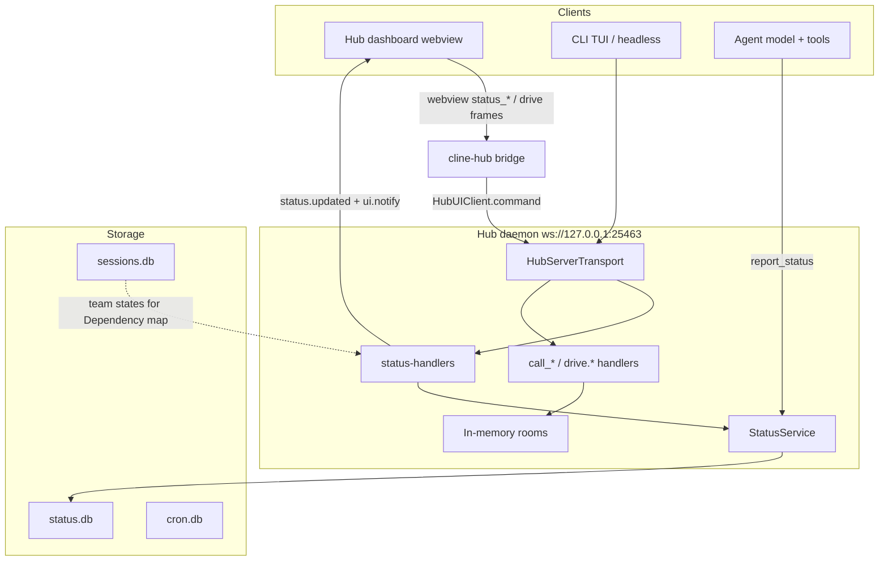
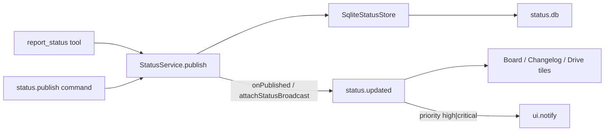
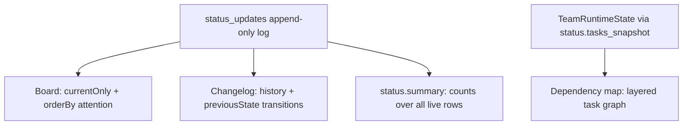
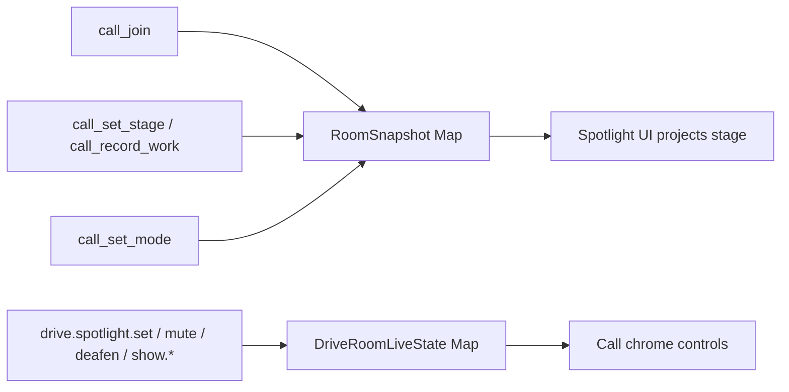
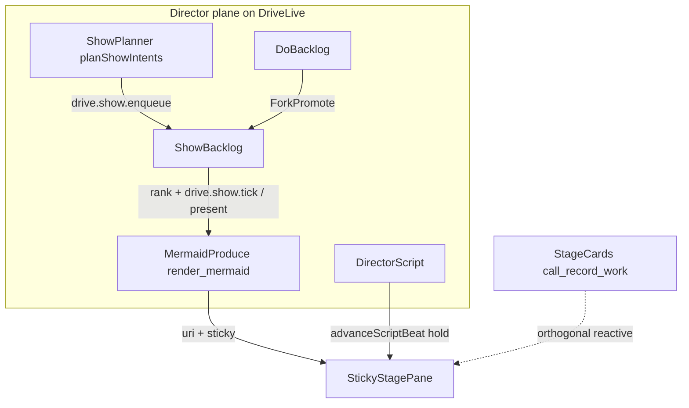

# Drivecode architecture: Status Hub, Drive UI, and protocol planes

Companion to [README](README.md) and [ARD-0005](./plans/cline-drivemode/ard/ARD-0005-status-hub.md).
This page is the diagram-first view of how the pieces fit. Schemas and op lists
live in the reference README; decisions live in the ARD.

## What this is (and is not)

| Term | Meaning here |
|---|---|
| **Status Hub** | Durable, queryable changelog for agent work (`status.db`, `status.*` hub ops, Board / Changelog / Dependency map). |
| **Drive UI** | Hub surfaces that sit on top of Cline: Drive tab home, call chrome, Spotlight, Drive Settings. |
| **Agent Host Protocol (AHP)** | A prior review finding — not a shipped protocol in this repo. It noted that `HubEventEnvelope` has `eventId` / `timestamp` but **no monotonic `seq`**, so clients cannot detect gaps. Status Hub’s `seq` exists to fix that class of bug for status. |
| **Branch name** `claude/agent-host-protocol-ui-demo-*` | Historical cloud-agent branch that shipped Status Hub + Drive landing. The name is a misnomer; prefer documenting against **current `main`**. |

Non-goals of this architecture:

- Not WebRTC / pixel screen share (human share is a structured Spotlight pin).
- Not room persistence (Drive rooms are in-memory; hub restart ends the room).
- Not a replacement for `sessions.db` lifecycle status (`running` / `ended`).

## System context



Two collaboration planes share the hub process but not storage (Director bags hang off the room live map — see Director / Show plane below):

1. **Status plane** — durable log; survives hub restart; cross-agent.
2. **Room plane** — roster, Spotlight/`stage`, mute/deafen; ephemeral Map.

## Layering

| Layer | Owner | Responsibility |
|---|---|---|
| Shared schemas | `@cline/shared` | `StatusUpdate`, query/page/summary zod; hub command/event names |
| Persistence | `@cline/core` | `SqliteStatusStore`, schema, FTS5-or-LIKE search |
| Service | `@cline/core` | `StatusService` publish/query/board/summary/prune + listeners |
| Agent ingress | `@cline/core` tools | `report_status` (attribution from tool context, never from the model) |
| Hub ingress | `@cline/core` | `status.*` commands; `status.updated` / `ui.notify` fan-out |
| Dashboard bridge | `apps/cline-hub` | Browser frames ↔ `HubUIClient` |
| UI lenses | hub webview | Drive home, Board, Changelog, Dependency map, Spotlight |

Dependency direction stays `shared → llms → agents → core → apps`.

## Publish paths

Every durable status must pass through `StatusService.publish`. Live UI and
notifications must hang off **service listeners**, not only the hub command
handler — otherwise tool publishes never reach the wire.



### Priority routing

| Priority | Effect |
|---|---|
| `low` / `normal` | Land in Hub only |
| `high` / `critical` | Hub + `ui.notify` interrupt |

## Query lenses



| Lens | Data | Sort / notes |
|---|---|---|
| Board | One live row per subject | Attention bands then `seq`; composite keyset paging |
| Changelog | Full history | Recency; shows `previousState → state` |
| Summary | Aggregates | Independent of any page (never count from a page) |
| Dependency map | Team tasks | Not `status.db`; empty until an active team has tasks |

`seq` is the resume cursor for the status log. Board paging uses
`(attention band, seq)` resolved in SQL so the wire cursor stays a plain `seq`.

## Protocol catalog (status plane)

### Hub commands

| Command | Role |
|---|---|
| `status.publish` | Insert update; supersede prior current for subject |
| `status.query` | Keyset-paged query |
| `status.current` | Latest live row for one subject |
| `status.board` | Forces current + attention order + history counts |
| `status.summary` | Whole-log live counts |
| `status.subjects` | Distinct subjects |
| `status.prune` | Delete superseded history (`before` and/or `keepPerSubject`) |
| `status.tasks_snapshot` | Team runtime states for Dependency map |

### Hub events

| Event | Role |
|---|---|
| `status.updated` | Full `StatusUpdate` including `seq` |
| `ui.notify` | Raised for high/critical publishes |

### Webview frames (browser ↔ dashboard)

| Inbound | Outbound |
|---|---|
| `status_query` / `status_board` / `status_subjects` / `status_summary` | `status_page` / `status_subjects_result` / `status_summary_result` |
| | `status_updated`, `status_error` |

### Agent tool

`report_status`: `subject`, `state`, `headline`, optional `detail` / `priority` /
`progress`. Session, agent, and workspace come from tool context.

## Drive / room plane (sibling)



| User-facing name | Wire name |
|---|---|
| Spotlight | `stage` (`StageState`, `call_set_stage`) |
| Drive Mode sub-modes | `call_set_mode` → native plan/act |
| Partner mute / deafen | `drive.*` live ops |

Rooms do not share a foreign key with Status Hub. Conventionally a room may
publish under `subject = "drive-room/<id>"`, but that is a string convention
only.

## Director / Show plane (sibling)

Third collaboration concern on the same hub process: **planned** Spotlight
artifacts via dual backlog + DirectorScript. Orthogonal to reactive StageCards.
Canonical names: [`.claude/diagram-conventions.md`](../.claude/diagram-conventions.md).
Cline skills: `diagram-first` (nest docs), `diagram-show` (stage present).
Ops: [hub-drive-ops.md](./plans/cline-drivemode/ops/hub-drive-ops.md).



- **Status plane** — durable log; survives hub restart.
- **Room plane** — roster, stage, mute/deafen; ephemeral.
- **Director plane** — Do/Show bags + script on `DriveRoomLiveState`; present is event-first (no WebRTC).

Do not conflate Status `DepMap` (team task edges) with `ShowBacklog` sticky diagrams.

## UI map

| Route / surface | Role |
|---|---|
| Drive tab (`drive-view.tsx`) | Product home: tiles, Start a Drive call, links into Status Hub |
| Status Hub (`status-view.tsx`) | Board / Changelog / Dependency map |
| Chat + Join call | Live room entry; Spotlight + Drive Settings in chrome |
| HTML wireframe | Discord-like channels IA — prototype only |

## Data model sketch

```text
status_updates
  update_id PK
  seq              -- monotonic resume cursor
  subject          -- free-form identity (/ -delimited by convention)
  state            -- queued|running|blocked|done|failed|cancelled
  headline, detail?, priority, progress?
  session_id?, agent_id?, agent_name?, workspace_root?  -- attribution
  superseded_at    -- NULL = current row for subject
  created_at

PARTIAL UNIQUE (subject) WHERE superseded_at IS NULL
```

Retention: `prune` is explicit; default is keep-everything. Search: indexed
`LIKE`, upgraded to FTS5 when the runtime provides it (Bun yes; Node 22
`node:sqlite` often no).

## Testing matrix (review checklist)

| Area | What to verify |
|---|---|
| Store | Append + supersede; one current per subject; attention composite paging; FTS vs LIKE |
| Handlers | Every `status.*` op; high/critical → `ui.notify` |
| Broadcast | Tool `report_status` and command `status.publish` both fan out (`attachStatusBroadcast`) |
| Webview | Live splice respects active filters; Board counts match lens |
| Rooms | Status survives hub restart; rooms do not |

## Related documents

- [drivecode README](README.md) — schema and op detail
- [skills inventory](skills-inventory.md) — in-repo skills vs `cline/skills`
- [ARD-0005](./plans/cline-drivemode/ard/ARD-0005-status-hub.md) — decisions D1–D10
- [ARD-0010](./plans/cline-drivemode/ard/ARD-0010-provider-harness-byok.md) — BYOK / topology
- [01-architecture.md](./plans/cline-drivemode/01-architecture.md) — hub as single writer
