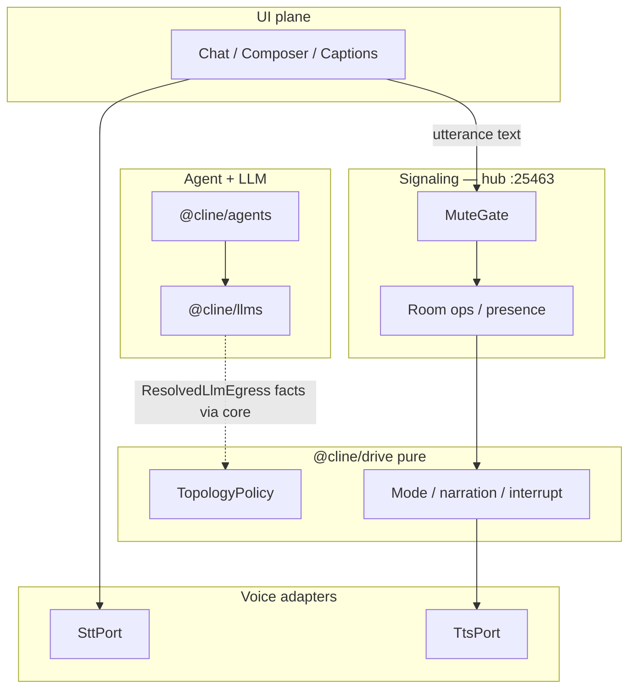
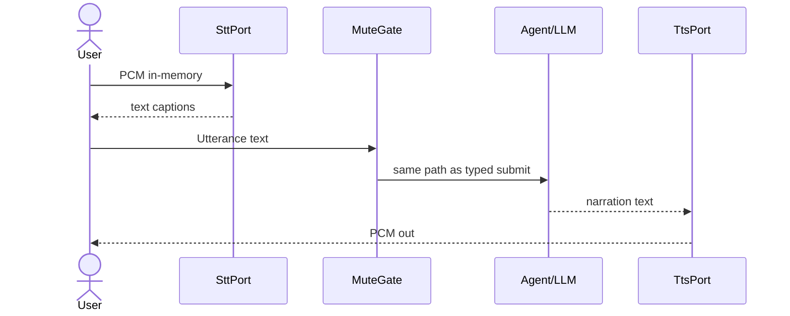

# 07 · Runtime topology (local and cloud)

Back to [README](README.md). Decisions: [ARD-0009](ard/ARD-0009-runtime-topology-local-cloud.md), D8 in [01-architecture.md](01-architecture.md). Provider swap: [08-provider-harness.md](08-provider-harness.md).

## Why this exists

Drive signaling is already local (hub on `ws://127.0.0.1:25463`). Agent turns already route through `@cline/llms` (Ollama and cloud vendors). Voice STT/TTS were underspecified: a Web Speech default would upload audio on Chromium and break local-only trust.

This document names the **planes**, the **DeploymentProfile**, and the **validation matrix** so Settings, MuteGate, and adapters share one story.

## Planes



Media / WebRTC stays out until multi-user humans need bidirectional audio ([04-future-multi-user.md](04-future-multi-user.md)).

## Domain types

```ts
type DeploymentProfile = "local" | "cloud" | "hybrid";

type EgressClass =
  | "loopback-only"
  | "declared-providers"
  | "platform-cloud";

type ResolvedLlmEgress =
  | { kind: "local"; providerId: string; baseUrlClass: "loopback" }
  | { kind: "cloud"; providerId: string };

interface RuntimeTopology {
  readonly profile: DeploymentProfile;
  readonly llm: ResolvedLlmEgress;
  readonly stt: SttBackend; // from selected provider manifest
  readonly tts: TtsBackend;
  readonly egressCeiling: EgressClass;
}
```

`@cline/drive` must not import `@cline/llms`. Core resolves LLM egress facts and passes them in.

## Validation matrix

| Profile | LLM | STT | TTS | Ceiling |
|---|---|---|---|---|
| `local` | loopback only | local-worker only | browser or local-worker | `loopback-only` |
| `cloud` | cloud provider | webSpeech, cloud-api, or local-worker | any | `declared-providers` (+ `platform-cloud` if Web Speech) |
| `hybrid` | either | per ceiling | per ceiling | `runtime.egressCeiling` |

Stable reject codes include `local_forbids_platform_cloud_stt`, `local_forbids_cloud_llm`, `local_forbids_cloud_tts`, `egress_exceeds_ceiling`.

## Voice data flow



Audio stops at the adapter. Hub events stay text and presence only ([DRV-PRIVACY](features/DRV-PRIVACY.md)).

## Latency notes

- Local LLM TTFT is often slow. Prefer cheap ack narration before the expensive turn when profile is `local`.
- TTS speaks narration sentence boundaries; queue depth 2 drop-oldest; `cancel()` for barge-in.
- Prefer CPU local STT so GPU stays available for Ollama.

## Package ownership

| Concern | Owner |
|---|---|
| Topology types | `@cline/shared` |
| `assertTopologyLegal` | `@cline/drive` |
| Resolve `ResolvedLlmEgress`, MuteGate | `@cline/core` |
| Adapter implementations | `apps/cline-hub` |

## See also

- [08-provider-harness.md](08-provider-harness.md) for BYOK manifests and default packs
- [02-research-streaming.md](02-research-streaming.md) for signaling vs media
