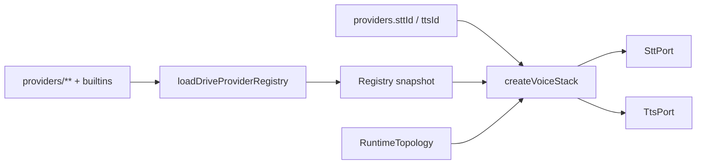

# 08 · Provider harness (BYOK) and Drive settings

Back to [README](README.md). Decision: [ARD-0010](ard/ARD-0010-provider-harness-byok.md). Topology: [07-runtime-topology.md](07-runtime-topology.md). Facets: [06-platform-config.md](06-platform-config.md).

## Product promise

1. **Out of the box.** Pick Local or Cloud once. Drive seeds compatible STT/TTS providers. Cloud users reuse existing Cline LLM keys. Local users aim at loopback Ollama (or openai-compatible localhost).
2. **Bring your own technology.** Drop a provider manifest under `.cline/drive/providers/<id>/` (or `~/`) and select it in Drive Settings. TopologyPolicy still enforces egress.
3. **One settings mechanism.** Facet catalog only. No second `driveSettings.json` bag. No API keys in Drive files.

## Slots

| Slot | Owner | Drive stores |
|---|---|---|
| LLM | Cline `@cline/llms` + provider settings + `ConfiguredAgent` | `runtime.profile`, `drive.defaults.pairAgent` (`AgentRef`) |
| STT | Drive registry → `SttPort` | `providers.sttId`, `providers.sttConfig` |
| TTS | Drive registry → `TtsPort` | `providers.ttsId`, `providers.ttsConfig`, `tts.*` |

LLM is intentionally **not** a `DriveProviderSlot`.

## Manifest shape

```ts
interface DriveProviderManifest {
  readonly schemaVersion: 1;
  readonly id: string;
  readonly slot: "stt" | "tts";
  readonly title: string;
  readonly origin: "builtin" | "workspace" | "user";
  readonly egress: EgressClass;
  readonly backend: SttBackend | TtsBackend;
  readonly defaultConfig: Record<string, unknown>;
  readonly configSchemaId: string;
  readonly modulePath?: string;
}
```

### Builtins (MVP)

| id | Slot | Egress | Notes |
|---|---|---|---|
| `builtin.webSpeech` | stt | `platform-cloud` | Cloud pack default |
| `builtin.localWorkerStt` | stt | `loopback-only` | Local pack default; engine brand probed at impl |
| `builtin.browserTts` | tts | `loopback-only` | Default for both packs |

### Disk layout

```text
<workspace>/.cline/drive/
  facets.v1.json
  registry.v1.json
  providers/<id>/manifest.json
  providers/<id>/index.js          # optional, workspace-trusted

~/.cline/drive/providers/...
```

Merge: workspace-over-user for facets and provider ids (same tombstone rules as DRV-PLATFORM-CONFIG).

## Default packs

`seedFacetsForProfile(profile)` returns partial facet values:

| Profile | sttId | ttsId | LLM expectation |
|---|---|---|---|
| `local` | `builtin.localWorkerStt` | `builtin.browserTts` | loopback `ResolvedLlmEgress` |
| `cloud` | `builtin.webSpeech` | `builtin.browserTts` | cloud agent/provider already configured |
| `hybrid` | user / ceiling | user / ceiling | either; `runtime.egressCeiling` required |

First-install default: **`cloud`**. If doctor detects loopback Ollama, Settings suggests Local with a single checklist row (not a multi-step wizard).

## Registry and factory



Pure helpers in `@cline/drive`: `listProviders`, `assertProviderCompatible`, `seedFacetsForProfile`.

IO and factory live in hub / `apps/cline-hub`.

## Drive Settings IA

```text
Drive Settings
  ├─ Runtime — profile Local | Cloud | Hybrid; egress ceiling (hybrid)
  ├─ Partner — ConfiguredAgent picker; appearance facets; link “Manage LLM providers in Cline”
  ├─ Voice — STT provider + options; TTS provider + options; captions; tts.enabled
  └─ Privacy — retention / debugRetention
```

Hub ops (illustrative): `drive_config_set`, `drive_providers_list`, `drive_providers_reload`.

Incompatible providers appear disabled in the picker and are rejected on set with ARD-0009 reason codes.

## Trust (MVP)

- Builtins compiled into the hub app.
- Workspace and user provider directories only.
- No remote URL install in MVP.
- Manifest `egress` is authoritative for compatibility checks; lying metadata still cannot bypass MuteGate privacy (no audio on the wire).

## Anti-goals

- API keys or tokens in facet JSON.
- Prompts, tools, skills, or model ids in Drive facets.
- A second daemon for providers.
- Chat.tsx switching on engine brand names.

## See also

- [ARD-0010](ard/ARD-0010-provider-harness-byok.md)
- [DRV-PLATFORM-CONFIG](features/DRV-PLATFORM-CONFIG.md)
- [DRV-MIC](features/DRV-MIC.md), [DRV-TTS](features/DRV-TTS.md)
