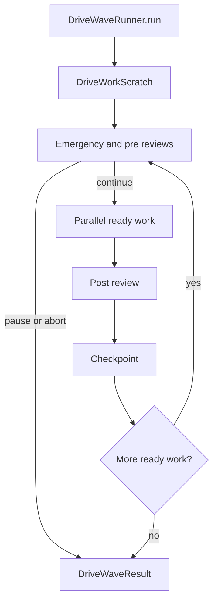

# Drive parallel work waves

## Context

Drive rooms need parallel specialist work (edits, tests, reviews) without inventing a second runtime or copying external orchestration brand names. This module lives inside `@cline/drive` as `waves/`.

## Ideas (product language)

| Idea | Drive type |
|---|---|
| Independent units of room work | `DriveWorkItem` |
| One parallel batch | wave (via `DriveWaveExecutor`) |
| Multi-batch run | `DriveWaveRunner` |
| Review before/after a batch | `DriveReviewGate` |
| Shared scratch pad | `DriveWorkScratch` |
| Worker messages | `DriveWorkMailbox` |
| Adaptive concurrency window | `AdaptiveConcurrency` |
| Start-rate tokens | `TokenQueue` |
| Resumable run state | `DriveWaveCheckpoint` |
| Bind real agents | `DriveWorkExecutor.runTask` |

## Boundary

- Pure kernel code. No sessions, hub sockets, or provider SDKs.
- Distinct from Cline Teams (execution groups) and from `RosterPack` (seating).
- Distinct from `DriveHostPort` (room propose/commit). Wave work uses `DriveWorkExecutor`.

## Lifecycle



## Usage

```ts
import { DriveWaveRunner, failFastReview } from "@cline/drive";

const result = await new DriveWaveRunner({
  host: {
    async runTask({ task }) {
      return { ok: true, result: { kind: task.kind } };
    },
  },
  gates: [failFastReview()],
  concurrency: { initial: 2, max: 6 },
}).run([
  { id: "a", kind: "edit" },
  { id: "b", kind: "edit" },
  { id: "c", kind: "test", dependsOn: ["a", "b"] },
]);
```

## Verification

```sh
bun -F @cline/drive test
bun -F @cline/drive build
```
