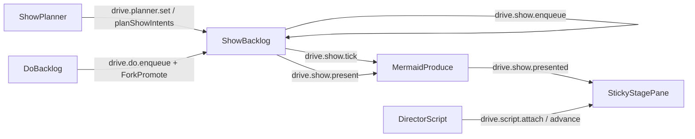

# Hub Drive ops catalog

**Purpose.** Canonical list of hub operations and failure modes for Drive rooms, config, and agent homes.
**Constraint.** Hub `ws://127.0.0.1:25463` is the single writer. Clients hold read-only projections.
**Status.** Planning catalog — shapes may tighten in Phase 0 schemas without changing ownership.

## Principles

1. Every mutating op is idempotent where noted.
2. Validation happens at the hub boundary; internal reducers trust typed inputs.
3. Broadcasts are versioned events (`DRV-EVENTS`).
4. Webview/CLI never write durable Drive config or seat state behind the hub’s back.
5. Pure fold (`reduceRoom`, `projectStage`) lives in `@cline/drive`; commit/broadcast live in `@cline/core`.

## Room / call ops (Phase 1)

| Op | Intent | Idempotent | Broadcast (conceptual) |
|---|---|---|---|
| `call_get_room` | Return `snapshot` + `seq`; with `afterSeq`, also gap `events` | Yes | none (reply only) |
| `call_join` / `room_join` | Attach human to room; seat pair partner via `joinCall` façade; optional `workspaceRoot` for durable log | Yes (re-join) | `room.snapshot` / `room.event` |
| `call_leave` | Remove human; room persists | Yes | participant remove |
| `call_end` | End session; handoff narration path | Yes (second end no-op) | room ended + handoff event |
| `call_mute` | Set human/agent mute flags | Yes | state update |
| `call_set_stage` | Set `sharer: human \| agent` (+ structured share payload ref) | Yes | stage update |
| `call_set_mode` | Drive sub-mode / native plan\|act mapping | Yes | mode update |
| `call_set_address` | Set addressSet for next sends | Yes | address update |
| `call_raise_hand` | Interrupt request | Yes | interrupt state |
| `call_steer` | Queue steer text | Append semantics | steer queued/acked |
| `room_focus` | Set focused room (MVP: only focused room runs turns) | Yes | focus update |

## Roster / pack / recruit ops

| Op | Intent | Phase |
|---|---|---|
| `room_seat` | Seat agent by AgentRef + seatSource | 1–2 |
| `room_unseat` | Remove seatSource; drop participant if refcount 0 | 1–2 |
| `room_add_roster_pack` | Expand pack into seats with pack seatSource | 2 |
| `room_remove_roster_pack` | Drop pack seatSources; keep other sources | 2 |
| `drive_recruit` | **Query only** — returns ranked agents/pack suggestions; does not seat | 2 |
| `room_seat_from_recruit` | UI convenience: seat chosen slug(s) after recruit | 2 |

Recruit never writes participants by itself (ARD-0003).

## Config / profile ops

| Op | Intent | Phase |
|---|---|---|
| `drive_config_get` | Read merged facet view | 0–1 |
| `drive_config_put` | Durable facet write (hub atomic write) | 0–1 |
| `drive_profile_patch` | Appearance overlay patch (name/inks/intent) | 1 |
| `drive_agent_home_get` | Read home tree / compiled graph projection | 1–2 |
| `drive_agent_home_put` | Write canonical home files (policy + FS allow) | 2 |
| `drive_agent_compile` | Compile canonical → `.derived/` | 1–2 |
| `drive_learn_propose` / `drive_learn_resolve` | Gated learn queue | 2–3 |

## Gate ops

| Op | Intent | Phase |
|---|---|---|
| `drive_gate_resolve` | approve / deny / allow-for-session | 1–2 |

See [DRV-GATES](../features/DRV-GATES.md).

## Director / Show / planner ops

Landed with [DRV-SHOW-BACKLOG](../features/DRV-SHOW-BACKLOG.md) (slices 1–7 + S on main).
Pure rank/script in `@cline/drive`; commit/broadcast in `@cline/core`.
Parse gate: `@cline/drive` `validateMermaidSource`. Cline skill: **`diagram-show`**.
Names: [`.claude/diagram-conventions.md`](../../../../../.claude/diagram-conventions.md).

| Op | Intent | Idempotent | Broadcast (conceptual) |
|---|---|---|---|
| `drive.show.enqueue` | Add/replace `ShowBacklogItem`; optional present-now tick | Yes (same id replaces) | `drive.show.planned`; room live |
| `drive.show.present` | Materialize (parse-gated mermaid) + set sticky showing | Yes (re-present) | `drive.show.presented` |
| `drive.show.tick` | Rank ready/planned → present winner | Yes (no-op if empty) | `drive.show.presented` when materialized |
| `drive.do.enqueue` | Add `DoBacklogItem` for fork claim | Yes (same id) | room live |
| `drive.planner.set` | `showPlanner: off \| heuristic` (+ cooldown knobs) | Yes | room live |
| `drive.script.attach` | Attach `DirectorScript` to live director | Yes | room live |
| `drive.script.advance` | `advanceScriptBeat`; sticky hold while `say` changes | Append beat cursor | `drive.script.beat` |
| `drive.fork.*` | Claim/promote Do; promote may create Show from kit | Per-op | room live / planned show |

**Fail closed:** `render_mermaid` without parse-valid `mermaidSource` does not get a `uri` and is not presented onto `StickyStagePane`.

See [show-backlog-director/overview.md](../show-backlog-director/overview.md).

## Failure modes (minimum UX)

| Condition | Client UX | Hub behavior |
|---|---|---|
| Hub not running | Empty state with how to start hub; no fake room | N/A |
| Version skew (client schema major ≠ server) | Hard stop message; refuse quiet degradation | Reject op / disconnect reason |
| Reconnect | Replay snapshot + gap events; show “reconnecting” | Resume session; do not duplicate seats |
| Unknown AgentRef on seat | Error toast/feed line | Op fails; room unchanged |
| Partial pack seat | Report missing members; seat available ones | Soft-partial with structured result |
| Isolation unavailable + teamOpt seat | Fail closed (DRV-ISOLATION) | Typed error |
| Stale definition while seated | Mark seat stale; require reseat for definition swap | No mid-turn hot-swap |
| Privacy debug off | No transcript/audio persist paths | Enforce retention caps |
| Invalid mermaidSource on present/tick | No sticky update; item stays without uri | Materialize fails closed; `mermaid_parse_failed` |
| Planner off | No auto-enqueue from work | `planShowIntents` returns `planner_off` |

## Snapshot / reconnect

On subscribe/reconnect (`call_join` / `call_get_room`):

1. Optional `workspaceRoot` attaches the durable JSONL room event log under `.cline/drive/rooms/<roomId>/`.
2. Hub hydrates `RoomSnapshot` from the log when the room is not already in memory.
3. Reply includes `snapshot`, monotonic `seq`, and optionally `events` for gap fill when the client sends `afterSeq` (events with `seq > afterSeq`).
4. Live broadcasts include `seq` on `room.event` / `room.snapshot`.

Clients rebuild projection via `@cline/drive` reducers — they do not merge ad hoc. Cursor field: `afterSeq` on `call_get_room`.

## Host capabilities (enterprise adapters)

`HostCapabilities` on `DriveHostPort` includes placeholders defaulting to false:

| Flag | Meaning |
|---|---|
| `remoteBridge` | Remote participant bridge to this hub |
| `orgConfig` | Org-managed facet / policy overlay |
| `auditExport` | Audit bundle export from the event log |

See [04-future-multi-user.md](../04-future-multi-user.md) Phase 2 and [ARD-0013](../ard/ARD-0013-state-partition.md).

## Out of scope here

- WebRTC signaling.
- Cross-machine rooms (until `remoteBridge`).
- Telemetry leaving localhost.
