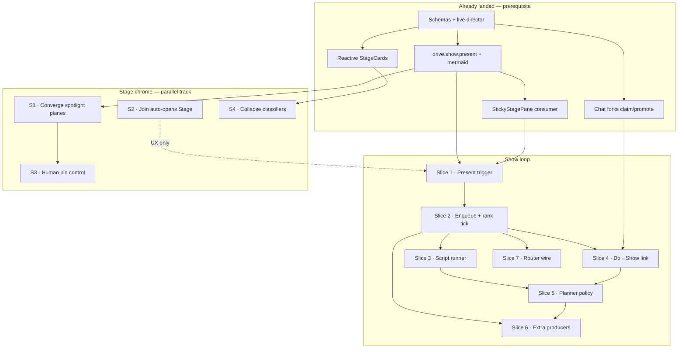

# Show backlog director · overview

Back to [README.md](README.md). Architecture: [share-and-router/PLAN.md](../share-and-router/PLAN.md). Feature: [DRV-SHOW-BACKLOG](../features/DRV-SHOW-BACKLOG.md).

## Goal

Close the dual-backlog loop so Spotlight can show **planned** artifacts (diagrams, walkthroughs, plan cards) chosen by rank/script, not only **reactive** work cards from tool completions.

```text
Planner / policy          Do backlog ──► worker forks ──► promote
        │                      │
        ▼                      ▼
   Show backlog ──► rank ──► produce ──► present sticky ──► advance script
                                                              │
                                                              ▼
                                                    StickyStagePane + captions
   Tool completions ──────────────────────────────► StageCards (existing)
```

## As-is (do not re-build)

| Layer | Landed |
|---|---|
| Schemas | `ShowBacklogItem`, `DoBacklogItem`, `DirectorScript`, `StageDirectorState`, bags, sticky policies (`@cline/shared` `director.ts`) |
| Live room | `DriveRoomLiveState.director` on hub room live map |
| Pure kernel | `rankShowBacklog`, `rankDoBacklog`, `advanceScriptBeat`, `buildDirectorStateFromBags`, `SHOW_TEMPLATE_KIT` — **tests only for rank/script** |
| Hub present | `drive.show.present` + mermaid materialize + `drive.show.presented` → `StickyStagePane` |
| Forks | `drive.fork.*` + tick claims Do; promote **creates** missing shows from templates (or flips planned→ready) |
| Work cards | `call_record_work` → stage cards (orthogonal reactive path) |
| UI gap | No product caller for `drive.show.present`; no enqueue/rank tick; no script runner |

## Tracks

| Track | Slices | Notes |
|---|---|---|
| **Show loop (main)** | 1 → 2 → 3 → 4 → 5 → 6 | Strict chain; 7 optional after 2+ |
| **Stage chrome (parallel)** | S | Can start in parallel with 1; S3 (pin UI) needs S1; classifiers independent |

## Dependency DAG



### Edge list (implementability)

| Task / slice | Depends on | Unlocks |
|---|---|---|
| Slice 1 Present trigger | present handler + StickyStagePane | Manual e2e proof; slice 2 product smoke |
| Slice 2 Enqueue + rank tick | Slice 1 | Automated present; slices 3–7 |
| Slice 3 Script runner | Slice 2 | Sticky hold across beats; richer planner |
| Slice 4 Do↔Show link | Slice 2 + forks | Promote creates shows; fork tick has Do seed |
| Slice 5 Planner policy | Slices 3 + 4 | Continuous enqueue without manual seed |
| Slice 6 Extra producers | Slice 2 (impl); Slice 5 (useful load) | Non-mermaid artifacts |
| Slice 7 Router wire | Slice 2 (optional bias) | Address-biased rank in live send |
| S · Converge spotlight | present/live ops exist | Pin control meaningful |
| S · Auto-stage | Join path exists | Slice 1 demos need fewer clicks |
| S · Human pin | Converge + `call_set_stage` | Bidirectional share |
| S · Classifier collapse | work-from-tool + stageReducer | Single classification SoT |

## Minimum vertical slice

**Done when:** enqueue one mermaid `ShowBacklogItem` → hub tick ranks it → present → StickyStagePane shows SVG → one `advanceScriptBeat` keeps URI while caption/`say` changes.

That is **slices 1 + 2 + 3** with a fixture seed (no planner yet).

## Package ownership

| Concern | Package |
|---|---|
| Schemas / hub event names | `@cline/shared` |
| Rank, advance, templates, fork policy | `@cline/drive` |
| Enqueue/tick/present/materialize handlers | `@cline/core` hub |
| Present trigger, sticky, optional backlog UI | `apps/cline-hub` |
| Demo query flags only at composition root | `@cline/drivecode-demo` |

## Implementation guidance

- Run **how** before changing hub director tick or spotlight convergence.
- Prefer hub policies over new ConfiguredAgent seats until slice 5 exits.
- After `@cline/shared` or `@cline/drive` edits: `bun run build:sdk`.
- Verify with [testing.md](testing.md); hub smoke via Join + Stage (or auto-stage once S lands).
- Do not treat `ShareScreenSpotlightDemo` as production gate — it stays a fixture.

## Status

| Slice | Status |
|---|---|
| 1 Present trigger | **Done** (sample Settings control + title plumb + tests + smoke doc) |
| 2 Enqueue + rank tick | **Done** (enqueue/tick commands, pickNextShow, Settings Sample/dev controls) |
| 3 Script runner | **Done** (attach/advance + beat event + Sample/dev Next beat; hold tested) |
| 4 Do↔Show link | **Done** (`drive.do.enqueue`, promote creates shows from templates, optional `tickShow`, Workers audit lists show ids) |
| 5 Planner policy | **Done** (`planShowIntents`, `call_record_work` hook, `drive.planner.set`, Settings Planner on/off, arch script skeleton) |
| 6 Extra producers | **Done** (plan_card + walkthrough SVG stubs; browser snapshot fail-closed on `demoCapture`) |
| 7 Router wire | **Done** (`call_set_address`, address-biased show tick, mute say gate, suggest chip on Drive send) |
| S Stage chrome | **Done** — S1 converge + S2 Join auto-stage + S3 human pin + S4 classifier collapse |
