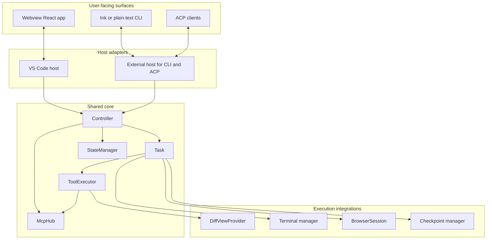
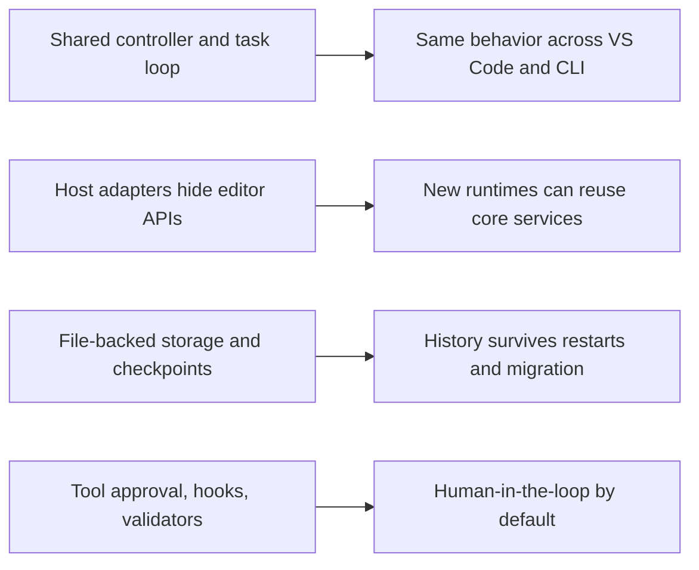

Cline is not one monolith. It is a layered architecture built around one shared task engine. The easiest way to understand it is to separate host-specific code from core logic.

## One core, three runtimes

The diagram hides an important design choice: Cline isolates editor-specific APIs inside host adapters. The controller and task engine do not care whether the request came from VS Code, a terminal, or an ACP client.

## Runtime boundaries

| Layer | Key files | Primary job | Reason it exists |
|---|---|---|---|
| VS Code host | `src/extension.ts`, `src/hosts/vscode/VscodeWebviewProvider.ts` | Activate the extension, register commands, expose the sidebar, bridge VS Code APIs | Keep IDE wiring out of the core engine |
| Webview UI | `webview-ui/src/App.tsx`, `webview-ui/src/Providers.tsx`, `webview-ui/src/context/ExtensionStateContext.tsx` | Render chat, history, settings, MCP, account, and worktrees views | Keep UI state in React instead of in the task loop |
| CLI / ACP | `cli/src/index.ts`, `cli/src/agent/ClineAgent.ts` | Choose terminal mode, host sessions, expose programmatic ACP events | Reuse core logic in non-editor workflows |
| Shared core | `src/core/controller/index.ts`, `src/core/task/index.ts`, `src/core/task/ToolExecutor.ts` | Create tasks, stream model output, run tools, track state | Centralize the agent brain |
| Shared services | `src/services/mcp/McpHub.ts`, `src/core/storage/StateManager.ts` | Manage MCP servers, storage, auth, config, and persistence | Make long-lived services reusable across hosts |

## The extension host is the conductor

`src/extension.ts` does more than register a sidebar. It performs a careful boot sequence:

1. It initializes `HostProvider` so shared services can talk to VS Code.
2. It runs legacy cleanup and state migration.
3. It exports VS Code-native storage into shared file-backed storage.
4. It calls `initialize(storageContext)` to build the shared services.
5. It registers `VscodeWebviewProvider`, command handlers, diff content providers, URI handlers, and editor integrations.

This order matters. If storage migration happened after service initialization, the core would boot against stale data.

## The controller is the orchestration boundary

`src/core/controller/index.ts` is the first core object worth memorizing. The `Controller` owns:

- `StateManager` for fast cached reads and debounced persistence.
- `McpHub` for MCP server discovery and transport management.
- auth and account services.
- workspace detection and root management.
- task lifecycle through `initTask(...)`, `clearTask()`, and UI state updates.

A good mental model is that the controller behaves like an airport tower. It does not fly the plane. It clears traffic, owns shared services, and creates one active `Task` that does the actual work.

## The task is the engine room

`src/core/task/index.ts` defines the `Task` class. This is where Cline stops being “an extension” and starts being “an agent runtime.” The class wires together:

- `ContextManager` for prompt assembly and context-window logic.
- `MessageStateHandler` for user-visible conversation state.
- `TaskPresentationScheduler` for serialized UI flushes.
- `BrowserSession`, terminal managers, diff providers, and checkpoint managers.
- `ToolExecutor` for every side effect.
- a single `Mutex` for state updates that must not race.

The task owns one active conversation. That makes reasoning about side effects much easier. Instead of many subsystems mutating the same data whenever they want, the task mediates the loop.

## The webview is a UI, not the business brain

The React app in `webview-ui/` renders state and sends gRPC-style messages through `ProtoBusClient` in `webview-ui/src/services/grpc-client-base.ts`.

`VscodeWebviewProvider.handleWebviewMessage(...)` receives `grpc_request` and `grpc_request_cancel` envelopes, then forwards them to controller handlers. That means the UI never edits files directly. It always asks the extension host to do it.

This split buys Cline two things:

- The UI can stay simple and reactive.
- The same controller and task engine can serve other runtimes.

## The CLI is a sibling runtime, not a fork

`cli/src/index.ts` chooses between interactive Ink mode and plain-text mode with `selectOutputMode(...)`. It also applies session-scoped overrides like `--plan`, `--model`, `--yolo`, and `--json`.

`cli/src/agent/ClineAgent.ts` goes one step further. It implements ACP and hosts multiple concurrent sessions by pairing session IDs with controllers and event emitters. That is why Cline can behave like a TUI for humans and like a library for other tools.

## Why this architecture scales

Cline succeeds architecturally because it separates “how users talk to the system” from “how the system thinks and acts.” That is the difference between a product surface and an execution core.

## Source anchors

- `src/extension.ts`
- `src/hosts/vscode/VscodeWebviewProvider.ts`
- `src/core/controller/index.ts`
- `src/core/task/index.ts`
- `src/core/task/ToolExecutor.ts`
- `src/core/storage/StateManager.ts`
- `src/services/mcp/McpHub.ts`
- `webview-ui/src/App.tsx`
- `webview-ui/src/Providers.tsx`
- `cli/src/index.ts`
- `cli/src/agent/ClineAgent.ts`
