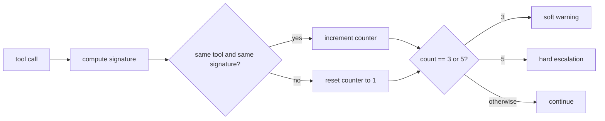
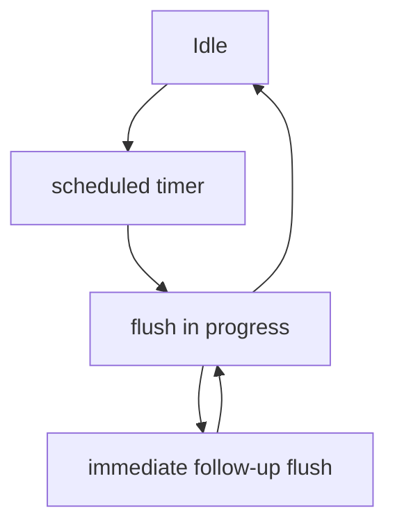

Cline is not a tensor-kernel repository, but it still contains real systems math. The formulas here are small, practical, and worth understanding because they explain cost, safety, and responsiveness.

## 1. API cost accounting is a weighted sum

`src/utils/cost.ts` computes total request cost by weighting four token buckets.

```text
totalCost
  = inputTokens      * inputPrice      / 1_000_000
  + outputTokens     * outputPrice     / 1_000_000
  + cacheWriteTokens * cacheWritePrice / 1_000_000
  + cacheReadTokens  * cacheReadPrice  / 1_000_000
```

| Symbol | Real meaning |
|---|---|
| `inputTokens` | tokens sent into the model |
| `outputTokens` | tokens generated by the model |
| `cacheWriteTokens` | tokens written into a prompt cache |
| `cacheReadTokens` | tokens served from that cache |
| price fields | dollars per one million tokens |

Think about a grocery receipt. Cline does not ask “how expensive was the trip?” in one vague step. It prices each basket separately and adds the baskets together.

### A tiny example

Suppose one request uses:

- `200,000` input tokens at `$3 / 1M`
- `40,000` output tokens at `$15 / 1M`
- `60,000` cache write tokens at `$3.75 / 1M`
- `120,000` cache read tokens at `$0.30 / 1M`

The bill becomes:

```text
input  = 200,000 * 3.00  / 1,000,000 = 0.600
output =  40,000 * 15.00 / 1,000,000 = 0.600
write  =  60,000 * 3.75  / 1,000,000 = 0.225
read   = 120,000 * 0.30  / 1,000,000 = 0.036
total  = 1.461 dollars
```

`calculateApiCostAnthropic(...)` and `calculateApiCostOpenAI(...)` differ because providers count cached tokens differently. The code normalizes that before doing the final sum.

### Tiered pricing is piecewise logic

Some models define pricing tiers. Cline sorts tiers by context window and chooses the first tier whose `contextWindow` can cover the request.

```text
pick the first tier where totalInputTokens <= contextWindow
```

That is a simple piecewise function. The larger the request, the further right you move along the pricing ladder.

## 2. Loop detection is a counter over canonical signatures

`src/core/task/loop-detection.ts` tries to catch a classic agent failure mode: calling the same tool with the same arguments over and over.

### Step 1: build a canonical signature

```text
signature(params)
  = JSON.stringify(sorted(params without task_progress))
```

The code strips metadata like `task_progress` because that field changes even when the real user-facing arguments do not.

### Step 2: update the counter

```text
if same toolName and same signature:
    consecutiveCount = consecutiveCount + 1
else:
    consecutiveCount = 1
```

### Step 3: compare against thresholds

```text
soft warning at 3
hard escalation at 5
```

That means Cline gives the model one visible warning before it escalates harder.

### Grocery-store version

Imagine you ask a store clerk for tomatoes and they reply by asking the same shelf scanner for “tomatoes” five times. The problem is not the scanner. The problem is the repeated, identical behavior. Cline measures that exact pattern.



## 3. Presentation scheduling is a tiny priority queue

`src/core/task/TaskPresentationScheduler.ts` solves a practical UI problem: streamed updates arrive quickly, but rendering every tiny change immediately can waste work and cause flicker.

The scheduler keeps two priority levels:

```text
normal < immediate
mergedPriority = max(currentPriority, nextPriority)
```

In everyday terms, normal updates wait in a short line. Immediate updates go to the front.



Two guarantees matter:

- Cline never runs concurrent flushes against the same presentation state.
- `flushNow()` guarantees that at least one immediate flush happens after the current in-flight flush completes.

Think of one cashier serving receipts. The cashier can speed up urgent customers, but still keeps one cash register instead of opening ten conflicting ones.

## 4. Two tiny boolean formulas explain a lot of behavior

### Multi-root checkpoints

`src/integrations/checkpoints/factory.ts` chooses the multi-root checkpoint manager with a compact predicate:

```text
useMultiRoot
  = multiRootEnabled
  && enableCheckpoints
  && workspaceManager exists
  && rootCount > 1
```

If you only have one workspace root, Cline keeps the simpler checkpoint path.

### CLI output mode selection

`cli/src/utils/mode-selection.ts` chooses plain text mode with another compact predicate:

```text
usePlainTextMode
  = yolo
  || json
  || stdinWasPiped
  || !stdinIsTTY
  || !stdoutIsTTY
```

This is why `cline --json` behaves like a machine-facing tool, while `cline` in a normal terminal gives you the interactive Ink UI.

## 5. One mutex keeps task state coherent

`src/core/task/index.ts` wraps mutable task state behind one `Mutex`. The principle is simple even if the implementation detail is easy to miss:

```text
every state mutation that must not race
goes through one lock
```

The daily-life analogy is one kitchen order rail. If five cooks pin tickets wherever they want, orders get mixed. If every ticket passes through one rail, the kitchen stays consistent.

## Source anchors

- `src/utils/cost.ts`
- `src/core/task/utils.ts`
- `src/core/task/loop-detection.ts`
- `src/core/task/TaskPresentationScheduler.ts`
- `src/integrations/checkpoints/factory.ts`
- `cli/src/utils/mode-selection.ts`
- `src/core/task/index.ts`
