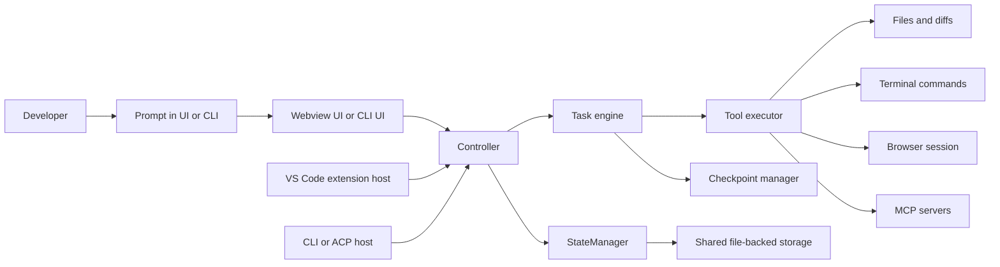

Cline looks like one assistant, but its repository is really a small distributed system. The VS Code extension host, the webview UI, and the CLI all sit on top of one shared control plane. If you keep that sentence in your head, the codebase stops looking huge and starts looking organized.

<CardGroup cols={2}>
  <Card title="System Architecture" icon="diagram-project" href="/en/architecture">
    See the macro structure before you read implementation details.
  </Card>
  <Card title="Runtime Flow" icon="arrow-right" href="/en/runtime-flow">
    Follow one prompt from the UI to tool execution and back.
  </Card>
  <Card title="Math and Algorithms" icon="calculator" href="/en/math-theory">
    Decode the scheduler, loop detection, and cost formulas.
  </Card>
  <Card title="Source Map" icon="book" href="/en/source-map">
    Jump straight to the files that matter for each subsystem.
  </Card>
</CardGroup>

## The 30-minute mental model



Read the diagram from left to right:

- A user interacts with either the sidebar UI or the CLI.
- A host surface turns that interaction into a controller call.
- The controller creates or resumes a `Task`.
- The `Task` streams model output, delegates side effects to the `ToolExecutor`, and records state.
- Shared storage and checkpoints make the session durable.

## Read these files first

<Steps>
  <Step title="Start at the host entrypoint">
    Read `src/extension.ts`. It sets up `HostProvider`, migrates old storage, exports VS Code state into shared file-backed stores, calls `initialize(...)`, and registers `VscodeWebviewProvider` plus commands.
  </Step>
  <Step title="Find the orchestrator">
    Read `src/core/controller/index.ts`. The `Controller` owns `StateManager`, `AuthService`, `McpHub`, workspace setup, and task creation through `initTask(...)`.
  </Step>
  <Step title="Drop into the engine room">
    Read `src/core/task/index.ts`. This file defines the `Task` class, the conversation loop, state locking, context trackers, checkpoint wiring, and message streaming.
  </Step>
  <Step title="Understand how side effects happen">
    Read `src/core/task/ToolExecutor.ts` and `src/core/task/tools/ToolExecutorCoordinator.ts`. They validate tool calls, apply approval policy, run hooks, and dispatch to concrete handlers.
  </Step>
  <Step title="Compare the two user-facing runtimes">
    Read `webview-ui/src/App.tsx`, `webview-ui/src/services/grpc-client-base.ts`, `cli/src/index.ts`, and `cli/src/agent/ClineAgent.ts`. You will see that the UI is different, but the control plane is shared.
  </Step>
</Steps>

## Directory cheat sheet

```text
src/
├── extension.ts                # VS Code activation entrypoint
├── core/
│   ├── controller/             # orchestration and UI-facing actions
│   ├── task/                   # main agent loop and tool execution
│   ├── storage/                # persistent state and task files
│   └── webview/                # webview provider abstraction
├── hosts/
│   ├── vscode/                 # VS Code-specific adapters
│   └── external/               # CLI and non-VS Code adapters
├── services/
│   └── mcp/                    # MCP discovery, transports, OAuth
webview-ui/src/                 # React sidebar application
cli/src/                        # Ink TUI, plain text mode, ACP agent
```

## What each runtime owns

| Runtime | Main files | Owns | Does not own |
|---|---|---|---|
| VS Code extension host | `src/extension.ts`, `src/hosts/vscode/VscodeWebviewProvider.ts` | activation, command registration, URI handling, sidebar transport | the model loop itself |
| Webview UI | `webview-ui/src/App.tsx`, `webview-ui/src/context/ExtensionStateContext.tsx` | rendering, local UI navigation, streaming request listeners | file edits, command execution |
| CLI and ACP | `cli/src/index.ts`, `cli/src/agent/ClineAgent.ts` | terminal UX, JSON mode, ACP embedding, session events | shared task logic |
| Shared core | `src/core/controller/index.ts`, `src/core/task/index.ts` | orchestration, tool execution, state, checkpoints, MCP integration | editor-specific APIs |

## Three questions worth keeping open

1. Where does a click in the sidebar become a real `Task` object?
2. How does Cline stop unsafe or repetitive tool execution before it spirals?
3. Why can the CLI and VS Code share one engine without copying business logic?

If you can answer those three questions, you already understand the repo better than most first-time readers.

## Source anchors

- `src/extension.ts`
- `src/core/controller/index.ts`
- `src/core/task/index.ts`
- `src/core/task/ToolExecutor.ts`
- `src/core/task/tools/ToolExecutorCoordinator.ts`
- `src/services/mcp/McpHub.ts`
- `webview-ui/src/App.tsx`
- `webview-ui/src/services/grpc-client-base.ts`
- `cli/src/index.ts`
- `cli/src/agent/ClineAgent.ts`
