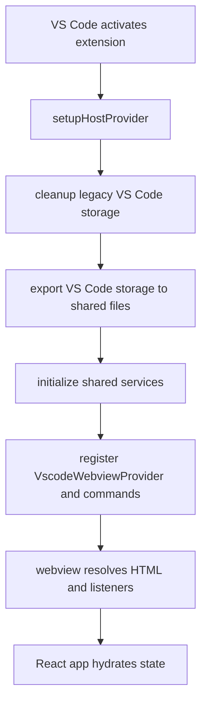
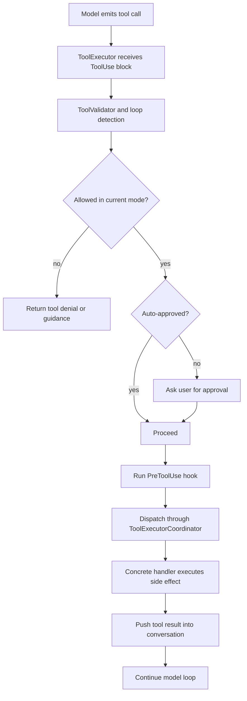
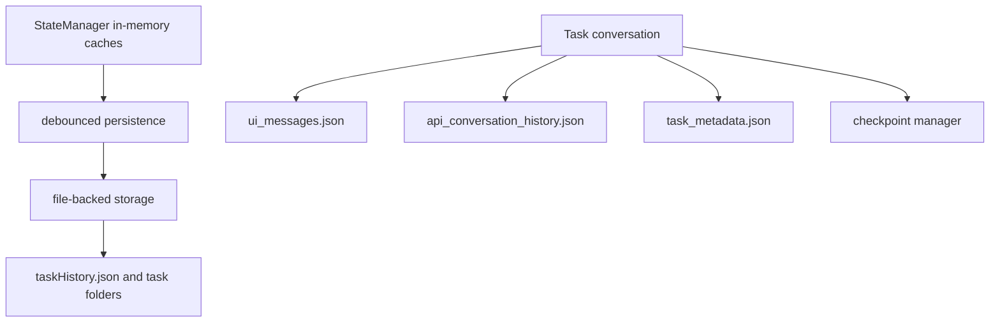

Architecture tells you where responsibilities live. Runtime flow tells you how work actually moves. This page follows a real prompt through Cline's control path.

## 1. Boot and sidebar hydration



`src/extension.ts` is explicit about ordering. Host setup happens first. Storage cleanup and export happen next. Shared services initialize after that. Only then does the extension expose the sidebar and commands.

## 2. The message bus between UI and host

The webview does not call controller methods directly. It sends envelopes defined in `src/shared/WebviewMessage.ts`, and the extension replies with envelopes from `src/shared/ExtensionMessage.ts`.

| Field | Where it lives | Why it matters |
|---|---|---|
| `service` | `WebviewMessage.GrpcRequest` | Selects which gRPC-style service should handle the request |
| `method` | `WebviewMessage.GrpcRequest` | Picks the operation on that service |
| `request_id` | request and response | Correlates responses with the original request |
| `is_streaming` | request and response | Distinguishes one-shot replies from streamed chunks |
| `sequence_number` | `GrpcResponse` | Preserves chunk ordering for streams |

`webview-ui/src/services/grpc-client-base.ts` generates a UUID per request. `src/hosts/vscode/VscodeWebviewProvider.ts` listens for those requests, runs the controller handler, and posts back `grpc_response` messages.

## 3. Starting a new task

```mermaid
flowchart LR
    UI[ChatView or CLI input] --> CTRL[Controller.initTask]
    CTRL --> CLEAR[clearTask and load settings]
    CLEAR --> CREATE[new Task(...)]
    CREATE --> START[startTask]
    START --> PROMPT[build context and system prompt]
    PROMPT --> MODEL[stream model response]
    MODEL --> PRESENT[update message state and UI]
```

The important object boundary is `Controller.initTask(...)`.

- The controller loads settings such as auto-approval, terminal mode, and output limits.
- It creates a fresh `Task` and passes in shared services like `McpHub` and `StateManager`.
- The task becomes the owner of the live conversation.

## 4. Tool execution is its own pipeline



`src/core/task/ToolExecutor.ts` centralizes the rules that make Cline safe:

- plan mode restrictions for mutating tools.
- auto-approval and manual approval handling.
- repeated-tool loop detection.
- hook execution around tool use.
- shared formatting for tool results.

`src/core/task/tools/ToolExecutorCoordinator.ts` then picks the actual handler, such as `ReadFileToolHandler`, `ExecuteCommandToolHandler`, `WriteToFileToolHandler`, or `UseMcpToolHandler`.

## 5. MCP requests are a second network inside the agent loop

```mermaid
flowchart LR
    Settings[cline_mcp_settings.json changes] --> Watcher[McpHub file watcher]
    Watcher --> Connect[build or rebuild MCP connections]
    Connect --> Catalog[available MCP tools and resources]
    Catalog --> ToolUse[use_mcp_tool or access_mcp_resource]
    ToolUse --> Approval[approval and hooks]
    Approval --> Call[McpHub.callTool]
    Call --> Notify[pending notifications]
    Notify --> Result[result returned to task]
```



`src/services/mcp/McpHub.ts` watches the MCP settings file, validates the schema, expands environment variables, chooses a transport, and manages reconnect behavior. `UseMcpToolHandler` then turns a model-emitted MCP tool call into a real server request, including approval, notifications, truncation, and image-handling logic.

## 6. State and history flow



`StateManager` gives Cline fast in-memory reads but writes through to file-backed storage after a short debounce. Task-specific artifacts are stored as JSON files. That is why history reconstruction works even after upgrades or migrations.

## 7. Checkpoints sit beside the conversation loop

The checkpoint factory in `src/integrations/checkpoints/factory.ts` chooses between a single-root checkpoint manager and `MultiRootCheckpointManager`. The decision depends on three facts:

- checkpoints must be enabled,
- multi-root support must be enabled,
- the workspace manager must report more than one root.

In plain English, Cline uses the more complex checkpoint machinery only when the workspace is actually complex.

## 8. Why the flow feels responsive

`TaskPresentationScheduler` is a small but important performance layer. It batches normal UI flushes, jumps immediately for urgent ones, and guarantees one last flush before completion. Without it, streaming updates would race or flicker.

## Source anchors

- `src/extension.ts`
- `src/hosts/vscode/VscodeWebviewProvider.ts`
- `src/shared/WebviewMessage.ts`
- `src/shared/ExtensionMessage.ts`
- `webview-ui/src/services/grpc-client-base.ts`
- `src/core/controller/index.ts`
- `src/core/task/index.ts`
- `src/core/task/ToolExecutor.ts`
- `src/core/task/tools/ToolExecutorCoordinator.ts`
- `src/core/task/tools/handlers/UseMcpToolHandler.ts`
- `src/services/mcp/McpHub.ts`
- `src/core/storage/StateManager.ts`
- `src/integrations/checkpoints/factory.ts`
