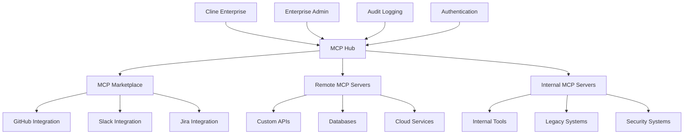

Model Context Protocol (MCP) provides standardized communication between AI models and external data sources, tools, and services. Enterprise MCP integration allows you to securely connect Cline to your organization's systems while maintaining governance and compliance.

## Enterprise MCP Benefits

<CardGroup cols={2}>
  <Card title="Extensible Architecture" icon="puzzle-piece">
    Connect to unlimited external tools, databases, APIs, and services through standardized MCP servers.
  </Card>
  
  <Card title="Enterprise Security" icon="shield-alt">
    Secure authentication, authorization, and audit trails for all MCP server communications.
  </Card>
  
  <Card title="Centralized Management" icon="network-wired">
    Manage and deploy MCP servers enterprise-wide with version control and configuration management.
  </Card>
  
  <Card title="Compliance Ready" icon="clipboard-check">
    Built-in logging, monitoring, and data governance for regulatory compliance requirements.
  </Card>
</CardGroup>

## MCP Architecture Overview



## Core Components

<CardGroup cols={2}>
  <Card title="MCP Marketplace" icon="store" href="/enterprise-solutions/configuration/infrastructure-configuration/mcp/mcp-marketplace">
    Pre-built, enterprise-ready MCP servers for popular tools and services with one-click deployment.
  </Card>
  
  <Card title="Remote MCP Servers" icon="server" href="/enterprise-solutions/configuration/infrastructure-configuration/mcp/remote-mcp-servers">
    Deploy and manage custom MCP servers across your infrastructure with centralized configuration.
  </Card>
</CardGroup>

## Enterprise Configuration

### Basic MCP Hub Setup

Configure the central MCP hub for your enterprise deployment:

```yaml
# mcp-hub-config.yaml
mcp:
  hub:
    enabled: true
    port: 8080
    authentication:
      method: "enterprise-sso"
      jwt_secret: "${MCP_JWT_SECRET}"
      
    # Server discovery
    discovery:
      methods: ["marketplace", "remote", "local"]
      marketplace_url: "https://mcp.cline.bot/marketplace"
      
    # Security settings
    security:
      enforce_tls: true
      allowed_origins: ["https://*.company.com"]
      rate_limiting:
        requests_per_minute: 1000
        burst_size: 100
        
    # Audit and compliance
    audit:
      enabled: true
      log_level: "INFO"
      destinations: ["file", "syslog", "datadog"]
      retention_days: 90
```

### Multi-Environment Configuration

Deploy MCP configurations across environments:

<Tabs>
<Tab title="Development">
```yaml
# mcp-dev-config.yaml
mcp:
  environment: "development"
  
  servers:
    - name: "github-dev"
      type: "marketplace"
      package: "@cline/mcp-github"
      version: "latest"
      config:
        github_token: "${GITHUB_DEV_TOKEN}"
        org: "company-dev"
        
    - name: "local-db"
      type: "remote" 
      url: "http://localhost:3001"
      auth:
        type: "api-key"
        key: "${DEV_DB_API_KEY}"
        
  policies:
    allow_experimental: true
    auto_update: true
    rate_limits:
      relaxed: true
```
</Tab>

<Tab title="Production">
```yaml
# mcp-prod-config.yaml
mcp:
  environment: "production"
  
  servers:
    - name: "github-prod"
      type: "marketplace"
      package: "@cline/mcp-github"
      version: "1.2.3"  # Pinned version
      config:
        github_token: "${GITHUB_PROD_TOKEN}"
        org: "company"
        
    - name: "crm-integration"
      type: "remote"
      url: "https://mcp-crm.internal.company.com"
      auth:
        type: "mtls"
        cert_path: "/certs/mcp-client.pem"
        key_path: "/certs/mcp-client-key.pem"
        
    - name: "security-scanner"
      type: "remote"
      url: "https://security-mcp.company.com"
      auth:
        type: "oauth2"
        client_id: "${SECURITY_CLIENT_ID}"
        client_secret: "${SECURITY_CLIENT_SECRET}"
        
  policies:
    allow_experimental: false
    auto_update: false
    strict_versioning: true
    
  monitoring:
    metrics: true
    health_checks: true
    alert_on_failure: true
```
</Tab>
</Tabs>

## Server Management

### Lifecycle Management

Manage MCP server deployments with GitOps:

```yaml
# mcp-server-manifest.yaml
apiVersion: mcp.cline.bot/v1
kind: MCPServer
metadata:
  name: custom-api-server
  namespace: cline-enterprise
spec:
  image: company/custom-mcp-server:v1.0.0
  replicas: 3
  
  config:
    api_endpoint: "https://api.internal.company.com"
    timeout: 30s
    retry_attempts: 3
    
  auth:
    type: service-account
    service_account: mcp-custom-api
    
  resources:
    requests:
      memory: "256Mi"
      cpu: "100m"
    limits:
      memory: "512Mi" 
      cpu: "500m"
      
  monitoring:
    enabled: true
    metrics_port: 9090
    health_endpoint: "/health"
    
  security:
    network_policy: strict
    pod_security_standard: restricted
```

### Configuration Management

Use Helm charts for enterprise MCP deployments:

```yaml
# values-prod.yaml
mcp:
  hub:
    replicaCount: 3
    image:
      repository: cline/mcp-hub-enterprise
      tag: "1.5.2"
      
  servers:
    marketplace:
      enabled: true
      catalog_url: "https://enterprise-catalog.company.com"
      
    custom:
      - name: "salesforce"
        enabled: true
        image: "company/mcp-salesforce:1.0.0"
        config:
          instance_url: "https://company.my.salesforce.com"
          
      - name: "jira"
        enabled: true
        image: "company/mcp-jira:2.1.0"
        config:
          base_url: "https://company.atlassian.net"
          
  ingress:
    enabled: true
    className: nginx
    annotations:
      cert-manager.io/cluster-issuer: "letsencrypt-prod"
    hosts:
      - host: mcp.company.com
        paths:
          - path: /
            pathType: Prefix
    tls:
      - secretName: mcp-tls
        hosts:
          - mcp.company.com
```

## Security & Governance

### Authentication & Authorization

Configure enterprise authentication for MCP servers:

```yaml
# mcp-auth-config.yaml
authentication:
  providers:
    - name: "enterprise-sso"
      type: "oidc"
      issuer: "https://sso.company.com"
      client_id: "${SSO_CLIENT_ID}"
      client_secret: "${SSO_CLIENT_SECRET}"
      
    - name: "service-accounts"
      type: "jwt"
      signing_key: "${SERVICE_ACCOUNT_KEY}"
      
authorization:
  policies:
    - name: "developers"
      subjects: ["group:developers"]
      resources: ["mcp:servers:read", "mcp:servers:execute"]
      
    - name: "admins"
      subjects: ["group:mcp-admins"]
      resources: ["mcp:*"]
      
    - name: "security-team"
      subjects: ["group:security"]
      resources: ["mcp:audit:*", "mcp:servers:security-*"]
      
  rbac:
    enabled: true
    default_role: "viewer"
```

### Network Security

Implement network policies for MCP communications:

```yaml
# mcp-network-policy.yaml
apiVersion: networking.k8s.io/v1
kind: NetworkPolicy
metadata:
  name: mcp-server-policy
  namespace: cline-enterprise
spec:
  podSelector:
    matchLabels:
      app: mcp-server
  policyTypes:
    - Ingress
    - Egress
    
  ingress:
    - from:
        - namespaceSelector:
            matchLabels:
              name: cline-enterprise
        - podSelector:
            matchLabels:
              app: cline-core
      ports:
        - protocol: TCP
          port: 8080
          
  egress:
    # Allow DNS
    - to: []
      ports:
        - protocol: UDP
          port: 53
    # Allow HTTPS to external APIs
    - to: []
      ports:
        - protocol: TCP
          port: 443
```

## Monitoring & Observability

### Metrics Collection

Configure comprehensive MCP monitoring:

```yaml
# mcp-monitoring.yaml
monitoring:
  metrics:
    enabled: true
    interval: 30s
    
    collectors:
      - name: "server-health"
        metrics:
          - mcp_server_status
          - mcp_server_response_time
          - mcp_server_error_rate
          
      - name: "hub-performance"
        metrics:
          - mcp_hub_requests_total
          - mcp_hub_request_duration
          - mcp_hub_active_connections
          
      - name: "resource-usage"
        metrics:
          - mcp_memory_usage
          - mcp_cpu_usage
          - mcp_network_io
          
  alerts:
    - name: "server-down"
      condition: "mcp_server_status == 0"
      severity: "critical"
      notification_channels: ["pagerduty", "slack"]
      
    - name: "high-error-rate"
      condition: "mcp_server_error_rate > 0.05"
      severity: "warning"
      notification_channels: ["slack"]
      
    - name: "performance-degradation"
      condition: "mcp_server_response_time > 5s"
      severity: "warning"
      notification_channels: ["email"]
```

### Audit Logging

Implement comprehensive audit trails:

```json
{
  "timestamp": "2024-01-15T10:30:00Z",
  "event_type": "mcp_server_call",
  "user_id": "john.doe@company.com",
  "session_id": "sess_abc123",
  "server_name": "github-prod",
  "method": "github.create_issue",
  "request": {
    "repository": "company/project",
    "title": "Bug fix required",
    "sensitive_data_detected": false
  },
  "response": {
    "status": "success",
    "issue_id": "12345",
    "duration_ms": 234
  },
  "compliance": {
    "data_classification": "internal",
    "retention_required": true,
    "pii_detected": false
  }
}
```

## Custom MCP Server Development

### Development Framework

Create custom MCP servers using the enterprise SDK:

```typescript
// custom-mcp-server.ts
import { MCPServer, Tool, Resource } from '@cline/mcp-enterprise-sdk';

class CustomAPIServer extends MCPServer {
  constructor() {
    super({
      name: 'custom-api-server',
      version: '1.0.0',
      description: 'Custom API integration server'
    });
    
    this.addTool(new DatabaseQueryTool());
    this.addResource(new UserDataResource());
  }
}

class DatabaseQueryTool implements Tool {
  name = 'query_database';
  description = 'Query the company database';
  
  async execute(params: any) {
    // Implement database query logic
    const result = await this.database.query(params.sql);
    
    // Audit log the query
    await this.auditLog({
      action: 'database_query',
      query: params.sql,
      user: params.user_id,
      results_count: result.length
    });
    
    return result;
  }
  
  async validate(params: any): Promise<boolean> {
    // Implement query validation
    return params.sql && !this.containsMaliciousSQL(params.sql);
  }
}
```

### Deployment Pipeline

Automate MCP server deployments:

```yaml
# .github/workflows/deploy-mcp-server.yml
name: Deploy MCP Server
on:
  push:
    branches: [main]
    paths: ['mcp-servers/**']
    
jobs:
  deploy:
    runs-on: ubuntu-latest
    steps:
      - uses: actions/checkout@v3
      
      - name: Build MCP Server
        run: |
          docker build -t company/mcp-server:${{ github.sha }} .
          docker push company/mcp-server:${{ github.sha }}
          
      - name: Deploy to Staging
        run: |
          helm upgrade mcp-server-staging ./helm-chart \
            --set image.tag=${{ github.sha }} \
            --namespace mcp-staging
            
      - name: Run Integration Tests
        run: |
          kubectl wait --for=condition=ready pod -l app=mcp-server -n mcp-staging
          npm run test:integration
          
      - name: Deploy to Production
        if: success()
        run: |
          helm upgrade mcp-server-prod ./helm-chart \
            --set image.tag=${{ github.sha }} \
            --namespace mcp-prod
```

## Best Practices

### Security
1. **Authentication**: Always require authentication for MCP servers
2. **Encryption**: Use TLS for all MCP communications
3. **Validation**: Validate all inputs and sanitize outputs
4. **Least Privilege**: Grant minimal required permissions
5. **Audit**: Log all MCP server interactions

### Performance
1. **Caching**: Implement response caching where appropriate
2. **Connection Pooling**: Reuse connections to external services
3. **Async Operations**: Use non-blocking operations for I/O
4. **Resource Limits**: Set appropriate CPU and memory limits
5. **Load Balancing**: Scale MCP servers based on demand

### Reliability
1. **Health Checks**: Implement comprehensive health endpoints
2. **Circuit Breakers**: Fail fast when external services are down
3. **Retry Logic**: Implement exponential backoff for failures
4. **Graceful Degradation**: Provide fallback behavior
5. **Monitoring**: Set up proactive alerting and monitoring

## Production Checklist

Before deploying MCP servers to production:

- [ ] Security review completed
- [ ] Authentication and authorization configured
- [ ] Network policies implemented
- [ ] Monitoring and alerting set up
- [ ] Audit logging enabled
- [ ] Resource limits configured
- [ ] Health checks implemented
- [ ] Integration tests passing
- [ ] Disaster recovery plan documented
- [ ] Compliance requirements validated

## Getting Started

Ready to implement enterprise MCP integration? Start with:

1. [MCP Marketplace](/enterprise-solutions/configuration/infrastructure-configuration/mcp/mcp-marketplace) - Deploy pre-built integrations
2. [Remote MCP Servers](/enterprise-solutions/configuration/infrastructure-configuration/mcp/remote-mcp-servers) - Configure custom servers
3. Review our [MCP Development Guide](/mcp/mcp-overview) for building custom integrations
