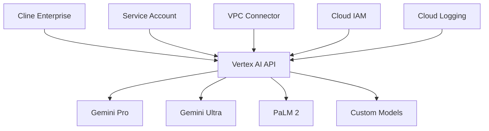

Google Vertex AI provides enterprise-grade AI models with advanced security, compliance, and regional deployment options. This guide covers integrating Vertex AI with your Cline Enterprise deployment for scalable, compliant AI operations.

## Enterprise Benefits

<CardGroup cols={2}>
  <Card title="Enterprise Security" icon="shield-check">
    VPC Service Controls, private endpoints, and Customer-Managed Encryption Keys (CMEK).
  </Card>
  
  <Card title="Global Deployment" icon="globe">
    Deploy models in 30+ regions worldwide to meet data residency requirements.
  </Card>
  
  <Card title="Advanced Models" icon="brain">
    Access to Gemini, PaLM, and specialized models for code generation and analysis.
  </Card>
  
  <Card title="Enterprise Billing" icon="credit-card">
    Unified billing with Google Cloud committed use discounts and enterprise pricing.
  </Card>
</CardGroup>

## Architecture Overview



## Prerequisites

### Google Cloud Setup

1. **Create a Google Cloud Project**:
```bash
# Create new project
gcloud projects create cline-enterprise-prod --name="Cline Enterprise Production"

# Set as active project
gcloud config set project cline-enterprise-prod

# Enable required APIs
gcloud services enable aiplatform.googleapis.com
gcloud services enable compute.googleapis.com
gcloud services enable logging.googleapis.com
gcloud services enable monitoring.googleapis.com
```

2. **Create Service Account**:
```bash
# Create service account for Cline Enterprise
gcloud iam service-accounts create cline-vertex-sa \
    --display-name="Cline Enterprise Vertex AI" \
    --description="Service account for Cline Enterprise Vertex AI access"

# Grant necessary permissions
gcloud projects add-iam-policy-binding cline-enterprise-prod \
    --member="serviceAccount:cline-vertex-sa@cline-enterprise-prod.iam.gserviceaccount.com" \
    --role="roles/aiplatform.user"

# Create and download key
gcloud iam service-accounts keys create cline-vertex-key.json \
    --iam-account=cline-vertex-sa@cline-enterprise-prod.iam.gserviceaccount.com
```

## Configuration

### Basic Configuration

Create a Vertex AI configuration for your Cline Enterprise deployment:

```yaml
# vertex-config.yaml
providers:
  vertex-ai:
    type: "google-vertex"
    project_id: "cline-enterprise-prod"
    location: "us-central1"
    service_account_path: "/path/to/cline-vertex-key.json"
    
    # Available models
    models:
      - name: "gemini-pro"
        model_id: "gemini-pro"
        max_tokens: 8192
        temperature: 0.1
        
      - name: "gemini-pro-vision"
        model_id: "gemini-pro-vision"
        max_tokens: 4096
        supports_vision: true
        
      - name: "gemini-ultra"
        model_id: "gemini-ultra"
        max_tokens: 8192
        tier: "premium"
        
    # Rate limiting
    rate_limits:
      requests_per_minute: 300
      tokens_per_minute: 1000000
      
    # Retry configuration
    retry_config:
      max_retries: 3
      backoff_multiplier: 2
      max_backoff: 60
```

### Multi-Region Deployment

Configure multiple regions for high availability and compliance:

```yaml
# multi-region-vertex-config.yaml
providers:
  # US regions
  vertex-us-central:
    type: "google-vertex"
    project_id: "cline-enterprise-prod"
    location: "us-central1"
    service_account_path: "/path/to/service-account.json"
    
  vertex-us-east:
    type: "google-vertex"  
    project_id: "cline-enterprise-prod"
    location: "us-east4"
    service_account_path: "/path/to/service-account.json"
    
  # European regions for GDPR compliance
  vertex-europe:
    type: "google-vertex"
    project_id: "cline-enterprise-eu"
    location: "europe-west1"
    service_account_path: "/path/to/eu-service-account.json"
    data_residency: "EU"
    
  # Asia Pacific regions
  vertex-asia:
    type: "google-vertex"
    project_id: "cline-enterprise-asia"
    location: "asia-southeast1"
    service_account_path: "/path/to/asia-service-account.json"

# Routing rules based on user location
routing_rules:
  - condition: "user.region == 'EU'"
    provider: "vertex-europe"
  - condition: "user.region == 'APAC'" 
    provider: "vertex-asia"
  - default: "vertex-us-central"
```

### Enterprise Security Configuration

<Tabs>
<Tab title="VPC Service Controls">
```yaml
# vpc-service-controls.yaml
apiVersion: accesscontextmanager.cnrm.cloud.google.com/v1beta1
kind: AccessContextManagerAccessPolicy
metadata:
  name: cline-enterprise-policy
spec:
  title: "Cline Enterprise Access Policy"
  
---
apiVersion: accesscontextmanager.cnrm.cloud.google.com/v1beta1
kind: AccessContextManagerServicePerimeter
metadata:
  name: cline-vertex-perimeter
spec:
  title: "Cline Vertex AI Perimeter"
  accessPolicyRef:
    name: cline-enterprise-policy
  perimeterType: "PERIMETER_TYPE_REGULAR"
  status:
    restrictedServices:
      - "aiplatform.googleapis.com"
    resources:
      - "projects/123456789"  # Your project number
    accessLevels:
      - "accesscontextmanager.googleapis.com/accessPolicies/123456/accessLevels/cline_authorized"
```
</Tab>

<Tab title="Private Endpoints">
```yaml
# private-endpoint-config.yaml
vertex_ai:
  private_service_connect:
    enabled: true
    network: "projects/cline-enterprise-prod/global/networks/cline-vpc"
    subnetwork: "projects/cline-enterprise-prod/regions/us-central1/subnetworks/cline-subnet"
    
  # Enterprise firewall rules
  firewall_rules:
    - name: "allow-vertex-ai-private"
      direction: "EGRESS"
      destination_ranges: ["199.36.153.8/30"]  # Vertex AI private endpoint range
      allowed:
        - protocol: "tcp"
          ports: ["443"]
```
</Tab>

<Tab title="CMEK Encryption">
```yaml
# cmek-config.yaml
encryption:
  kms_key_name: "projects/cline-enterprise-prod/locations/us-central1/keyRings/cline-ring/cryptoKeys/vertex-key"
  
  # Configure CMEK for Vertex AI
  vertex_ai_encryption:
    prediction_encryption_spec:
      kms_key_name: "projects/cline-enterprise-prod/locations/us-central1/keyRings/cline-ring/cryptoKeys/vertex-predictions"
    
    training_encryption_spec:
      kms_key_name: "projects/cline-enterprise-prod/locations/us-central1/keyRings/cline-ring/cryptoKeys/vertex-training"
```
</Tab>
</Tabs>

## Enterprise Features

### Workload Identity Integration

Configure Workload Identity for Kubernetes deployments:

```yaml
# workload-identity-setup.yaml
apiVersion: v1
kind: ServiceAccount
metadata:
  name: cline-vertex-workload-identity
  namespace: cline-enterprise
  annotations:
    iam.gke.io/gcp-service-account: cline-vertex-sa@cline-enterprise-prod.iam.gserviceaccount.com

---
apiVersion: apps/v1
kind: Deployment
metadata:
  name: cline-enterprise
  namespace: cline-enterprise
spec:
  template:
    spec:
      serviceAccountName: cline-vertex-workload-identity
      containers:
      - name: cline
        env:
        - name: GOOGLE_CLOUD_PROJECT
          value: "cline-enterprise-prod"
        - name: VERTEX_AI_LOCATION
          value: "us-central1"
```

### Custom Model Deployment

Deploy custom models on Vertex AI:

```python
# deploy-custom-model.py
from google.cloud import aiplatform

def deploy_custom_model():
    aiplatform.init(
        project="cline-enterprise-prod",
        location="us-central1"
    )
    
    # Upload custom model
    model = aiplatform.Model.upload(
        display_name="cline-custom-code-model",
        artifact_uri="gs://cline-models/custom-code-model",
        serving_container_image_uri="gcr.io/vertex-ai/prediction/pytorch-gpu.1-9:latest",
        serving_container_environment_variables={
            "MODEL_NAME": "cline-code-model"
        }
    )
    
    # Deploy to endpoint
    endpoint = model.deploy(
        machine_type="n1-standard-4",
        min_replica_count=1,
        max_replica_count=10,
        accelerator_type="NVIDIA_TESLA_T4",
        accelerator_count=1
    )
    
    return endpoint

if __name__ == "__main__":
    endpoint = deploy_custom_model()
    print(f"Model deployed to endpoint: {endpoint.resource_name}")
```

### Cost Management & Budgets

Set up billing budgets and alerts:

```bash
# Create billing budget
gcloud billing budgets create \
    --billing-account=BILLING_ACCOUNT_ID \
    --display-name="Cline Enterprise Vertex AI Budget" \
    --budget-amount=5000 \
    --threshold-rules-percent=50,90 \
    --threshold-rules-spend-basis=CURRENT_SPEND \
    --all-updates-rule-monitoring-notification-channels=NOTIFICATION_CHANNEL_ID \
    --filter-projects=cline-enterprise-prod \
    --filter-services=aiplatform.googleapis.com
```

## Monitoring & Observability

### Cloud Monitoring Integration

Configure monitoring dashboards and alerts:

```yaml
# monitoring-config.yaml
monitoring:
  dashboards:
    - name: "Cline Vertex AI Usage"
      widgets:
        - title: "API Requests"
          metric: "aiplatform.googleapis.com/api/request_count"
          resource: "gce_instance"
          
        - title: "Response Latency" 
          metric: "aiplatform.googleapis.com/api/request_latencies"
          aggregation: "ALIGN_PERCENTILE_95"
          
        - title: "Token Usage"
          metric: "aiplatform.googleapis.com/prediction/token_count"
          
  alerts:
    - name: "High Error Rate"
      condition: "error_rate > 0.05"
      notification_channels: ["email", "slack"]
      
    - name: "Budget Alert"
      condition: "monthly_spend > 4500"
      notification_channels: ["email", "pagerduty"]
```

### Logging Configuration

Enable comprehensive audit logging:

```yaml
# logging-config.yaml
logging:
  audit_logs:
    - service: "aiplatform.googleapis.com"
      audit_log_configs:
        - log_type: "ADMIN_READ"
        - log_type: "DATA_READ"
        - log_type: "DATA_WRITE"
          
  log_sinks:
    - name: "vertex-ai-audit-sink"
      destination: "bigquery.googleapis.com/projects/cline-enterprise-prod/datasets/vertex_audit_logs"
      filter: 'resource.type="aiplatform.googleapis.com/Model"'
      
    - name: "vertex-security-sink"
      destination: "storage.googleapis.com/cline-security-logs"
      filter: 'severity>=ERROR OR resource.type="gcp_network"'
```

## Best Practices

### Security
1. **Service Account Management**:
   - Use dedicated service accounts per environment
   - Implement regular key rotation (90 days)
   - Apply principle of least privilege

2. **Network Security**:
   - Use VPC Service Controls for sensitive workloads
   - Enable private endpoints for production traffic
   - Implement network-level access controls

3. **Data Protection**:
   - Enable Customer-Managed Encryption Keys (CMEK)
   - Use data loss prevention (DLP) for sensitive content
   - Implement request/response filtering

### Performance
1. **Regional Selection**:
   - Choose regions closest to your users
   - Use multiple regions for high availability
   - Consider model availability per region

2. **Model Selection**:
   - Use Gemini Pro for general-purpose tasks
   - Use specialized models for specific use cases
   - Optimize prompt engineering for cost efficiency

### Cost Optimization
1. **Budget Management**:
   - Set up billing alerts at 50%, 90% thresholds
   - Monitor token usage patterns
   - Implement cost allocation by team/project

2. **Usage Optimization**:
   - Cache responses for repeated queries
   - Use appropriate model sizes for tasks
   - Implement request batching where possible

## Production Checklist

Before deploying to production:

- [ ] Service accounts configured with minimal permissions
- [ ] VPC Service Controls enabled for sensitive data
- [ ] Private endpoints configured
- [ ] CMEK encryption enabled
- [ ] Monitoring and alerting configured
- [ ] Billing budgets and alerts set up
- [ ] Backup and disaster recovery tested
- [ ] Compliance requirements validated
- [ ] Load testing completed
- [ ] Security review passed

## Troubleshooting

### Common Issues

**Authentication Errors**:
```bash
# Verify service account permissions
gcloud iam service-accounts get-iam-policy cline-vertex-sa@cline-enterprise-prod.iam.gserviceaccount.com

# Test API access
gcloud ai models list --region=us-central1
```

**Regional Availability**:
```bash
# Check model availability in region
gcloud ai models list --region=europe-west1 --filter="displayName:gemini"

# List supported regions
gcloud ai locations list
```

**Quota Issues**:
```bash
# Check current quotas
gcloud compute project-info describe --format="value(quotas[].limit,quotas[].metric,quotas[].usage)"

# Request quota increase
gcloud compute regions describe us-central1 --format="table(quotas[].metric,quotas[].limit,quotas[].usage)"
```

**Performance Debugging**:
```bash
# Check model prediction latency
gcloud ai endpoints explain ENDPOINT_ID \
    --region=us-central1 \
    --json-request=test-request.json
    
# Monitor API metrics
gcloud logging read "resource.type=aiplatform.googleapis.com/Model" \
    --limit=50
