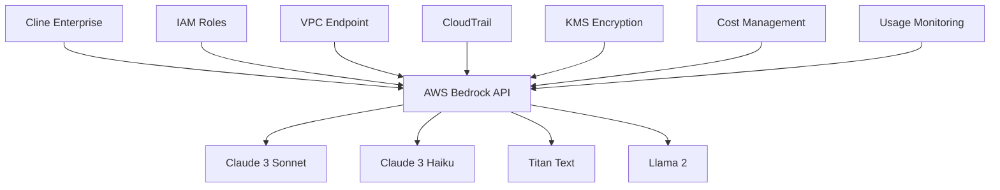

AWS Bedrock provides enterprise-grade access to foundation models through Amazon's cloud infrastructure. This guide covers integrating Bedrock with your Cline Enterprise deployment for scalable, compliant AI operations with advanced security and cost management features.

## Enterprise Benefits

<CardGroup cols={2}>
  <Card title="Enterprise Security" icon="shield-alt">
    VPC endpoints, IAM integration, CloudTrail logging, and Customer-Managed Encryption Keys (CMEK).
  </Card>
  
  <Card title="Compliance Ready" icon="clipboard-check">
    Built-in compliance frameworks including HIPAA, SOC2, and data residency controls.
  </Card>
  
  <Card title="Cost Optimization" icon="dollar-sign">
    Model-based pricing, batch inference, and provisioned throughput for cost-effective scaling.
  </Card>
  
  <Card title="Model Selection" icon="brain">
    Access to Claude, Llama2, Titan, and other leading foundation models with unified APIs.
  </Card>
</CardGroup>

## Architecture Overview



## Enterprise Configuration

### Multi-Account Setup

Configure Bedrock across multiple AWS accounts:

```yaml
# aws-bedrock-enterprise-config.yaml
bedrock:
  accounts:
    development:
      account_id: "123456789012"
      region: "us-east-1"
      role_arn: "arn:aws:iam::123456789012:role/ClineBedrockDev"
      models:
        - "anthropic.claude-3-haiku-20240307-v1:0"
        - "anthropic.claude-3-sonnet-20240229-v1:0"
      cost_controls:
        monthly_budget: 1000
        
    staging:
      account_id: "123456789013"
      region: "us-east-1"
      role_arn: "arn:aws:iam::123456789013:role/ClineBedrockStaging"
      models:
        - "anthropic.claude-3-sonnet-20240229-v1:0"
        - "amazon.titan-text-premier-v1:0"
      cost_controls:
        monthly_budget: 5000
        
    production:
      account_id: "123456789014"
      region: "us-east-1"
      role_arn: "arn:aws:iam::123456789014:role/ClineBedrockProd"
      models:
        - "anthropic.claude-3-sonnet-20240229-v1:0"
        - "anthropic.claude-3-opus-20240229-v1:0"
      cost_controls:
        monthly_budget: 25000
        alerts:
          - threshold: 50
            notification: "arn:aws:sns:us-east-1:123456789014:bedrock-alerts"
          - threshold: 80
            notification: "arn:aws:sns:us-east-1:123456789014:bedrock-critical"
```

### VPC Configuration

Deploy Bedrock with private connectivity:

```yaml
# bedrock-vpc-config.yaml
vpc_configuration:
  vpc_id: "vpc-0123456789abcdef0"
  subnet_ids:
    - "subnet-0123456789abcdef0"
    - "subnet-0123456789abcdef1"
  
  vpc_endpoint:
    service_name: "com.amazonaws.us-east-1.bedrock-runtime"
    vpc_endpoint_type: "Interface"
    security_group_ids:
      - "sg-0123456789abcdef0"
    policy_document: |
      {
        "Version": "2012-10-17",
        "Statement": [
          {
            "Effect": "Allow",
            "Principal": "*",
            "Action": [
              "bedrock:InvokeModel",
              "bedrock:InvokeModelWithResponseStream"
            ],
            "Resource": "*",
            "Condition": {
              "StringEquals": {
                "aws:PrincipalAccount": "123456789014"
              }
            }
          }
        ]
      }
      
  security_groups:
    - group_id: "sg-0123456789abcdef0"
      ingress_rules:
        - from_port: 443
          to_port: 443
          protocol: "tcp"
          cidr_blocks: ["10.0.0.0/8"]
      egress_rules:
        - from_port: 443
          to_port: 443
          protocol: "tcp"
          cidr_blocks: ["0.0.0.0/0"]
```

### IAM Configuration

Set up enterprise IAM roles and policies:

```yaml
# bedrock-iam-config.yaml
iam_configuration:
  roles:
    - name: "ClineBedrockExecutionRole"
      assume_role_policy: |
        {
          "Version": "2012-10-17",
          "Statement": [
            {
              "Effect": "Allow",
              "Principal": {
                "Service": "ec2.amazonaws.com",
                "AWS": "arn:aws:iam::ACCOUNT-ID:root"
              },
              "Action": "sts:AssumeRole",
              "Condition": {
                "StringEquals": {
                  "sts:ExternalId": "cline-enterprise-bedrock"
                }
              }
            }
          ]
        }
      
      policies:
        - name: "BedrockModelAccess"
          policy_document: |
            {
              "Version": "2012-10-17",
              "Statement": [
                {
                  "Effect": "Allow",
                  "Action": [
                    "bedrock:InvokeModel",
                    "bedrock:InvokeModelWithResponseStream"
                  ],
                  "Resource": [
                    "arn:aws:bedrock:us-east-1::foundation-model/anthropic.claude-3-sonnet-20240229-v1:0",
                    "arn:aws:bedrock:us-east-1::foundation-model/anthropic.claude-3-haiku-20240307-v1:0"
                  ],
                  "Condition": {
                    "ForAllValues:StringEquals": {
                      "bedrock:modelId": [
                        "anthropic.claude-3-sonnet-20240229-v1:0",
                        "anthropic.claude-3-haiku-20240307-v1:0"
                      ]
                    }
                  }
                }
              ]
            }
            
        - name: "BedrockLogging"
          policy_document: |
            {
              "Version": "2012-10-17",
              "Statement": [
                {
                  "Effect": "Allow",
                  "Action": [
                    "logs:CreateLogGroup",
                    "logs:CreateLogStream",
                    "logs:PutLogEvents"
                  ],
                  "Resource": "arn:aws:logs:us-east-1:ACCOUNT-ID:log-group:/aws/bedrock/cline-enterprise:*"
                }
              ]
            }
```

## Cost Management

### Budgets and Alerts

Set up cost monitoring and controls:

```yaml
# bedrock-cost-config.yaml
cost_management:
  budgets:
    - name: "cline-enterprise-bedrock-monthly"
      budget_limit: 10000
      time_unit: "MONTHLY"
      budget_type: "COST"
      cost_filters:
        Service: ["Amazon Bedrock"]
        TagKey: ["Project"]
        TagValue: ["cline-enterprise"]
      
      alerts:
        - threshold: 50
          threshold_type: "PERCENTAGE"
          notification_type: "ACTUAL"
          subscribers:
            - email: "finance-team@company.com"
            - email: "platform-team@company.com"
            
        - threshold: 80
          threshold_type: "PERCENTAGE"
          notification_type: "FORECASTED"
          subscribers:
            - email: "cto@company.com"
            - sns_topic: "arn:aws:sns:us-east-1:ACCOUNT-ID:bedrock-alerts"
            
        - threshold: 100
          threshold_type: "PERCENTAGE"
          notification_type: "ACTUAL"
          subscribers:
            - email: "exec-team@company.com"
            - sns_topic: "arn:aws:sns:us-east-1:ACCOUNT-ID:bedrock-critical"
            
  cost_allocation_tags:
    - key: "Project"
      value: "cline-enterprise"
    - key: "Team"
      value: "platform"
    - key: "Environment"
      value: "production"
    - key: "CostCenter"
      value: "engineering"
```

### Usage Analytics

Monitor usage patterns and optimize costs:

```yaml
# bedrock-analytics-config.yaml
analytics:
  cloudwatch_metrics:
    - metric_name: "ModelInvocations"
      namespace: "AWS/Bedrock"
      dimensions:
        - name: "ModelId"
          value: "*"
        - name: "AccountId"
          value: "${AWS_ACCOUNT_ID}"
          
    - metric_name: "InputTokens"
      namespace: "AWS/Bedrock"
      
    - metric_name: "OutputTokens"
      namespace: "AWS/Bedrock"
      
    - metric_name: "InvocationLatency"
      namespace: "AWS/Bedrock"
      
  custom_dashboards:
    - name: "Cline Enterprise Bedrock Usage"
      widgets:
        - type: "metric"
          properties:
            metrics:
              - ["AWS/Bedrock", "ModelInvocations", "ModelId", "anthropic.claude-3-sonnet-20240229-v1:0"]
              - ["AWS/Bedrock", "ModelInvocations", "ModelId", "anthropic.claude-3-haiku-20240307-v1:0"]
            period: 300
            stat: "Sum"
            region: "us-east-1"
            title: "Model Invocations by Model"
            
        - type: "metric"
          properties:
            metrics:
              - ["AWS/Bedrock", "InputTokens", {"stat": "Sum"}]
              - ["AWS/Bedrock", "OutputTokens", {"stat": "Sum"}]
            period: 300
            region: "us-east-1"
            title: "Token Usage"
```

## Security & Compliance

### Encryption Configuration

Implement comprehensive encryption:

```yaml
# bedrock-encryption-config.yaml
encryption:
  kms:
    key_id: "arn:aws:kms:us-east-1:ACCOUNT-ID:key/12345678-1234-1234-1234-123456789012"
    key_spec: "SYMMETRIC_DEFAULT"
    key_usage: "ENCRYPT_DECRYPT"
    
  encryption_at_rest:
    enabled: true
    kms_key_id: "${KMS_KEY_ID}"
    
  encryption_in_transit:
    enabled: true
    tls_version: "1.3"
    
  data_protection:
    mask_sensitive_data: true
    patterns:
      - "\\b\\d{3}-\\d{2}-\\d{4}\\b"  # SSN
      - "\\b4[0-9]{12}(?:[0-9]{3})?\\b"  # Credit Card
      - "[a-zA-Z0-9._%+-]+@[a-zA-Z0-9.-]+\\.[a-zA-Z]{2,}"  # Email
```

### Audit Logging

Configure comprehensive audit trails:

```yaml
# bedrock-audit-config.yaml
audit_logging:
  cloudtrail:
    trail_name: "cline-enterprise-bedrock-audit"
    s3_bucket_name: "cline-enterprise-audit-logs"
    s3_key_prefix: "bedrock"
    include_global_service_events: true
    is_multi_region_trail: true
    enable_log_file_validation: true
    
    event_selectors:
      - read_write_type: "All"
        include_management_events: true
        data_resources:
          - type: "AWS::Bedrock::Model"
            values: ["*"]
            
  cloudwatch_logs:
    log_group_name: "/aws/bedrock/cline-enterprise"
    retention_in_days: 2555  # 7 years
    
  custom_logging:
    log_requests: true
    log_responses: false  # Don't log response content for privacy
    log_tokens: true
    log_costs: true
    
    log_format: |
      {
        "timestamp": "${timestamp}",
        "account_id": "${aws_account_id}",
        "region": "${aws_region}",
        "user_identity": "${user_identity}",
        "model_id": "${model_id}",
        "input_tokens": ${input_tokens},
        "output_tokens": ${output_tokens},
        "cost_estimate": ${cost_estimate},
        "latency_ms": ${latency_ms},
        "request_id": "${request_id}",
        "session_id": "${session_id}",
        "user_id": "${user_id}"
      }
```

## Regional Deployment

### Multi-Region Configuration

Deploy across multiple AWS regions:

```yaml
# bedrock-multi-region-config.yaml
regions:
  primary:
    region: "us-east-1"
    models:
      - "anthropic.claude-3-sonnet-20240229-v1:0"
      - "anthropic.claude-3-haiku-20240307-v1:0"
      - "amazon.titan-text-premier-v1:0"
    capacity: "standard"
    
  secondary:
    region: "us-west-2"
    models:
      - "anthropic.claude-3-sonnet-20240229-v1:0"
      - "anthropic.claude-3-haiku-20240307-v1:0"
    capacity: "on-demand"
    
  international:
    region: "eu-west-1"
    models:
      - "anthropic.claude-3-sonnet-20240229-v1:0"
    capacity: "on-demand"
    data_residency: "eu"
    compliance_framework: "gdpr"
    
routing:
  strategy: "latency-based"
  health_checks: true
  failover_threshold: 3
  
  rules:
    - condition: "user.region == 'eu'"
      target_region: "eu-west-1"
    - condition: "user.region == 'us-west'"
      target_region: "us-west-2"
    - default: "us-east-1"
```

## Performance Optimization

### Provisioned Throughput

Configure provisioned throughput for consistent performance:

```yaml
# bedrock-performance-config.yaml
provisioned_throughput:
  - model_id: "anthropic.claude-3-sonnet-20240229-v1:0"
    throughput_units: 100
    commitment_duration: "1_MONTH"
    throughput_name: "cline-enterprise-sonnet-pt"
    
  - model_id: "anthropic.claude-3-haiku-20240307-v1:0"
    throughput_units: 200
    commitment_duration: "6_MONTHS"
    throughput_name: "cline-enterprise-haiku-pt"
    
auto_scaling:
  enabled: true
  min_throughput_units: 50
  max_throughput_units: 500
  scale_out_cooldown: 300
  scale_in_cooldown: 900
  
  metrics:
    - metric_name: "InvocationsPerSecond"
      target_value: 80
    - metric_name: "AverageLatency"
      target_value: 2000  # 2 seconds
```

### Batch Processing

Optimize costs with batch inference:

```yaml
# bedrock-batch-config.yaml
batch_inference:
  enabled: true
  
  job_configurations:
    - name: "daily-batch-processing"
      model_id: "anthropic.claude-3-sonnet-20240229-v1:0"
      input_data_config:
        s3_uri: "s3://cline-enterprise-batch-input/daily/"
        content_type: "application/jsonl"
      output_data_config:
        s3_uri: "s3://cline-enterprise-batch-output/daily/"
      role_arn: "arn:aws:iam::ACCOUNT-ID:role/ClineBedrockBatchRole"
      
    - name: "weekly-analysis"
      model_id: "amazon.titan-text-premier-v1:0"
      input_data_config:
        s3_uri: "s3://cline-enterprise-batch-input/weekly/"
        content_type: "application/jsonl"
      output_data_config:
        s3_uri: "s3://cline-enterprise-batch-output/weekly/"
      role_arn: "arn:aws:iam::ACCOUNT-ID:role/ClineBedrockBatchRole"
```

## Integration Examples

### Cline Configuration

Configure Cline to use enterprise Bedrock setup:

```typescript
// cline-bedrock-enterprise.ts
export interface BedrockEnterpriseConfig {
  region: string;
  roleArn: string;
  externalId: string;
  models: string[];
  vpcEndpoint?: string;
  encryptionKeyId?: string;
}

export class BedrockEnterpriseClient {
  constructor(private config: BedrockEnterpriseConfig) {}
  
  async assumeRole(): Promise<AWS.STS.Credentials> {
    const sts = new AWS.STS({ region: this.config.region });
    
    const result = await sts.assumeRole({
      RoleArn: this.config.roleArn,
      RoleSessionName: 'cline-enterprise-session',
      ExternalId: this.config.externalId,
      DurationSeconds: 3600, // 1 hour
    }).promise();
    
    return result.Credentials!;
  }
  
  async createBedrockClient(): Promise<AWS.BedrockRuntime> {
    const credentials = await this.assumeRole();
    
    return new AWS.BedrockRuntime({
      region: this.config.region,
      credentials: {
        accessKeyId: credentials.AccessKeyId!,
        secretAccessKey: credentials.SecretAccessKey!,
        sessionToken: credentials.SessionToken!,
      },
      endpoint: this.config.vpcEndpoint,
    });
  }
  
  async invokeModel(modelId: string, body: any): Promise<any> {
    const client = await this.createBedrockClient();
    
    const params = {
      modelId,
      body: JSON.stringify(body),
      contentType: 'application/json',
      accept: 'application/json',
    };
    
    if (this.config.encryptionKeyId) {
      // Add encryption parameters if needed
    }
    
    const result = await client.invokeModel(params).promise();
    return JSON.parse(result.body.toString());
  }
}
```

## Best Practices

### Security
1. **IAM Roles**: Use cross-account roles instead of API keys
2. **VPC Endpoints**: Use private connectivity for production
3. **Encryption**: Enable encryption at rest and in transit
4. **Logging**: Comprehensive audit logging for compliance
5. **Access Control**: Limit model access based on business needs

### Cost Optimization
1. **Model Selection**: Use appropriate models for different tasks
2. **Provisioned Throughput**: Reserve capacity for predictable workloads
3. **Batch Processing**: Use batch inference for non-real-time tasks
4. **Monitoring**: Track usage and costs continuously
5. **Budgets**: Set up alerts and automatic controls

### Performance
1. **Regional Distribution**: Deploy closer to users
2. **Caching**: Cache responses when appropriate
3. **Connection Pooling**: Reuse connections
4. **Retry Logic**: Implement exponential backoff
5. **Monitoring**: Track latency and throughput

## Troubleshooting

### Common Issues

**Authentication Errors**:
```bash
# Verify role assumption
aws sts assume-role --role-arn arn:aws:iam::ACCOUNT:role/ClineBedrockRole --role-session-name test

# Check IAM permissions
aws iam simulate-principal-policy --policy-source-arn arn:aws:iam::ACCOUNT:role/ClineBedrockRole --action-names bedrock:InvokeModel
```

**VPC Connectivity Issues**:
```bash
# Test VPC endpoint connectivity
aws bedrock-runtime invoke-model --region us-east-1 --endpoint-url https://vpce-xxx.bedrock-runtime.us-east-1.vpce.amazonaws.com --model-id anthropic.claude-3-haiku-20240307-v1:0 --body '{"prompt": "test"}' output.txt
```

**Cost Monitoring**:
```bash
# Check current usage
aws bedrock get-usage-statistics --region us-east-1 --start-time 2024-01-01 --end-time 2024-01-31

# Review cost allocation
aws ce get-cost-and-usage --time-period Start=2024-01-01,End=2024-01-31 --granularity MONTHLY --metrics BlendedCost --group-by Type=DIMENSION,Key=SERVICE
```

AWS Bedrock provides enterprise-grade foundation model access with comprehensive security, compliance, and cost management features. This configuration ensures your Cline deployment meets enterprise requirements while optimizing performance and costs.
