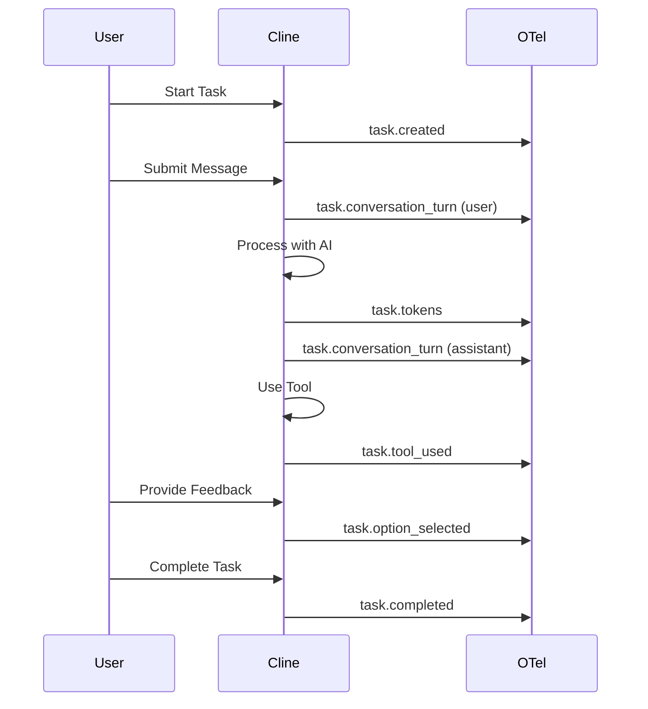

This page documents all OpenTelemetry log events currently instrumented in Cline. These events are emitted when OpenTelemetry integration is enabled and provide detailed insights into user behavior, task execution, and system operations.

<Info>
Events are only emitted when OpenTelemetry is enabled. See [OpenTelemetry](/enterprise-solutions/monitoring/opentelemetry) for configuration instructions.
</Info>

## Event Categories

Cline emits events across several categories, each prefixed with a namespace:

<CardGroup cols={3}>
  <Card title="user.*" icon="user">
    Authentication, telemetry controls, extension lifecycle
  </Card>
  
  <Card title="task.*" icon="list-check">
    Task execution, conversation turns, tool usage, tokens
  </Card>
  
  <Card title="workspace.*" icon="folder-tree">
    Workspace initialization, VCS detection, path resolution
  </Card>
  
  <Card title="ui.*" icon="window">
    User interface interactions and model selection
  </Card>
  
  <Card title="hooks.*" icon="webhook">
    Hook discovery, execution, and context modification
  </Card>
  
  <Card title="worktree.*" icon="code-branch">
    Git worktree operations and merge handling
  </Card>
  
  <Card title="host.*" icon="computer">
    Host environment detection
  </Card>
  
  <Card title="test.*" icon="flask">
    Diagnostic and connection testing
  </Card>
</CardGroup>

## User Events

Events related to user authentication, telemetry preferences, and extension lifecycle.

| Event | Description | Key Attributes |
|-------|-------------|----------------|
| `user.opt_out` | User explicitly opts out of telemetry | user_id, timestamp |
| `user.opt_in` | User explicitly opts into telemetry | user_id, timestamp |
| `user.telemetry_enabled` | Telemetry service enabled/initialization signal | enabled, timestamp |
| `user.extension_activated` | Extension activation event | extension_version, host_type |
| `user.extension_storage_error` | Error while reading/writing extension storage state | error_type, error_message |
| `user.auth_started` | Authentication flow started | provider, timestamp |
| `user.auth_succeeded` | Authentication flow succeeded | provider, user_id |
| `user.auth_failed` | Authentication flow failed | provider, error_reason |
| `user.auth_logged_out` | User logged out | reason, provider |
| `user.onboarding_progress` | Onboarding step/action progress | step, action, completed |

### Example: user.auth_succeeded

```json
{
  "event": "user.auth_succeeded",
  "timestamp": "2026-03-05T10:30:00Z",
  "attributes": {
    "provider": "github",
    "user_id": "user_abc123",
    "session_id": "sess_xyz789"
  }
}
```

## Workspace Events

Events related to workspace initialization, version control detection, and multi-root operations.

| Event | Description | Key Attributes |
|-------|-------------|----------------|
| `workspace.initialized` | Workspace initialization completed | roots_count, vcs_type, duration_ms |
| `workspace.init_error` | Workspace initialization failed | error_type, fallback_used |
| `workspace.vcs_detected` | Version control system detection event | vcs_type, root_path_hash |
| `workspace.multi_root_checkpoint` | Multi-root checkpoint operation telemetry | operation, roots_count, duration_ms |
| `workspace.path_resolved` | Workspace path resolution | hint, fallback_used, cross_workspace |

### Example: workspace.initialized

```json
{
  "event": "workspace.initialized",
  "timestamp": "2026-03-05T10:32:15Z",
  "attributes": {
    "roots_count": 2,
    "vcs_type": "git",
    "duration_ms": 145,
    "multi_root_enabled": true
  }
}
```

## Task Events

Core events tracking task lifecycle, conversation turns, tool usage, and execution details.

### Task Lifecycle

| Event | Description | Key Attributes |
|-------|-------------|----------------|
| `task.created` | New task/conversation started | task_id, mode, model, provider |
| `task.restarted` | Existing task restarted/reopened | task_id, time_since_last_message |
| `task.completed` | Task completed | task_id, duration_ms, model, provider, tokens_total |
| `task.feedback` | User feedback on task | task_id, feedback_type (thumbs_up/thumbs_down) |
| `task.historical_loaded` | Historical task loaded from storage | task_id, age_days |
| `task.retry_clicked` | User clicked retry on a failed action/request | task_id, action_type |

### Conversation & Tokens

| Event | Description | Key Attributes |
|-------|-------------|----------------|
| `task.conversation_turn` | Conversation turn event | role (user/assistant), provider, model, tokens_in, tokens_out |
| `task.tokens` | Token usage event | tokens_in, tokens_out, cached_tokens, cost |
| `task.mode` | Plan/Act mode switch event | previous_mode, new_mode, task_id |

### Tool Usage

| Event | Description | Key Attributes |
|-------|-------------|----------------|
| `task.tool_used` | Tool invocation and outcome telemetry | tool_name, success, duration_ms, auto_approved |
| `task.mcp_tool_called` | MCP tool call lifecycle event | status (started/success/error), tool_name, server_name |
| `task.browser_tool_start` | Browser tool/session started | url, action |
| `task.browser_tool_end` | Browser tool/session ended with stats | duration_ms, actions_count, success |
| `task.browser_error` | Browser tool error event | error_type, url |
| `task.terminal_execution` | Terminal execution capture success/failure event | success, command_hash, duration_ms |
| `task.terminal_output_failure` | Terminal output capture failed | reason |
| `task.terminal_user_intervention` | User intervention during terminal execution | intervention_type |
| `task.terminal_hang` | Terminal hang/stuck detection event | duration_ms, command_hash |

### Features & Options

| Event | Description | Key Attributes |
|-------|-------------|----------------|
| `task.checkpoint_used` | Checkpoint action used | action (create/restore/compare), task_id |
| `task.option_selected` | User selected one of AI-provided options | option_index, total_options |
| `task.options_ignored` | User ignored AI options and entered custom input | options_count |
| `task.slash_command_used` | Slash command/workflow/MCP prompt command used | command_name, is_workflow |
| `task.mention_used` | Mention resolution succeeded | mention_type (file/url/folder/terminal/problems/git) |
| `task.mention_failed` | Mention resolution failed | mention_type, error_reason |
| `task.mention_search_results` | Mention search query result telemetry | query, results_count |
| `task.workspace_search_pattern` | Workspace search strategy/pattern telemetry | pattern_type, files_scanned |

### Advanced Features

| Event | Description | Key Attributes |
|-------|-------------|----------------|
| `task.focus_chain_enabled` | Focus chain feature enabled | task_id |
| `task.focus_chain_disabled` | Focus chain feature disabled | task_id |
| `task.focus_chain_progress_first` | First focus-chain checklist/progress emitted | items_count |
| `task.focus_chain_progress_update` | Subsequent focus-chain checklist/progress updates | items_total, items_completed |
| `task.focus_chain_incomplete_on_completion` | Task completed while focus-chain checklist still incomplete | items_remaining |
| `task.focus_chain_list_opened` | Focus-chain markdown/list opened by user | task_id |
| `task.focus_chain_list_written` | Focus-chain markdown/list written/saved | task_id |
| `task.subagent_enabled` | Subagents feature enabled | task_id |
| `task.subagent_disabled` | Subagents feature disabled | task_id |
| `task.subagent_started` | Subagent execution started | subagent_id, prompt_length |
| `task.subagent_completed` | Subagent execution completed | subagent_id, duration_ms, success |
| `task.skill_used` | Skill invocation event | skill_name, task_id |

### Auto-Compact & Context

| Event | Description | Key Attributes |
|-------|-------------|----------------|
| `task.summarize_task` | Auto-compaction/summarize triggered for context pressure | conversation_length, estimated_tokens |
| `task.auto_condense_toggled` | Auto-condense setting toggled | enabled |

### Settings & Features

| Event | Description | Key Attributes |
|-------|-------------|----------------|
| `task.feature_toggled` | Generic feature toggle changed | feature_name, enabled |
| `task.rule_toggled` | Cline rule toggled on/off | rule_name, enabled, is_global |
| `task.yolo_mode_toggled` | YOLO mode toggled | enabled |
| `task.cline_web_tools_toggled` | Cline web tools setting toggled | enabled |

### API & Performance

| Event | Description | Key Attributes |
|-------|-------------|----------------|
| `task.gemini_api_performance` | Gemini-specific API performance telemetry | duration_ms, tokens, cache_hit |
| `task.provider_api_error` | API provider error event | provider, model, error_code, error_message |
| `task.diff_edit_failed` | Diff/replace edit failed | file_path_hash, error_type |
| `task.initialization` | Task initialization timing/metadata event | duration_ms, mode |

### AI Output Feedback

| Event | Description | Key Attributes |
|-------|-------------|----------------|
| `task.ai_output.accepted` | AI-generated file edit accepted | lines_added, lines_removed, file_count |
| `task.ai_output.rejected` | AI-generated file edit rejected | lines_added, lines_removed, file_count |

### Example: task.tool_used

```json
{
  "event": "task.tool_used",
  "timestamp": "2026-03-05T10:35:22Z",
  "attributes": {
    "task_id": "task_1234567890",
    "tool_name": "write_to_file",
    "success": true,
    "duration_ms": 125,
    "auto_approved": false,
    "model": "claude-sonnet-4",
    "provider": "anthropic"
  }
}
```

## UI Events

Events tracking user interface interactions.

| Event | Description | Key Attributes |
|-------|-------------|----------------|
| `ui.model_selected` | Model selected in UI | model, provider, previous_model |
| `ui.model_favorite_toggled` | Model favorite toggled | model_id, is_favorited |
| `ui.button_clicked` | UI button click event | button_id, context |
| `ui.rules_menu_opened` | Rules/workflows menu/modal opened | menu_type |

### Example: ui.model_selected

```json
{
  "event": "ui.model_selected",
  "timestamp": "2026-03-05T11:20:00Z",
  "attributes": {
    "model": "claude-sonnet-4",
    "provider": "anthropic",
    "previous_model": "gpt-4o",
    "mode": "act"
  }
}
```

## Hooks Events

Events related to hook discovery, execution lifecycle, and context modifications.

| Event | Description | Key Attributes |
|-------|-------------|----------------|
| `hooks.enabled` | Hooks feature enabled | user_id |
| `hooks.disabled` | Hooks feature disabled | user_id |
| `hooks.cancel_requested` | Hook requested cancellation | hook_name, task_id |
| `hooks.context_modified` | Hook modified context | hook_name, modification_type |
| `hooks.discovery_completed` | Hook discovery completed | hooks_count, global_count, workspace_count |
| `hooks.execution` | Unified hook execution lifecycle | hook_name, status (started/completed/failed/cancelled), duration_ms |

### Hook Execution Lifecycle

The `hooks.execution` event tracks the complete lifecycle with a `status` attribute:

- **started**: Hook execution began
- **completed**: Hook finished successfully
- **failed**: Hook encountered an error
- **cancelled**: Hook was cancelled by user or system

### Example: hooks.execution

```json
{
  "event": "hooks.execution",
  "timestamp": "2026-03-05T10:40:15Z",
  "attributes": {
    "hook_name": "preToolUse",
    "status": "completed",
    "duration_ms": 234,
    "task_id": "task_1234567890",
    "context_modified": false
  }
}
```

## Worktree Events

Events related to Git worktree operations.

| Event | Description | Key Attributes |
|-------|-------------|----------------|
| `worktree.view_opened` | Worktree view opened | user_id |
| `worktree.created` | Worktree create event | success, branch_name, duration_ms |
| `worktree.merge_attempted` | Worktree merge attempt event | has_conflicts, delete_option_chosen |

### Example: worktree.created

```json
{
  "event": "worktree.created",
  "timestamp": "2026-03-05T14:22:00Z",
  "attributes": {
    "success": true,
    "branch_name_hash": "abc123",
    "duration_ms": 1250,
    "parent_branch": "main"
  }
}
```

## Host Events

Events related to host environment detection.

| Event | Description | Key Attributes |
|-------|-------------|----------------|
| `host.detected` | Host environment detection event | host_type (vscode/jetbrains/cli), version |

### Example: host.detected

```json
{
  "event": "host.detected",
  "timestamp": "2026-03-05T09:00:00Z",
  "attributes": {
    "host_type": "vscode",
    "version": "1.95.0",
    "platform": "darwin"
  }
}
```

## Test Events

Diagnostic and connection testing events.

| Event | Description | Key Attributes |
|-------|-------------|----------------|
| `cline.test.connection` | OTEL connection test event from "Test OTEL Connection" flow | success, exporter_type, endpoint |

### Example: cline.test.connection

```json
{
  "event": "cline.test.connection",
  "timestamp": "2026-03-05T15:30:00Z",
  "attributes": {
    "success": true,
    "exporter_type": "otlp",
    "endpoint": "https://api.datadoghq.com:4317",
    "protocol": "grpc"
  }
}
```

## Event Attribute Guidelines

### Common Attributes

Most events include these standard attributes:

| Attribute | Type | Description |
|-----------|------|-------------|
| `timestamp` | ISO 8601 | Event occurrence time |
| `user_id` | string | Anonymized user identifier (when authenticated) |
| `session_id` | string | Current session identifier |
| `extension_version` | string | Cline extension version |
| `host_type` | string | vscode, jetbrains, or cli |

### Privacy & Hashing

Sensitive information is hashed or anonymized:

- **File paths**: Hashed to preserve privacy
- **Command content**: Hashed, not logged verbatim
- **User identifiers**: Anonymized tokens
- **Branch names**: Hashed in worktree events

<Warning>
File paths, command arguments, and code content are **never** included in raw form. Only hashes or anonymized identifiers are used.
</Warning>

## Task Event Deep Dive

Task events are the most detailed category. Here's a typical task execution flow:



### Task Token Tracking

Token events provide detailed cost and usage information:

```json
{
  "event": "task.tokens",
  "timestamp": "2026-03-05T10:35:30Z",
  "attributes": {
    "task_id": "task_1234567890",
    "tokens_in": 2500,
    "tokens_out": 850,
    "cached_tokens": 1200,
    "cost": 0.0043,
    "model": "claude-sonnet-4",
    "provider": "anthropic"
  }
}
```

## Using Events for Analytics

<Warning>
**SQL syntax is illustrative only.** Attribute access varies by observability platform — for example, `JSON_EXTRACT(attributes, '$.model')` in BigQuery, `attributes['model']` in ClickHouse, or `@attributes.model` in Datadog. Adapt all queries below to your platform's query language before use.
</Warning>

### Query Patterns

**Most used tools:**
```sql
SELECT attributes.tool_name, COUNT(*) as count
FROM otel_logs
WHERE event = 'task.tool_used'
  AND attributes.success = true
GROUP BY attributes.tool_name
ORDER BY count DESC
LIMIT 10
```

**Average task duration by model:**
```sql
SELECT 
  attributes.model,
  AVG(attributes.duration_ms) as avg_duration_ms,
  COUNT(*) as task_count
FROM otel_logs
WHERE event = 'task.completed'
GROUP BY attributes.model
```

**Token usage by provider:**
```sql
SELECT 
  attributes.provider,
  SUM(attributes.tokens_in) as total_tokens_in,
  SUM(attributes.tokens_out) as total_tokens_out,
  SUM(attributes.cost) as total_cost
FROM otel_logs
WHERE event = 'task.tokens'
  AND timestamp >= NOW() - INTERVAL '30 days'
GROUP BY attributes.provider
```

**Tool approval rates:**
```sql
SELECT 
  attributes.tool_name,
  SUM(CASE WHEN attributes.auto_approved THEN 1 ELSE 0 END)::float / COUNT(*) as auto_approval_rate,
  COUNT(*) as total_uses
FROM otel_logs
WHERE event = 'task.tool_used'
GROUP BY attributes.tool_name
ORDER BY total_uses DESC
```

## Integration Examples

<Note>
Query syntax below is illustrative. Attribute access varies by platform — for example, `JSON_EXTRACT(attributes, '$.model')` in BigQuery, `attributes['model']` in ClickHouse, or dot notation in Datadog. Adapt to your platform's query language.
</Note>

### Datadog Dashboard

Create custom Datadog dashboards using these events:

```json
{
  "widgets": [
    {
      "definition": {
        "type": "timeseries",
        "requests": [
          {
            "q": "sum:cline.task.completed{*}.as_count()",
            "display_type": "bars"
          }
        ],
        "title": "Tasks Completed Over Time"
      }
    },
    {
      "definition": {
        "type": "query_value",
        "requests": [
          {
            "q": "sum:cline.task.tokens{*}",
            "aggregator": "sum"
          }
        ],
        "title": "Total Tokens Used"
      }
    }
  ]
}
```

### Grafana Queries

Example Loki query for tool usage:

```logql
{event="task.tool_used"} 
| json
| line_format "{{.attributes_tool_name}}: {{.attributes_success}}"
```

### New Relic NRQL

Query task completion rates:

```sql
SELECT count(*) 
FROM Log 
WHERE event = 'task.completed' 
FACET attributes.model 
SINCE 1 day ago
```

## Event Schema Reference

All events follow this structure:

```typescript
interface OtelLogEvent {
  event: string              // Event name (e.g., "task.created")
  timestamp: string           // ISO 8601 timestamp
  attributes: {
    // Event-specific attributes
    [key: string]: string | number | boolean
  }
  resource: {
    service_name: "cline"
    service_version: string   // Extension version
    host_type: string         // vscode | jetbrains | cli
  }
}
```

## Best Practices

<CardGroup cols={2}>
  <Card title="Filter Noise" icon="filter">
    Focus on events relevant to your use case. Not all events need dashboards.
  </Card>
  
  <Card title="Set Alerts" icon="bell">
    Alert on error events and usage anomalies for proactive monitoring.
  </Card>
  
  <Card title="Aggregate Metrics" icon="chart-bar">
    Roll up events into metrics for long-term trend analysis.
  </Card>
  
  <Card title="Respect Privacy" icon="shield">
    Remember events are already anonymized. Don't attempt to de-anonymize.
  </Card>
</CardGroup>

## Troubleshooting

### Events Not Appearing

If events aren't showing up in your observability platform:

1. **Verify OTel is enabled** in remote configuration or environment variables
2. **Check endpoint configuration** - ensure URL and protocol are correct
3. **Validate credentials** - test with the "Test OTEL Connection" button
4. **Check exporter settings** - ensure logs exporter includes `otlp`
5. **Review platform-specific requirements** - some platforms need specific headers

### Event Volume Concerns

If you're seeing excessive event volume:

1. **Sample events** - Configure sampling in your OTel collector
2. **Filter events** - Use your platform's filtering to drop noisy events
3. **Aggregate on collection** - Pre-aggregate metrics before export
4. **Adjust export intervals** - Increase `openTelemetryMetricExportInterval` and batch settings

## See Also

<CardGroup cols={3}>
  <Card title="OpenTelemetry Setup" icon="chart-line" href="/enterprise-solutions/monitoring/opentelemetry">
    Configure OTel integration
  </Card>
  
  <Card title="Prompt Storage" icon="database" href="/enterprise-solutions/monitoring/prompt-storage">
    Backup conversation history
  </Card>
  
  <Card title="Telemetry" icon="chart-simple" href="/enterprise-solutions/monitoring/telemetry">
    Basic telemetry overview
  </Card>
</CardGroup>
