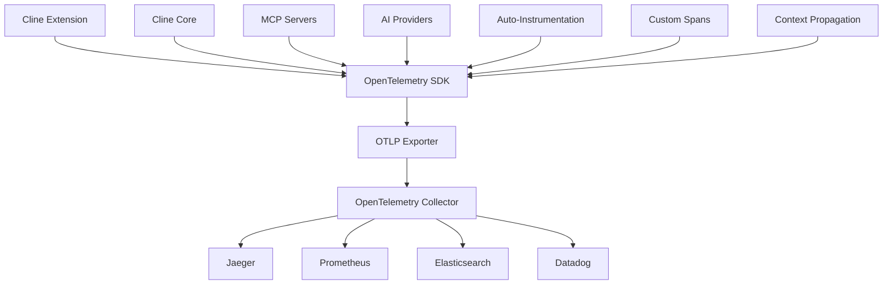

OpenTelemetry provides comprehensive observability for your Cline Enterprise deployment through distributed tracing, metrics collection, and structured logging. This industry-standard solution delivers deep insights into AI operations, user workflows, and system performance.

## OpenTelemetry Benefits

<CardGroup cols={2}>
  <Card title="Distributed Tracing" icon="route">
    Trace complex AI workflows across multiple services, providers, and components for complete visibility.
  </Card>
  
  <Card title="Unified Observability" icon="eye">
    Single solution for metrics, traces, and logs with consistent data models and correlation capabilities.
  </Card>
  
  <Card title="Vendor Agnostic" icon="arrows-left-right">
    Export data to any observability backend including Jaeger, Prometheus, Grafana, Datadog, and more.
  </Card>
  
  <Card title="Auto-Instrumentation" icon="magic-wand">
    Automatic instrumentation for popular frameworks and libraries with minimal code changes.
  </Card>
</CardGroup>

## Architecture Overview



## Installation & Configuration

### Collector Deployment

Deploy the OpenTelemetry Collector for your enterprise:

<Tabs>
<Tab title="Kubernetes">
```yaml
# otel-collector-config.yaml
apiVersion: v1
kind: ConfigMap
metadata:
  name: otel-collector-config
  namespace: cline-monitoring
data:
  collector.yaml: |
    receivers:
      otlp:
        protocols:
          grpc:
            endpoint: 0.0.0.0:4317
          http:
            endpoint: 0.0.0.0:4318
            
      prometheus:
        config:
          scrape_configs:
            - job_name: 'cline-metrics'
              static_configs:
                - targets: ['cline-service:8080']
                
    processors:
      batch:
        timeout: 1s
        send_batch_size: 1024
        
      resource:
        attributes:
          - key: service.name
            value: "cline-enterprise"
            action: upsert
          - key: deployment.environment
            from_attribute: "environment"
            action: insert
            
      memory_limiter:
        limit_mib: 512
        
    exporters:
      # Jaeger for traces
      jaeger:
        endpoint: jaeger-collector:14250
        tls:
          insecure: true
          
      # Prometheus for metrics  
      prometheusremotewrite:
        endpoint: "http://prometheus:9090/api/v1/write"
        
      # Elasticsearch for logs
      elasticsearch:
        logs_index: "cline-logs"
        metrics_index: "cline-metrics"
        traces_index: "cline-traces"
        endpoints: ["http://elasticsearch:9200"]
        
      # Datadog (example)
      datadog:
        api:
          key: "${DD_API_KEY}"
          site: "datadoghq.com"
        hostname: "cline-enterprise"
        
    service:
      pipelines:
        traces:
          receivers: [otlp]
          processors: [memory_limiter, resource, batch]
          exporters: [jaeger, datadog]
          
        metrics:
          receivers: [otlp, prometheus] 
          processors: [memory_limiter, resource, batch]
          exporters: [prometheusremotewrite, datadog]
          
        logs:
          receivers: [otlp]
          processors: [memory_limiter, resource, batch]
          exporters: [elasticsearch, datadog]

---
apiVersion: apps/v1
kind: Deployment
metadata:
  name: otel-collector
  namespace: cline-monitoring
spec:
  replicas: 2
  selector:
    matchLabels:
      app: otel-collector
  template:
    metadata:
      labels:
        app: otel-collector
    spec:
      containers:
      - name: otel-collector
        image: otel/opentelemetry-collector-contrib:latest
        command: ["/otelcol-contrib"]
        args: ["--config=/etc/otel-collector-config.yaml"]
        volumeMounts:
        - name: otel-collector-config-vol
          mountPath: /etc/otel-collector-config.yaml
          subPath: collector.yaml
        ports:
        - containerPort: 4317   # OTLP gRPC
        - containerPort: 4318   # OTLP HTTP
        - containerPort: 8888   # Prometheus metrics
        resources:
          requests:
            memory: "256Mi"
            cpu: "100m"
          limits:
            memory: "512Mi"
            cpu: "500m"
      volumes:
      - name: otel-collector-config-vol
        configMap:
          name: otel-collector-config
```
</Tab>

<Tab title="Docker Compose">
```yaml
# docker-compose.otel.yml
version: '3.8'

services:
  otel-collector:
    image: otel/opentelemetry-collector-contrib:latest
    command: ["--config=/etc/otel-collector-config.yaml"]
    volumes:
      - ./otel-collector-config.yaml:/etc/otel-collector-config.yaml
    ports:
      - "4317:4317"   # OTLP gRPC receiver
      - "4318:4318"   # OTLP HTTP receiver  
      - "8888:8888"   # Prometheus metrics
    environment:
      - DD_API_KEY=${DATADOG_API_KEY}
    depends_on:
      - jaeger
      - prometheus

  jaeger:
    image: jaegertracing/all-in-one:latest
    ports:
      - "16686:16686"   # Web UI
      - "14250:14250"   # gRPC
    environment:
      - COLLECTOR_OTLP_ENABLED=true

  prometheus:
    image: prom/prometheus:latest
    ports:
      - "9090:9090"
    volumes:
      - ./prometheus.yml:/etc/prometheus/prometheus.yml

  grafana:
    image: grafana/grafana:latest
    ports:
      - "3000:3000"
    environment:
      - GF_SECURITY_ADMIN_PASSWORD=admin
    volumes:
      - grafana-storage:/var/lib/grafana

volumes:
  grafana-storage:
```
</Tab>
</Tabs>

### Cline Core Instrumentation

Instrument the core Cline application:

```typescript
// src/observability/telemetry.ts
import { NodeSDK } from '@opentelemetry/auto-instrumentations-node';
import { Resource } from '@opentelemetry/resources';
import { SemanticResourceAttributes } from '@opentelemetry/semantic-conventions';
import { OTLPTraceExporter } from '@opentelemetry/exporter-otlp-grpc';
import { OTLPMetricExporter } from '@opentelemetry/exporter-otlp-grpc';
import { getNodeAutoInstrumentations } from '@opentelemetry/auto-instrumentations-node';
import { PeriodicExportingMetricReader } from '@opentelemetry/sdk-metrics';

export function initializeTelemetry() {
  const resource = Resource.default().merge(
    new Resource({
      [SemanticResourceAttributes.SERVICE_NAME]: 'cline-core',
      [SemanticResourceAttributes.SERVICE_VERSION]: process.env.CLINE_VERSION || 'unknown',
      [SemanticResourceAttributes.DEPLOYMENT_ENVIRONMENT]: process.env.NODE_ENV || 'development',
      [SemanticResourceAttributes.SERVICE_INSTANCE_ID]: process.env.HOSTNAME || 'unknown',
    }),
  );

  const traceExporter = new OTLPTraceExporter({
    url: process.env.OTEL_EXPORTER_OTLP_TRACES_ENDPOINT || 'http://localhost:4317',
  });

  const metricExporter = new OTLPMetricExporter({
    url: process.env.OTEL_EXPORTER_OTLP_METRICS_ENDPOINT || 'http://localhost:4317',
  });

  const sdk = new NodeSDK({
    resource,
    traceExporter,
    metricReader: new PeriodicExportingMetricReader({
      exporter: metricExporter,
      exportIntervalMillis: 30000, // Export every 30 seconds
    }),
    instrumentations: [
      getNodeAutoInstrumentations({
        // Disable some noisy instrumentations
        '@opentelemetry/instrumentation-fs': {
          enabled: false,
        },
        '@opentelemetry/instrumentation-http': {
          enabled: true,
          ignoreIncomingRequestHook: (req) => {
            // Ignore health check requests
            return req.url?.includes('/health') || false;
          },
        },
      }),
    ],
  });

  sdk.start();
  
  console.log('OpenTelemetry initialized successfully');
  return sdk;
}

// Graceful shutdown
process.on('SIGTERM', () => {
  sdk.shutdown()
    .then(() => console.log('Tracing terminated'))
    .catch((error) => console.error('Error terminating tracing', error))
    .finally(() => process.exit(0));
});
```

### Custom Instrumentation

Add custom tracing for AI operations:

```typescript
// src/observability/ai-instrumentation.ts
import { trace, metrics, SpanStatusCode, SpanKind } from '@opentelemetry/api';
import { SemanticAttributes } from '@opentelemetry/semantic-conventions';

const tracer = trace.getTracer('cline-ai', '1.0.0');
const meter = metrics.getMeter('cline-ai', '1.0.0');

// Metrics
const aiRequestCounter = meter.createCounter('ai_requests_total', {
  description: 'Total number of AI requests',
});

const aiRequestDuration = meter.createHistogram('ai_request_duration_seconds', {
  description: 'AI request processing time',
  unit: 'seconds',
});

const tokenUsageCounter = meter.createCounter('ai_tokens_total', {
  description: 'Total tokens used',
});

const costCounter = meter.createCounter('ai_cost_total', {
  description: 'Total AI costs',
  unit: 'USD',
});

export class AIInstrumentation {
  static async traceAIRequest<T>(
    operation: string,
    modelName: string,
    provider: string,
    fn: (span: any) => Promise<T>
  ): Promise<T> {
    return tracer.startActiveSpan(
      `ai.${operation}`,
      {
        kind: SpanKind.CLIENT,
        attributes: {
          [SemanticAttributes.AI_MODEL_NAME]: modelName,
          [SemanticAttributes.AI_PROVIDER]: provider,
          [SemanticAttributes.AI_OPERATION]: operation,
        },
      },
      async (span) => {
        const startTime = Date.now();
        
        try {
          const result = await fn(span);
          
          // Record success metrics
          const duration = (Date.now() - startTime) / 1000;
          
          aiRequestCounter.add(1, {
            model: modelName,
            provider,
            operation,
            status: 'success',
          });
          
          aiRequestDuration.record(duration, {
            model: modelName,
            provider,
            operation,
          });
          
          span.setStatus({ code: SpanStatusCode.OK });
          return result;
        } catch (error) {
          // Record error metrics
          aiRequestCounter.add(1, {
            model: modelName,
            provider,
            operation,
            status: 'error',
          });
          
          span.recordException(error as Error);
          span.setStatus({
            code: SpanStatusCode.ERROR,
            message: (error as Error).message,
          });
          
          throw error;
        } finally {
          span.end();
        }
      }
    );
  }
  
  static recordTokenUsage(
    modelName: string,
    inputTokens: number,
    outputTokens: number,
    cost: number,
    userTeam?: string
  ) {
    tokenUsageCounter.add(inputTokens, {
      model: modelName,
      token_type: 'input',
      user_team: userTeam || 'unknown',
    });
    
    tokenUsageCounter.add(outputTokens, {
      model: modelName,
      token_type: 'output',
      user_team: userTeam || 'unknown',
    });
    
    costCounter.add(cost, {
      model: modelName,
      user_team: userTeam || 'unknown',
    });
  }
  
  static addContextToSpan(span: any, context: {
    userId?: string;
    sessionId?: string;
    taskId?: string;
    workspaceRoot?: string;
  }) {
    if (context.userId) {
      span.setAttribute('user.id', context.userId);
    }
    if (context.sessionId) {
      span.setAttribute('session.id', context.sessionId);
    }
    if (context.taskId) {
      span.setAttribute('task.id', context.taskId);
    }
    if (context.workspaceRoot) {
      span.setAttribute('workspace.root', context.workspaceRoot);
    }
  }
}
```

### Task Execution Tracing

Trace complete task execution workflows:

```typescript
// src/core/task/task-instrumentation.ts
import { AIInstrumentation } from '../../observability/ai-instrumentation';
import { trace, context } from '@opentelemetry/api';

export class TaskInstrumentation {
  static async traceTaskExecution<T>(
    taskId: string,
    taskType: string,
    userId: string,
    fn: () => Promise<T>
  ): Promise<T> {
    const tracer = trace.getTracer('cline-task', '1.0.0');
    
    return tracer.startActiveSpan(
      'task.execute',
      {
        attributes: {
          'task.id': taskId,
          'task.type': taskType,
          'user.id': userId,
        }
      },
      async (span) => {
        try {
          const result = await fn();
          span.setAttribute('task.status', 'completed');
          return result;
        } catch (error) {
          span.setAttribute('task.status', 'failed');
          span.recordException(error as Error);
          throw error;
        } finally {
          span.end();
        }
      }
    );
  }
  
  static async traceToolExecution<T>(
    toolName: string,
    parameters: any,
    fn: () => Promise<T>
  ): Promise<T> {
    const tracer = trace.getTracer('cline-tools', '1.0.0');
    
    return tracer.startActiveSpan(
      `tool.${toolName}`,
      {
        attributes: {
          'tool.name': toolName,
          'tool.parameters': JSON.stringify(parameters),
        }
      },
      async (span) => {
        const startTime = Date.now();
        
        try {
          const result = await fn();
          const duration = Date.now() - startTime;
          
          span.setAttributes({
            'tool.status': 'success',
            'tool.duration_ms': duration,
          });
          
          return result;
        } catch (error) {
          span.setAttributes({
            'tool.status': 'error',
            'tool.error': (error as Error).message,
          });
          span.recordException(error as Error);
          throw error;
        } finally {
          span.end();
        }
      }
    );
  }
}
```

## Custom Metrics Implementation

### Business Logic Metrics

Track business-specific metrics:

```typescript
// src/observability/business-metrics.ts
import { metrics } from '@opentelemetry/api';

const meter = metrics.getMeter('cline-business', '1.0.0');

// User productivity metrics
const tasksCompleted = meter.createCounter('tasks_completed_total', {
  description: 'Number of tasks completed by users',
});

const codeGenerated = meter.createCounter('code_lines_generated_total', {
  description: 'Lines of code generated',
});

const filesModified = meter.createCounter('files_modified_total', {
  description: 'Number of files created or modified',
});

const userSatisfaction = meter.createHistogram('user_satisfaction_score', {
  description: 'User satisfaction ratings',
});

// Feature adoption metrics
const featureUsage = meter.createCounter('feature_usage_total', {
  description: 'Usage count by feature',
});

const workflowExecutions = meter.createCounter('workflow_executions_total', {
  description: 'Number of workflow executions',
});

export class BusinessMetrics {
  static recordTaskCompletion(
    userId: string,
    taskType: string,
    duration: number,
    success: boolean,
    teamName: string
  ) {
    tasksCompleted.add(1, {
      user_id: userId,
      task_type: taskType,
      success: success.toString(),
      team: teamName,
    });
  }
  
  static recordCodeGeneration(
    language: string,
    lineCount: number,
    fileType: string,
    userId: string
  ) {
    codeGenerated.add(lineCount, {
      language,
      file_type: fileType,
      user_id: userId,
    });
  }
  
  static recordFileModification(
    operation: 'create' | 'modify' | 'delete',
    fileExtension: string,
    userId: string
  ) {
    filesModified.add(1, {
      operation,
      file_extension: fileExtension,
      user_id: userId,
    });
  }
  
  static recordUserSatisfaction(
    userId: string,
    score: number, // 1-5 scale
    taskId: string
  ) {
    userSatisfaction.record(score, {
      user_id: userId,
      task_id: taskId,
    });
  }
  
  static recordFeatureUsage(
    featureName: string,
    userId: string,
    userRole: string,
    success: boolean
  ) {
    featureUsage.add(1, {
      feature_name: featureName,
      user_id: userId,
      user_role: userRole,
      success: success.toString(),
    });
  }
}
```

### MCP Server Instrumentation

Instrument MCP server interactions:

```typescript
// src/services/mcp/mcp-instrumentation.ts
import { trace, metrics } from '@opentelemetry/api';

const tracer = trace.getTracer('cline-mcp', '1.0.0');
const meter = metrics.getMeter('cline-mcp', '1.0.0');

const mcpRequests = meter.createCounter('mcp_requests_total', {
  description: 'Total MCP server requests',
});

const mcpLatency = meter.createHistogram('mcp_request_duration_seconds', {
  description: 'MCP server request latency',
  unit: 'seconds',
});

export class MCPInstrumentation {
  static async traceMCPRequest<T>(
    serverName: string,
    toolName: string,
    parameters: any,
    fn: () => Promise<T>
  ): Promise<T> {
    return tracer.startActiveSpan(
      `mcp.call`,
      {
        attributes: {
          'mcp.server': serverName,
          'mcp.tool': toolName,
          'mcp.parameters': JSON.stringify(parameters),
        }
      },
      async (span) => {
        const startTime = Date.now();
        
        try {
          const result = await fn();
          const duration = (Date.now() - startTime) / 1000;
          
          mcpRequests.add(1, {
            server: serverName,
            tool: toolName,
            status: 'success',
          });
          
          mcpLatency.record(duration, {
            server: serverName,
            tool: toolName,
          });
          
          span.setAttributes({
            'mcp.status': 'success',
            'mcp.duration_ms': duration * 1000,
          });
          
          return result;
        } catch (error) {
          mcpRequests.add(1, {
            server: serverName,
            tool: toolName,
            status: 'error',
          });
          
          span.setAttributes({
            'mcp.status': 'error',
            'mcp.error': (error as Error).message,
          });
          
          span.recordException(error as Error);
          throw error;
        } finally {
          span.end();
        }
      }
    );
  }
}
```

## Trace Correlation & Context Propagation

### Cross-Service Correlation

Maintain trace context across services:

```typescript
// src/observability/context-propagation.ts
import { trace, propagation, context, ROOT_CONTEXT } from '@opentelemetry/api';
import { W3CTraceContextPropagator } from '@opentelemetry/core';

export class ContextPropagation {
  private static propagator = new W3CTraceContextPropagator();
  
  static injectTraceContext(headers: Record<string, string>): Record<string, string> {
    const activeContext = context.active();
    const injectedHeaders = { ...headers };
    
    this.propagator.inject(activeContext, injectedHeaders, {
      set: (carrier, key, value) => {
        (carrier as Record<string, string>)[key] = value;
      },
    });
    
    return injectedHeaders;
  }
  
  static extractTraceContext(headers: Record<string, string>): any {
    return this.propagator.extract(ROOT_CONTEXT, headers, {
      get: (carrier, key) => {
        return (carrier as Record<string, string>)[key];
      },
      keys: (carrier) => {
        return Object.keys(carrier as Record<string, string>);
      },
    });
  }
  
  static async withTraceContext<T>(
    traceContext: any,
    fn: () => Promise<T>
  ): Promise<T> {
    return context.with(traceContext, fn);
  }
  
  static getCurrentTraceId(): string | undefined {
    const activeSpan = trace.getActiveSpan();
    return activeSpan?.spanContext().traceId;
  }
  
  static getCurrentSpanId(): string | undefined {
    const activeSpan = trace.getActiveSpan();
    return activeSpan?.spanContext().spanId;
  }
}
```

### User Session Tracking

Link traces to user sessions:

```typescript
// src/observability/session-tracking.ts
import { trace, context } from '@opentelemetry/api';

export class SessionTracking {
  static createUserContext(
    userId: string,
    sessionId: string,
    teamId: string,
    role: string
  ): any {
    const activeContext = context.active();
    
    return context.setSpan(
      activeContext,
      trace.wrapSpanContext({
        traceId: trace.getActiveSpan()?.spanContext().traceId || '',
        spanId: trace.getActiveSpan()?.spanContext().spanId || '',
        traceFlags: 1,
      })
    );
  }
  
  static addUserAttributes(span: any, user: {
    id: string;
    email: string;
    role: string;
    team: string;
    organization: string;
  }) {
    span.setAttributes({
      'user.id': user.id,
      'user.email': user.email,
      'user.role': user.role,
      'user.team': user.team,
      'user.organization': user.organization,
    });
  }
  
  static addSessionAttributes(span: any, session: {
    id: string;
    startTime: Date;
    userAgent: string;
    ipAddress: string;
  }) {
    span.setAttributes({
      'session.id': session.id,
      'session.start_time': session.startTime.toISOString(),
      'session.user_agent': session.userAgent,
      'session.ip_address': session.ipAddress,
    });
  }
}
```

## Advanced Telemetry Features

### Sampling Configuration

Optimize data collection with intelligent sampling:

```typescript
// src/observability/sampling.ts
import { TraceIdRatioBasedSampler, ParentBasedSampler, CompositeSampler } from '@opentelemetry/sdk-trace-node';

export class SamplingConfiguration {
  static createAdaptiveSampler() {
    // High-value traces (errors, slow requests) - always sample
    const highValueSampler = new CompositeSampler({
      root: new TraceIdRatioBasedSampler(1.0), // 100%
      rootSpans: [
        {
          spanName: /.*error.*/,
          sampler: new TraceIdRatioBasedSampler(1.0),
        },
        {
          spanName: /.*slow.*/,
          sampler: new TraceIdRatioBasedSampler(1.0),
        },
      ],
    });
    
    // AI operations - medium sampling
    const aiSampler = new CompositeSampler({
      root: new TraceIdRatioBasedSampler(0.1), // 10%
      rootSpans: [
        {
          spanName: /ai\..*/,
          sampler: new TraceIdRatioBasedSampler(0.3), // 30%
        },
      ],
    });
    
    // Regular operations - low sampling
    const regularSampler = new TraceIdRatioBasedSampler(0.01); // 1%
    
    return new ParentBasedSampler({
      root: regularSampler,
    });
  }
  
  static createEnvironmentBasedSampler(environment: string) {
    switch (environment) {
      case 'production':
        return new TraceIdRatioBasedSampler(0.05); // 5%
      case 'staging':
        return new TraceIdRatioBasedSampler(0.5);  // 50%
      case 'development':
        return new TraceIdRatioBasedSampler(1.0);  // 100%
      default:
        return new TraceIdRatioBasedSampler(0.01); // 1%
    }
  }
}
```

### Resource Detection

Automatically detect and enrich resource information:

```typescript
// src/observability/resource-detection.ts
import { Resource } from '@opentelemetry/resources';
import { detectResources, 
         processDetector,
         osDetector,
         hostDetector,
         containerDetector,
         awsEc2Detector,
         gcpDetector } from '@opentelemetry/resources/detection';

export async function detectEnvironmentResources(): Promise<Resource> {
  const resource = await detectResources({
    detectors: [
      processDetector,
      osDetector, 
      hostDetector,
      containerDetector,
      awsEc2Detector,
      gcpDetector,
    ],
  });
  
  // Add custom attributes
  return resource.merge(
    new Resource({
      'cline.version': process.env.CLINE_VERSION || 'unknown',
      'cline.build': process.env.CLINE_BUILD || 'unknown',
      'cline.environment': process.env.ENVIRONMENT || 'unknown',
      'cline.cluster': process.env.CLUSTER_NAME || 'unknown',
      'cline.region': process.env.AWS_REGION || process.env.GOOGLE_CLOUD_REGION || 'unknown',
    })
  );
}
```

## Dashboards & Visualization

### Jaeger Dashboard Configuration

Configure Jaeger for trace visualization:

```yaml
# jaeger-config.yaml
apiVersion: v1
kind: ConfigMap
metadata:
  name: jaeger-config
data:
  jaeger.yaml: |
    es:
      server-urls: http://elasticsearch:9200
      index-prefix: jaeger
      
    query:
      additional-headers:
        - "Access-Control-Allow-Origin: *"
        
    ui:
      header-text: "Cline Enterprise Tracing"
      menu:
        - label: "Documentation"
          url: "https://docs.cline.enterprise/monitoring"
        - label: "Grafana"
          url: "https://grafana.cline.enterprise"
          
    dependencies:
      enabled: true
      
    hotrod:
      enabled: false
      
    analytics:
      enabled: true
```

### Grafana OpenTelemetry Dashboard

Create comprehensive Grafana dashboards:

```json
{
  "dashboard": {
    "title": "Cline Enterprise - OpenTelemetry Overview",
    "panels": [
      {
        "title": "Trace Volume",
        "type": "stat",
        "targets": [
          {
            "expr": "sum(rate(traces_total[5m]))",
            "legendFormat": "Traces/sec"
          }
        ]
      },
      {
        "title": "AI Request Traces",
        "type": "timeseries",
        "targets": [
          {
            "expr": "sum by (model) (rate(ai_requests_total[5m]))",
            "legendFormat": "{{ model }}"
          }
        ]
      },
      {
        "title": "Error Rate by Service",
        "type": "timeseries", 
        "targets": [
          {
            "expr": "sum by (service_name) (rate(traces_total{status_code=\"ERROR\"}[5m])) / sum by (service_name) (rate(traces_total[5m]))",
            "legendFormat": "{{ service_name }}"
          }
        ]
      },
      {
        "title": "P99 Latency by Operation",
        "type": "timeseries",
        "targets": [
          {
            "expr": "histogram_quantile(0.99, sum by (operation, le) (rate(duration_bucket[5m])))",
            "legendFormat": "{{ operation }}"
          }
        ]
      }
    ]
  }
}
```

## Best Practices

### Performance Optimization
1. **Sampling Strategy**: Use appropriate sampling rates for different environments
2. **Batch Export**: Configure batch processing to reduce network overhead
3. **Resource Detection**: Automatically detect environment resources
4. **Memory Limits**: Set appropriate memory limits for the collector
5. **Connection Pooling**: Reuse connections to exporters

### Data Quality
1. **
