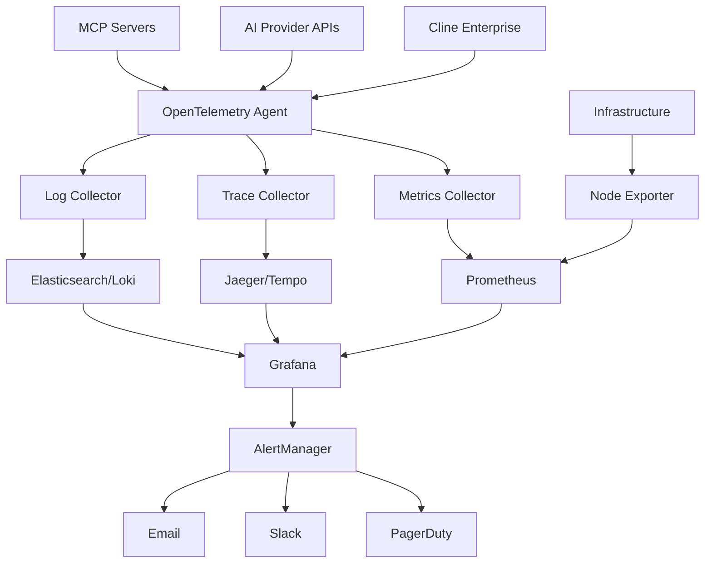

Enterprise Monitoring provides comprehensive visibility into your Cline deployment with real-time metrics, distributed tracing, log aggregation, and advanced analytics. Built on industry-standard observability technologies including OpenTelemetry, Prometheus, and Grafana.

## Monitoring Benefits

<CardGroup cols={2}>
  <Card title="Full Stack Visibility" icon="eye">
    Monitor every aspect of your Cline deployment from AI requests to infrastructure performance.
  </Card>
  
  <Card title="Proactive Alerting" icon="bell">
    Detect and respond to issues before they impact users with intelligent alerting and escalation.
  </Card>
  
  <Card title="Performance Insights" icon="chart-line">
    Analyze usage patterns, optimize costs, and improve user experience with detailed analytics.
  </Card>
  
  <Card title="Compliance & Audit" icon="clipboard-check">
    Maintain comprehensive audit trails and compliance reporting for regulatory requirements.
  </Card>
</CardGroup>

## Core Components

<CardGroup cols={2}>
  <Card title="OpenTelemetry" icon="telescope" href="/enterprise-solutions/monitoring/opentelemetry">
    Distributed tracing, metrics collection, and observability instrumentation across all Cline components.
  </Card>
  
  <Card title="Metrics & Dashboards" icon="chart-bar">
    Real-time performance metrics, usage analytics, and customizable dashboards for operational visibility.
  </Card>
  
  <Card title="Log Management" icon="file-lines">
    Centralized log aggregation, search, and analysis for troubleshooting and audit compliance.
  </Card>
  
  <Card title="Alerting & Escalation" icon="triangle-exclamation">
    Intelligent alerting with multi-channel notifications and automated escalation policies.
  </Card>
</CardGroup>

## Monitoring Architecture



## Key Metrics Categories

### AI & Model Performance

Monitor AI model usage, performance, and costs:

```yaml
# ai-metrics.yaml
metrics:
  # Request volume and patterns
  - name: "ai_requests_total"
    type: "counter"
    labels: ["model", "user_role", "task_type", "status"]
    description: "Total AI requests by model and status"
    
  - name: "ai_request_duration_seconds"
    type: "histogram"
    labels: ["model", "provider", "request_size"]
    buckets: [0.1, 0.5, 1, 2, 5, 10, 30, 60]
    description: "AI request processing time"
    
  - name: "ai_token_usage_total"
    type: "counter"
    labels: ["model", "token_type", "user_team"]
    description: "Total tokens consumed (input/output)"
    
  - name: "ai_cost_total"
    type: "counter"
    labels: ["model", "provider", "cost_center"]
    description: "Total AI costs in USD"

  # Model health and availability
  - name: "ai_model_availability"
    type: "gauge"
    labels: ["model", "provider", "region"]
    description: "Model availability status (0=down, 1=up)"
    
  - name: "ai_error_rate"
    type: "gauge"
    labels: ["model", "error_type"]
    description: "Error rate by model and error type"

  # Context window usage
  - name: "ai_context_utilization"
    type: "histogram"
    labels: ["model", "task_type"]
    buckets: [0.1, 0.3, 0.5, 0.7, 0.9, 0.95, 1.0]
    description: "Context window utilization percentage"
```

### User Activity & Performance

Track user engagement and productivity:

```yaml
# user-metrics.yaml
metrics:  
  # User activity
  - name: "user_sessions_total"
    type: "counter"
    labels: ["user_role", "team", "environment"]
    description: "Total user sessions"
    
  - name: "user_task_completion_total"
    type: "counter"  
    labels: ["user_id", "task_type", "success"]
    description: "Tasks completed by users"
    
  - name: "user_task_duration_seconds"
    type: "histogram"
    labels: ["task_type", "complexity"]
    buckets: [60, 300, 900, 1800, 3600, 7200, 14400]
    description: "Time to complete tasks"

  # Feature usage
  - name: "feature_usage_total"
    type: "counter"
    labels: ["feature_name", "user_role", "success"]
    description: "Feature usage by type and role"
    
  - name: "tool_execution_total"
    type: "counter"
    labels: ["tool_name", "execution_time_bucket", "success"]
    description: "Tool execution counts and success rates"

  # Productivity metrics
  - name: "code_lines_generated"
    type: "counter"
    labels: ["language", "user_team", "file_type"]
    description: "Lines of code generated by AI"
    
  - name: "files_modified_total"
    type: "counter"
    labels: ["operation_type", "file_extension", "user_role"]
    description: "Files created/modified by operations"
```

### System Health & Infrastructure

Monitor infrastructure and system performance:

```yaml
# system-metrics.yaml  
metrics:
  # Application health
  - name: "cline_up"
    type: "gauge"
    labels: ["instance", "version"]
    description: "Cline service availability"
    
  - name: "http_requests_total"
    type: "counter"
    labels: ["method", "route", "status_code"]
    description: "HTTP requests to Cline APIs"
    
  - name: "http_request_duration_seconds"
    type: "histogram"
    labels: ["method", "route"]
    buckets: [0.005, 0.01, 0.025, 0.05, 0.1, 0.25, 0.5, 1, 2.5, 5, 10]
    description: "HTTP request latency"

  # Resource usage
  - name: "memory_usage_bytes"
    type: "gauge"
    labels: ["component", "instance"]
    description: "Memory usage by component"
    
  - name: "cpu_usage_percent" 
    type: "gauge"
    labels: ["component", "instance"]
    description: "CPU usage percentage"
    
  - name: "disk_usage_bytes"
    type: "gauge"
    labels: ["volume", "instance"]
    description: "Disk space usage"

  # External dependencies
  - name: "external_api_requests_total"
    type: "counter"  
    labels: ["provider", "api", "status"]
    description: "Requests to external APIs"
    
  - name: "external_api_duration_seconds"
    type: "histogram"
    labels: ["provider", "api"]
    buckets: [0.1, 0.5, 1, 2, 5, 10, 30]
    description: "External API response times"
```

## Dashboard Examples

### Executive Dashboard

High-level KPIs for leadership:

```yaml
# executive-dashboard.yaml
dashboard:
  title: "Cline Enterprise - Executive Overview"
  
  panels:
    - title: "Daily Active Users"
      type: "stat"
      targets:
        - expr: "count(increase(user_sessions_total[24h]) > 0)"
      fieldConfig:
        displayName: "Active Users"
        unit: "users"
        
    - title: "AI Requests Today"
      type: "stat"
      targets:
        - expr: "sum(increase(ai_requests_total[24h]))"
      fieldConfig:
        displayName: "AI Requests"
        unit: "requests"
        
    - title: "Cost per Day"
      type: "stat"
      targets:
        - expr: "sum(increase(ai_cost_total[24h]))"
      fieldConfig:
        displayName: "Daily Cost"
        unit: "currencyUSD"
        
    - title: "User Satisfaction" 
      type: "gauge"
      targets:
        - expr: "avg(rate(user_task_completion_total{success=\"true\"}[24h]) / rate(user_task_completion_total[24h]))"
      fieldConfig:
        displayName: "Success Rate"
        unit: "percentunit"
        min: 0
        max: 1
        
    - title: "Usage by Team"
      type: "piechart"  
      targets:
        - expr: "sum by (team) (increase(ai_requests_total[24h]))"
        
    - title: "Cost Trends"
      type: "timeseries"
      targets:
        - expr: "sum(increase(ai_cost_total[1h]))"
        legendFormat: "Hourly Cost"
      timeRange: "7d"
```

### Operations Dashboard

Detailed operational metrics for SRE teams:

```yaml
# operations-dashboard.yaml  
dashboard:
  title: "Cline Enterprise - Operations"
  
  panels:
    - title: "Service Availability"
      type: "stat"
      targets:
        - expr: "avg(cline_up)"
      fieldConfig:
        displayName: "Uptime"
        unit: "percentunit"
        thresholds:
          - color: "red"
            value: 0.95
          - color: "yellow" 
            value: 0.99
          - color: "green"
            value: 0.999
            
    - title: "Request Rate"
      type: "timeseries"
      targets:
        - expr: "sum(rate(http_requests_total[5m]))"
        legendFormat: "Requests/sec"
        
    - title: "Response Times"
      type: "timeseries"
      targets:
        - expr: "histogram_quantile(0.95, rate(http_request_duration_seconds_bucket[5m]))"
          legendFormat: "95th percentile"
        - expr: "histogram_quantile(0.50, rate(http_request_duration_seconds_bucket[5m]))"
          legendFormat: "50th percentile"
          
    - title: "Error Rate"
      type: "timeseries"
      targets:
        - expr: "sum(rate(http_requests_total{status_code=~\"5..\"}[5m])) / sum(rate(http_requests_total[5m]))"
        legendFormat: "5xx Error Rate"
        
    - title: "AI Provider Health"
      type: "table"
      targets:
        - expr: "ai_model_availability"
        format: "table"
      transformations:
        - id: "organize"
          options:
            excludeByName:
              "__name__": true
        - id: "groupBy"
          options:
            fields:
              provider: "groupBy"
              model: "groupBy"
              value: "mean"
```

### Security Dashboard

Security and compliance monitoring:

```yaml
# security-dashboard.yaml
dashboard:
  title: "Cline Enterprise - Security & Compliance"
  
  panels:
    - title: "Authentication Events"
      type: "timeseries"
      targets:
        - expr: "sum by (status) (rate(auth_events_total[5m]))"
        legendFormat: "{{ status }}"
        
    - title: "Failed Login Attempts"
      type: "stat"
      targets:
        - expr: "sum(increase(auth_events_total{status=\"failed\"}[24h]))"
      fieldConfig:
        displayName: "Failed Logins"
        unit: "attempts"
        thresholds:
          - color: "green"
            value: 0
          - color: "yellow"
            value: 10
          - color: "red"
            value: 50
            
    - title: "Permission Violations"
      type: "table"
      targets:
        - expr: "increase(permission_violations_total[1h])"
        format: "table"
        
    - title: "Data Access Patterns"
      type: "heatmap"
      targets:
        - expr: "sum by (data_classification, user_role) (rate(data_access_total[1h]))"
        
    - title: "Audit Log Volume"
      type: "timeseries" 
      targets:
        - expr: "sum(rate(audit_logs_total[5m]))"
        legendFormat: "Audit Events/sec"
```

## Alerting Configuration

### Critical Alerts

Production-impacting issues requiring immediate attention:

```yaml
# critical-alerts.yaml
groups:
  - name: cline.critical
    rules:
      - alert: ClineServiceDown
        expr: cline_up == 0
        for: 1m
        labels:
          severity: critical
          team: sre
        annotations:
          summary: "Cline service is down"
          description: "Cline service {{ $labels.instance }} has been down for more than 1 minute"
          runbook: "https://docs.company.com/runbooks/cline-service-down"
          
      - alert: HighErrorRate
        expr: rate(http_requests_total{status_code=~"5.."}[5m]) / rate(http_requests_total[5m]) > 0.05
        for: 5m
        labels:
          severity: critical
          team: sre
        annotations:
          summary: "High error rate detected"
          description: "Error rate is {{ $value | humanizePercentage }} over the last 5 minutes"
          
      - alert: AIProviderDown
        expr: ai_model_availability < 1
        for: 2m
        labels:
          severity: critical
          team: platform
        annotations:
          summary: "AI provider unavailable"
          description: "{{ $labels.provider }}/{{ $labels.model }} has been unavailable for 2 minutes"
```

### Warning Alerts

Issues that need attention but aren't immediately critical:

```yaml
# warning-alerts.yaml
groups:
  - name: cline.warning
    rules:
      - alert: HighLatency
        expr: histogram_quantile(0.95, rate(http_request_duration_seconds_bucket[5m])) > 2
        for: 10m
        labels:
          severity: warning
          team: sre
        annotations:
          summary: "High latency detected"
          description: "95th percentile latency is {{ $value }}s"
          
      - alert: HighAICost
        expr: increase(ai_cost_total[1h]) > 100
        for: 5m
        labels:
          severity: warning
          team: finance
        annotations:
          summary: "High AI costs detected"
          description: "AI costs exceeded $100 in the last hour: ${{ $value }}"
          
      - alert: HighMemoryUsage
        expr: memory_usage_percent > 85
        for: 15m
        labels:
          severity: warning
          team: sre
        annotations:
          summary: "High memory usage"
          description: "Memory usage on {{ $labels.instance }} is {{ $value }}%"
```

## Log Management

### Structured Logging

Implement structured logging across all components:

```json
{
  "timestamp": "2024-01-15T10:30:00.123Z",
  "level": "INFO",
  "service": "cline-core",
  "version": "2.1.0",
  "instance_id": "cline-core-abc123",
  "trace_id": "4bf92f3577b34da6a3ce929d0e0e4736",
  "span_id": "00f067aa0ba902b7",
  "user_id": "user123",
  "session_id": "session456",
  "message": "AI request completed",
  "context": {
    "request_id": "req789",
    "model": "claude-3-sonnet",
    "provider": "anthropic",
    "tokens_used": 1250,
    "cost_usd": 0.025,
    "duration_ms": 1834,
    "task_type": "code_generation"
  }
}
```

### Log Aggregation Pipeline

Configure centralized log collection:

```yaml
# fluent-bit-config.yaml
service:
  flush: 1
  daemon: off
  log_level: info
  
input:
  - name: tail
    path: /app/logs/*.log
    parser: json
    tag: cline.*
    
  - name: systemd
    tag: host.*
    systemd_filter: _SYSTEMD_UNIT=cline.service
    
filter:
  - name: kubernetes
    match: kube.*
    merge_log: on
    keep_log: off
    
  - name: record_modifier
    match: cline.*
    record:
      environment: "${ENVIRONMENT}"
      cluster: "${CLUSTER_NAME}"
      
output:
  - name: elasticsearch
    match: "*"
    host: elasticsearch.logging.svc.cluster.local
    port: 9200
    index: cline-logs
    type: _doc
    
  - name: prometheus_exporter
    match: cline.*
    host: 0.0.0.0
    port: 2021
```

## Custom Monitoring Integration

### Webhook Integrations

Send monitoring data to external systems:

```yaml
# webhook-config.yaml
webhooks:
  - name: "datadog-integration"
    url: "https://http-intake.logs.datadoghq.com/v1/input/${DD_API_KEY}"
    events: ["metric", "alert"]
    headers:
      Content-Type: "application/json"
    template: |
      {
        "service": "cline-enterprise",
        "ddsource": "cline",
        "ddtags": "env:{{ .environment }},version:{{ .version }}",
        "message": "{{ .message }}",
        "timestamp": "{{ .timestamp }}"
      }
      
  - name: "splunk-integration"  
    url: "https://splunk.company.com:8088/services/collector/event"
    events: ["log", "audit"]
    headers:
      Authorization: "Splunk ${SPLUNK_TOKEN}"
    template: |
      {
        "time": {{ .timestamp }},
        "source": "cline-enterprise", 
        "sourcetype": "_json",
        "event": {{ .data | toJson }}
      }
```

### Custom Metrics Export

Export metrics to business intelligence systems:

```typescript
// metrics-exporter.ts
export class BusinessMetricsExporter {
  async exportProductivityMetrics(period: DateRange) {
    const metrics = await this.collectMetrics([
      'tasks_completed_by_team',
      'code_quality_improvements', 
      'time_saved_estimates',
      'user_satisfaction_scores'
    ], period);
    
    // Export to BI system
    await this.sendToDataWarehouse(metrics);
    
    // Generate executive reports
    return this.generateExecutiveReport(metrics);
  }
  
  async exportCostOptimizationData() {
    const data = {
      aiProviderCosts: await this.getProviderCosts(),
      usageEfficiency: await this.calculateEfficiency(),
      potentialSavings: await this.identifySavings(),
      recommendations: await this.generateRecommendations()
    };
    
    await this.sendToCostManagement(data);
    return data;
  }
}
```

## Best Practices

### Metrics Design
1. **Consistent Naming**: Use standard naming conventions across all metrics
2. **Appropriate Cardinality**: Avoid high-cardinality labels that cause storage issues
3. **Business Alignment**: Include metrics that matter to business stakeholders 
4. **SLI/SLO Focus**: Define and monitor Service Level Indicators and Objectives
5. **Cost Awareness**: Monitor the cost of monitoring itself

### Alerting Strategy  
1. **Alert on Symptoms**: Focus on user-impacting issues, not just technical metrics
2. **Reduce Noise**: Minimize false positives through proper thresholds and timing
3. **Clear Escalation**: Define escalation paths and ownership for different alert types
4. **Runbook Integration**: Link alerts to actionable runbooks and documentation
5. **Regular Review**: Periodically review and tune alerting rules

### Performance Optimization
1. **Efficient Queries**: Optimize PromQL queries for performance
2. **Storage Management**: Implement appropriate retention and downsampling policies  
3. **Resource Planning**: Right-size monitoring infrastructure based on usage
4. **Caching Strategy**: Cache frequently accessed dashboards and queries
5. **Network Optimization**: Optimize data ingestion and query patterns

## Getting Started

Ready to implement comprehensive monitoring? Start with:

1. [OpenTelemetry Integration](/enterprise-solutions/monitoring/opentelemetry) - Set up observability instrumentation
2. Review the dashboard examples and customize for your needs
3. Configure critical alerting rules for production issues
4. Implement log aggregation and search capabilities
5. Train your teams on monitoring tools and practices

Enterprise monitoring provides the visibility needed to operate Cline at scale while maintaining high performance and reliability standards.
