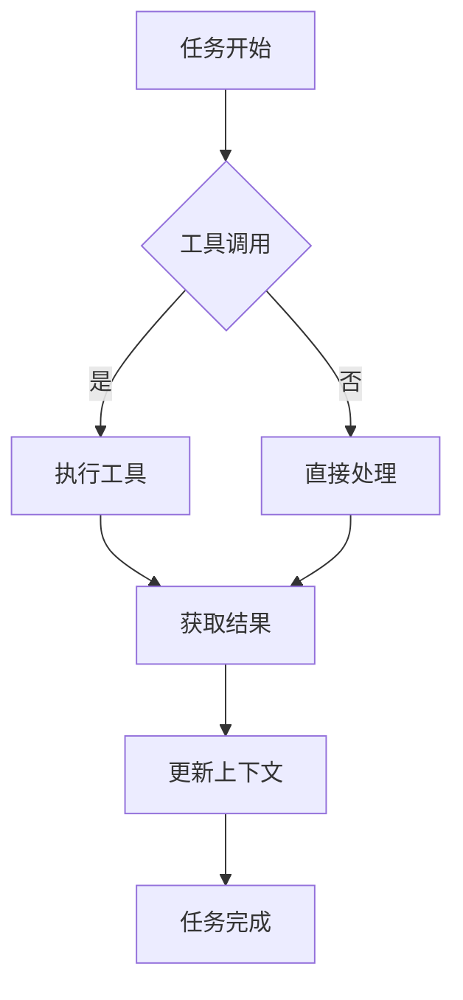
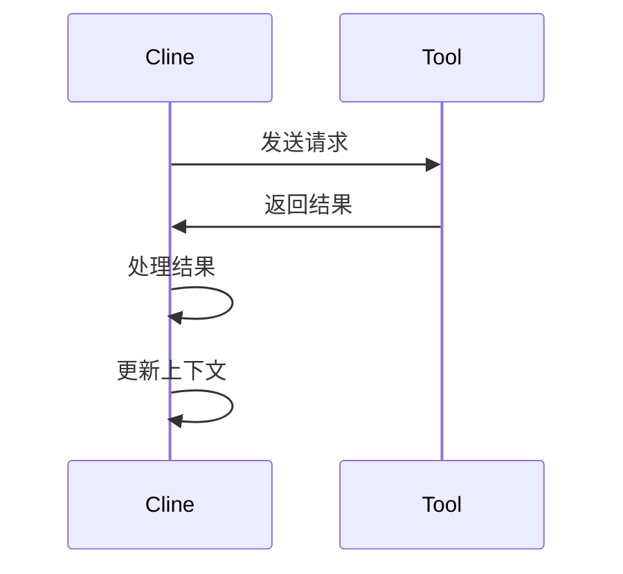

# 项目学习指南

## 1. 项目概述
- 项目名称：Cline
- 主要功能：提供智能代码助手服务
- 核心特性：
  * 工具调用机制
  * 文件操作处理
  * 浏览器自动化
  * 终端命令执行
  * MCP工具集成

## 2. 核心模块分析

### 2.1 Cline.ts 详细分析
- 任务生命周期管理：
  * 任务初始化
  * 上下文准备
  * 工具选择
  * 结果处理
  * 状态更新

- 工具调用机制：
  * 工具注册
  * 参数验证
  * 执行控制
  * 结果解析

- 文件操作处理：
  * 文件读写
  * 内容替换
  * 路径处理
  * 权限管理

- 浏览器自动化：
  * 页面导航
  * 元素操作
  * 数据提取
  * 截图功能

- 终端命令执行：
  * 命令构建
  * 环境配置
  * 输出处理
  * 错误处理

- MCP工具集成：
  * 服务发现
  * 工具调用
  * 资源访问
  * 错误处理

- 上下文管理：
  * 状态存储
  * 数据同步
  * 版本控制
  * 持久化

- 检查点机制：
  * 状态保存
  * 断点恢复
  * 进度跟踪
  * 错误恢复



### 2.2 工具调用流程


## 3. 项目结构详细解析

### 3.1 核心目录
```
src/
├── core/          # 核心逻辑
│   ├── Cline.ts   # 主控制类
│   ├── prompts/   # 提示管理
│   ├── mentions/  # 上下文引用
│   └── webview/   # 界面集成
```

### 3.2 服务模块
```
src/services/
├── auth/          # 认证管理
├── browser/       # 浏览器服务
├── glob/          # 文件匹配
├── mcp/           # MCP服务
├── ripgrep/       # 文本搜索
└── tree-sitter/   # 语法解析
```

### 3.3 集成模块
```
src/integrations/
├── checkpoints/   # 检查点
├── debug/         # 调试工具
├── diagnostics/   # 诊断
├── editor/        # 编辑器集成
├── notifications/ # 通知
├── terminal/      # 终端
└── workspace/     # 工作区
```

### 3.4 其他模块
```
src/
├── api/           # API接口
├── shared/        # 共享模块
└── webview-ui/    # 前端界面
```

## 4. 深入学习方法

### 4.1 学习路径
1. 从核心模块Cline.ts开始
   * 理解核心类结构
   * 分析主要方法实现
   * 跟踪任务生命周期
2. 逐步扩展到其他模块
   * 研究API层实现
   * 理解服务模块架构
   * 掌握集成模块功能
3. 通过实际任务加深理解
   * 完成简单工具调用
   * 实现文件操作功能
   * 扩展MCP工具支持

# Cline.ts 学习笔记

## 核心类结构

### Cline 类
- 核心类，负责管理整个任务的生命周期
- 主要职责：
  - 与API交互
  - 管理终端会话
  - 处理文件操作
  - 管理浏览器会话
  - 处理用户交互

### 主要属性
- `taskId`: 当前任务的唯一标识
- `api`: API处理程序
- `terminalManager`: 终端管理器
- `browserSession`: 浏览器会话
- `diffViewProvider`: 文件差异视图提供者
- `checkpointTracker`: 检查点跟踪器

## 关键方法

### 构造函数
- 初始化所有核心组件
- 根据传入参数决定是启动新任务还是恢复历史任务

### 任务生命周期管理
- `startTask()`: 启动新任务
  * 文件读写
  * 内容替换
  * 路径处理
  * 权限管理

- 浏览器自动化：
  * 页面导航
  * 元素操作
  * 数据提取
  * 截图功能

- 终端命令执行：
  * 命令构建
  * 环境配置
  * 输出处理
  * 错误处理

- MCP工具集成：
  * 服务发现
  * 工具调用
  * 资源访问
  * 错误处理

- 上下文管理：
  * 状态存储
  * 数据同步
  * 版本控制
  * 持久化

- 检查点机制：
  * 状态保存
  * 断点恢复
  * 进度跟踪
  * 错误恢复


### 4.2 调试技巧
- 使用DebugConsoleManager
- 设置断点调试
- 查看日志输出
- 使用检查点功能

### 4.3 代码阅读建议
- 先理解接口定义
  * 查看类型声明
  * 分析参数结构
  * 理解返回值类型
- 关注模块间交互
  * 跟踪调用链路
  * 理解依赖关系
  * 分析数据流动
- 注意异常处理
  * 查看错误捕获
  * 分析恢复机制
  * 理解日志记录
- 查看单元测试
  * 阅读测试用例
  * 理解测试场景
  * 运行调试测试

### 4.4 实践建议
- 从简单任务开始
  * 选择基础功能模块
  * 理解核心流程
  * 完成简单修改
- 逐步增加复杂度
  * 尝试功能扩展
  * 解决复杂问题
  * 优化现有实现
- 记录学习笔记
  * 使用Markdown格式
  * 记录关键概念
  * 整理常见问题
- 参与代码审查
  * 学习审查规范
  * 参与团队审查
  * 提出改进建议
- 项目贡献流程
  * 创建功能分支
  * 编写单元测试
  * 提交Pull Request
  * 参与代码评审
- 持续学习计划
  * 每周学习新技术
  * 参与技术分享
  * 阅读源码实现

### 4.5 API层学习建议
1. 从src/api/index.ts开始
2. 理解API请求处理流程
3. 研究不同provider的实现
4. 分析请求转换机制

### 4.6 MCP协议学习建议
1. 从src/services/mcp/开始
2. 理解MCP协议规范
3. 研究工具调用流程
4. 分析资源访问机制

## 5. 常见问题解答
- Q: 如何添加新工具？
- A: 参考tools目录下的实现

- Q: 如何调试核心流程？
- A: 使用DebugConsoleManager

## 6. 代码示例

### 6.1 工具调用示例
```typescript
// 示例：文件读取工具调用
const result = await executeTool('read_file', {
  path: 'example.txt',
  requires_approval: false
});
```

### 6.2 API调用示例
```typescript
// 示例：API请求处理
const response = await apiProvider.sendRequest({
  endpoint: '/v1/chat',
  method: 'POST',
  body: { message: 'Hello' }
});
```

### 6.3 MCP工具调用示例
```typescript
// 示例：MCP工具调用
const mcpResult = await mcpHub.callTool('weather', 'get_forecast', {
  city: 'Beijing',
  days: 3
});
```

## 7. 调试与测试指南

### 7.1 调试技巧
- 使用VSCode调试器
- 设置断点
- 查看调用堆栈
- 使用日志输出

### 7.2 单元测试
- 测试文件结构
- 测试用例编写
- 测试覆盖率
- 持续集成

## 8. 开发最佳实践

### 8.1 代码规范
- 遵循TypeScript最佳实践
- 使用ESLint进行代码检查
- 保持代码风格一致

### 8.2 文档编写
- 使用JSDoc注释
- 保持文档更新
- 编写清晰的README

### 8.3 版本控制
- 使用Git进行版本管理
- 遵循Git Flow工作流
- 编写有意义的提交信息

### 8.4 性能优化
- 使用性能分析工具
  * 安装Node.js性能分析工具
  * 配置性能监控
  * 定期进行性能测试
- 优化关键路径
  * 识别性能瓶颈
  * 优化算法复杂度
  * 减少I/O操作
- 减少内存占用
  * 使用内存分析工具
  * 优化数据结构
  * 及时释放资源
- 优化网络请求
  * 使用缓存机制
  * 压缩传输数据
  * 优化API设计

### 8.5 安全实践
- 输入验证
  * 实现数据校验
  * 防止SQL注入
  * 防范XSS攻击
- 权限控制
  * 实现RBAC模型
  * 配置访问控制列表
  * 定期审查权限
- 数据加密
  * 使用HTTPS协议
  * 加密敏感数据
  * 管理加密密钥
- 安全审计
  * 定期安全扫描
  * 记录安全事件
  * 实施安全培训

### 8.6 代码审查
- 审查流程
  * 制定审查规范
  * 配置审查工具
  * 安排定期审查
- 审查要点
  * 代码质量
  * 安全漏洞
  * 性能问题
- 自动化检查
  * 配置ESLint规则
  * 集成SonarQube
  * 设置CI检查
- 审查记录
  * 记录审查结果
  * 跟踪问题修复
  * 生成审查报告

### 8.7 CI/CD配置
- 自动化测试
  * 编写单元测试
  * 配置测试覆盖率
  * 集成E2E测试
- 构建流程
  * 配置构建脚本
  * 优化构建时间
  * 管理构建产物
- 部署策略
  * 实现蓝绿部署
  * 配置自动回滚
  * 监控部署状态
- 回滚机制
  * 配置版本管理
  * 实现快速回滚
  * 记录回滚日志
