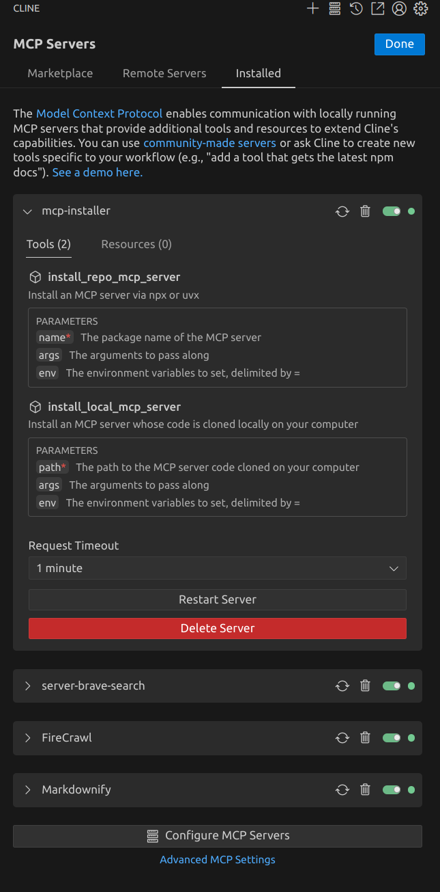

# Configuring MCP Servers

### Global MCP Server Inclusion Mode <a href="#enabling-or-disabling-mcp-servers" id="enabling-or-disabling-mcp-servers"></a>

Utilizing MCP servers will increase your token useage. Cline offers the ability to restrict or disable MCP server functionality as desired.&#x20;

1. Click the "MCP Servers" icon in the top navigation bar of the Cline extension.
2. Select the "Installed" tab, and then Click the "Advanced MCP Settings" link at the bottom of that pane.
3. Cline will open a new settings window. find `Cline>Mcp:Mode`and make your selection from the dropdown menu.

<figure><figcaption></figcaption></figure>

### Managing Individual MCP Servers[​](https://docs.roocode.com/features/mcp/using-mcp-in-roo#managing-individual-mcp-servers) <a href="#managing-individual-mcp-servers" id="managing-individual-mcp-servers"></a>

Each MCP server has its own configuration panel where you can modify settings, manage tools, and control its operation. To access these settings:

1. Click the "MCP Servers" icon in the top navigation bar of the Cline extension.
2. Locate the MCP server you want to manage in the list, and open it by clicking on its name.

<figure><figcaption></figcaption></figure>

#### Deleting a Server[​](https://docs.roocode.com/features/mcp/using-mcp-in-roo#deleting-a-server) <a href="#deleting-a-server" id="deleting-a-server"></a>

1. Click the Trash icon next to the MCP server you would like to delete, or the red Delete Server button at the bottom of the MCP server config box.

<mark style="color:yellow;">NOTE: There is no delete confirmation dialog box</mark>

#### Restarting a Server[​](https://docs.roocode.com/features/mcp/using-mcp-in-roo#restarting-a-server) <a href="#restarting-a-server" id="restarting-a-server"></a>

1. Click the Restart button next to the MCP server you would like to restart, or the gray Restart Server button at the bottom of the MCP server config box.

#### Enabling or Disabling a Server[​](https://docs.roocode.com/features/mcp/using-mcp-in-roo#enabling-or-disabling-a-server) <a href="#enabling-or-disabling-a-server" id="enabling-or-disabling-a-server"></a>

1. Click the toggle switch next to the MCP server to enable/disable servers individually.

#### Network Timeout[​](https://docs.roocode.com/features/mcp/using-mcp-in-roo#network-timeout) <a href="#network-timeout" id="network-timeout"></a>

To set the maximum time to wait for a response after a tool call to the MCP server:

1. Click the `Network Timeout` dropdown at the bottom of the individual MCP server's config box and change the time. Default is 1 minute but it can be set between 30 seconds and 1 hour.


### Editing MCP Settings Files[​](https://docs.roocode.com/features/mcp/using-mcp-in-roo#editing-mcp-settings-files) <a href="#editing-mcp-settings-files" id="editing-mcp-settings-files"></a>

Settings for all installed MCP servers are located in the `cline_mcp_settings.json`file :

1. Click the MCP Servers icon at the top navigation bar of the Cline pane.
2. Select the "Installed" tab.
3. Click the "Configure MCP Servers" button at the bottom of the pane.

The file usees a JSON format with a `mcpServers` object containing named server configurations:

```
{
  "mcpServers": {
    "server1": {
      "command": "python",
      "args": ["/path/to/server.py"],
      "env": {
        "API_KEY": "your_api_key"
      },
      "alwaysAllow": ["tool1", "tool2"],
      "disabled": false
    }
  }
}
```

_Example of MCP Server config in Cline (STDIO Transport)_

***

### Understanding Transport Types[​](https://docs.roocode.com/features/mcp/using-mcp-in-roo#understanding-transport-types) <a href="#understanding-transport-types" id="understanding-transport-types"></a>

MCP supports two transport types for server communication:

### **STDIO Transport**[**​**](https://docs.roocode.com/features/mcp/using-mcp-in-roo#stdio-transport)

Used for local servers running on your machine:

* Communicates via standard input/output streams
* Lower latency (no network overhead)
* Better security (no network exposure)
* Simpler setup (no HTTP server needed)
* Runs as a child process on your machine

For more in-depth information about how STDIO transport works, see [MCP Transport Mechanisms.](mcp-transport-mechanisms.md)

STDIO configuration example:

```
{
  "mcpServers": {
    "local-server": {
      "command": "node",
      "args": ["/path/to/server.js"],
      "env": {
        "API_KEY": "your_api_key"
      },
      "alwaysAllow": ["tool1", "tool2"],
      "disabled": false
    }
  }
}
```

### **SSE Transport**[**​**](https://docs.roocode.com/features/mcp/using-mcp-in-roo#sse-transport)

Used for remote servers accessed over HTTP/HTTPS:

* Communicates via Server-Sent Events protocol
* Can be hosted on a different machine
* Supports multiple client connections
* Requires network access
* Allows centralized deployment and management

For more in-depth information about how SSE transport works, see  [MCP Transport Mechanisms.](mcp-transport-mechanisms.md)

SSE configuration example:

```
{
  "mcpServers": {
    "remote-server": {
      "url": "https://your-server-url.com/mcp",
      "headers": {
        "Authorization": "Bearer your-token"
      },
      "alwaysAllow": ["tool3"],
      "disabled": false
    }
  }
}
```

***

### Using MCP Tools in Your Workflow[​](https://docs.roocode.com/features/mcp/using-mcp-in-roo#using-mcp-tools-in-your-workflow) <a href="#using-mcp-tools-in-your-workflow" id="using-mcp-tools-in-your-workflow"></a>

After configuring an MCP server, Cline will automatically detect available tools and resources. To use them:

1. Type your request in Cline's conversation window
2. Cline will identify when an MCP tool can help with your task
3. Approve the tool use when prompted (or use auto-approval)

Example: "Analyze the performance of my API" might use an MCP tool that tests API endpoints.

### Troubleshooting MCP Servers[​](https://docs.roocode.com/features/mcp/using-mcp-in-roo#troubleshooting-mcp-servers) <a href="#troubleshooting-mcp-servers" id="troubleshooting-mcp-servers"></a>

Common issues and solutions:

* **Server Not Responding:** Check if the server process is running and verify network connectivity
* **Permission Errors:** Ensure proper API keys and credentials are configured in your `mcp_settings.json` file.
* **Tool Not Available:** Confirm the server is properly implementing the tool and it's not disabled in settings
* **Slow Performance:** Try adjusting the network timeout value for the specific MCP server

[Edit this page](https://github.com/RooVetGit/Roo-Code-Docs/edit/main/docs/features/mcp/using-mcp-in-roo.md)\
