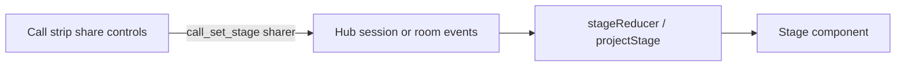

# MVP plan · UI and shared screen

Transparent next steps toward Drive MVP, focused on user interface and shared screen mode. Aligns with [TASK-GRAPH](../cline-drivemode/TASK-GRAPH.md) Phases 1–2 and [DRV-STAGE](../cline-drivemode/features/DRV-STAGE.md) / [DRV-SHARE](../cline-drivemode/features/DRV-SHARE.md).

## Goal

A user in a Drive room can **see the partner’s current work on a shared stage** (edit / command / test cards) and optionally **take the stage with a structured pin** (selection / file / terminal). Stage is a pure projection of hub (or session) events. **No WebRTC pixels.**

## Shared screen definition (locked)

| MVP | Later (not this slice) |
|---|---|
| Events-first Call Stage, last-event-wins cards | WebRTC / pixel capture / media SFU |
| `sharer: human \| agent` + participant id | Multi-human Live share |
| Agent cards via existing ai-elements (`code-block`, `terminal`, `test-results`) | Streaming fine-grained diff chunks |
| Structured user share (selection / file / terminal pin) | Arbitrary desktop capture |

From vision: the screen is structured work state, not pixels.

## Where we are

**Have**

- Chat Join / Stage on/off / call strip ([`DriveCallChrome.tsx`](../../apps/cline-hub/src/webview/src/drive/DriveCallChrome.tsx))
- Local demo fixture cards ([`demoFixture.ts`](../../apps/cline-hub/src/webview/src/drive/demoFixture.ts)), labeled non-hub
- Schemas: `StageState`, `StageCard`, sharer in `@cline/shared`
- Kernel: `reduceRoom` / `projectStage` in `@cline/drive`
- HTML Drive-tab prototype for IA validation
- Overview canvas + DEMO runbook

**Missing for real shared screen**

- Pure `stageReducer` + `Stage.tsx` on hub events (not fixture-only)
- Hub `call_set_stage` + broadcast of sharer pointer
- Drive tab route / room chrome (Phase 1 primary mount)
- Stage cards wired to ai-elements
- Live smoke: agent work updates stage; user pin then return

## Decision for sequencing

**First proof surface:** Hub Chat Stage split (extends the working scaffold).

**Primary product mount:** Drive tab room chrome, once Phase 1 room shell exists.

That is honest about TASK-GRAPH (STAGE depends on room chrome) while still delivering a testable shared-screen UX early. Slice A is a proof path; Slice C is what makes the locked IA true.

## Slices

### Slice A · Shared-screen core (prove the stage)

1. Write `stageReducer.ts` as a pure function: event stream → `StageState` (last-event-wins per category). Fixture tests for edit / command / test + replay determinism. Prefer `@cline/drive` `projectStage` where shapes match; adapt session tool events if room ops are not live yet.
2. Build `Stage.tsx` rendering ai-elements cards; header always labels the sharer.
3. Wire Chat Stage panel to the reducer when live projection exists; keep `drive.demo` fixture for offline demos.
4. Smoke: Join → Stage on → real edit/command/test → cards update; narrow layout stacks.

**Exit.** Stage tracks live work in the Chat Join split.

### Slice B · Room ownership of sharer (make share real)

1. Hub `call_set_stage` carries `sharer` + participant id. Clients do not invent a second owner.
2. Call strip: Agent takes stage / You take stage with structured pin payload.
3. Human sharer branch in Stage (selection / file / terminal pin).
4. Smoke bidirectional share per DRV-SHARE.

**Exit.** Hub owns the stage pointer; reload converges; no WebRTC.

### Slice C · Drive tab mount (align with locked IA)

1. Minimal Drive tab activity + one call room shell (DRV-DRIVE-TAB subset Stage needs).
2. Same `Stage` + strip in room chrome; Chat Join focuses that room.
3. Phase 1 smoke items Stage depends on (join, leave, rejoin).

**Exit.** Shared screen lives on Drive tab as primary; Chat remains a shortcut.

## Deferred (explicit)

- Voice (Phase 3)
- Recruit / RosterPack depth
- WebRTC / SFU (Phase 5)
- Multi-room active runtimes beyond view-only

## Verification

| Slice | Static | Runtime |
|---|---|---|
| A | Reducer + Stage unit tests | `control-ui` on hub; screenshots wide + narrow |
| B | Shared/core unit tests for `call_set_stage` | Bidirectional share smoke |
| C | Hub webview tests | Drive tab → join → stage → Chat rejoin |

Acceptance criteria remain those in DRV-STAGE and DRV-SHARE. Do not invent a parallel checklist.

## Open product questions (none for share pixels)

User share = structured only is already closed in `DEC-open-product-forks.md`. Remaining work is implementation sequencing, not product fork.

If leadership still needs ARD accept for other Phase 0 items, that does not block Slice A’s Chat Stage proof on session events.
