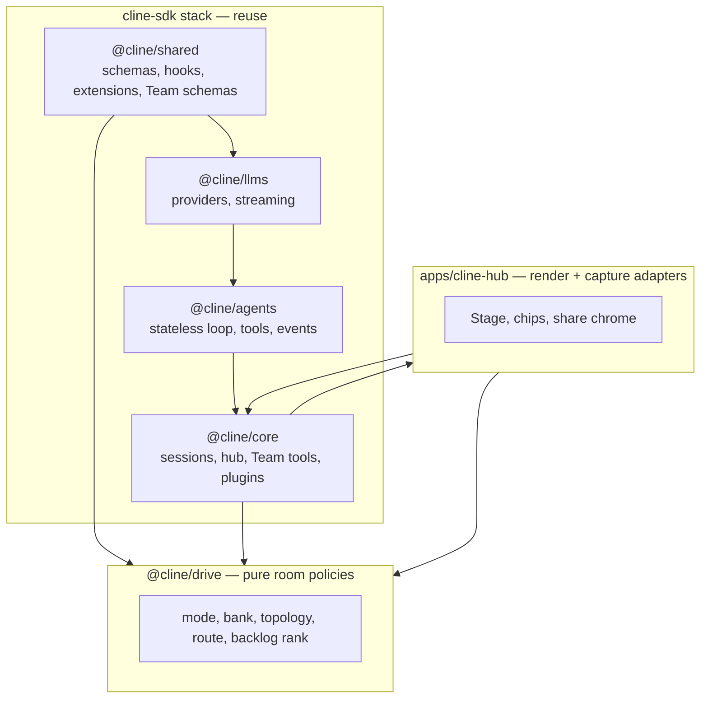
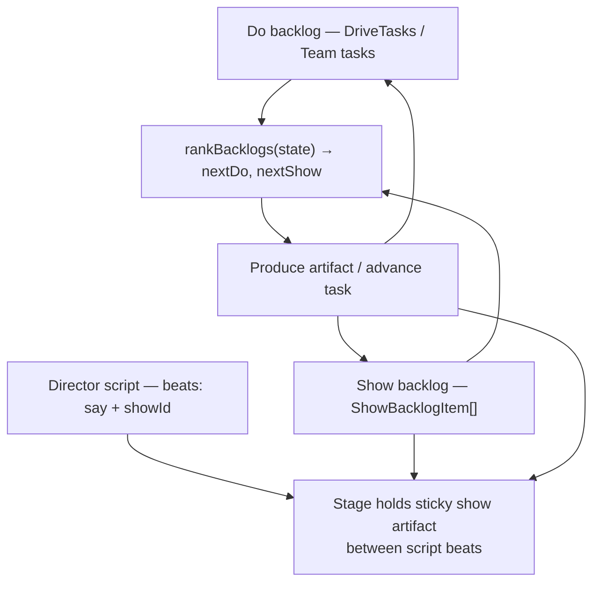
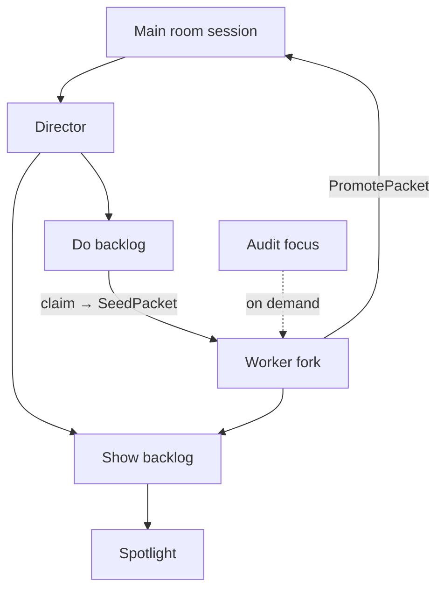
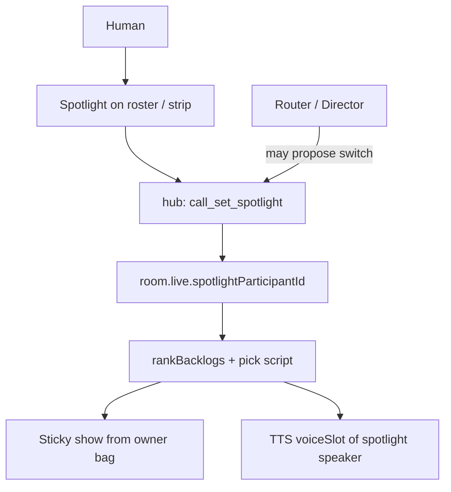
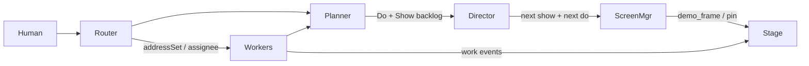

# PLAN · Drive demo stage + multi-agent orchestration (SDK-first)

Revised architecture plan. Incorporates: **cline-sdk first**, **Apache-2.0 licensing**, **non-live “appearing live” demo backlog**, and **specialized room agents** (router, backlog planner, screen manager).

**Principles:** redesign-from-first-principles, model-the-domain, boundary-discipline, laziness-protocol, experience-first, exhaust-the-design-space, foundational-thinking, migrate-callers-then-delete-legacy-apis, encode-lessons-in-structure.

---

## Context (updated)

Prior plan (share-and-router) chose Cursor-like demo *artifacts* over WebRTC. That direction is confirmed and strengthened:

> Agent share screen need not be truly live. Intelligent planning of what to show, plus continuously building and reranking a backlog of demos and work, is enough to *appear* live and is more feasible.

Also confirmed:

> Leverage **cline-sdk** as much as possible. Improve and contribute back. Respect licensing.

---

## Scope

### In scope

- Architecture that prefers existing `@cline/*` SDK seams (agents loop, Team tools, hooks, extensions, hub, llms, ConfiguredAgent).
- Licensing posture for fork work and upstream contributions.
- **Demo backlog** model: plan → produce → rank → present on stage (simulated live).
- **DirectorScript** + sticky explanatory artifacts (diagrams, animations, walkthroughs, plans).
- **Spotlight** control: prioritize what is on screen, what is said, and who says it (per-agent voices).
- **Per-agent** discretionary scripts/artifacts; router + director choose what is shown (may reassign spotlight).
- **Mute / deafen** per participant + **A2A** (agent-to-agent) delivery respecting those toggles.
- Room agent roles: **router**, **backlog planner**, **screen share manager** (+ optional extras).
- How these relate to Drive seats, DRV-ADDRESS, DRV-RECRUIT, Cline `Team`.

### Out of scope

- True live pixel SFU / WebRTC for agent demos.
- Replacing Cline Team with a Drive-owned execution group.
- Non-Apache copyleft dependencies in the SDK contribution path.
- Implementation in this planning pass (repo docs update lands on approval).

### Definition of done (plan)

- SDK capability map + contribution rules written.
- Demo backlog + stage presentation pipeline typed.
- Explanatory artifact kinds + director script model written.
- **Spotlight, mute/deafen, A2A, per-agent script ownership** typed and related to router/director.
- Agent role graph with ownership and defaults.
- Phased tasks with acceptance criteria.
- Open decisions have defaults.

---

## Cline SDK capability map (leverage first)



| SDK capability | Use for Drive |
|---|---|
| `ConfiguredAgent` + `.cline/agents` | Role prompts for router / planner / screen manager as real agents (or compiled overlays) |
| `@cline/agents` loop + tool orchestration | Each specialist runs a normal agent turn with tools |
| Team tools (spawn/claim/mailbox/outcomes) | Optional *execution* group for bounded multi-agent jobs — keep distinct from Drive roster |
| Hooks (`prompt_submit`, tool lifecycle) | Inject route plan, backlog context, narration policy without monkey-patching |
| Extension / plugin registry | Register `drive_browser_snapshot`, backlog tools as plugins or core tools |
| Hub sessions + event stream | Broadcast stage/demo/backlog events; single writer already on `:25463` |
| `@cline/llms` streaming | Local/cloud providers unchanged (topology from prior work) |
| Task bank / DriveTask (existing `@cline/drive`) | **Do backlog** items map to DriveTasks; **show backlog** is parallel queue |

**Contribution rule.** Prefer extending SDK packages (`shared` schemas, `core` tools/hub ops, `agents` hooks) with Apache-2.0-compatible patches that could upstream to `cline/cline`. Keep Drive-specific room IA in `@cline/drive` + hub webview. Do not fork a parallel agent runtime.

---

## Licensing (must respect)

| Fact | Implication |
|---|---|
| Repo / SDK packages are **Apache-2.0** (root `LICENSE`, `@cline/*` package.json) | Contributions to SDK code stay Apache-2.0; retain copyright/NOTICE; document material changes |
| Hosted Cline API ToS ≠ SDK license | BYOK / self-hosted paths remain Apache-governed; do not bake hosted ToS assumptions into Drive |
| Copyleft deps (GPL/AGPL) in SDK path | **Forbidden** for new SDK contributions unless upstream already accepts them |
| Proprietary demo codecs / closed SDKs | Isolate behind host adapters; never require them in `@cline/drive` pure kernel |
| Third-party browser/capture binaries | Document license in NOTICE; prefer OS/browser APIs already used by the host |

**Architecture encoding.** CI/docs checklist: new `sdk/packages/**` files must declare Apache-2.0; dependency review for license compatibility before merge; Drive docs cite “contribute upstream when general”.

---

## Revised product model · Simulated-live stage

### Insight

“Live share” for an *agent* is a planning problem:

1. Decide what the human should see next (and what to say while it is on screen).
2. Produce discrete **show artifacts** — not only live captures, but **explanatory stills, animations, and short demos** planned ahead.
3. Continuously **rerank** a backlog of show-items and do-items as work progresses.
4. Present the top show-item on the stage so it *feels* live, while a **director script** keeps narration aligned with the sticky on-screen artifact.

True pixel streaming is unnecessary for this loop.



### Explanatory show catalog (planning, results, review)

Show backlog items are not limited to “screenshot the running app.” A large class is **explanatory media** used while planning work and while explaining results, tests, and code review.

| Purpose | Typical artifacts | Sticky on stage for |
|---|---|---|
| Planning | Architecture diagram, data-flow diagram, plan file / task bank view, sequence sketch | Discussing approach before coding |
| Explaining results | Before/after UI still or animation, test-results card, metric snapshot | Walkthrough of what changed |
| Code review / rubber duck | Highlighted file walkthrough slides, call-graph diagram, “explain this function” panels | Line-by-line or module narration |
| Network / security | Trust-boundary diagram, request-flow diagram, threat sketch | Auth, egress, threat review |
| Ops / data | ERD, pipeline diagram, state-machine diagram | Persistence and migrations |

**“Static” includes motion.** A show artifact may be:

- still image (PNG/SVG/WebP)
- **animation** (animated WebP/GIF, short silent loop, diagram reveal)
- **short demo clip** (bounded video)
- structured pin / work card (selection, diff, terminal, tests)
- rendered **document surface** (plan markdown, ADR excerpt) as a stage card

All remain **pre-planned or generated as files**, then presented — not a continuous desktop stream.

### Standardized artifact workflow (common kit)

Build show items through a small, repeatable pipeline so planners and screen managers share one vocabulary:

```text
1. Choose template from ArtifactKind catalog
2. Fill slots (paths, mermaid source, caption, audience)
3. Produce file(s) via SDK tools (write mermaid→SVG, snapshot, record loop, render plan)
4. Register ShowBacklogItem { artifactKind, uri, stickyPolicy, scriptBeats[] }
5. Rank / present; keep sticky until script advances or human dismisses
```

| ArtifactKind (catalog) | Produce hint (tools) |
|---|---|
| `diagram.architecture` | mermaid/SVG generate + optional annotate |
| `diagram.data_flow` | mermaid/SVG |
| `diagram.network_security` | mermaid/SVG |
| `diagram.sequence` | mermaid/SVG |
| `walkthrough.code` | rubber-duck slides: file+range panels or multi-step stills |
| `walkthrough.animation` | short loop / reveal animation of a diagram or UI |
| `doc.plan` | render plan / DriveTask / ADR excerpt card |
| `doc.review` | review checklist + linked diffs |
| `capture.screenshot` | browser/app snapshot |
| `capture.demo_clip` | short recording |
| `share.structured` | selection / file / terminal pin |
| `work.card` | reuse edit/command/test event as show |

Templates live as data (YAML/JSON under `.cline/drive/show-templates/` or shared package constants) so new kinds are additive (**OCP**).

### Director script (say + show)

A **DirectorScript** is an ordered list of beats. Each beat pairs narration with a show artifact that can **persist across beats**.

```ts
type StickyPolicy =
  | { mode: "replace" }                 // new show clears previous
  | { mode: "hold" }                    // keep current until explicit advance
  | { mode: "hold_until"; beatId: string };

type ScriptBeat = {
  beatId: string;
  say: string;                          // narration / TTS / caption source
  showItemId: string;                   // ShowBacklogItem.id
  sticky: StickyPolicy;
  advance: "auto_after_say" | "on_tool" | "on_human" | "with_do_item";
};

type DirectorScript = {
  scriptId: string;
  title: string;
  beats: ScriptBeat[];
  /** Show ids that remain mounted while later beats only change `say` */
  stickyShowIds: string[];
};
```

**Stage behavior.** While a script runs, the stage’s primary pane holds the active sticky artifact; narration advances beat-to-beat without tearing down the diagram. Screen manager advances sticky only when the beat’s `sticky` policy says so. This is the “stay on screen between scripts” requirement.

### Domain types

```ts
/** What to *do* — prefer existing DriveTask / Team task ids when present. */
type DoBacklogItem = {
  id: string;
  title: string;
  goal: string;
  assigneeParticipantId?: string;
  priority: number;
  status: "queued" | "active" | "blocked" | "done";
  dependsOn: string[];
  source: "human" | "planner" | "router" | "system";
};

type ShowArtifactKind =
  | "diagram.architecture"
  | "diagram.data_flow"
  | "diagram.network_security"
  | "diagram.sequence"
  | "walkthrough.code"
  | "walkthrough.animation"
  | "doc.plan"
  | "doc.review"
  | "capture.screenshot"
  | "capture.demo_clip"
  | "share.structured"
  | "work.card";

/** What to *show* — planned beats, including explanatory media. */
type ShowBacklogItem = {
  id: string;
  title: string;
  intent: string;
  artifactKind: ShowArtifactKind;
  mediaClass: "still" | "animation" | "video" | "document" | "structured" | "work";
  uri?: string;
  caption: string;
  produce: {
    tool: string;
    templateId?: string;
    args: Record<string, unknown>;
  };
  priority: number;
  status: "planned" | "ready" | "showing" | "shown" | "cancelled";
  linkedDoItemId?: string;
  linkedScriptId?: string;
  scoreReasons: string[];
};

type StageDirectorState = {
  doBacklog: DoBacklogItem[];
  /** Merged view; sources include per-agent bags (see Spotlight section). */
  showBacklog: ShowBacklogItem[];
  activeScript: DirectorScript | null;
  activeBeatId: string | null;
  activeShowId: string | null;
  stickyShowIds: string[];
  spotlightParticipantId: string | null;
  lastPresentedAt: string | null;
};
```

Events (extend DRV-EVENTS): `drive_show_planned`, `drive_show_ranked`, `drive_show_presented`, `drive_script_beat`, `drive_spotlight_changed`, plus `drive_demo_frame` / structured share / diagram cards.

Privacy unchanged: metadata in events; media bytes ephemeral unless exported.

---

## ChatForkLifecycle (invisible auditable workers)

Decision record: [ARD-0014](../ard/ARD-0014-chat-fork-lifecycle.md). Feature: [DRV-CHAT-FORK](../features/DRV-CHAT-FORK.md). Related GAP: W-33 one-shot side-question fork (not this loop).

Worker forks are the **execution substrate** for Do items while the director keeps ranking Show. They are invisible by default and auditable on demand. “Merge” is structured promote, never raw transcript concatenation.



### When to fork

| Boundary | Fork? |
|---|---|
| Do-item claim | Yes |
| Wave batch item start | Yes |
| Review gate needing private scratch | Optional |
| Director replan / Spotlight rank / mute UI | No |

### SeedPacket / PromotePacket (schemas)

Canonical Zod lives in `@cline/shared` (`drive/chatFork.ts`). Conceptual shape:

```ts
type SeedPacket = {
  doItemId: string;
  title: string;
  goal: string;
  parentBriefing: string;           // compact; not full transcript
  assigneeParticipantId: string;
  allowedPathPrefixes: string[];    // empty = read-mostly / no edit claim
  linkedShowTemplateIds: string[];
  workspace: {
    mode: "shared_readonly" | "path_disjoint" | "worktree_isolated";
    cwd?: string;
    worktreePath?: string;
  };
  parentSessionId: string;
};

type PromotePacket = {
  workerSessionId: string;
  doItemId: string;
  status: "done" | "failed" | "cancelled";
  summary: string;
  decisions: string[];
  showItemIds: string[];
  eventRefs: string[];
  auditHandle: string;
  retainForAudit: boolean;
};

type ChatForkLifecycleState =
  | "seeded"
  | "running"
  | "promoting"
  | "archived"
  | "dropped"
  | "auditing";
```

### Pure policy (`@cline/drive`)

- `assertForkLegal` — rejects overlapping path contracts without worktree isolation; rejects fork reasons outside the boundary table.
- `buildSeedPacket` — builds seed from Do item + parent briefing + workspace mode.
- `applyPromotePacket` — folds promote into `StageDirectorState` (Do status, keep Show ids); returns main-context injection text. Does not splice worker messages.

### Explicit non-substrates

| Mechanism | Why not |
|---|---|
| CLI `/fork` / app `forkSession` | Full-message diverge; becomes active session; no promote-back |
| Checkpoint `session.restore` | Trim + optional in-place cwd hard-reset |
| Hub `session.fork` event names | Declared, unimplemented; do not overload without adapter |

### Audit UX

Default: no worker chat tabs. On demand: agent-stream focus + optional retain-for-audit. See [DRV-CHAT-FORK](../features/DRV-CHAT-FORK.md). Spotlight Gaps A/B/C are a parallel presentation track.

### Sequencing

Schemas + pure policy land with this amendment. Hub spawn/cancel/audit listing and UI affordances follow. End-to-end reactive share demos still need Spotlight production wiring.

---

## Spotlight, per-agent scripts, mute/deafen, A2A

### Spotlight button (priority focus)

**Spotlight** is room live state: `room.live.spotlightParticipantId` (human or agent). It is the call’s “who has the floor” for presentation — orthogonal to mute/deafen, but the director uses it as a strong ranking prior for screen, speech, and voice identity.

| Dimension | Spotlight effect |
|---|---|
| **What is on screen** | Bias rank toward the spotlighted agent’s Show backlog / sticky artifacts |
| **What is said** | Prefer that agent’s DirectorScript `say` beats (and Narrator TTS) |
| **Who is saying it** | TTS uses that participant’s `voiceSlotId` (AgentProfile); agents may share a voice or each have a distinct slot |



**Who may change spotlight**

| Actor | Power |
|---|---|
| Human | Always (strip / roster Spotlight control) |
| Director / Screen manager | May switch when presenting another agent’s artifact (`suggest` asks; `auto` allowed with audit event) |
| Router | May request spotlight follow primary assignee on send |
| Spotlighted agent | May *request* spotlight; cannot unilaterally steal it |

**Defaults.** One partner: spotlight = pair_partner. Multi-agent: last human-selected, else pair_partner. Never leave presentation without a fallback owner when agents are seated.

**UI.** Distinct from mute and stage-share. Roster glyph + strip label `Spotlight: {name}`.

### Per-agent discretionary scripts and artifacts

Each seated agent owns a bag the planner/director can pull from:

```ts
type AgentMediaBag = {
  participantId: string;
  showBacklog: ShowBacklogItem[];
  scripts: DirectorScript[];
  voiceSlotId?: string;
};
```

**Global StageDirectorState selects, it does not erase ownership:**

1. Candidates = union of agent bags (+ system templates).
2. Rank with weights: spotlight owner ≫ addressed agents ≫ others; human pin ≫ auto.
3. Present selected show + advance selected script beat.
4. Optionally emit `drive_spotlight_changed` if policy allows follow-the-owner.

Agents may prefetch off-spotlight. Only the selected sticky mounts on the primary stage pane.

### Mute and deafen (independent toggles)

Per-participant hub flags (extend DRV-MIC beyond human-only strip mute):

| Flag | Agents | Human |
|---|---|---|
| **muted** | No outbound TTS / `say` / speak turns as narration | Mic / utterance ingress blocked |
| **deafened** | No inbound room/A2A turns into their context | Optional suppress of partner TTS/captions |

Mute ⟂ deafen. Ops: `call_set_participant_mute`, `call_set_participant_deafen`. Facet `agents.allowSilentWorkWhenMuted` default `true` (muted agents may still tool/edit).

### Agent-to-agent (A2A)

A2A = addressed delivery between agents via existing `addressSet` (`mode: "agents"`), not a second bus.

- Facet `a2a.enabled` default on when seatCap > 1.
- Transcript `channel: "a2a" | "room"` for human filter.
- Facet `spotlightFollowA2A` default **off** (A2A does not steal the stage).
- Mute/deafen still apply on A2A paths.

### Voice identity

- `AgentProfile.voiceSlotId` binds TTS per agent.
- Spotlight speaker’s slot is used for active `say` beats.
- `voice.allowSharedSlot` default true; UI may warn on collisions.

### Relation to existing controls

| Control | Role |
|---|---|
| Strip mute (DRV-MIC) | Human muted |
| TTS quiet (DRV-TTS) | Global suppress of speech out |
| Per-agent mute/deafen | Roster-level speak/hear |
| Spotlight | Priority for show / say / voice — not a mute |
| Stage sharer / shareMode | What kind of share is mounted |

---

## Room agent roles (open to more)

These are **ConfiguredAgents** (or Driveagent homes) that may be seated as specialists or run as background policies. Prefer SDK Team *only* when a bounded multi-agent *job* needs mailbox/outcomes; room presence stays Drive roster.



| Role | Responsibility | SDK leverage | Drive seat? |
|---|---|---|---|
| **Router** | Map utterance (or slices) → best seated agent / addressSet | Pure `@cline/drive` scorer + optional cheap model via `@cline/llms` | Policy first; optional visible “Router” specialist |
| **Backlog planner** | Maintain/rerank **Do** and **Show** backlogs; enqueue explanatory artifacts (diagrams, walkthroughs, plan cards) from templates | Agent turn + tools; may use Team task board for Do items | Optional seated `specialist` or hub-side periodic turn |
| **Screen share manager** | Pick top Show / advance **DirectorScript** beats; keep sticky artifacts on stage while `say` changes; invoke produce tools | Tools via core/plugins; hooks for post-tool publish | Optional seated specialist or pure director in `@cline/drive` + hub executor |
| **Pair partner** (existing) | Primary collaborator | ConfiguredAgent | Yes (`pair_partner`) |
| **Domain specialists** (existing TEAM-OPT) | Execute routed work | ConfiguredAgent / Team teammate | Yes when flagged |

### Additional role ideas (optional, not required for MVP)

| Role | When it earns a seat |
|---|---|
| **Critic / QA** | Ranks Show items by “would a reviewer understand this?”; vetoes weak demos |
| **Narrator** | Speaks DirectorScript `say` beats (TTS/captions) while sticky show holds |
| **Diagrammer** | Specialized producer for mermaid/SVG/architecture templates |
| **Synthesizer** | Merges multi-slice answers into one human-facing summary after parallel specialists finish |
| **Librarian** | Keeps artifact index / export pack for PR attachment (Cursor proof-of-work analog) |

**Default MVP cast.** Router (pure + suggest UI) + Screen director (pure rank + hub execute) + Backlog planner (lightweight agent or heuristic). Do not seat five specialists until `teamOpt` / seatCap allow.

### Naming

- Room-facing: “Backlog planner”, “Screen manager”, “Router” — never Drive `Team*`.
- If a role needs Cline Team mailbox semantics, spawn a **Team** under the hood and mirror status into Drive events — do not rename Team to Drive.

---

## Integration with prior share/router plan

| Prior decision | Update |
|---|---|
| Demo artifacts over WebRTC | **Confirmed**; emphasize backlog-driven presentation |
| Router suggest/auto | **Confirmed**; router feeds Do assignee + optional Show hints |
| Structured share MVP | Remains; Screen manager may enqueue structured pins as Show items |
| Pixel ShareMode | Still reserved / unimplemented |

New center of gravity: **StageDirectorState** (dual backlog) owned as pure policy in `@cline/drive`, executed by hub/tools from SDK.

---

## Package / contribution split

| Change | Where | Upstream? |
|---|---|---|
| RoutePlan, Show/Do backlog, DirectorScript, Spotlight, mute/deafen, Seed/Promote schemas | `@cline/shared` | Yes if generally useful |
| `planRoute`, `rankBacklogs`, `advanceScriptBeat`, `assertForkLegal`, `buildSeedPacket`, `applyPromotePacket` | `@cline/drive` | Drive-first; extract if others need |
| Capture / diagram tools, blob mint, spotlight/mute/deafen/A2A hub ops | `@cline/core` | Prefer upstreamable tools |
| Show templates + AgentMediaBag | `@cline/shared` (+ `.cline/drive/show-templates/`) | Templates yes if general |
| Stage UI, sticky pane, spotlight button, mute/deafen toggles | `apps/cline-hub` | App-specific |
| Role agent YAMLs / driveagent homes | `.cline/agents` / `.driveagent` | Examples only |

---

## Alternatives (exhaust)

| Option | Verdict |
|---|---|
| Live WebRTC agent desktop | Rejected for agent path |
| Single monolithic “share agent” does all | Rejected — mix routing, planning, capture |
| **Dual backlog + specialized roles on SDK agents** | **Chosen** |
| Invisible auditable worker forks + PromotePacket | **Chosen** ([ARD-0014](../ard/ARD-0014-chat-fork-lifecycle.md)) |
| Only human-planned demos | Rejected — too slow; planner must continuous-rerank |
| Replace SDK Team with Drive execution | Rejected — reuse Team where mailbox/outcomes needed |
| Spotlight = mute | Rejected — orthogonal; mute is speak/hear, spotlight is priority |
| Only human can change spotlight | Rejected — director may follow presented owner under policy |
| Separate A2A websocket | Rejected — reuse addressSet + channel tag |
| CLI `/fork` or checkpoint restore as worker substrate | Rejected — wrong semantics; unsafe shared cwd |
| Raw transcript merge into main chat | Rejected — memory thrash; use PromotePacket |

---

## Phases (revised)

No dates. Prefer SDK extension before new packages.

### Phase 1 · Docs amend (licensing + backlog + roles)

**Goal.** Update `share-and-router/PLAN.md`, `09`/`10`, ADRs with this revision; add licensing section to drivemode README.  
**Verify.** Docs linked; LICENSE/NOTICE expectations stated.  
**Acceptance.** Reader sees SDK-first + non-live backlog model.

### Phase 2 · Schemas

**Goal.** Dual backlog + ShowArtifactKind + DirectorScript + **Spotlight** + **ParticipantAudioFlags** (muted/deafened) + A2A channel field in `@cline/shared`.  
**Verify.** `bun -F @cline/shared test` + forbidden media keys.  
**Acceptance.** Types cover per-agent bags, spotlight id, mute⟂deafen, A2A addressSets.

### Phase 3 · Pure director + router (spotlight-aware)

**Goal.** `rankBacklogs` (spotlight bias), `advanceScriptBeat`, `planRoute`, `assertRouteLegal`, `assertDeliveryAllowed(sender, receiver, flags)`.  
**Verify.** Fixtures: sticky hold; spotlight bias; muted sender drops speak; deafened receiver drops hear; A2A deliver matrix.

### Phase 4 · Hub live ops

**Goal.** `call_set_spotlight`, mute/deafen ops, director tick respects flags; A2A transcript channel.  
**Verify.** `bun -F @cline/core test:unit`.

### Phase 5 · Standard template kit MVP

**Goal.** Architecture, data-flow, code walkthrough, plan doc, screenshot (+ animation optional).  
**Verify.** Golden fixtures → ShowBacklogItems in an AgentMediaBag.

### Phase 6 · Strip/roster UI: Spotlight + mute/deafen

**Goal.** Spotlight button; per-agent mute/deafen; voiceSlot indicator.  
**Verify.** hub webview tests + smoke.

### Phase 7 · Suggest/auto router + sticky stage + A2A filter

**Goal.** Composer preview; stage sticky; human feed filter room vs a2a.  
**Verify.** hub webview tests + smoke with two agents.

### Phase 8 · Optional seats + fractions + synthesizer

**Goal.** Planner/screen manager as seats behind flag; fraction routing.  
**Verify.** Fixtures; defaults off where specified.

### Phase 9 · Upstream contribution pass

**Goal.** Apache-safe upstreamable commits for shared schemas/tools.  
**Verify.** License headers; dependency license scan.

### Phase 10 · Gates + smokes

**Goal.** Smoke: spotlight B → B’s diagram sticky while B’s voice narrates; mute A → no A TTS; deafen B → B skips A2A; director may move spotlight with audit event.

---

## Testing strategy

```text
cd sdk
bun run build:sdk && bun run types
bun -F @cline/shared test
bun -F @cline/drive test
bun -F @cline/core test:unit
bun -F @cline/agents test
bun -F @cline/cline-hub test
```

Runtime: control-ui — planner enqueues architecture diagram (sticky) while two script beats narrate; optional animation loop; send “fix flake” with two agents → suggest chip.

License: `bun`/CI grep that new SDK files include Apache-2.0 header where required by repo convention; no GPL deps added to `sdk/packages/**`.

---

## Implementation guidance

1. **how** on Team tools, hooks, hub handlers before inventing Drive-only runtimes.  
2. Prefer ConfiguredAgent + tools over new agent frameworks.  
3. Dual backlog + DirectorScript is the domain model; UI is projection.  
4. Contribute upstream in separate commits from Drive IA.  
5. `/deslop`, **unslop**, **show-me-your-work** on ADR updates.  
6. No time frames in phase text.

---

## Risks

| Risk | Mitigation |
|---|---|
| Rebuilding Team inside Drive | Explicit verb table; Team only for mailbox jobs |
| License drift / proprietary capture SDKs | Apache-only SDK path; host adapters for optional binaries |
| Backlog thrash (constant rerank) | Rate-limit director ticks; hysteresis on activeShowId / stickyShowIds |
| Fake-live feels laggy | Prefetch next Show item; keep sticky diagrams while narration advances |
| Too many artifact kinds | Start with template kit MVP; catalog is additive |
| Script/show desync | advanceScriptBeat is pure; hub applies atomically with present |
| Too many seated agents | Default planner/screen manager as policies, not seats |

---

## Open decisions (defaults)

1. **MVP screen manager / backlog planner run as hub policies**, not seated agents; promote to seats when `teamOpt` on.  
2. **Do backlog** prefers existing DriveTask bank; Team tasks only when mailbox/outcomes required.  
3. **Show backlog** Drive-owned director over **per-agent bags**; includes diagrams/walkthroughs/animations.  
4. **DirectorScript sticky default** = `hold` for diagram/doc; `replace` for captures unless script says otherwise.  
5. **Spotlight** default = pair_partner; human always wins; director may switch only under auto/suggest policy with audit.  
6. **Mute ⟂ deafen**; `allowSilentWorkWhenMuted` default true; `spotlightFollowA2A` default false.  
7. **Per-agent voices** via `voiceSlotId`; shared slots allowed.  
8. **Router** suggest-default for multi-seat.  
9. **Upstream** general `@cline/shared` schemas when not Drive-UI-specific.
10. **Chat forks** invisible+auditable; promote-not-merge; path-disjoint or worktree-isolated for parallel edits ([ARD-0014](../ard/ARD-0014-chat-fork-lifecycle.md)).

---

## Hand back

**SDK-first + Apache-2.0.** Extend agents/Team/hooks/hub; contribute upstream when general.

**Share.** Dual backlog + explanatory artifacts (stills/animations/demos) + DirectorScript sticky presentation — appear live, not WebRTC.

**Chat forks.** SeedPacket → worker → PromotePacket; audit on demand; never raw merge ([ARD-0014](../ard/ARD-0014-chat-fork-lifecycle.md), [DRV-CHAT-FORK](../features/DRV-CHAT-FORK.md)).

**Spotlight.** Prioritizes on-screen, spoken content, and speaker voice; human control + director/router may reassign under policy.

**Per-agent bags.** Each agent keeps discretionary scripts/artifacts; director selects with spotlight bias.

**Mute / deafen / A2A.** Independent speak/hear flags; A2A via addressSet + channel tag; hub-enforced.

**Phases.** Docs → schemas (spotlight/flags/bags/chat-fork) → pure rank/route/delivery/fork asserts → hub ops → templates → strip UI → router/stage UI → optional seats → upstream → gates.

Stop for review. Approve to execute (including syncing `docs/plans/cline-drivemode/share-and-router/`).
