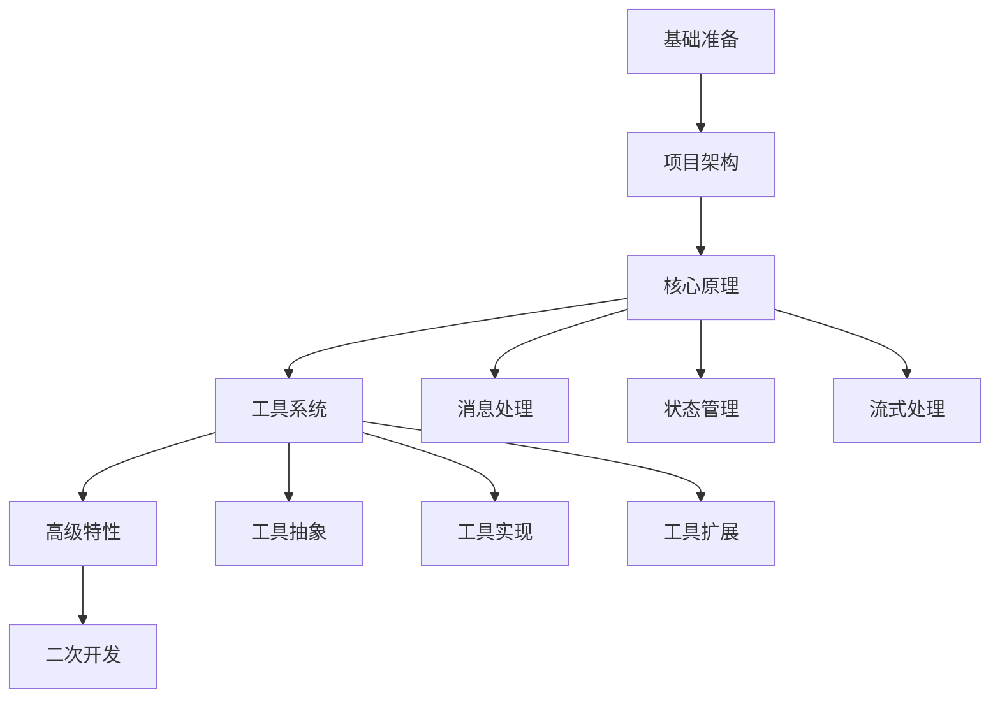
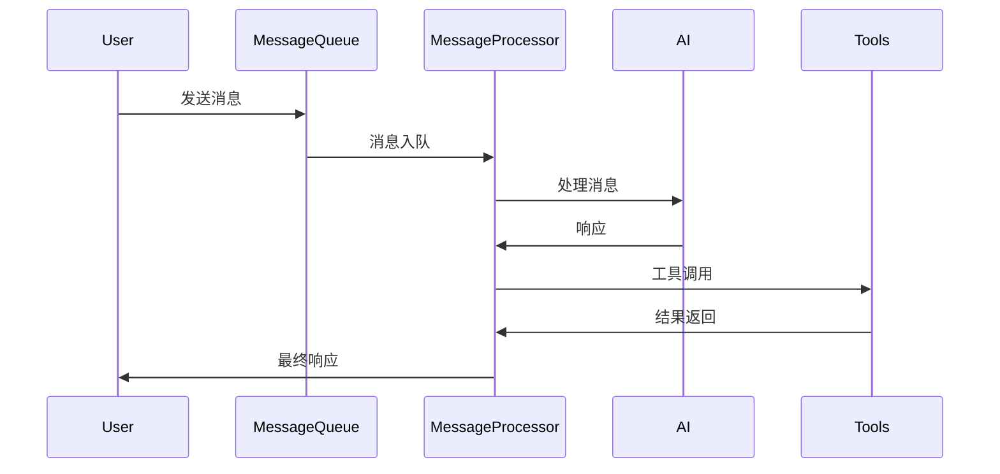
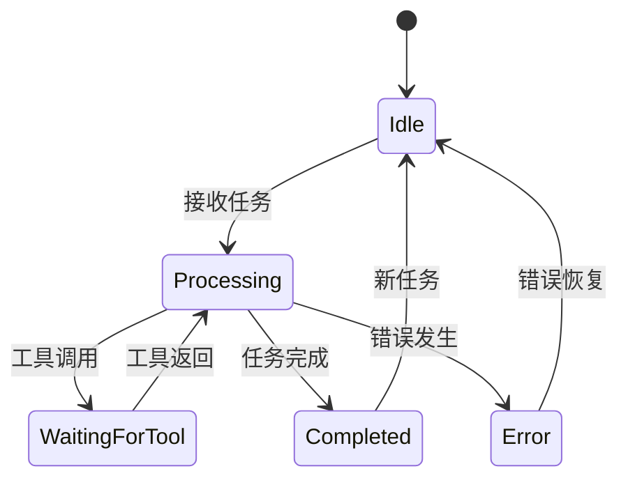

# Cline 项目学习指南 - 深入版

## 1. 学习路线图



## 2. 基础准备

### 2.1 技术栈深入
- TypeScript 高级特性
  - 类型系统
  - 装饰器
  - 泛型约束
  - 异步编程
- VSCode 扩展开发
  - Extension API
  - WebView API
  - Debug Protocol
- AI API 深入理解
  - Claude API 特性
  - 流式响应处理
  - 上下文管理
  - Token 计算

### 2.2 环境搭建详解
1. 开发环境配置
   ```bash
   # 环境要求
   Node.js >= 14.0.0
   npm >= 6.0.0
   VSCode >= 1.60.0
   
   # 项目初始化
   git clone <repository>
   cd <project>
   npm install
   ```

2. 调试环境配置
   ```json
   // launch.json 配置示例
   {
     "version": "0.2.0",
     "configurations": [
       {
         "type": "extensionHost",
         "request": "launch",
         "name": "Launch Extension",
         "runtimeExecutable": "${execPath}",
         "args": ["--extensionDevelopmentPath=${workspaceFolder}"],
         "outFiles": ["${workspaceFolder}/out/**/*.js"]
       }
     ]
   }
   ```

## 3. 核心原理解析

### 3.1 消息处理系统


#### 关键实现
```typescript
// 消息处理核心代码示例
class MessageProcessor {
  async processMessage(message: Message) {
    // 1. 消息预处理
    const processedMsg = await this.preprocess(message);
    
    // 2. AI 处理
    const aiResponse = await this.handleAIProcessing(processedMsg);
    
    // 3. 工具调用处理
    if (aiResponse.requiresTool) {
      const toolResult = await this.handleToolExecution(aiResponse);
      return this.postprocess(toolResult);
    }
    
    return aiResponse;
  }
}
```

### 3.2 状态管理系统

#### 核心状态流转


#### 状态管理实现
```typescript
interface TaskState {
  status: 'idle' | 'processing' | 'waiting' | 'completed' | 'error';
  context: TaskContext;
  history: MessageHistory;
}

class StateManager {
  private state: TaskState;
  
  async transition(action: Action): Promise<void> {
    // 状态转换逻辑
    const newState = this.computeNewState(action);
    await this.validateTransition(this.state, newState);
    await this.performTransition(newState);
  }
}
```

## 4. 工具系统架构

### 4.1 工具抽象层
```typescript
// 工具接口定义
interface Tool {
  name: string;
  description: string;
  parameters: ToolParameter[];
  execute(params: any): Promise<ToolResult>;
  validate(params: any): boolean;
}

// 工具参数定义
interface ToolParameter {
  name: string;
  type: 'string' | 'number' | 'boolean' | 'object';
  required: boolean;
  description: string;
}
```

### 4.2 工具实现示例
```typescript
// 文件操作工具示例
class FileOperationTool implements Tool {
  name = 'file_operation';
  description = '文件操作工具';
  
  async execute(params: FileOperationParams): Promise<ToolResult> {
    // 实现文件操作逻辑
    const { operation, path, content } = params;
    
    switch (operation) {
      case 'read':
        return await this.readFile(path);
      case 'write':
        return await this.writeFile(path, content);
      // ...其他操作
    }
  }
}
```

## 5. 二次开发指南

### 5.1 扩展点
1. 工具扩展
   ```typescript
   // 自定义工具示例
   class CustomTool implements Tool {
     name = 'custom_tool';
     
     async execute(params: any): Promise<ToolResult> {
       // 实现自定义逻辑
     }
     
     validate(params: any): boolean {
       // 参数验证逻辑
     }
   }
   ```

2. AI 模型扩展
   ```typescript
   // 自定义 AI 处理器
   class CustomAIHandler implements AIHandler {
     async process(input: string): Promise<AIResponse> {
       // 实现自定义 AI 处理逻辑
     }
     
     async streamResponse(input: string): AsyncIterator<AIChunk> {
       // 实现流式响应
     }
   }
   ```

### 5.2 性能优化
1. 消息缓存优化
   ```typescript
   class MessageCache {
     private cache: Map<string, CacheItem>;
     
     async get(key: string): Promise<CacheItem | null> {
       // 实现缓存获取逻辑
     }
     
     async set(key: string, value: CacheItem): Promise<void> {
       // 实现缓存设置逻辑
     }
   }
   ```

2. 内存管理优化
   ```typescript
   class ResourceManager {
     private resources: WeakMap<object, Resource>;
     
     async cleanup(): Promise<void> {
       // 实现资源清理逻辑
     }
     
     async monitor(): Promise<void> {
       // 实现资源监控逻辑
     }
   }
   ```

### 5.3 调试技巧
1. 日志系统
   ```typescript
   class Logger {
     static debug(message: string, context?: any) {
       // 实现调试日志
     }
     
     static error(error: Error, context?: any) {
       // 实现错误日志
     }
   }
   ```

2. 性能分析
   ```typescript
   class PerformanceMonitor {
     static startTrace(name: string) {
       // 开始性能追踪
     }
     
     static endTrace(name: string) {
       // 结束性能追踪并记录数据
     }
   }
   ```

## 6. 实战示例

### 6.1 代码分析工具开发
```typescript
// 代码分析工具示例
class CodeAnalysisTool implements Tool {
  name = 'code_analysis';
  
  async execute(params: CodeAnalysisParams): Promise<AnalysisResult> {
    const { path, type } = params;
    
    switch (type) {
      case 'dependency':
        return await this.analyzeDependencies(path);
      case 'complexity':
        return await this.analyzeComplexity(path);
      // ...其他分析类型
    }
  }
}
```

### 6.2 自动化测试工具
```typescript
// 自动化测试工具示例
class AutoTestTool implements Tool {
  name = 'auto_test';
  
  async execute(params: TestParams): Promise<TestResult> {
    // 实现自动化测试逻辑
    const { testPath, testType } = params;
    
    const runner = new TestRunner(testType);
    return await runner.execute(testPath);
  }
}
```

## 7. 最佳实践

### 7.1 代码组织
```
src/
  ├── core/           # 核心功能
  ├── tools/          # 工具实现
  ├── handlers/       # 处理器
  ├── utils/          # 工具函数
  └── types/          # 类型定义
```

### 7.2 错误处理
```typescript
// 统一错误处理
class ErrorHandler {
  static handle(error: Error): void {
    // 错误分类处理
    if (error instanceof ToolError) {
      // 处理工具错误
    } else if (error instanceof AIError) {
      // 处理 AI 错误
    } else {
      // 处理其他错误
    }
  }
}
```

### 7.3 安全考虑
1. 输入验证
2. 权限控制
3. 资源限制
4. 数据加密

## 8. 参考资源

### 8.1 API 文档
- [Claude API 文档](https://docs.anthropic.com/claude/reference)
- [VSCode Extension API](https://code.visualstudio.com/api)

### 8.2 示例代码
- [工具实现示例](examples/tools/)
- [扩展开发示例](examples/extensions/) 