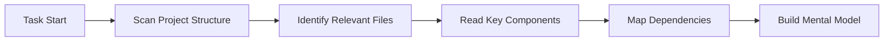

<Info>
**Quick Reference**

- **Context** = All information Cline knows about your project
- **Context Window** = Maximum information Cline can process at once (varies by model)
- **Token** = Unit of text measurement (~3/4 of an English word)
- **Auto-management** = Cline automatically handles context through Focus Chain & Auto Compact
</Info>

## What is Context Management?

Context management is how Cline maintains understanding of your project throughout a conversation. Think of it as the shared memory between you and Cline - containing code, decisions, requirements, and progress.

<Frame caption="Context is like a shared workspace where Cline builds understanding of your project">
	
</Frame>

### The Three Layers of Context

1. **Immediate Context** - Current conversation and active files
2. **Project Context** - Your codebase, structure, and patterns
3. **Persistent Context** - Memory Bank, .clinerules, and documentation

## Understanding Context Windows

Every AI model has a **context window** - the maximum amount of information it can process in a single conversation. This is measured in tokens:

### Token Limits by Model

| Model | Context Window | Effective Limit* | Best For |
|-------|---------------|-----------------|----------|
| **Claude 3.5 Sonnet** | 200,000 tokens | 150,000 tokens | Complex tasks, large codebases |
| **Claude 3.5 Haiku** | 200,000 tokens | 150,000 tokens | Faster responses, simpler tasks |
| **GPT-4o** | 128,000 tokens | 100,000 tokens | General purpose development |
| **Gemini 2.0 Flash** | 1,000,000+ tokens | 400,000 tokens | Very large contexts |
| **DeepSeek v3** | 64,000 tokens | 50,000 tokens | Cost-effective coding |
| **Qwen 2.5 Coder** | 128,000 tokens | 100,000 tokens | Specialized coding tasks |

*Effective limit is ~75-80% of maximum for optimal performance

<Tip>
**Token Math Made Simple**
- 1 token ≈ 3/4 of an English word
- 100 tokens ≈ 75 words ≈ 3-5 lines of code
- 10,000 tokens ≈ 7,500 words ≈ ~15 pages of text
- A typical source file: 500-2,000 tokens
</Tip>

## How Cline Builds Context

Building effective context is what makes Cline truly useful. When you start a task, Cline doesn't just passively wait for information - he actively gathers context about your project, asks clarifying questions when needed, and adapts to what's happening in real-time. This combination of automatic discovery, user guidance, and dynamic adaptation ensures Cline always has the right information to solve your problems effectively.

### 1. Automatic Context Gathering

When you start a task, Cline proactively:

**What Cline automatically discovers:**
- Project structure and file organization
- Import relationships and dependencies
- Code patterns and conventions
- Configuration files and settings
- Recent changes and git history (when using @git)

### 2. User-Guided Context

While automatic discovery handles much of the work, you control what Cline focuses on. The more specific and relevant context you provide, the better Cline can understand your needs and deliver accurate solutions.

You enhance context by:
- **@ Mentioning** files, folders, or URLs
- **Providing requirements** in natural language
- **Sharing screenshots** for UI context
- **Adding documentation** through .clinerules or Memory Bank
- **Answering questions** when Cline needs clarification

### 3. Dynamic Context Adaptation

Cline adapts context dynamically throughout your conversation. It considers the complexity of your request, available context window space, current task progress, error messages and feedback, plus previous decisions made during the conversation to determine what information matters most at each step.

## The Context Window Progress Bar

Monitor your context usage in real-time:

<Frame caption="The context window bar shows input/output token usage">
	
</Frame>

### Understanding the Indicators

- ⬆️ **Input Tokens**: Information sent to the model (your messages + context)
- ⬇️ **Output Tokens**: Model's responses and generated code
- ➡️ **Cache Tokens**: Previously processed tokens that's reused (reduces costs and improves speed)
- **Progress Bar**: Visual representation of usage
- **Percentage**: Current usage of total capacity

## Automatic Context Management Features

Cline includes intelligent systems that handle context for you:

### Focus Chain (Default: ON)

Focus Chain maintains task continuity through automatic todo lists. When you start a task, Cline generates actionable steps and updates them as work progresses. This keeps critical context visible even after Auto Compact runs, letting you track progress without scrolling through the entire conversation.

[Learn more →](/features/focus-chain)

### Auto Compact (Always ON)

When context usage hits around 80%, Auto Compact automatically creates a comprehensive summary of the conversation. This preserves all decisions and code changes while freeing up space for continued work. You'll see a message when this happens. The task continues seamlessly - you don't need to do anything.

[Learn more →](/features/auto-compact)

### Context Truncation System

If your conversation approaches the model's context window limit before Auto Compact runs, Cline's Context Manager automatically truncates older parts of the conversation to prevent errors.

The system prioritizes what matters most:
- Your original task description stays
- Recent tool executions and their results remain intact
- Current code state and active errors are preserved
- The logical flow of user-assistant messages is maintained

What gets removed first:
- Redundant conversation history from earlier in the task
- Completed tool outputs that are no longer relevant
- Intermediate debugging steps
- Verbose explanations that served their purpose

This happens automatically. You'll keep working without interruption, and Cline maintains enough context to continue solving your problem effectively.

## Best Practices

- **Be specific** - Clear objectives help Cline understand your needs
- **Use @ mentions strategically** - Reference specific files rather than entire folders
- **Monitor the progress bar** - Yellow/red means consider using `/smol` or `/newtask`
- **Trust auto-management** - Focus Chain and Auto Compact handle complexity automatically
- **Use Memory Bank** - Document persistent patterns and conventions

## Next Steps

<CardGroup cols={2}>
	<Card title="Focus Chain" icon="link" href="/features/focus-chain">
		Learn how Focus Chain maintains task continuity
	</Card>
	<Card title="Auto Compact" icon="compress" href="/features/auto-compact">
		Understand automatic conversation compression
	</Card>
	<Card title="Memory Bank" icon="brain" href="/prompting/cline-memory-bank">
		Set up persistent project knowledge
	</Card>
	<Card title="Cline Rules" icon="gavel" href="/features/cline-rules">
		Define project-specific conventions
	</Card>
</CardGroup>
