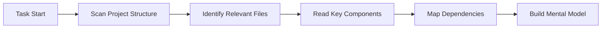
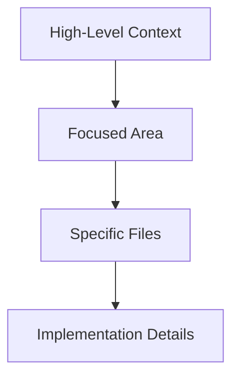

> **Quick Reference**
>
> - **Context** = All information Cline knows about your project
> - **Context Window** = Maximum information Cline can process at once (varies by model)
> - **Token** = Unit of text measurement (~3/4 of an English word)
> - **Auto-management** = Cline automatically handles context through Focus Chain & Auto Compact

## What is Context Management?

Context management is how Cline maintains understanding of your project throughout a conversation. Think of it as the shared memory between you and Cline - containing code, decisions, requirements, and progress.

<Frame caption="Context is like a shared workspace where Cline builds understanding of your project">
	
</Frame>

### The Three Layers of Context

1. **Immediate Context** - Current conversation and active files
2. **Project Context** - Your codebase, structure, and patterns
3. **Persistent Context** - Memory Bank, .clinerules, and documentation

## Understanding Context Windows

Every AI model has a **context window** - the maximum amount of information it can process in a single conversation. This is measured in tokens:

### Token Limits by Model

| Model | Context Window | Effective Limit* | Best For |
|-------|---------------|-----------------|----------|
| **Claude 3.5 Sonnet** | 200,000 tokens | 150,000 tokens | Complex tasks, large codebases |
| **Claude 3.5 Haiku** | 200,000 tokens | 150,000 tokens | Faster responses, simpler tasks |
| **GPT-4o** | 128,000 tokens | 100,000 tokens | General purpose development |
| **Gemini 2.0 Flash** | 1,000,000+ tokens | 400,000 tokens | Very large contexts |
| **DeepSeek v3** | 64,000 tokens | 50,000 tokens | Cost-effective coding |
| **Qwen 2.5 Coder** | 128,000 tokens | 100,000 tokens | Specialized coding tasks |

*Effective limit is ~75-80% of maximum for optimal performance

<Tip>
**Token Math Made Simple**
- 1 token ≈ 3/4 of an English word
- 100 tokens ≈ 75 words ≈ 3-5 lines of code
- 10,000 tokens ≈ 7,500 words ≈ ~15 pages of text
- A typical source file: 500-2,000 tokens
</Tip>

## How Cline Builds Context

Cline actively constructs context through multiple strategies:

### 1. Automatic Context Gathering

When you start a task, Cline proactively:



**What Cline automatically discovers:**
- Project structure and file organization
- Import relationships and dependencies
- Code patterns and conventions
- Configuration files and settings
- Recent changes and git history (when using @git)

### 2. User-Guided Context

You enhance context by:
- **@ Mentioning** files, folders, or URLs
- **Providing requirements** in natural language
- **Sharing screenshots** for UI context
- **Adding documentation** through .clinerules or Memory Bank
- **Answering questions** when Cline needs clarification

### 3. Dynamic Context Adaptation

Cline adapts context based on:
- The complexity of your request
- Available context window space
- Task progress and state
- Error messages and feedback
- Previous decisions in the conversation

## The Context Window Progress Bar

Monitor your context usage in real-time:

<Frame caption="The context window bar shows input/output token usage">
	
</Frame>

### Understanding the Indicators

- **↑ Input Tokens**: Information sent to the model (your messages + context)
- **↓ Output Tokens**: Model's responses and generated code
- **Progress Bar**: Visual representation of usage
- **Percentage**: Current usage of total capacity
- **Color Coding**:
  - 🟢 Green (0-50%): Plenty of room
  - 🟡 Yellow (50-75%): Monitor usage
  - 🔴 Red (75-100%): Consider compacting

## Automatic Context Management Features

Cline includes intelligent systems that handle context for you:

### Focus Chain (Default: ON)
Maintains task continuity through automatic todo lists:
- Generates actionable steps at task start
- Keeps progress visible throughout
- Updates automatically as work completes
- Preserves critical context across compaction

[Learn more →](/features/focus-chain)

### Auto Compact (Always ON)
Prevents context overflow intelligently:
- Monitors token usage continuously
- Creates comprehensive summaries at ~80% capacity
- Preserves all decisions and code changes
- Maintains task continuity seamlessly

[Learn more →](/features/auto-compact)

### Context Truncation System

When approaching limits, Cline's Context Manager:

1. **Preserves Critical Information**
   - Original task description
   - Recent tool executions
   - Current code state
   - Active errors or issues

2. **Intelligently Removes**
   - Redundant conversation history
   - Completed tool outputs
   - Intermediate states
   - Verbose explanations

3. **Maintains Structure**
   - User-assistant message pairing
   - Logical conversation flow
   - Decision history
   - Implementation progress

## Advanced Context Tools

### For Planning: `/deep-planning`

Best for substantial features or complex refactoring:

```markdown
/deep-planning Build a real-time notification system

Cline will:
1. Investigate your codebase architecture
2. Ask clarifying questions
3. Create implementation_plan.md
4. Start fresh task with optimized context
```

### For Transitions: `/newtask`

Create clean handoffs between work phases:

```markdown
/newtask

Cline will:
1. Summarize completed work
2. Package essential context
3. Create fresh task with clean slate
4. Maintain continuity of understanding
```

### For Compression: `/smol`

Compress conversation while maintaining momentum:

```markdown
/smol

Cline will:
1. Analyze current conversation
2. Extract key decisions and state
3. Compress in place
4. Continue without interruption
```

## Context Management Strategies

### Strategy 1: Memory Bank Pattern

For long-term projects, maintain evolving documentation:

```markdown
# techContext.md
## Architecture Overview
- Next.js 14 with App Router
- PostgreSQL with Prisma ORM
- Redis for caching
- AWS S3 for file storage

## Key Patterns
- Server components by default
- API routes in /app/api
- Shared components in /components
- Type definitions in /types
```

### Strategy 2: Task-Specific Context

For focused implementations:

```markdown
# payment-integration.md
## Requirements
- Stripe integration for subscriptions
- Support monthly and annual billing
- Webhook handling for events
- PCI compliance considerations

## Implementation Notes
- Use Stripe Elements for card input
- Store customer_id, not card details
- Implement idempotency for webhooks
```

### Strategy 3: Progressive Context Building

Start minimal, expand as needed:

```markdown
1. Initial: "Add user authentication"
2. Clarify: Share auth requirements doc
3. Expand: @ mention existing user model
4. Refine: Provide UI mockups
5. Execute: Let Cline implement with full context
```

## Best Practices

### DO's ✅

1. **Start with clear objectives**
   ```
   "Build a REST API for user management with JWT auth"
   vs
   "Add some API endpoints"
   ```

2. **Use @ mentions strategically**
   ```
   "@src/models for data structure reference"
   "@docs/api.md for endpoint specifications"
   ```

3. **Maintain .clinerules for consistency**
   ```markdown
   # .clinerules
   - Use TypeScript strict mode
   - Prefer functional components
   - Include JSDoc comments
   ```

4. **Update Memory Bank after major changes**
   ```
   After refactoring, update techContext.md
   with new patterns and decisions
   ```

### DON'Ts ❌

1. **Don't overload initial context**
   - Start focused, expand as needed
   - Let Cline ask for what it needs

2. **Don't ignore the progress bar**
   - Yellow = consider your next steps
   - Red = time for /smol or /newtask

3. **Don't repeat resolved information**
   - Once Cline understands, move forward
   - Use Memory Bank for persistent rules

4. **Don't fight the auto-management**
   - Trust Focus Chain and Auto Compact
   - They're designed for long sessions

## Context Window Optimization

### Signs You Need Optimization

- ⚠️ Cline forgets earlier decisions
- ⚠️ Responses become less accurate
- ⚠️ Context bar showing >75% usage
- ⚠️ Repetitive questions about resolved topics

### Optimization Techniques

1. **Preemptive Compression**
   ```
   Before starting new feature:
   /smol or /newtask
   ```

2. **Selective Context Loading**
   ```
   Instead of: @ entire src folder
   Better: @ specific relevant files
   ```

3. **Progressive Disclosure**
   ```
   Start: "Implement search"
   Then: "Using Elasticsearch"
   Then: @ existing search interfaces
   ```

4. **Context Recycling**
   ```
   Save successful patterns to Memory Bank
   Reuse in future tasks
   ```

## Working with Large Codebases

### The Challenge
Large projects can exceed context windows just with file listings.

### The Solution: Layered Approach



1. **Start with architecture overview** (Memory Bank)
2. **Focus on specific module** (@ mention folder)
3. **Load relevant files** (@ mention files)
4. **Implement with full context** (let Cline explore)

### Example: Large React Application

```markdown
# Initial context (Memory Bank)
Project: E-commerce platform
Stack: Next.js, PostgreSQL, Stripe
Structure: /app (routes), /components, /lib

# Task-specific focus
Task: Add product reviews
Focus: @ src/features/products
Context: @ src/models/Review.ts
Reference: @ src/components/Rating
```

## Troubleshooting Context Issues

### Problem: "Cline seems confused"
**Solution**: Check context bar, use /smol if >75%

### Problem: "Cline forgot earlier work"
**Solution**: Auto Compact may have triggered, re-mention key decisions

### Problem: "Context fills too quickly"
**Solution**: Be more selective with @ mentions, use folders sparingly

### Problem: "Lost track of progress"
**Solution**: Ensure Focus Chain is enabled, check todo list

### Problem: "Starting fresh loses everything"
**Solution**: Use /newtask instead of new chat, preserves continuity

## Advanced Tips

### 1. Context Priming
Start conversations with essential context:
```
"Continue working on the auth system.
Context: Using NextAuth with Prisma adapter.
Current: Implementing password reset flow."
```

### 2. Context Anchoring
Reference fixed points throughout:
```
"As discussed, we're using the Repository pattern"
"Following the style guide in .clinerules"
"Maintaining compatibility with v2 API"
```

### 3. Context Bridging
Connect related work:
```
"This connects to the user system we built earlier"
"Use the same pattern as the payment module"
"Follow the testing approach from @src/tests"
```

## The Context Management Mindset

Think of context like a **focused workspace**:
- 🎯 Keep only what's relevant visible
- 📚 Store references in Memory Bank
- 🔄 Refresh when switching tasks
- 📊 Monitor usage proactively
- 🤖 Let automation handle the complexity

<Note>
**Remember**: Effective context management isn't about maximizing information - it's about maintaining the **right** information at the **right** time.
</Note>

## Quick Reference Card

| Situation | Action | Command/Feature |
|-----------|--------|----------------|
| Starting complex feature | Deep planning | `/deep-planning` |
| Context >75% full | Compress | `/smol` |
| Switching major tasks | New task | `/newtask` |
| Maintaining project knowledge | Document | Memory Bank |
| Enforcing conventions | Add rules | `.clinerules` |
| Quick context addition | Mention | `@file` or `@folder` |
| Long coding session | Auto-manage | Focus Chain + Auto Compact |

## Next Steps

<CardGroup cols={2}>
	<Card title="Focus Chain" icon="link" href="/features/focus-chain">
		Learn how Focus Chain maintains task continuity
	</Card>
	<Card title="Auto Compact" icon="compress" href="/features/auto-compact">
		Understand automatic conversation compression
	</Card>
	<Card title="Memory Bank" icon="brain" href="/prompting/cline-memory-bank">
		Set up persistent project knowledge
	</Card>
	<Card title="Cline Rules" icon="gavel" href="/features/cline-rules">
		Define project-specific conventions
	</Card>
</CardGroup>

---

*Context management is an evolving feature. This guide reflects best practices as of Cline v3.28+*
