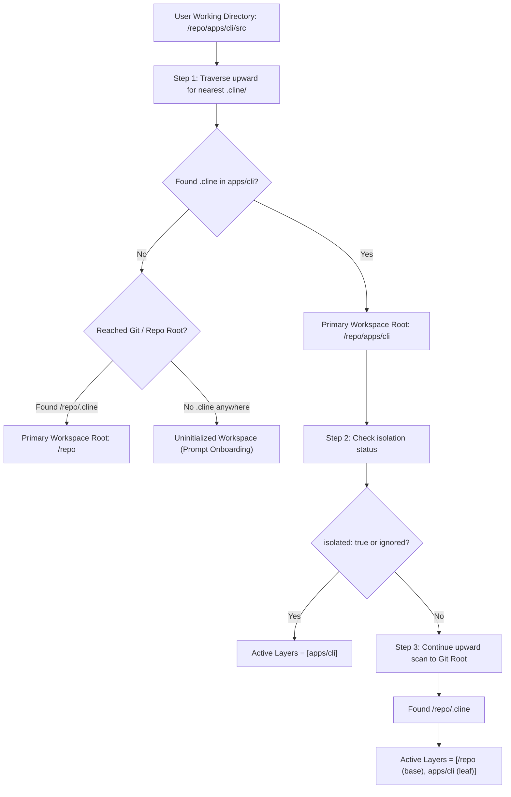

# RFC 0001: Resolution & Layering Specification

- **Module:** Resolution & Layering
- **Target Package:** `@cline/shared`, `@cline/core`

---

## 1. Resolution Model: Nearest Root First

The resolution engine treats the **nearest** `.cline` directory discovered when traversing upward from the working directory as the **Primary Workspace Anchor**.



### 1.1. Why Nearest Root First?
1. **Local Intent**: A developer working in `apps/cli` with a localized `.cline/` intends for CLI-specific commands, tools, and configurations to govern their immediate session.
2. **Deterministic Context**: The nearest root establishes the primary boundary for session storage, checkpoint tracking, and file search scopes.
3. **Composable Architecture**: Shared organization standards (from the monorepo root) should enhance and support local work without overriding specific local adjustments.

---

## 2. Ancestor Layering & Composition

When the primary workspace root is not isolated, the resolver continues scanning upward to collect all parent `.cline/` directories up to the repository boundary (Git root or filesystem root).

### Layer Ordering
The resolved workspace maintains an ordered hierarchy stack:
```typescript
[
  "/path/to/monorepo",          // Layer 0: Root ancestor (lowest priority among repo layers)
  "/path/to/monorepo/apps",     // Layer 1: Intermediate group layer (if present)
  "/path/to/monorepo/apps/cli"  // Layer 2: Primary active root (highest priority)
]
```

Global user configuration (`~/.cline/`) always sits at the absolute foundation beneath Layer 0.

---

## 3. Boundary & Stopping Conditions

Upward directory traversal halts immediately upon encountering any of the following boundaries:
1. **Git Root / Worktree Root**: Traversal does not ascend beyond the containing `.git` repository boundary unless explicitly permitted by configuration.
2. **Isolation Boundary**:
   - A workspace configuration file with `"isolated": true`.
   - The presence of a `.cline-boundary` marker file in the workspace directory.
3. **User Home Directory (`~`)**: Prevents unintentional inheritance of developer-level configs from parent directories.
4. **Filesystem Root (`/` or `C:\`)**.

---

## 4. Workspace Configuration Schema (`.cline/workspace.json`)

To enable monorepo awareness, sub-cline declaration, and ignore rules, workspaces support an optional `.cline/workspace.json`:

```typescript
import { z } from "zod";

export const WorkspaceConfigSchema = z.object({
  /**
   * Human-readable label for display in UI, CLI prompt, and status bar.
   * Default: folder basename.
   */
  name: z.string().optional(),

  /**
   * Explicit sub-cline inclusion patterns (relative globs).
   * Declares recognized child workspaces belonging to this parent.
   * Example: ["packages/*", "apps/*", "services/core-*"]
   */
  includes: z.array(z.string()).default([]),

  /**
   * Directory patterns excluded from workspace resolution or layering.
   * Example: ["apps/legacy-monolith/**", "temp-experiment"]
   */
  ignores: z.array(z.string()).default([]),

  /**
   * When true, this workspace will not inherit rules, skills, or settings
   * from any parent .cline layers.
   */
  isolated: z.boolean().default(false),

  /**
   * Whether to inherit MCP server definitions from parent layers.
   * Default: true.
   */
  inheritMcpServers: z.boolean().default(true),

  /**
   * Optional custom workspace metadata or environment variables.
   */
  metadata: z.record(z.unknown()).optional(),
});

export type WorkspaceConfig = z.infer<typeof WorkspaceConfigSchema>;
```

### 4.1. `.clineignore` Support
Similar to `.gitignore`, a `.clineignore` file can be placed at any workspace root. Any subdirectory matching patterns in `.clineignore` is skipped during sub-cline scans and will not be layered as a child workspace.

---

## 5. TypeScript API

```typescript
export interface WorkspaceLayer {
  path: string;
  config: WorkspaceConfig;
  hasRules: boolean;
  hasSkills: boolean;
  hasAgents: boolean;
  hasWorkflows: boolean;
  isGitRoot: boolean;
}

export interface ResolvedHierarchicalWorkspace {
  /** The nearest active workspace directory (Primary Anchor) */
  primaryRoot: string;
  /** The original target directory where the session started */
  targetPath: string;
  /** Ordered list of active layers from root-most ancestor to primaryRoot */
  layers: WorkspaceLayer[];
  /** Whether an active workspace was discovered */
  isInitialized: boolean;
  /** Sub-clines discovered via `includes` patterns */
  discoveredSubClines: string[];
}

/**
 * Core entry point for hierarchical workspace resolution.
 */
export async function resolveHierarchicalWorkspace(
  startPath: string,
  options?: {
    stopAtGitRoot?: boolean;
    fs?: typeof import("node:fs/promises");
  }
): Promise<ResolvedHierarchicalWorkspace>;
```
