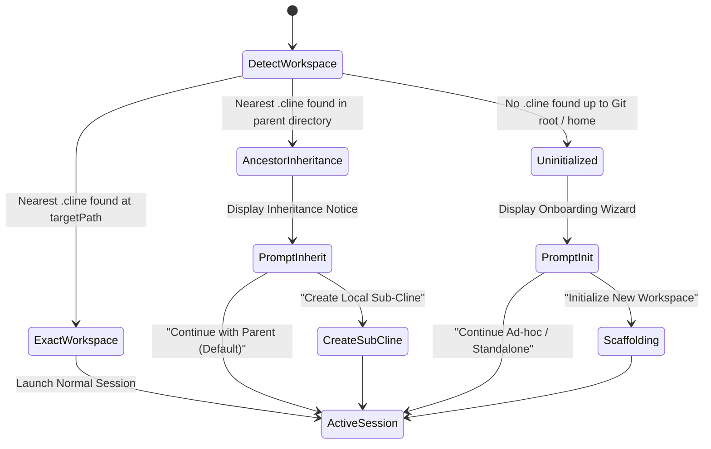

# RFC 0001: Onboarding & User Experience Specification

- **Module:** Onboarding & Host UX
- **Target Surfaces:** `@cline/cli`, `@cline/vscode`, `@cline/code` (Desktop)

---

## 1. Onboarding Scenarios & Interaction Flows

The user experience adapts dynamically depending on whether an existing workspace is detected up the directory tree.



---

## 2. CLI Experience (Terminal & TUI)

### 2.1. Scenario 1: Parent Workspace Inheritance
When starting `cline` in `my-monorepo/apps/cli` when `my-monorepo/.cline` exists:

```text
╭─ Cline Workspace ──────────────────────────────────────────────────────────╮
│ ℹ Inherited parent workspace: ~/Dev/my-monorepo                            │
│   Active layers: [my-monorepo]                                             │
│                                                                            │
│   [Enter] Continue with parent workspace                                   │
│   [c] Create local sub-cline (.cline/) in apps/cli                         │
╰────────────────────────────────────────────────────────────────────────────╯
```
Pressing `Enter` proceeds immediately with parent rules and skills loaded. Pressing `c` initializes `apps/cli/.cline/workspace.json` and local rule scaffolding.

### 2.2. Scenario 2: Unconfigured Project (First Run)
When running `cline` in a directory with no `.cline` in its ancestors:

```text
╭─ Welcome to Cline ─────────────────────────────────────────────────────────╮
│ No Cline workspace detected in this project.                               │
│                                                                            │
│ ? How would you like to configure this project?                            │
│   ❯ 1. Initialize Cline workspace (.cline/) [Recommended]                  │
│     2. Run in temporary scratch session (no config saved to disk)          │
╰────────────────────────────────────────────────────────────────────────────╯
```
Selecting option 1 creates:
```text
.cline/
├── workspace.json
├── rules/
│   └── project-rules.md
└── skills/
```

### 2.3. History Scoping in CLI TUI
In the TUI session manager (`/history` or checkpoint restore):
- Header displays: `Showing history for: my-monorepo/apps/cli`
- Shortcut `Tab` toggles between:
  - `Current Sub-Workspace (6 sessions)`
  - `Entire Monorepo (28 sessions)`
  - `All Global Projects (114 sessions)`

---

## 3. VS Code Extension Experience

### 3.1. Status Bar Item
A persistent status bar item displays the resolved workspace anchor:
- **Direct Workspace**: `$(folder) Cline: apps/cli`
- **Inherited Workspace**: `$(repo) Cline: apps/cli (inherited from my-monorepo)`
- Clicking the status bar item opens a quick-pick menu:
  - `View Workspace Hierarchy`
  - `Create Local Sub-Cline Override`
  - `Open .cline/workspace.json`

### 3.2. Webview Onboarding Card
In the chat webview panel for an uninitialized workspace, a non-intrusive card appears above the prompt:

> **✨ Initialize Cline in this repository**  
> Create a `.cline/` directory to share instructions, custom skills, and team settings with your collaborators.  
> `[ Initialize Project ]` `[ Dismiss ]`

### 3.3. Webview History Tab
The History tab includes a scope selector at the top:
```text
[ Current Project ▾ ] Search sessions...
  ├── Current Project (apps/cli)
  ├── Include Parent (my-monorepo)
  └── All Recent Projects
```

---

## 4. Telemetry & Analytics

To evaluate adoption and stability, the following privacy-preserving metrics will be recorded:
- `workspace_resolved`: VCS type (`git` | `none`), hierarchy depth (1–5), whether inheritance occurred.
- `workspace_initialized`: User chose to initialize a new root workspace.
- `sub_cline_created`: User chose to create a local sub-cline override under a parent workspace.
- `workspace_isolation_enabled`: Percentage of sub-workspaces configured with `"isolated": true`.
