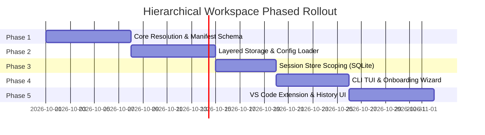

# RFC 0001: Phased Implementation Roadmap & Verification

- **Module:** Implementation Roadmap & Verification
- **Target Surfaces:** Entire Monorepo

---

## 1. Phased Execution Roadmap

The implementation is broken down into 5 decoupled phases following our architectural rules: minimizing change amplification, reader-centric design, and deep interfaces.

### Phase 1: Core Hierarchy Resolution (`@cline/shared`)
- **Deliverables**:
  - Implement `WorkspaceConfigSchema` (`name`, `includes`, `ignores`, `isolated`, `inheritMcpServers`).
  - Implement `findWorkspaceHierarchy(startPath: string)` and `resolveHierarchicalWorkspace(startPath: string)` in `@cline/shared/storage`.
  - Upward directory traversal with boundary stops (Git root, user home, `.cline-boundary`).
  - Glob matching for `includes` and `ignores`.
- **Testing**:
  - Unit tests covering deeply nested mock directories (`/repo/packages/sub/deep`).
  - Edge cases: Symlinks, directory loops, unreadable parent directories, Windows drive roots.

### Phase 2: Layered Storage Paths & Dynamic Watching (`@cline/shared` & `@cline/core`)
- **Deliverables**:
  - Adapt `resolveRulesConfigSearchPaths`, `resolveSkillsConfigSearchPaths`, `resolveAgentConfigSearchPaths`, and `resolveWorkflowsConfigSearchPaths` in `@cline/shared/storage/paths.ts` to consume resolved layers.
  - Implement rule deduplication and override logic (same filename overrides ancestor).
  - Update `UserInstructionConfigLoader` and `UnifiedConfigFileWatcher` to monitor all active workspace layer directories simultaneously.
- **Testing**:
  - Verification that adding or editing a rule in the parent workspace hot-reloads in an active child session.
  - Verification that child rules with the same name override parent rules.

### Phase 3: SQLite Session History Partitioning (`@cline/core`)
- **Deliverables**:
  - Add `anchor_workspace_path` column and index to SQLite `sessions.db`.
  - Extend `SqliteSessionStore.create()` and `update()` to stamp `anchor_workspace_path`.
  - Extend `listHistory()` with `anchorPath` and `scope` options (`current` | `hierarchical` | `all`).
  - Backfill migration for historical sessions.
- **Testing**:
  - In-memory SQLite tests validating session filtering across multi-package directories.
  - Migration tests verifying zero data loss on pre-existing `sessions.db`.

### Phase 4: CLI Surface Integration (`@cline/cli`)
- **Deliverables**:
  - Hook hierarchical resolution into CLI boot (`runInteractive` / `runAgent`).
  - Implement TUI onboarding prompt for unconfigured directories.
  - Implement parent workspace inheritance banner and local sub-cline creation hotkey (`c`).
  - Add workspace scope toggle in TUI `/history`.
- **Testing**:
  - Interactive Tuistory e2e tests simulating new folder onboarding.
  - CLI execution from subfolder verifying parent rules appear in `/rules` or system prompt.

### Phase 5: VS Code Extension Integration (`@cline/vscode`)
- **Deliverables**:
  - Update `SdkController` and `WorkspaceRootManager` to initialize via `resolveHierarchicalWorkspace`.
  - Add Status Bar indicator showing active workspace and inheritance state.
  - Implement Webview onboarding banner for uninitialized folders.
  - Add workspace scope dropdown to History tab (`Current Workspace` / `Include Parent` / `All`).
- **Testing**:
  - Unit tests in `apps/vscode/src/sdk`.
  - VS Code extension integration tests verifying multi-root monorepo behavior.

---

## 2. Verification & Testing Matrix

| Level | Component | Test Target | Command |
|---|---|---|---|
| **Unit** | `@cline/shared` | Hierarchy resolver, globs, boundary stops | `bun -F @cline/shared test` |
| **Unit** | `@cline/core` | Multi-layer rule merging & deduplication | `bun -F @cline/core test:unit` |
| **Unit** | `@cline/core` | SQLite session scoping & migration | `bun -F @cline/core test:unit` |
| **Unit** | `@cline/cli` | Onboarding dialogs & history filters | `bun -F @cline/cli test:unit` |
| **E2E** | `@cline/cli` | Tuistory TUI interactive launch | `bun -F @cline/cli test:e2e:tuistory` |
| **Integration**| `@cline/vscode`| Host workspace resolution & history loader | `bun -F @cline/vscode test:unit` |

---

## 3. Backward Compatibility & Rollout Safety

1. **Zero-Breakage Default**: In single-root repositories, the nearest `.cline` is found immediately at the project root; no ancestor layers exist, producing behavior 100% identical to current Cline.
2. **Opt-Out Isolation**: Any repository or sub-package can set `"isolated": true` in `.cline/workspace.json` or touch `.cline-boundary` to immediately disable hierarchical resolution.
3. **Database Fallback**: If a database error occurs during the `anchor_workspace_path` migration, the query cleanly falls back to legacy unpartitioned history.
