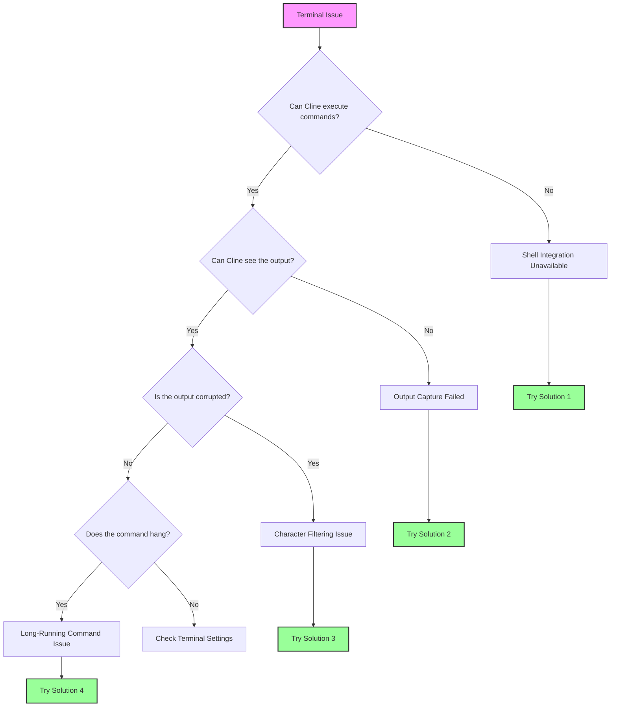

This guide helps you resolve terminal integration issues in Cline. Terminal integration is crucial for Cline to execute commands and read their output, enabling it to understand errors, test results, and command responses.

<Tip>
	If you're experiencing terminal issues, try switching to a simpler shell like `bash` in the Cline settings, under "Terminal Settings"

    This resolves most terminal integration problems.

</Tip>

## Quick Diagnosis Flowchart

Follow this flowchart to quickly identify your issue:



## Common Issues & Quick Solutions

### 1. Shell Integration Unavailable

**Symptoms:**

-   Message: "Shell Integration Unavailable"
-   Commands execute but Cline can't read output
-   Terminal works fine manually but not with Cline

**Quick Solutions:**

#### macOS

-   **Switch to bash**

    1. Go to Cline Settings
    2. Left-Click the **"Terminal Settings"** tab
    3. Navigate to **"Default Terminal Profile"** and select **"bash"** from the drop-down menu

-   **Disable Oh-My-Zsh temporarily**:

    1. If using zsh, enter `mv ~/.zshrc ~/.zshrc.backup` into the terminal
    2. Restart VSCode

-   **Set environment**:
    1.a For Zsh users, use one of the following Zsh commands to edit your shell profile:

          - `nano ~/.zshrc`
          - `vim ~/.zshrc`
          - `code ~/.zshrc`

    1.b For Bash users

          - nano ~/.bash_profile

    2. Add the following to your shell config: `export TERM=xterm-256color`
    3. Save your configuration

#### Windows

-   **Use PowerShell 7**

    1. Install from Microsoft Store
    2. Go to Cline Settings
    3. Left-Click the **"Terminal Settings"** tab
    4. Navigate to **"Default Terminal Profile"** and select **"PowerShell 7"** from the drop-down menu

-   **Disable Windows ConPTY**

    1. Navigate to your VSCode Settings
    2. Enter "Integrated: Windows Enable Conpty" into the Settings searchbar
    3. Uncheck the option

-   **Try Command Prompt**
    1. Go to Cline Settings
    2. Left-Click the **"Terminal Settings"** tab
    3. Navigate to **"Default Terminal Profile"** and select **"Command Prompt"** from the drop-down menu

#### Linux

-   **Use bash**

    1. Go to Cline Settings
    2. Left-Click the **"Terminal Settings"** tab
    3. Navigate to **"Default Terminal Profile"** and select **"bash"** from the drop-down menu

-   **Check permissions**

    1. Ensure VSCode has terminal access permissions

-   **Disable custom prompts**
    1. Comment out prompt customizations in `.bashrc`

### 2. Command Output Not Visible

**Symptoms:**

-   Cline states in chat: "[Command is running but producing no output]"
-   Commands complete but Cline doesn't see results
-   Commands work sometimes but not consistently

**Solutions:**

-   **Increase Shell Integration Timeout**

    1. Within Cline, left-click the **Settings** button in the top right-hand corner of the chat window
    2. Once in the **Settings** window, left-click the **"Terminal Settings"** tab from the left-hand column
    3. Navigate to "Shell integration timeout (seconds)" and enter **"10"** into the text field

-   **Disable Terminal Reuse**

    1. Within Cline, left-click the **Settings** button in the top right-hand corner of the chat window
    2. Once in the **Settings** window, left-click the **"Terminal Settings"** tab from the left-hand column
    3. Look for **"Enable aggressive terminal reuse"**, and **uncheck** this option

-   **Check for interfering extensions**
    1. Disable other terminal-related VSCode extensions

### 3. Character Filtering Issues

**Symptoms:**

-   Commas missing from output (JSON appears corrupted)
-   Special characters stripped from terminal output
-   Syntax errors that don't appear when running manually

**Solution:**
This is a known bug in output processing. Workarounds:

-   Recommend AI to use file output instead
    1. Tell Cline in chat or Cline rules, to use `command > output.txt` before reading the file/s

<Tip>
	This family of issues is only partially solved in the latest Cline versions, so if you still face this, create a GitHub issue
	if it is a persistent problem.
</Tip>

### 4. Long-Running Commands & Progress Bars

**Symptoms:**

-   Docker builds never complete in Cline
-   Progress bars consume thousands of tokens
-   The Cline button "Proceed while running" doesn't work properly in chat

<Tip>
	This family of issues has been solved in latest Cline versions but if you still face any issues, then create a GitHub issue
	for this.
</Tip>

## Terminal Settings Explained

Access these in Cline by clicking the settings icon, and navigating to the "Terminal Settings" section:

### Default Terminal Profile

-   **What it does**: Selects which shell Cline uses for commands
-   **When to change**: If experiencing shell integration issues with your default shell
-   **Recommended**: - macOS: bash (if zsh has issues) - Windows: PowerShell 7 - Linux: bash

### Shell Integration Timeout

-   **What it does**: How long Cline waits for the terminal to be ready
-   **Default**: 4 seconds
-   **When to increase**:
    -   Slow shell startup (heavy .zshrc/.bashrc)
    -   WSL environments
    -   SSH connections
-   **Recommended**: - Start with 10 seconds if having issues

### Enable Aggressive Terminal Reuse

-   **What it does**: Reuses existing terminals even if not in the correct directory
-   **When to disable**:
    -   Commands execute in wrong directory
    -   Virtual environment issues
    -   Terminal state corruption
-   **Trade-off**: - Disabling creates more terminals but ensures clean state

### Terminal Output Line Limit

-   **What it does**: Limits how many lines Cline reads from terminal output
-   **Default**: 500 lines
-   **When to adjust**:
    -   Increase for verbose build outputs
    -   Decrease if hitting token limits
    -   Set to 100 for commands with progress bars

## Platform-Specific Solutions

### macOS Issues

#### Oh-My-Zsh Conflicts

Oh-My-Zsh often interferes with shell integration. Solutions:

1. Create a minimal `.zshrc` for VSCode:
    ```bash
    # ~/.zshrc-vscode
    export TERM=xterm-256color
    export PAGER=cat
    # Minimal PATH and environment setup
    ```
2. Configure VSCode to use it:
    ```json
    {
    	"terminal.integrated.env.osx": {
    		"ZDOTDIR": "~/.zshrc-vscode"
    	}
    }
    ```

#### macOS 15+ Issues

Recent macOS versions have stricter terminal permissions:

1. System Preferences → Privacy & Security → Developer Tools
2. Add Visual Studio Code
3. Restart VSCode completely

### Windows Issues

If you're using Windows and still experiencing issues with shell integration after trying the previous steps, it's recommended you use Git Bash (or PowerShell).

### Git Bash

Git Bash is a terminal emulator that provides a Unix-like command line experience on Windows. To use Git Bash, you need to:

1. Download and run the Git for Windows installer from [https://git-scm.com/downloads/win](https://git-scm.com/downloads/win)
2. Quit and re-open VSCode
3. Press `Ctrl + Shift + P` to open the Command Palette
4. Type "Terminal: Select Default Profile" and choose it
5. Select "Git Bash"

### PowerShell

If you'd still like to use PowerShell, make sure you're using an updated version (at least v7+).
  - Check your current PowerShell version by running: `$PSVersionTable.PSVersion`
  - If your version is below 7, [update PowerShell](https://learn.microsoft.com/en-us/powershell/scripting/whats-new/migrating-from-windows-powershell-51-to-powershell-7?view=powershell-7.4#installing-powershell-7).

You may also need to adjust your PowerShell execution policy. By default, PowerShell restricts script execution for security reasons.

#### Understanding PowerShell Execution Policies

PowerShell uses execution policies to determine which scripts can run on your system. Here are the most common policies:

- `Restricted`: No PowerShell scripts can run. This is the default setting.
- `AllSigned`: All scripts, including local ones, must be signed by a trusted publisher.
- `RemoteSigned`: Scripts created locally can run, but scripts downloaded from the internet must be signed.
- `Unrestricted`: No restrictions. Any script can run, though you will be warned before running internet-downloaded scripts.

For development work in VSCode, the `RemoteSigned` policy is generally recommended. It allows locally created scripts to run without restrictions while maintaining security for downloaded scripts. To learn more about PowerShell execution policies and understand the security implications of changing them, visit Microsoft's documentation: [About Execution Policies](https://learn.microsoft.com/en-us/powershell/module/microsoft.powershell.core/about/about_execution_policies).

#### Steps to Change the Execution Policy

1. Open PowerShell as an Administrator: Press `Win + X` and select "Windows PowerShell (Administrator)" or "Windows Terminal (Administrator)".

2. Check Current Execution Policy by running this command:
     ```powershell
     Get-ExecutionPolicy
     ```
   - If the output is already `RemoteSigned`, `Unrestricted`, or `Bypass`, you likely don't need to change your execution policy. These policies should allow shell integration to work.
   - If the output is `Restricted` or `AllSigned`, you may need to change your policy to enable shell integration.

3. Change the Execution Policy by running the following command:
     ```powershell
     Set-ExecutionPolicy RemoteSigned -Scope CurrentUser
     ```
   - This sets the policy to `RemoteSigned` for the current user only, which is safer than changing it system-wide.

4. Confirm the Change by typing `Y` and pressing Enter when prompted.

5. Verify the Policy Change by running `Get-ExecutionPolicy` again to confirm the new setting.

6. Restart VSCode and try the shell integration again.


#### WSL Integration

For WSL issues:

1. Use WSL extension for VSCode
2. Open folder in WSL: `code .` from WSL terminal
3. Select "WSL Bash" as terminal profile in Cline

#### Path Issues

Windows path problems:

1. Use forward slashes in Cline: `C:/Users/...`
2. Quote paths with spaces: `"C:/Program Files/..."`
3. Avoid `~` - use full paths

### Linux/SSH/Container Issues

#### SSH Connections

For remote development:

1. Install Cline on the remote machine, not locally
2. Use SSH extension's integrated terminal
3. Increase timeout to 15+ seconds

#### Docker Containers

When developing in containers:

1. Install Cline in the container
2. Use Dev Containers extension
3. Ensure shell integration scripts are available

## Shell-Specific Fixes

### Zsh

```bash
# Add to ~/.zshrc
export TERM=xterm-256color
export PAGER=cat
# Disable fancy prompts for VSCode
if [[ "$TERM_PROGRAM" == "vscode" ]]; then
    PS1="%n@%m %1~ %# "
fi
```

### Bash

```bash
# Add to ~/.bashrc
export TERM=xterm-256color
export PAGER=cat
# Simple prompt for VSCode
if [[ "$TERM_PROGRAM" == "vscode" ]]; then
    PS1='\u@\h:\w\$ '
fi
```

### Fish

```fish
# Add to ~/.config/fish/config.fish
set -x TERM xterm-256color
set -x PAGER cat
# Disable fancy features in VSCode
if test "$TERM_PROGRAM" = "vscode"
    function fish_prompt
        echo (whoami)'@'(hostname)':'(pwd)'> '
    end
end
```

### PowerShell

```powershell
# Add to $PROFILE
$env:PAGER = "cat"
# Disable progress bars
$ProgressPreference = 'SilentlyContinue'
```

## Advanced Troubleshooting

### Debug Mode

Enable terminal debugging to see what's happening:

1. Open VSCode Command Palette (Cmd/Ctrl+Shift+P)
2. Run: "Developer: Set Log Level..."
3. Choose "Trace"
4. Check Output panel → "Cline" for terminal logs

### Manual Shell Integration Test

Test if shell integration works at all:

```bash
# In VSCode terminal
echo $TERM_PROGRAM  # Should show "vscode"
echo $VSCODE_SHELL_INTEGRATION  # Should be "1"
```

## FAQ

### Why does Cline create so many terminals?

When shell integration fails, Cline can't reuse terminals safely (they might be running long processes). Enable shell integration or adjust the terminal reuse setting.

### Can I use my custom shell (nushell, xonsh, etc.)?

Cline officially supports bash, zsh, fish, and PowerShell. Custom shells may work but aren't guaranteed. Use bash as a fallback.

### Why do some commands work but others don't?

Commands that use interactive features (pagers, progress bars, curses) often fail. Set `PAGER=cat` and use non-interactive flags.

### How do I know if shell integration is working?

Working integration shows command output in Cline's chat. Failed integration shows "Shell Integration Unavailable" or "[Command is running but producing no output]".

## Still Having Issues?

If you've tried everything:

1. **Collect Debug Info**:

    ```bash
    echo "Shell: $SHELL"
    echo "Term: $TERM"
    echo "VSCode: $TERM_PROGRAM"
    which bash
    bash --version
    ```

2. **Report the Issue**:
    - Use `/reportbug` in Cline github issues
    - Include your debug info
    - Mention which solutions you tried

<Tip>
	Remember: Most terminal issues are resolved by switching to bash and increasing the timeout. Start there before trying complex
	solutions.
</Tip>
