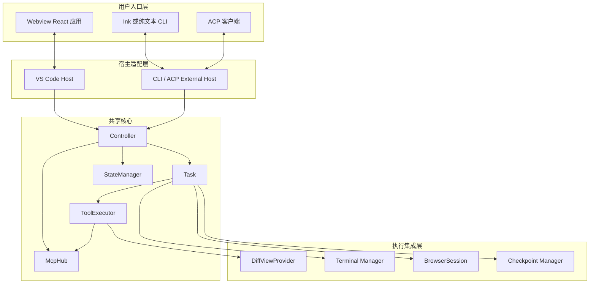
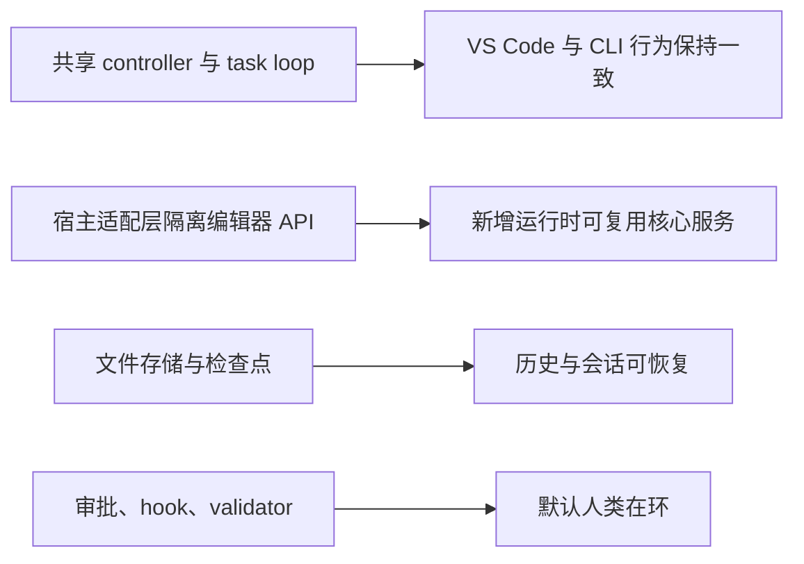

Cline 不是一个“大而全”的单体，而是一套围绕共享任务引擎搭起来的分层架构。要读懂它，第一步不是记住每个文件，而是先把“宿主层”和“共享核心”分开。

## 一套核心，三种运行时

这张图最重要的结论是：编辑器专属能力都被关在宿主适配层里，`Controller` 和 `Task` 并不关心请求究竟来自 VS Code、终端还是 ACP。

## 分层边界怎么理解

| 层级 | 核心文件 | 主要职责 | 为什么要这样拆 |
|---|---|---|---|
| VS Code 宿主 | `src/extension.ts`, `src/hosts/vscode/VscodeWebviewProvider.ts` | 扩展激活、命令注册、侧边栏暴露、桥接 VS Code API | 不让核心引擎直接依赖 IDE 细节 |
| Webview UI | `webview-ui/src/App.tsx`, `webview-ui/src/Providers.tsx`, `webview-ui/src/context/ExtensionStateContext.tsx` | 聊天界面、历史、设置、MCP、账号、worktrees 视图渲染 | 把 UI 状态留在 React 中 |
| CLI / ACP | `cli/src/index.ts`, `cli/src/agent/ClineAgent.ts` | 终端模式选择、ACP 会话托管、程序化接入 | 让同一套核心复用到非 IDE 场景 |
| 共享核心 | `src/core/controller/index.ts`, `src/core/task/index.ts`, `src/core/task/ToolExecutor.ts` | 创建任务、流式生成、工具执行、状态管理 | 把 agent 大脑集中在一个地方 |
| 共享服务 | `src/services/mcp/McpHub.ts`, `src/core/storage/StateManager.ts` | MCP 管理、存储、配置、持久化 | 让多宿主共享长生命周期能力 |

## 扩展宿主像“总配电箱”

`src/extension.ts` 不只是简单注册一个 sidebar。它做了一套严格的启动顺序：

1. 初始化 `HostProvider`，让共享服务能访问 VS Code 能力。
2. 清理旧版存储格式。
3. 把 VS Code 原生存储导出到共享文件存储。
4. 调用 `initialize(storageContext)` 构建共享服务。
5. 注册 `VscodeWebviewProvider`、命令、diff provider、URI handler 等扩展侧能力。

这个顺序不能乱。你可以把它理解成“先搬家，再开工”。如果先启动核心再迁移状态，就会让任务引擎建立在旧数据之上。

## Controller 是“总调度台”

`src/core/controller/index.ts` 里的 `Controller` 是整个系统的编排边界。它拥有：

- `StateManager`：缓存读取 + 延迟写盘。
- `McpHub`：MCP 服务器发现、连接和传输管理。
- 鉴权与账号服务。
- 工作区检测和 root 管理。
- `initTask(...)`、`clearTask()` 这类任务生命周期入口。

最形象的比喻是机场塔台。塔台自己不飞，但它负责调度航路、分配跑道、确保资源准备好，然后才放一架真实飞机起飞。这个“飞机”就是 `Task`。

## Task 才是真正的引擎室

`src/core/task/index.ts` 定义的 `Task`，才是 Cline 真正执行推理与动作的地方。它把下列能力串在一起：

- `ContextManager`：拼装 system prompt 与上下文窗口。
- `MessageStateHandler`：维护用户可见会话状态。
- `TaskPresentationScheduler`：控制流式 UI 刷新节奏。
- `BrowserSession`、terminal manager、diff provider、checkpoint manager。
- `ToolExecutor`：执行一切副作用。
- 一个全局 `Mutex`：避免关键状态竞争。

你可以把 `Task` 理解成一次活跃会话的“主线程”。所有真正会改变世界的动作，最终都要经过它。

## Webview 是界面，不是业务中枢

`webview-ui/` 中的 React 应用负责渲染状态，通过 `webview-ui/src/services/grpc-client-base.ts` 里的 `ProtoBusClient` 发送 gRPC 风格消息。

对应地，`src/hosts/vscode/VscodeWebviewProvider.ts` 中的 `handleWebviewMessage(...)` 接收 `grpc_request` 和 `grpc_request_cancel`，再转给控制器去执行。也就是说，前端从来不直接写文件、不直接跑命令，它永远是“发请求”，真正执行的人是扩展宿主侧。

这带来两个巨大好处：

- 前端可以保持简单、可响应。
- 同一套控制器和任务引擎可以服务于 CLI 与 ACP。

## CLI 不是“缩水版”，而是同级运行时

`cli/src/index.ts` 用 `selectOutputMode(...)` 在 Ink 交互模式和纯文本模式之间切换，还会注入像 `--plan`、`--model`、`--yolo`、`--json` 这样的会话级覆盖项。

`cli/src/agent/ClineAgent.ts` 更进一步，它实现 ACP 协议，并通过 session ID、controller 和事件发射器把多会话托管起来。所以 Cline 既能是面向人的终端产品，也能是面向其他系统的编程接口。

## 为什么这套架构能扩展

Cline 架构上最漂亮的一点，是把“用户从哪里进入系统”和“系统如何思考与执行”分离开了。前者属于产品表层，后者属于执行内核。

## 源码锚点

- `src/extension.ts`
- `src/hosts/vscode/VscodeWebviewProvider.ts`
- `src/core/controller/index.ts`
- `src/core/task/index.ts`
- `src/core/task/ToolExecutor.ts`
- `src/core/storage/StateManager.ts`
- `src/services/mcp/McpHub.ts`
- `webview-ui/src/App.tsx`
- `webview-ui/src/Providers.tsx`
- `cli/src/index.ts`
- `cli/src/agent/ClineAgent.ts`
