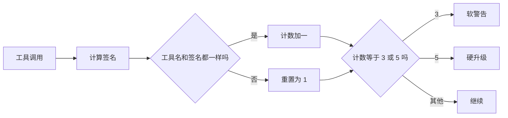
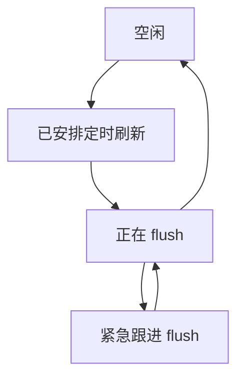

Cline 不是算子仓库，也不是大模型训练框架，但它依然包含了很多非常有价值的“小数学”。这些公式不大，却直接决定了成本、安全性和交互流畅度。

## 1. API 成本计算，本质上是一个加权求和

`src/utils/cost.ts` 里计算总成本的方法，可以压缩成一行：

```text
totalCost
  = inputTokens      * inputPrice      / 1_000_000
  + outputTokens     * outputPrice     / 1_000_000
  + cacheWriteTokens * cacheWritePrice / 1_000_000
  + cacheReadTokens  * cacheReadPrice  / 1_000_000
```

| 符号 | 现实含义 |
|---|---|
| `inputTokens` | 送进模型的 token 数 |
| `outputTokens` | 模型生成出来的 token 数 |
| `cacheWriteTokens` | 写入 prompt cache 的 token |
| `cacheReadTokens` | 从 cache 中直接读出来的 token |
| 各种 `Price` | 每 100 万 token 的单价 |

你可以把它想成买菜结账。Cline 不是只问一句“这趟花了多少钱”，而是把青菜、肉、调料、优惠券分别算清楚，最后再加总。

### 一个菜市场级别的小例子

假设一次请求消耗了：

- `200,000` 个输入 token，单价 `$3 / 1M`
- `40,000` 个输出 token，单价 `$15 / 1M`
- `60,000` 个 cache write token，单价 `$3.75 / 1M`
- `120,000` 个 cache read token，单价 `$0.30 / 1M`

那么账单就是：

```text
input  = 200,000 * 3.00  / 1,000,000 = 0.600
output =  40,000 * 15.00 / 1,000,000 = 0.600
write  =  60,000 * 3.75  / 1,000,000 = 0.225
read   = 120,000 * 0.30  / 1,000,000 = 0.036
total  = 1.461 美元
```

`calculateApiCostAnthropic(...)` 和 `calculateApiCostOpenAI(...)` 的差别，本质上不在于“公式不同”，而在于不同 provider 对缓存 token 的计数口径不同。代码先把计数口径统一，再走同一种成本求和。

### 阶梯定价，本质上是分段函数

有些模型带 pricing tiers。Cline 会先按上下文窗口排序，再选出第一个能覆盖当前请求大小的 tier：

```text
找到第一个满足 totalInputTokens <= contextWindow 的 tier
```

这就是典型的分段函数。请求越大，你就会落到越靠右的一段价格区间里。

## 2. 循环检测，本质上是“规范化签名 + 连续计数”

`src/core/task/loop-detection.ts` 要解决的是 agent 最经典的失败模式之一：拿着同一个工具、同一组参数，原地空转。

### 第一步：做参数签名

```text
signature(params)
  = JSON.stringify(sorted(params without task_progress))
```

这里会故意剔除像 `task_progress` 这种元信息，因为它可能每次都变，但真正对用户有意义的参数其实没变。

### 第二步：更新连续计数器

```text
if same toolName and same signature:
    consecutiveCount = consecutiveCount + 1
else:
    consecutiveCount = 1
```

### 第三步：和阈值比较

```text
第 3 次：soft warning
第 5 次：hard escalation
```

也就是说，Cline 会先给模型一次自我纠偏机会，如果还在重复，就升级处理。

### 生活化类比

想象你让一个店员去找西红柿，他不是去换思路，而是把同一把扫码枪对着“西红柿”连续扫 5 次。问题显然不在扫码枪，而在重复、无进展的行为模式。Cline 测量的就是这种模式。



## 3. 展示调度器，本质上是一个极简优先级队列

`src/core/task/TaskPresentationScheduler.ts` 解决的是流式 UI 的工程问题：增量消息来得太快，如果每来一小块都立刻渲染，就会浪费计算，还可能导致闪烁和竞争。

它内部只有两个优先级：

```text
normal < immediate
mergedPriority = max(currentPriority, nextPriority)
```

翻译成大白话就是：普通消息排队，紧急消息插队。



这里有两个非常关键的保证：

- 同一份展示状态上，不会并发跑两个 flush。
- `flushNow()` 能保证当前 in-flight flush 结束后，至少再补一次立即刷新。

你可以把它想成一个收银台。普通顾客排队，急件可以优先，但全程仍然只有一个收银员在操作同一台机器。

## 4. 两个小布尔公式，解释了很多系统行为

### 多根工作区检查点判断

`src/integrations/checkpoints/factory.ts` 判断是否启用多根检查点，大致等于：

```text
useMultiRoot
  = multiRootEnabled
  && enableCheckpoints
  && workspaceManager exists
  && rootCount > 1
```

也就是说，只要你不是多根工作区，Cline 就走更简单的检查点路径。

### CLI 输出模式判断

`cli/src/utils/mode-selection.ts` 选择纯文本模式的逻辑，也可以压成一个布尔式：

```text
usePlainTextMode
  = yolo
  || json
  || stdinWasPiped
  || !stdinIsTTY
  || !stdoutIsTTY
```

所以 `cline --json` 看起来像机器接口，而普通终端里的 `cline` 看起来像交互式产品，这不是偶然，而是明确的策略分流。

## 5. 一个 Mutex，守住了任务状态的一致性

`src/core/task/index.ts` 用一个全局 `Mutex` 包住那些不能竞争的状态更新。原则非常简单：

```text
所有不能抢写的状态修改
都必须走同一把锁
```

厨房类比最容易懂：如果 5 个厨师各自把订单贴到不同地方，出餐一定乱；如果所有订单都先经过同一块挂单板，状态就一致了。

## 源码锚点

- `src/utils/cost.ts`
- `src/core/task/utils.ts`
- `src/core/task/loop-detection.ts`
- `src/core/task/TaskPresentationScheduler.ts`
- `src/integrations/checkpoints/factory.ts`
- `cli/src/utils/mode-selection.ts`
- `src/core/task/index.ts`
