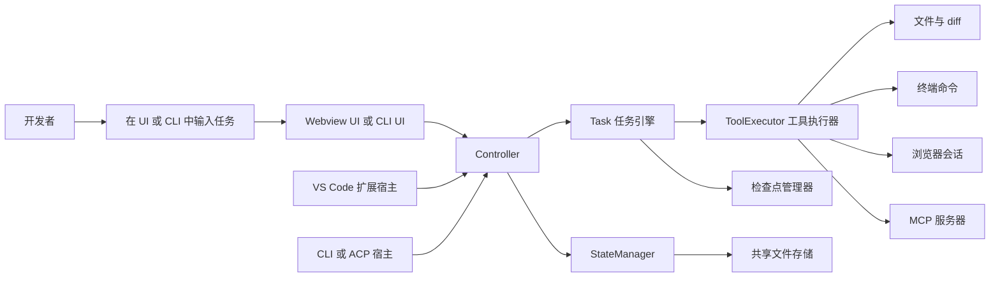

Cline 表面上像一个助手，实际上它更像一个小型分层系统。VS Code 扩展宿主、Webview 前端、CLI 终端界面，这三套入口都压在同一套共享控制平面之上。只要先抓住这个总纲，整个仓库就不会再显得杂乱。

<CardGroup cols={2}>
  <Card title="系统架构" icon="diagram-project" href="/zh/architecture">
    先看宏观骨架，再下潜到具体实现。
  </Card>
  <Card title="运行流转" icon="arrow-right" href="/zh/runtime-flow">
    沿着一次真实请求，追踪从输入到执行再到回显的全链路。
  </Card>
  <Card title="数学与逻辑" icon="calculator" href="/zh/math-theory">
    把调度器、循环检测、成本计算讲到直觉层面。
  </Card>
  <Card title="源码地图" icon="book" href="/zh/source-map">
    直接定位最值得读的核心文件。
  </Card>
</CardGroup>

## 30 分钟心智模型



这张图从左往右读就够了：

- 用户从侧边栏或终端发出任务。
- 宿主层把输入转成控制器调用。
- 控制器创建或恢复一个 `Task`。
- `Task` 负责流式生成、调用工具、维护会话状态。
- 状态存储和检查点把结果持久化下来。

## 建议先读的 5 组文件

<Steps>
  <Step title="先看宿主入口">
    读 `src/extension.ts`。它负责设置 `HostProvider`、迁移历史存储、把 VS Code 原生状态导出到共享文件存储，再注册 `VscodeWebviewProvider` 与各种命令。
  </Step>
  <Step title="找到总调度器">
    读 `src/core/controller/index.ts`。`Controller` 拥有 `StateManager`、`AuthService`、`McpHub`、工作区管理器，以及 `initTask(...)` 这类任务生命周期入口。
  </Step>
  <Step title="进入引擎室">
    读 `src/core/task/index.ts`。这里定义了 `Task` 类，也就是 Cline 真正的执行核心：上下文管理、状态锁、检查点、流式消息、工具调度都在这。
  </Step>
  <Step title="理解副作用是怎么落地的">
    读 `src/core/task/ToolExecutor.ts` 和 `src/core/task/tools/ToolExecutorCoordinator.ts`。它们负责校验工具调用、审批、执行 hook，再把调用路由到具体 handler。
  </Step>
  <Step title="对照两套前端入口">
    读 `webview-ui/src/App.tsx`、`webview-ui/src/services/grpc-client-base.ts`、`cli/src/index.ts`、`cli/src/agent/ClineAgent.ts`。你会发现界面不同，但控制平面是同一套。
  </Step>
</Steps>

## 目录速查表

```text
src/
├── extension.ts                # VS Code 扩展激活入口
├── core/
│   ├── controller/             # 总控编排与 UI 侧动作
│   ├── task/                   # 主任务循环与工具执行
│   ├── storage/                # 状态持久化与任务文件
│   └── webview/                # Webview 抽象层
├── hosts/
│   ├── vscode/                 # VS Code 专用适配器
│   └── external/               # CLI / 非 VS Code 适配器
├── services/
│   └── mcp/                    # MCP 发现、传输、OAuth
webview-ui/src/                 # React 侧边栏应用
cli/src/                        # Ink TUI、纯文本模式、ACP Agent
```

## 各运行时分别管什么

| 运行时 | 核心文件 | 负责什么 | 不负责什么 |
|---|---|---|---|
| VS Code 扩展宿主 | `src/extension.ts`, `src/hosts/vscode/VscodeWebviewProvider.ts` | 激活、命令注册、URI 处理、侧边栏消息桥 | 真正的模型循环 |
| Webview UI | `webview-ui/src/App.tsx`, `webview-ui/src/context/ExtensionStateContext.tsx` | 渲染、前端视图切换、流式消息监听 | 文件改动与命令执行 |
| CLI 与 ACP | `cli/src/index.ts`, `cli/src/agent/ClineAgent.ts` | 终端 UX、JSON 模式、ACP 会话、事件流 | 共享任务业务逻辑 |
| 共享核心 | `src/core/controller/index.ts`, `src/core/task/index.ts` | 编排、工具执行、状态、检查点、MCP 集成 | 编辑器专属 API |

## 带着这 3 个问题去读源码

1. 侧边栏里的一次点击，是在哪一层变成真正的 `Task` 对象的？
2. Cline 是怎样在工具执行前拦住危险行为和重复空转的？
3. 为什么 CLI 和 VS Code 能共用一套引擎，而不是复制两套逻辑？

如果这三个问题你都能答上来，这个仓库的主脉络你就已经抓住了。

## 源码锚点

- `src/extension.ts`
- `src/core/controller/index.ts`
- `src/core/task/index.ts`
- `src/core/task/ToolExecutor.ts`
- `src/core/task/tools/ToolExecutorCoordinator.ts`
- `src/services/mcp/McpHub.ts`
- `webview-ui/src/App.tsx`
- `webview-ui/src/services/grpc-client-base.ts`
- `cli/src/index.ts`
- `cli/src/agent/ClineAgent.ts`
