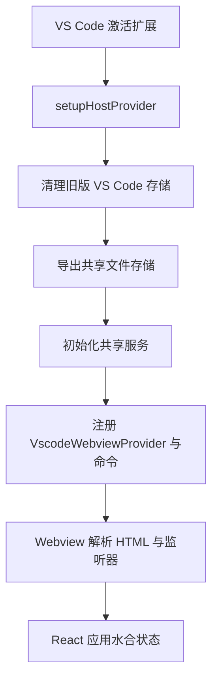
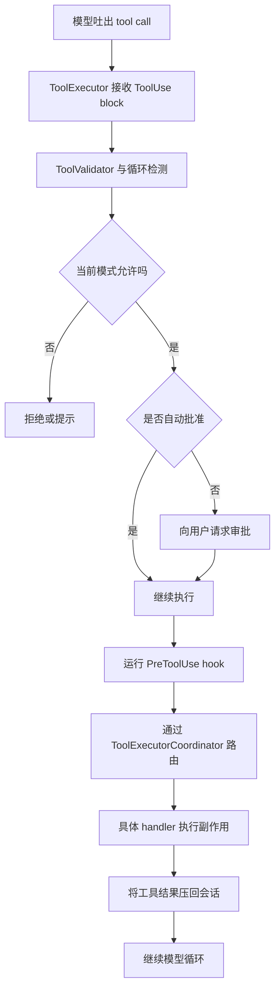
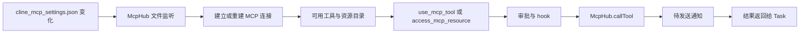
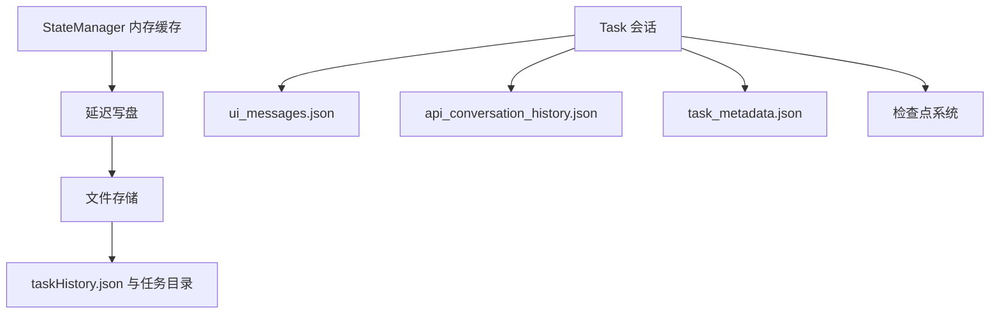

架构图解决的是“东西放在哪里”，运行流解决的是“事情怎么动起来”。这一页沿着一次真实 prompt，把 Cline 内部链路走完整。

## 1. 启动与侧边栏初始化



`src/extension.ts` 对启动顺序写得非常明确：先宿主，再存储，再共享服务，最后才把 sidebar 和命令暴露出去。

## 2. UI 与宿主之间的消息总线

Webview 并不会直接调用控制器方法。它发送的是 `src/shared/WebviewMessage.ts` 定义的消息信封，扩展端回的是 `src/shared/ExtensionMessage.ts` 里的响应信封。

| 字段 | 所在位置 | 现实意义 |
|---|---|---|
| `service` | `WebviewMessage.GrpcRequest` | 请求要交给哪个 gRPC 风格服务 |
| `method` | `WebviewMessage.GrpcRequest` | 调用这个服务的哪一个方法 |
| `request_id` | 请求与响应两端 | 用来把响应和原请求对上号 |
| `is_streaming` | 请求与响应两端 | 区分一次性响应和流式分块 |
| `sequence_number` | `GrpcResponse` | 用来维持流式块的顺序 |

`webview-ui/src/services/grpc-client-base.ts` 会给每个请求生成 UUID。`src/hosts/vscode/VscodeWebviewProvider.ts` 监听到请求后，执行对应逻辑，再发回 `grpc_response`。

## 3. 一次新任务如何启动

```mermaid
flowchart LR
    UI[ChatView 或 CLI 输入] --> CTRL[Controller.initTask]
    CTRL --> CLEAR[clearTask 并加载设置]
    CLEAR --> CREATE[创建新的 Task(...)]
    CREATE --> START[startTask]
    START --> PROMPT[构建上下文与 system prompt]
    PROMPT --> MODEL[流式请求模型]
    MODEL --> PRESENT[更新消息状态与 UI]
```

这里最关键的边界是 `Controller.initTask(...)`：

- 控制器先读取 auto-approve、终端模式、输出限制等设置。
- 然后把 `McpHub`、`StateManager` 等共享服务注入给新的 `Task`。
- 从这一步开始，活跃会话真正归 `Task` 所有。

## 4. 工具执行是一条独立流水线



`src/core/task/ToolExecutor.ts` 集中处理安全策略：

- plan mode 下的写操作限制。
- 自动审批和手动审批。
- 重复工具调用检测。
- 工具调用前后的 hook。
- 工具结果回灌到上下文中的统一格式。

然后 `src/core/task/tools/ToolExecutorCoordinator.ts` 才会把调用分发到具体 handler，比如读文件、跑命令、写文件、调 MCP。

## 5. MCP 是 agent 循环里的“第二张网络”



`src/services/mcp/McpHub.ts` 会监听 MCP 配置文件、做 schema 校验、展开环境变量、选择传输协议、维护重连。`UseMcpToolHandler` 再把模型生成的 MCP 工具调用变成真实服务器请求，并处理审批、通知、内容截断、图片响应等逻辑。

## 6. 状态与历史怎么流动



`StateManager` 负责高频内存读写，但不会每次都立即刷盘，而是做短暂 debounce。任务级数据则会分别写到 JSON 文件里，这也是为什么任务历史在升级、迁移之后依然可以重建。

## 7. 检查点系统在会话旁边并行工作

`src/integrations/checkpoints/factory.ts` 会在单根工作区检查点管理器和 `MultiRootCheckpointManager` 之间做选择。判断条件很朴素：

- 是否启用了 checkpoints。
- 是否启用了 multi-root。
- workspace manager 是否发现了多个根目录。

说白了就是：工作区不复杂，就别启用复杂方案。

## 8. 为什么界面看起来很顺滑

`TaskPresentationScheduler` 是一个很小但很关键的性能层。它会把普通刷新合并调度，把紧急刷新直接提速，并保证任务结束前至少做一次最终刷新。如果没有它，流式输出很容易出现闪烁、乱序或者竞争。

## 源码锚点

- `src/extension.ts`
- `src/hosts/vscode/VscodeWebviewProvider.ts`
- `src/shared/WebviewMessage.ts`
- `src/shared/ExtensionMessage.ts`
- `webview-ui/src/services/grpc-client-base.ts`
- `src/core/controller/index.ts`
- `src/core/task/index.ts`
- `src/core/task/ToolExecutor.ts`
- `src/core/task/tools/ToolExecutorCoordinator.ts`
- `src/core/task/tools/handlers/UseMcpToolHandler.ts`
- `src/services/mcp/McpHub.ts`
- `src/core/storage/StateManager.ts`
- `src/integrations/checkpoints/factory.ts`
