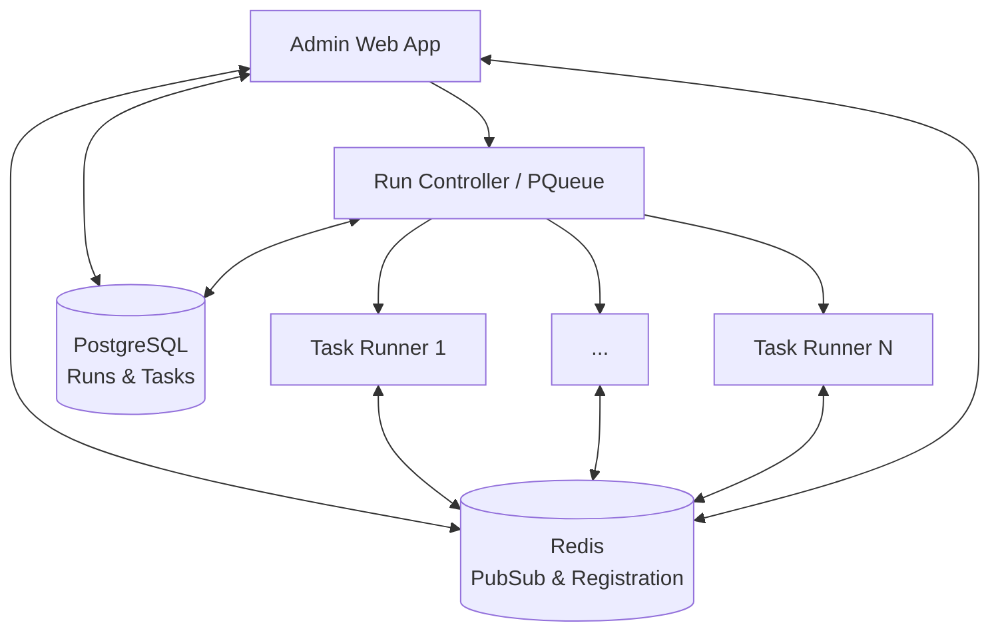

# Evals System Architecture

## Overview

The evals system is a distributed evaluation platform that runs AI coding tasks in isolated VS Code environments. It solves two critical problems in AI evaluation:

1. **Dependency Management**: Eliminates the complexity of setting up multiple programming language environments by packaging everything into pre-configured containers
2. **Resource Isolation**: Prevents memory exhaustion and state contamination by running each task in a fresh, isolated container instead of sequentially in a single VS Code instance

The architecture consists of three main components: a Next.js web application for management, a controller container that orchestrates evaluation runs, and multiple runner containers that execute individual tasks.

## Problems Solved

### Simplified Setup and Deployment

Traditional AI evaluation setups require complex dependency management across multiple programming languages, development tools, and VS Code extensions. The evals system eliminates this friction by:

- **One-Command Deployment**: Single `docker compose up` command starts the entire evaluation infrastructure
- **Pre-configured Environments**: Runner containers include all necessary language runtimes, tools, and VS Code extensions
- **Dependency Isolation**: No host system contamination or version conflicts between different language requirements
- **Reproducible Environments**: Identical evaluation conditions across different machines and deployments

### Resource Management and Isolation

Running multiple AI evaluation tasks sequentially in a single VS Code instance creates several problems:

- **Memory Accumulation**: VS Code instances gradually consume more memory with each task, eventually leading to crashes
- **State Contamination**: Previous tasks can leave behind files, settings, or processes that affect subsequent evaluations
- **Resource Contention**: Multiple tasks competing for the same VS Code instance create bottlenecks and inconsistent performance
- **Failure Propagation**: A single problematic task can crash the entire evaluation session

The containerized approach solves these issues by:

- **Fresh Environments**: Each task starts with a clean VS Code instance and workspace
- **Memory Reset**: Container termination automatically reclaims all memory and resources
- **Parallel Execution**: Multiple tasks can run simultaneously without interference
- **Fault Isolation**: Individual task failures don't affect other running evaluations

## Architecture Components

### Core Components

#### Next.js Web Application

The web application serves as the primary interface for creating and monitoring evaluation runs. It provides:

- **Run Management**: Create evaluation runs with configurable parameters (model, concurrency, exercise selection)
- **Real-time Monitoring**: Live progress tracking via Server-Sent Events
- **Results Dashboard**: View task completion status, metrics, and outcomes
- **Container Orchestration**: Spawns controller containers for new runs

#### Controller Container

A specialized instance of the `evals-runner` container that acts as the run orchestrator. The controller:

- **In-Memory Task Queue**: Uses the `p-queue` npm package to manage task distribution with configurable concurrency limits
- **Git Workspace Setup**: Prepares exercise repositories and manages version control
- **Runner Coordination**: Spawns and monitors individual task runner containers
- **Heartbeat Monitoring**: Maintains Redis heartbeat to track controller health
- **Result Aggregation**: Collects task results and finalizes run metrics

#### Runner Containers

Individual containers that execute single evaluation tasks. Each runner:

- **Isolated Environment**: Fresh VS Code instance with pre-installed language tools and extensions
- **Task Execution**: Runs AI agent with evaluation prompt in VS Code environment
- **IPC Communication**: Connects to VS Code via Unix socket for real-time interaction
- **Unit Testing**: Validates task completion using language-specific test suites
- **Metrics Collection**: Tracks token usage, costs, tool usage, and execution time

#### Supporting Infrastructure

- **Redis**: Provides pub/sub messaging for real-time events and runner registration tracking (not used for task queuing)
- **PostgreSQL**: Stores run configurations, task definitions, execution metrics, and results
- **Docker**: Container orchestration for isolation and scalability

## Execution Flow

### 1. Run Initialization

The web application creates an evaluation run with specified parameters:

- **Suite Type**: Full evaluation (all exercises) or partial (selected exercises)
- **Model Configuration**: AI model selection and settings
- **Concurrency**: Number of parallel task executions (1-25)
- **Exercise Selection**: Programming language and specific coding challenges

### 2. Controller Deployment

The web application spawns a controller container that:

- **Loads Run Configuration**: Retrieves run parameters and associated tasks from database
- **Prepares Workspace**: Sets up git repository with exercise code and test suites
- **Establishes Monitoring**: Starts Redis heartbeat and event publishing
- **Creates Task Queue**: Initializes concurrent task processing with specified limits

### 3. Task Distribution

The controller distributes tasks across runner containers using an in-memory queue:

- **p-queue Management**: Uses the `p-queue` npm package to manage task concurrency in memory
- **Container Spawning**: Creates isolated runner containers for each task
- **Resource Management**: Enforces concurrency limits to prevent resource exhaustion
- **Task Assignment**: Each runner receives a single task with full context
- **Progress Tracking**: Monitors runner registration and task status via Redis pub/sub

### 4. Task Execution

Individual runners execute evaluation tasks:

- **Environment Setup**: Launches VS Code with Roo extension in isolated container
- **Prompt Delivery**: Sends evaluation prompt to AI agent via IPC
- **Code Generation**: AI agent writes code using available tools and context
- **Real-time Events**: Publishes progress updates, token usage, and completion status
- **Validation**: Runs language-specific unit tests to verify task completion

### 5. Result Collection

The system aggregates and reports results:

- **Event Streaming**: Real-time progress updates flow from runners through Redis to web interface
- **Metrics Aggregation**: Controller collects execution metrics, costs, and success rates
- **Run Completion**: Final results stored in database with comprehensive analytics
- **Cleanup**: Containers terminated and resources released

## Technical Implementation

### CLI System

The evaluation system is driven by a command-line interface that can operate in two modes:

- **Run Mode**: Orchestrates complete evaluation runs with multiple tasks
- **Task Mode**: Executes individual tasks within runner containers

The CLI automatically detects its execution environment and adapts behavior accordingly, using containerized task execution when running within Docker.

### Container Architecture

Both controller and runner containers use the same base image but serve different purposes:

#### Runner Container Features

- **Multi-language Support**: Pre-installed runtimes for Go, Java, JavaScript, Python, and Rust
- **Development Tools**: VS Code with language-specific extensions and Roo Code extension
- **Containerization**: Docker-in-Docker capability for nested container execution
- **Exercise Repository**: Git clone of evaluation exercises with test suites

#### Container Isolation

Each task executes in complete isolation with:

- **Fresh VS Code Instance**: Clean environment with no shared state
- **Dedicated Workspace**: Task-specific directory with relevant exercise files
- **Resource Limits**: Controlled CPU and memory allocation
- **Network Isolation**: Containers communicate only through Redis pub/sub

### Communication Architecture

The system uses multiple communication channels:

#### IPC (Inter-Process Communication)

- **Unix Sockets**: Direct communication between CLI and VS Code extension
- **Event Streaming**: Real-time task progress and AI agent interactions
- **Command Interface**: Task lifecycle management (start, cancel, close)

#### Redis Pub/Sub

- **Event Broadcasting**: Task events published to run-specific channels
- **Runner Registration**: Active runner tracking per evaluation run
- **Heartbeat Monitoring**: Controller health and availability status
- **Not Used for Queuing**: Task queue management is handled in-memory by the controller using `p-queue`

#### HTTP/SSE

- **Web Interface**: REST API for run management and configuration
- **Real-time Updates**: Server-Sent Events for live progress monitoring
- **Result Retrieval**: Task metrics and completion status

### Task Lifecycle Management

Each evaluation task follows a structured lifecycle:

1. **Initialization**: Container startup and VS Code launch
2. **Connection**: IPC socket establishment and extension activation
3. **Prompt Delivery**: Evaluation challenge sent to AI agent
4. **Execution**: AI agent writes code using available tools
5. **Validation**: Unit test execution to verify correctness
6. **Cleanup**: Container termination and resource cleanup

### Error Handling and Timeouts

The system implements comprehensive error handling:

- **Task Timeouts**: 30-minute maximum execution time per task
- **Process Cleanup**: Automatic termination of hung processes
- **Container Recovery**: Failed containers are cleaned up and resources released
- **Graceful Degradation**: Individual task failures don't affect other tasks in the run

### Metrics and Monitoring

Comprehensive tracking of evaluation performance:

- **Token Usage**: Input/output tokens and context size tracking
- **Cost Analysis**: API costs per task and aggregated run costs
- **Tool Usage**: Frequency and success rates of different AI tools
- **Execution Time**: Task duration and queue wait times
- **Success Rates**: Pass/fail statistics across languages and exercises

## Configuration and Customization

### Run Configuration

Evaluation runs support extensive customization:

- **Model Selection**: Choose from available AI models via OpenRouter integration
- **Concurrency Control**: 1-25 parallel task executions based on resource availability
- **Exercise Selection**: Full suite (all exercises) or partial (selected exercises)
- **Custom Settings**: Override default AI agent configuration and behavior
- **System Prompts**: Optional custom prompts for specialized evaluation scenarios

### Exercise Management

The system uses a separate Git repository containing:

- **Language-specific Exercises**: Coding challenges organized by programming language
- **Test Suites**: Automated validation for each exercise
- **Prompt Templates**: Standardized evaluation instructions per language
- **Workspace Configuration**: Language-specific development environment setup

### Scalability Considerations

The architecture supports horizontal scaling:

- **Container Orchestration**: Multiple controller instances can run simultaneously
- **Resource Management**: Configurable concurrency prevents resource exhaustion
- **Database Optimization**: Efficient task querying and result storage
- **Redis Clustering**: Pub/sub system can scale with message volume

## Operational Characteristics

### Performance

- **Task Isolation**: Complete environment isolation prevents interference between tasks
- **Parallel Execution**: Configurable concurrency maximizes resource utilization
- **Efficient Communication**: Unix sockets and Redis provide low-latency messaging
- **Resource Cleanup**: Automatic container termination prevents resource leaks

### Reliability

- **Fault Tolerance**: Individual task failures don't impact other tasks
- **Timeout Management**: Prevents hung tasks from consuming resources indefinitely
- **Health Monitoring**: Controller heartbeat and runner registration tracking
- **Graceful Shutdown**: Proper cleanup of containers and database connections

### Observability

- **Real-time Monitoring**: Live progress tracking through web interface
- **Comprehensive Logging**: Detailed execution logs for debugging and analysis
- **Metrics Collection**: Performance and cost analytics for optimization
- **Event Auditing**: Complete task lifecycle tracking for accountability

This architecture provides a robust, scalable platform for evaluating AI coding capabilities across multiple programming languages while maintaining strict isolation and comprehensive monitoring.
