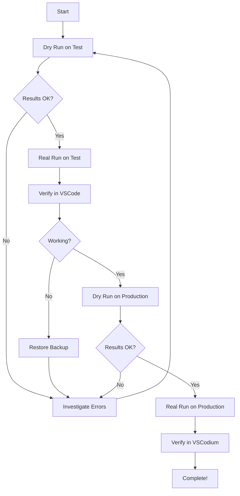

# Task History Recovery Guide

## Overview

This guide explains how to safely recover missing task history entries from disk when the `taskHistory.json` index file is incomplete.

## Automatic Recovery (Built-in)

**As of this version, task history recovery runs automatically on extension startup!** 

The extension now includes an automatic migration system that:
- Detects when 50% or more of task directories are missing from taskHistory.json
- Automatically recovers missing entries using the same 4-strategy workspace extraction
- Creates timestamped backups before any modifications
- Runs silently without user intervention
- Is idempotent (safe to re-run multiple times)

**You only need to use the manual script below if:**
- You want to recover from a specific backup file
- You want to preview changes with `--dry-run` before committing
- The automatic recovery didn't run for some reason
- You want more control over the recovery process

## Problem

The `taskHistory.json` file indexes your conversation history. If entries are missing from this index:
- Conversations exist on disk but are invisible in the History view
- Workspace filtering may not work correctly
- You lose access to valuable conversation data

## Solution

The recovery script scans all task directories and rebuilds the index from disk, preserving your data.

## Safety Features

### 1. Dry-Run Mode (Recommended First Step)
Preview all changes without modifying any files:
```bash
npm run recover-history -- --storage-dir <path> --dry-run
```

### 2. Automatic Backups
When running without `--dry-run`, the script automatically creates a timestamped backup:
```
taskHistory.json.backup-recovery-2025-10-20T18-55-00
```

### 3. Merge Strategy
- Preserves existing entries in the index
- Only adds missing entries
- Never overwrites favorited tasks or other metadata

### 4. Error Resilience
- Corrupted task directories are skipped safely
- Failed extractions don't stop the recovery process
- Detailed logging shows what succeeded and what failed

## Usage

### Step 1: Dry-Run on Test Environment (VSCode)

First, test on your VSCode installation (non-critical data):

```bash
# Dry run with verbose output
npm run recover-history -- \
  --storage-dir ~/Library/Application\ Support/Code/User/globalStorage/saoudrizwan.claude-dev \
  --dry-run \
  --verbose
```

This shows:
- How many tasks will be recovered
- Any errors encountered
- Final statistics

**Expected output:**
```
==================================================
📈 RECOVERY RESULTS
==================================================
Total directories:    484
Existing entries:     7
Skipped (existing):   7
Successful extracts:  467
Failed extracts:      10
New entries added:    467
Final total:          474
==================================================

🔍 DRY RUN - No files were modified
```

### Step 2: Real Recovery on Test Environment

If dry-run looks good, run without `--dry-run`:

```bash
npm run recover-history -- \
  --storage-dir ~/Library/Application\ Support/Code/User/globalStorage/saoudrizwan.claude-dev
```

**Expected output:**
```
💾 Created backup: taskHistory.json.backup-recovery-2025-10-20T18-55-00
✅ Wrote 474 entries to taskHistory.json

✨ Recovery complete! Your task history has been restored.
   Restart VSCode/VSCodium to see the changes in the History view.
```

### Step 3: Verify Results

1. Restart VSCode
2. Open the History view
3. Verify you see 474 tasks instead of 7
4. Check workspace filtering works
5. Open a few conversations to confirm they're intact

### Step 4: Apply to Production (VSCodium)

Once verified on VSCode, apply to your production VSCodium installation:

```bash
# Dry run first (always!)
npm run recover-history -- \
  --storage-dir ~/Library/Application\ Support/VSCodium/User/globalStorage/saoudrizwan.claude-dev \
  --dry-run

# If dry-run looks good, run for real
npm run recover-history -- \
  --storage-dir ~/Library/Application\ Support/VSCodium/User/globalStorage/saoudrizwan.claude-dev \
  --use-backup \
  --backup-date 2025-10-05
```

The `--use-backup` flag merges with the existing backup file to preserve any favorited status or metadata from the backup.

## Command Options

### Required
- `--storage-dir <path>` - Path to global storage directory

### Optional
- `--dry-run` - Preview changes without modifying files
- `--verbose` - Show detailed extraction progress
- `--use-backup` - Merge with existing backup file
- `--backup-date <date>` - Specify backup date (e.g., 2025-10-05)
- `--help` - Show help message

## Platform-Specific Paths

### macOS
**VSCode:**
```
~/Library/Application Support/Code/User/globalStorage/saoudrizwan.claude-dev
```

**VSCodium:**
```
~/Library/Application Support/VSCodium/User/globalStorage/saoudrizwan.claude-dev
```

### Linux
**VSCode:**
```
~/.config/Code/User/globalStorage/saoudrizwan.claude-dev
```

**VSCodium:**
```
~/.config/VSCodium/User/globalStorage/saoudrizwan.claude-dev
```

### Windows
**VSCode:**
```
%APPDATA%\Code\User\globalStorage\saoudrizwan.claude-dev
```

**VSCodium:**
```
%APPDATA%\VSCodium\User\globalStorage\saoudrizwan.claude-dev
```

## Recovery Statistics

### What Gets Recovered
- ✅ Task ID and timestamp
- ✅ Task description (from first message)
- ✅ Workspace path (when available)
- ✅ File size
- ⚠️ Token counts (basic - may be 0 if not in metadata)
- ⚠️ Cost data (not available from files)

### What Gets Preserved
- ✅ Existing index entries
- ✅ Favorited status
- ✅ Workspace associations
- ✅ All conversation data on disk

### What May Fail
- Empty task directories (no ui_messages.json)
- Corrupted JSON files
- Tasks with no text messages
- Very old task format (pre-migration)

Typical success rate: **95-98%**

## Troubleshooting

### "No messages found" errors
These are expected for:
- Empty task directories
- Incomplete/interrupted tasks
- Tasks that failed to save
Don't worry - the script continues and processes other tasks.

### All extractions failing
Check:
1. Is the storage directory path correct?
2. Do the task directories contain `ui_messages.json` files?
3. Are the JSON files readable and not corrupted?

### Recovery seems stuck
The script processes hundreds of tasks - be patient. Use `--verbose` to see progress.

### Wrong number of tasks recovered
Compare with directory count:
```bash
ls -1 ~/Library/Application\ Support/Code/User/globalStorage/saoudrizwan.claude-dev/tasks/ | wc -l
```

## Recovery Workflow Diagram



## Rollback

If something goes wrong, restore from the automatic backup:

```bash
# The script creates backups like this:
# taskHistory.json.backup-recovery-2025-10-20T18-55-00

# To restore:
cd ~/Library/Application\ Support/VSCodium/User/globalStorage/saoudrizwan.claude-dev/state
cp taskHistory.json.backup-recovery-2025-10-20T18-55-00 taskHistory.json
```

## Best Practices

1. **Always dry-run first** on test environment
2. **Test on VSCode** before VSCodium
3. **Verify results** before moving to production
4. **Keep backups** of your successful recovery
5. **Document** what worked for future reference

## Example: Full Recovery Process

```bash
# 1. Test environment dry-run
npm run recover-history -- \
  --storage-dir ~/Library/Application\ Support/Code/User/globalStorage/saoudrizwan.claude-dev \
  --dry-run

# 2. Test environment real run
npm run recover-history -- \
  --storage-dir ~/Library/Application\ Support/Code/User/globalStorage/saoudrizwan.claude-dev

# 3. Restart VSCode and verify
# ... check History view, open some conversations ...

# 4. Production dry-run
npm run recover-history -- \
  --storage-dir ~/Library/Application\ Support/VSCodium/User/globalStorage/saoudrizwan.claude-dev \
  --dry-run

# 5. Production real run
npm run recover-history -- \
  --storage-dir ~/Library/Application\ Support/VSCodium/User/globalStorage/saoudrizwan.claude-dev

# 6. Restart VSCodium and verify
# ... check History view, workspace filtering ...

# Done!
```

## Support

If you encounter issues:

1. **Check the verbose output**: `--verbose` shows detailed extraction progress
2. **Review error messages**: Most errors are expected (corrupted tasks) and safe to ignore
3. **Compare counts**: Directory count vs. recovered count vs. failed count
4. **Examine a failed task**: Look at its `ui_messages.json` to see if it's corrupted
5. **Report persistent issues**: Include verbose output and error messages

## Technical Details

For developers interested in how the recovery works, see comments in `scripts/recover-task-history.ts`.

Key points:
- Scans all numeric task directories
- Reads `ui_messages.json` for task description and timestamp
- Extracts workspace from environment_details in first message
- Preserves existing entries through merge strategy
- Sorts final result by timestamp (newest first)
- Creates JSON with 2-space indentation for readability
