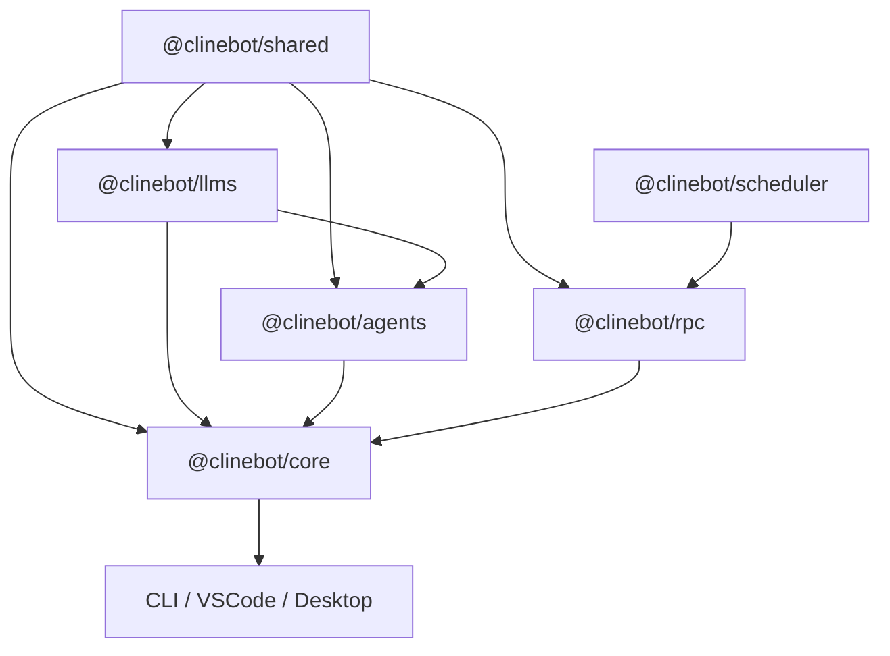

# Cline SDK Guide

This repository is a WIP framework for building and orchestrating AI agents. Full refactors are encouraged as we iterate on the core foundation.

## Workspace Map

- **Packages:**
  - `@clinebot/shared`: Common types, paths, and helpers.
  - `@clinebot/llms`: Provider schemas and model catalog.
  - `@clinebot/scheduler`: Cron orchestration and task scheduling (SQLite-backed).
  - `@clinebot/agents`: Stateless runtime loop, tools, and hooks.
  - `@clinebot/rpc`: Control-plane APIs and chat bridge.
  - `@clinebot/core`: Stateful orchestration, sessions, and storage.
- **Apps:** `cli`, `code` (Next.js/Tauri), `desktop` (Next.js/Tauri), `vscode` (Extension).

## Architecture



## Runtime Flows

### Core Execution
1. **Host** builds a runtime via `@clinebot/core`.
2. **Core** composes tools/policies and invokes `@clinebot/agents`.
3. **Agents** use `@clinebot/llms` for model interactions.
4. **Core** persists session state and artifacts (logs, messages).

### Bootstrap & RPC
- **CLI**: Direct CLI runs default to local in-process sessions. RPC-backed hosts still use `CLINE_RPC_ADDRESS` as a preferred base address, but sidecar bootstrap is owner-scoped rather than machine-global and now uses shared `@clinebot/core` ensure logic: startup paths take a lock under `~/.cline/data/locks/`, reuse a compatible owned sidecar when available, and otherwise start a fresh background RPC sidecar without requiring users to restart older listeners manually.
- **UI Apps**: Use Tauri or Extension hosts to ensure a compatible RPC server and communicate via WebSocket or gRPC bridges.
- **Connectors**: Background bridges (Telegram, WhatsApp, etc.) that map external threads to RPC sessions.
- **Hooks**: Direct local CLI runs own one persistent `hook-worker` per CLI runtime; RPC-backed sessions share one persistent hook service owned by the RPC server process.

## Core Features

- **Tool Approvals**: Hooks can return `review: true` to force host-side approval for specific calls (e.g., `git` commands).
- **Model Routing**: Automatic tool selection (e.g., `apply_patch` vs `editor`) based on the active model and provider.
- **OAuth**: Token refresh is managed centrally by `@clinebot/core`.
- **Interactive Queueing**: Prompt queue and steer behavior are owned by `@clinebot/core`; app hosts should consume core queue events instead of duplicating pending-turn execution logic.
- **Sub-agents**: `spawn_agent` automatically inherits workspace metadata and prompt context.
- **Error Handling**: Immediate failure for non-recoverable errors; retries for transient failures.

## Storage & Paths

All data is rooted at `~/.cline/data` (overridable via `CLINE_DATA_DIR`).

- **`SqliteSessionStore`**: Session metadata and status.
- **`ArtifactStore`**: Append-only logs, hooks, and message history.
- **`ProviderSettingsManager`**: JSON-based provider configuration.
- **Search Paths**: Configs are loaded from workspace roots (`.clinerules/`, `.cline/`) and global directories.

## Development Workflow

### Essential Commands
- `bun run build`: Build SDK and CLI.
- `bun run dev`: Build SDK and CLI in development mode.
- `bun run cli`: Run CLI interactively.
- `bun run test`: Run the Vitest suite.
- `bun run lint / format / fix`: Code quality and formatting.

### Rebuilding
Changes to `packages/*` require a rebuild (`bun run build:sdk`). Direct CLI runs pick up rebuilt code immediately; RPC-backed hosts auto-replace their owner-scoped sidecar when the shared RPC runtime build changes. Today that build identity is keyed from `@clinebot/core` and `@clinebot/rpc` package versions, and hosts can extend it with a host-specific build key if needed. If you touch RPC bootstrap, preserve the startup lock and owner-scoped discovery behavior so multiple builds can coexist safely. Use `dev:*` scripts for automatic rebuilding during development.

### Publishing SDK Packages
- Source workspace manifests must keep real workspace dependencies declared so `bun install` and local builds resolve correctly.
- Published runtime workspace packages stay in `dependencies`. Bundled internal workspace packages must live in `devDependencies` so they do not leak into packed manifests.
- `bun scripts/version.ts <version>` updates all workspace package versions in place, refreshes generated models, formats the repo, and runs `bun run build` so the post-bump artifacts match the release version.
- `bun scripts/check-publish.ts` packs the publishable packages with `bun pm pack`, verifies that packed internal runtime dependency versions match the release version, and installs the packed tarballs together in an isolated temp directory.
- `bun publish` resolves published `workspace:*` dependencies to concrete versions when it packs the tarball.
- Manual publish guide:
  1. Run `bun run test` from the repo root.
  2. Choose the release version like `0.0.22`.
  3. Run `bun scripts/version.ts <version>` to update all workspace package versions and rebuild from the bumped versions.
  4. Review the changed `package.json` files and generated model artifacts before publishing.
  5. Run `bun scripts/check-publish.ts` to verify the packed SDK tarballs are version-aligned and install together correctly.
  6. If you want to inspect one package manually before publish, run `bun pm pack` in that package and inspect `package/package.json` from the generated tarball.
  7. Publish in dependency order:
     `cd packages/shared && bun publish`
     `cd ../llms && bun publish`
     `cd ../agents && bun publish`
     `cd ../core && bun publish`
  8. If you are doing a tagged production release, create and push the corresponding git tags after publish.
- CI publish flow in `.github/workflows/publish-sdk.yaml` follows the same order: build, version, `check:publish`, then publish `shared -> llms -> agents -> core`.

#### Verification Steps

To inspect the exact manifest Bun will publish for a package:

```sh
cd ./packages/core
tmpdir=$(mktemp -d)
bun pm pack --destination "$tmpdir" >/dev/null
tar -xOf "$tmpdir"/*.tgz package/package.json | jq '.version, .dependencies'
```

Use that output to confirm the package version and any published `@clinebot/*` runtime dependencies match the release version before running `bun publish`.

To inspect the versions of the dependencies installed in another project:
```sh
bun pm ls @clinebot/core @clinebot/agents @clinebot/llms
# or
npm ls @clinebot/core @clinebot/agents @clinebot/llms
```

### Change Routing
- **Model/Provider schemas**: `@clinebot/llms`
- **Scheduling/Cron**: `@clinebot/scheduler`
- **Agent loop/tools**: `@clinebot/agents`
- **Sessions/Storage/Lifecycle**: `@clinebot/core`
- **RPC contracts**: `@clinebot/rpc`
