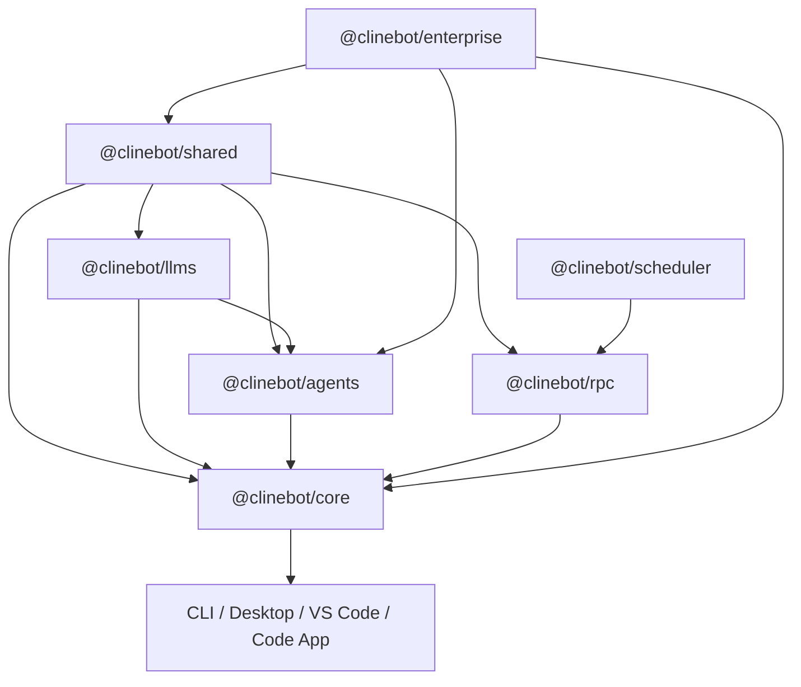

# Cline SDK Guide

This document is for developers working in this repository.

Use it to get oriented quickly:

- what each package owns
- how the packages fit together
- where to make changes
- how to build, test, and publish safely

This repo is a WIP framework for building and orchestrating AI agents. Full refactors are acceptable when they improve the architecture and all call sites are updated.

## Start Here

If you are new to the codebase:

1. Read this file for contributor workflow and package ownership.
2. Read [ARCHITECTURE.md](./ARCHITECTURE.md) for dependency direction and runtime flows.
3. Use [DOC.md](./DOC.md) when you need detailed behavior or API reference.

## Documentation Responsibilities

Keep the four top-level docs focused on different audiences.

- `README.md`: visitor-facing overview of the repository. Update this when the high-level repo story changes, when package/app inventory changes, or when the main “what is this repo?” explanation changes.
- `AGENTS.md`: contributor onboarding and working guide. Update this when contributor workflow changes, package ownership changes, development/publishing rules change, or new contributors need different routing guidance.
- `ARCHITECTURE.md`: design, dependency direction, boundaries, runtime flows, and integration patterns. Update this when the system design changes or when architectural constraints/seams change.
- `DOC.md`: detailed API and behavior reference. Update this when exported package surfaces, integration entrypoints, lifecycle semantics, or runtime behavior changes.

Practical rule:

- if a change affects how a visitor understands the repo, update `README.md`
- if a change affects how a contributor should work in the repo, update `AGENTS.md`
- if a change affects how the system is designed, update `ARCHITECTURE.md`
- if a change affects what code does or how an API behaves, update `DOC.md`

## Workspace Map

### Published SDK Packages

- `@clinebot/shared`: shared contracts, schemas, path helpers, hook engine, extension registry, and reusable low-level runtime utilities
- `@clinebot/llms`: provider settings/config, model catalogs, provider manifests, and handler creation
- `@clinebot/agents`: stateless agent loop, tool orchestration, hook/extension runtime, and event streaming
- `@clinebot/scheduler`: scheduled execution, concurrency guards, and routine persistence
- `@clinebot/rpc`: gRPC/control-plane layer for sessions, events, approvals, and schedules
- `@clinebot/core`: stateful orchestration, session lifecycle, storage, config watching, plugin loading, default tools, and telemetry integration

### Internal Workspace Package

- `@clinebot/enterprise`: internal-only enterprise integration layer. It composes with core from above and owns enterprise identity adapters, enterprise control-plane sync, managed instruction materialization, claims-to-role mapping, and enterprise telemetry bridging.

Important:

- `packages/enterprise` stays in the workspace for internal use.
- It is intentionally excluded from the root SDK build/version/publish flows.
- `@clinebot/core` must stay enterprise-agnostic.

### Apps

- `apps/cli`: CLI host and RPC server management
- `apps/code`: Tauri + Next.js desktop app
- `apps/desktop`: desktop board/task app
- `apps/vscode`: VS Code extension
- `apps/examples`: sample consumers and integration examples

## Dependency Model

Use this as the default mental model:

Rules:

- `shared` stays low-level and reusable
- `agents` stays stateless
- `core` owns stateful orchestration
- `rpc` owns transport/gateway concerns
- `enterprise` may depend on `core`, but `core` must not depend on `enterprise`

## Runtime Flows

### Local Flow

1. A host app builds a runtime through `@clinebot/core`.
2. `@clinebot/core` composes config, tools, watchers, hooks, telemetry, and the core-owned context pipeline.
3. `@clinebot/core` creates an `Agent` from `@clinebot/agents`.
4. `@clinebot/agents` uses `@clinebot/llms` handlers for model execution.
5. `@clinebot/core` persists session state and artifacts.

### RPC-Backed Flow

1. Host connects to or ensures an RPC runtime.
2. `@clinebot/rpc` brokers session/task/event/approval APIs.
3. `@clinebot/core` still owns shared session persistence behavior.
4. `@clinebot/scheduler` is embedded behind RPC for routine execution.

### Enterprise Flow

1. Enterprise bootstrap code resolves identity via `@clinebot/enterprise`.
2. Enterprise fetches a normalized control-plane bundle.
3. Enterprise materializes managed rules/workflows/skills into workspace-local files.
4. Enterprise optionally derives telemetry config/services.
5. `@clinebot/core` consumes watcher/extension/telemetry inputs without enterprise-specific logic.

## Change Routing

When you make a change, route it to the package that owns the concern:

- model/provider schemas or handler behavior: `@clinebot/llms`
- stateless loop behavior, tool orchestration, streaming, hook/extension runtime: `@clinebot/agents`
- session lifecycle, storage, config watching, default tool composition, plugin loading, telemetry integration: `@clinebot/core`
- schedules and routine execution: `@clinebot/scheduler`
- session gateway, approval routing, RPC server/client contracts: `@clinebot/rpc`
- enterprise identity, control-plane sync, materialization, claims mapping, telemetry bridge: `@clinebot/enterprise`
- host-specific UX or shell behavior: app package

## Development Workflow

### Essential Commands

- `bun install`
- `bun run build`
- `bun run build:sdk`
- `bun run test`
- `bun run types`
- `bun run lint`
- `bun run fix`
- `bun run cli`

Direct package work:

- `bun -F @clinebot/core build|test|typecheck`
- `bun -F @clinebot/agents build|test|typecheck`
- `bun -F @clinebot/enterprise build|test|typecheck`

### Rebuilding

Changes to published SDK packages require `bun run build:sdk`.

Internal-only packages such as `packages/enterprise` are excluded from the root SDK build/version/publish flows, so work on them directly with package-scoped commands when needed.

Direct CLI runs pick up rebuilt packages immediately. RPC-backed hosts use shared runtime ensure logic and replace incompatible owned sidecars automatically when the RPC runtime build changes.

### Testing

Use root commands for cross-package confidence:

- `bun run test`
- `bun run types`
- `bun run check`

Use package-scoped runs while iterating:

- `bun -F @clinebot/core test`
- `bun -F @clinebot/agents test`
- `bun -F @clinebot/enterprise test`

If you touch RPC/bootstrap/session flows, prefer both unit coverage and an end-to-end sanity check.

## Publishing Rules

Only the publishable SDK packages are part of the root release path.

Published package order:

1. `packages/shared`
2. `packages/llms`
3. `packages/agents`
4. `packages/core`

Notes:

- `scripts/check-publish.ts` only checks non-internal packages
- `scripts/version.ts` skips packages marked `internal: true`
- internal workspace code must not leak into packed published artifacts

If you add a new internal package, keep it out of root publish/version/build sweeps unless you explicitly intend to publish it.

## Practical Guidance

### Keep Boundaries Clean

- don’t move stateful logic down into `agents`
- don’t put app-specific behavior into `core` unless it is truly shared host behavior
- don’t let enterprise concerns leak into published core APIs unless they are generic and reusable

### Prefer Existing Seams

Before adding a new subsystem, look for an existing seam:

- watcher/config loader
- `packages/core/src/extensions/config` for config-facing parsing, watching, and watcher projection
- `packages/core/src/extensions/plugin` for runtime plugin loading/sandboxing
- `packages/core/src/extensions/context` for core-owned message/context pipeline behavior
- runtime builder input
- extension/hook system
- storage adapter/service split
- provider manifest/config resolution

### Refactor Standard

When refactoring within this repo:

- prefer direct architectural cleanup over compatibility shims
- move code to the layer that actually owns the concern and update all call sites
- if a helper is just projecting watcher state, keep it with the config layer instead of creating thin runtime wrappers

### Be Careful With Root Automation

Root scripts are intentionally narrower than the full workspace now.

- root SDK build/test/version/publish flows target the publishable SDK packages
- internal packages can still be built/tested directly, but should not be swept into release automation by accident
