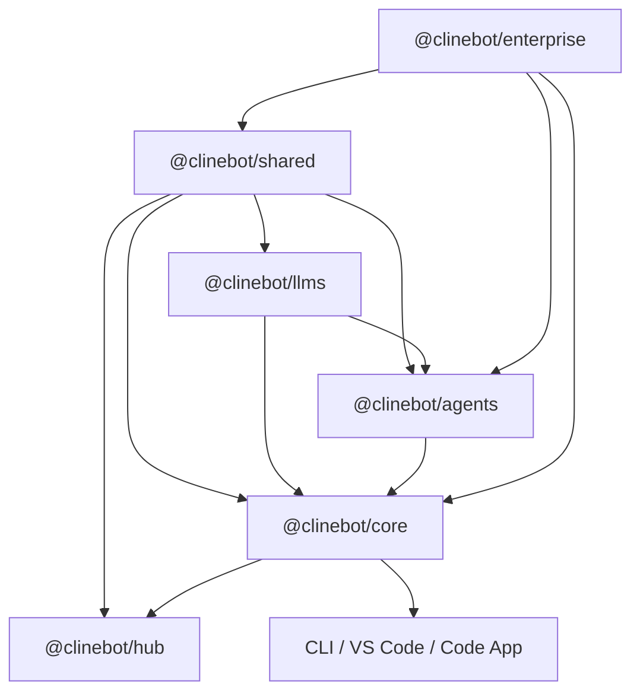

# Cline SDK — Development Reference

Quick-reference for active development. For onboarding, workspace setup, publishing, and detailed workflow see [CONTRIBUTING.md](./CONTRIBUTING.md). For architecture and runtime flows see [ARCHITECTURE.md](./ARCHITECTURE.md). For API details see [DOC.md](./DOC.md).

## Package Boundaries

### Published SDK Packages

- `@clinebot/shared`: shared contracts, schemas, path helpers, hook engine, extension registry, low-level utilities
- `@clinebot/llms`: provider settings/config, model catalogs, provider manifests, gateway contracts, handler creation
- `@clinebot/agents`: stateless agent loop, tool orchestration, hook/extension runtime, event streaming
- `@clinebot/hub`: hub discovery, WebSocket clients, session helpers, and host-side daemon controls
- `@clinebot/core`: stateful orchestration, session lifecycle, storage, config watching, plugin loading, default tools, telemetry

### Internal Package

- `@clinebot/enterprise`: enterprise identity adapters, control-plane sync, managed instruction materialization, claims-to-role mapping, telemetry bridging. Composes with core but `core` must not depend on it. Excluded from root SDK build/version/publish flows.

### Dependency Direction



Rules:
- `shared` stays low-level and reusable
- `agents` stays stateless — no session/storage/config concerns
- `core` owns stateful orchestration
- `hub` owns host-side discovery/client concerns while `core` owns the hub runtime/server behavior
- `enterprise` may depend on `core`, but not the reverse

## Change Routing

Route changes to the package that owns the concern:

- model/provider schemas or handler behavior: `@clinebot/llms`
- stateless loop, tool orchestration, streaming, hook/extension runtime: `@clinebot/agents`
- hub discovery, attach flows, and session-oriented client helpers: `@clinebot/hub`
- session lifecycle, storage, config watching, default tools, plugin loading, telemetry, and hub runtime services: `@clinebot/core`
- enterprise identity, control-plane sync, materialization, claims mapping: `@clinebot/enterprise`
- host-specific UX or shell behavior: app package

## Verifying Changes

Root commands for cross-package confidence:

```sh
bun run types       # typecheck all packages
bun run test        # run all tests
bun run check       # lint + build + typecheck + check-publish
```

If you touch hub/bootstrap/session flows, please update `ARCHITECTURE.md`.

## Practical Guidance

### Keep Boundaries Clean

- Don't move stateful logic down into `agents`
- Don't put app-specific behavior into `core` unless it is truly shared host behavior
- Don't let enterprise concerns leak into published core APIs unless they are generic and reusable

### Refactor Standard

- Prefer direct architectural cleanup over compatibility shims
- Move code to the layer that owns the concern and update all call sites
- If a helper just projects watcher state, keep it with the config layer instead of creating thin runtime wrappers

## Documentation Responsibilities

- `README.md`: visitor-facing overview. Update when the repo story or package inventory changes.
- `CONTRIBUTING.md`: onboarding, workflow, publishing. Update when contributor setup or release process changes.
- `AGENTS.md` (this file): development reference. Update when package boundaries, dependency rules, or change routing changes.
- `ARCHITECTURE.md`: design, boundaries, runtime flows. Update when system design or architectural constraints change.
- `DOC.md`: API and behavior reference. Update when exported surfaces, lifecycle semantics, or runtime behavior changes.
