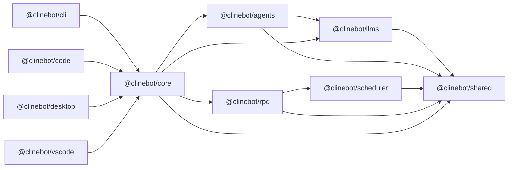
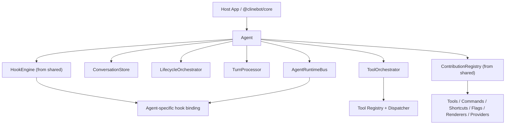
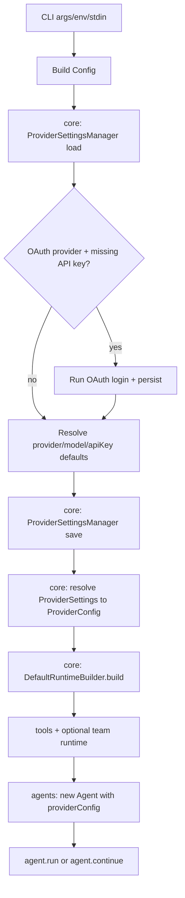

# Cline SDK Architecture

This document is the single architecture source of truth for this repository.

For contributor workflow/setup details, see [`AGENTS.md`](AGENTS.md).

## Workspace Map

Packages (SDK layers, bottom-up):

- `packages/shared` (`@clinebot/shared`): cross-package primitives and reusable runtime infrastructure (types, paths, helpers, DB access, Zod schemas, RPC constants, tool creation, hook engine/contracts, extension registry/contracts).
- `packages/llms` (`@clinebot/llms`): LLM provider runtime and catalog layer. Owns provider settings/config parsing, provider/model registry access, built-in provider manifests, and protocol-family model handlers (OpenAI-compatible, Anthropic, Gemini, Vertex, Bedrock, community SDK, etc.).
- `packages/scheduler` (`@clinebot/scheduler`): cron-based scheduled execution service with persistence, concurrency guards, and bounded autonomous routine polling. Internal to RPC.
- `packages/agents` (`@clinebot/agents`): stateless agent loop/runtime implementation. Owns the iteration loop, model turn processing, tool execution orchestration, and agent-facing hook/extension callback typing.
- `packages/rpc` (`@clinebot/rpc`): gRPC transport/control-plane (session CRUD, tasks, events, approvals, schedule management). Internal to host apps.
- `packages/core` (`@clinebot/core`): stateful orchestration layer binding everything together: runtime composition, session management, storage, config watchers, plugin loading, telemetry.

Apps (host runtimes):

- `apps/cli` (`@clinebot/cli`): command-line host with interactive TUI, single-prompt mode, RPC server management, and chat platform connectors (Slack, Telegram, WhatsApp, Google Chat).
- `apps/code` (`@clinebot/code`): Tauri + Next.js desktop app host.
- `apps/desktop` (`@clinebot/desktop`): Tauri desktop app with Kanban board UI and subprocess-per-task execution.
- `apps/vscode` (`@clinebot/vscode`): VS Code extension with webview chat over RPC.
- `apps/examples` (`examples`): example implementations using nightly SDK builds.

## Dependency Direction



Import boundary rules:

- `@clinebot/llms` now exposes one repo-facing root API plus a narrow browser entrypoint. Internal code should import from `@clinebot/llms`, not legacy subpaths such as `@clinebot/llms/models`, `@clinebot/llms/providers`, `@clinebot/llms/runtime`, or `@clinebot/llms/node`.
- Browser/frontend modules use `@clinebot/llms/browser` and `@clinebot/shared/browser` only when they need browser-safe exports.
- Shared contracts (types, schemas) import from bare package names: `@clinebot/core`, `@clinebot/shared`.
- `@clinebot/core` re-exports `@clinebot/llms` as `Llms` only. It no longer exposes separate `LlmsModels` and `LlmsProviders` namespaces.

## Runtime Flows

### Local in-process flow

1. Host (`cli` / desktop app runner) builds runtime through `@clinebot/core`.
2. `@clinebot/core` composes tools/policies via `DefaultRuntimeBuilder` and creates an `Agent` from `@clinebot/agents`.
3. `@clinebot/agents` uses `@clinebot/llms` provider handlers for model calls.
4. `@clinebot/core` persists session artifacts and state via `DefaultSessionManager`.

### RPC-backed flow

1. Host uses `RpcCoreSessionService` (through `@clinebot/core`) for session persistence/control-plane calls.
2. `@clinebot/rpc` server handles session/task/event/approval RPCs and schedule/execution RPCs.
3. `@clinebot/rpc` embeds `@clinebot/scheduler` to trigger scheduled runtime turns with concurrency and timeout guards.
4. SQLite session backend is provided by `@clinebot/core/node` (`createSqliteRpcSessionBackend`).

### Session persistence

Both local (`CoreSessionService`) and RPC (`RpcCoreSessionService`) persistence routes through `UnifiedSessionPersistenceService`. Backend-specific differences are isolated in adapters:

- Local adapter: `SqliteSessionStore`-backed SQL/session queue operations
- RPC adapter: `RpcSessionClient`-backed CRUD/queue operations

Session artifacts, subagent upserts, team task sub-sessions, and child-session status propagation use shared service logic to keep behavior identical across backends.

### Prompt queue and steer

`DefaultSessionManager` owns interactive pending-prompt state. Turn requests carry `delivery: "queue" | "steer"`:

- `"queue"` appends a pending user turn.
- `"steer"` promotes a prompt to the front of the pending list.

Core emits `pending_prompts` snapshots on queue changes and `pending_prompt_submitted` when a queued prompt becomes active. Queue entries preserve turn attachments. Host UIs should treat core as the source of truth for pending prompts.

## Agents Runtime (`@clinebot/agents`)

Stateless runtime layer providing:

- Agent loop execution (`Agent`, `createAgent`)
- In-memory conversation and turn processing
- Runtime-internal tool execution/formatting/registry helpers
- Agent-facing lifecycle hook and extension callback types

Reusable contracts and infrastructure live below the loop:

- `@clinebot/shared`: `createTool(...)`, hook engine/contracts, extension manifest/registry infrastructure
- `@clinebot/core`: team runtime, spawn/team tools, MCP bridge, subprocess hook hosts, default prompts, plugin discovery/loading, persistence, trust/sandbox policy

Stateful concerns belong in `@clinebot/core`.

## LLM Layer (`@clinebot/llms`)

`@clinebot/llms` is now organized around protocol families plus declarative built-in manifests, rather than provider-id-specific handler sprawl.

### Public shape

- Root entrypoint: `@clinebot/llms`
- Browser-safe entrypoint: `@clinebot/llms/browser`
- No public repo usage of `@clinebot/llms/models`, `@clinebot/llms/providers`, or `@clinebot/llms/runtime`

The root entrypoint exports:

- model catalog and registry helpers such as `getModelsForProvider`, `getProviderCollection`, `registerProvider`
- provider config/settings helpers such as `ProviderSettingsSchema`, `toProviderConfig`, `resolveProviderConfig`
- runtime handler APIs such as `createHandler`, `createHandlerAsync`
- the remaining llms runtime SDK exports, while they still exist internally

### Internal organization

Provider execution is split by wire protocol family, not by provider id:

- `providers/families/openai-compatible.ts`
- `providers/families/openai-chat.ts`
- `providers/families/openai-responses.ts`
- `providers/families/anthropic.ts`
- `providers/families/gemini.ts`
- `providers/families/vertex.ts`
- `providers/families/bedrock.ts`
- `providers/families/community.ts`
- explicit special cases such as `asksage.ts`

Declarative built-in provider metadata lives in `providers/runtime/builtin-manifests.ts`. That manifest layer drives:

- provider-family selection
- provider defaults
- auth/env-key lookup

This keeps provider-specific differences in data where possible and reserves separate implementation modules for genuinely different protocols.

### Runtime layers



### Execution model

The agent keeps one canonical in-memory conversation (`providers.Message[]`) and iterates until it returns a final answer.

**Conversation state:**

- Persistent per conversation (`ConversationStore`): `messages`, `conversationId`, `sessionStarted`
- Ephemeral per run: `activeRunId`, `abortController`, loop counters, aggregated usage, tool call records

**Run APIs:**

- `run(input)` - starts a new conversation, clears previous history
- `continue(input)` - appends to existing history
- `restore(messages)` - preloads history for resume flows

**Iteration loop:**

```text
user input
  -> iteration_start -> turn_start -> before_agent_start
  -> model stream (text/reasoning/tool_calls/usage)
  -> assistant message persisted
  -> if no tool calls: iteration_end + done
  -> if tool calls: execute in parallel -> persist tool_result -> iteration_end -> next iteration
```

Tool-call arguments are buffered from stream chunks and finalized at end-of-turn via `parseJsonStream`.

### Events and hooks

**`AgentEvent` types:** `iteration_start`, `content_start`, `content_end`, `usage`, `iteration_end`, `done`, `error`

**Hook stages (in dispatch order):**

1. `session_start` (first run only)
2. `run_start`
3. Per iteration: `iteration_start` -> `turn_start` -> `before_agent_start` -> `tool_call_before`/`tool_call_after` -> `turn_end` -> `iteration_end`
4. `run_end`
5. Additional: `stop_error`, `error`, `session_shutdown`, `runtime_event`

Ownership split:

- `@clinebot/shared` owns generic hook contracts and the reusable `HookEngine`
- `@clinebot/agents` owns agent-specific lifecycle payload typing and the runtime hook-binding layer in `runtime/hook-registry.ts`
- `@clinebot/core` owns subprocess/persistent/file-backed hook hosts and hook file loading/merging

Key lifecycle distinctions:

- `run_start`: once per `run()` / `continue()` invocation, before the first iteration
- `iteration_start`: once per loop iteration, before turn construction
- `before_agent_start`: once per iteration, immediately before the model call; last chance to replace `systemPrompt`, append messages, or cancel
- `stop_error`: dispatched when a turn-level error causes forward progress to stop for that run path
- `error`: dispatched only when an error escapes the main agent loop and the run fails with final `finishReason = "error"`

Dispatch behavior:

- Blocking stages return merged `AgentHookControl` (`cancel`: OR, `context`: joined, `overrideInput`/`systemPrompt`: last writer wins, `appendMessages`: concatenated)
- Async stages use bounded queue limits and per-stage concurrency budgets
- Handler order: higher `priority` first, then handler name

### Extensions

Extensions follow a deterministic lifecycle: resolve -> validate -> setup -> activate -> run. No dynamic registration during `run`.

- `@clinebot/shared`: owns extension manifest/contracts plus `ContributionRegistry`
- `@clinebot/agents`: supplies agent-specific extension callback typing and registers validated hook handlers into the shared hook engine
- `@clinebot/core`: discovers modules from disk, loads/instantiates them, applies trust/sandbox policy, persists state

`ContributionRegistry` collects tools, commands, shortcuts, flags, renderers, and providers into one normalized snapshot.

### Performance guardrails

- Tool execution bounded by `AgentConfig.maxParallelToolCalls` (default `8`)
- Hook stages have bounded timeout/retry and per-stage concurrency budgets
- Hook routing is stage-indexed (no scanning unrelated handlers)
- Extension setup runs once per agent lifecycle

## Core Runtime (`@clinebot/core`)

### Runtime composition

`DefaultRuntimeBuilder.build(...)` composes the full runtime:

1. Resolves provider settings to `ProviderConfig` (including cloud-specific fields: `aws`, `gcp`, `azure`, `sap`, `oca`)
2. Overlays runtime overrides (`model`, `apiKey`, `baseUrl`, `headers`, `thinking`)
3. Assembles tools and optional team runtime
4. Creates `Agent` with the composed config

`@clinebot/core` is the app-facing aggregator. For llms functionality it exposes a single namespace, `Llms`, which is a straight re-export of `@clinebot/llms`. App code should not expect separate `LlmsModels` or `LlmsProviders` namespaces.

### Input preparation

`DefaultSessionManager` prepares each user turn before handing it to the agent:

1. Mention enrichment resolves `@path` tokens against `session.config.workspaceRoot ?? session.config.cwd`
2. File indexer provides cached workspace file lists (15s cache, 10min eviction for idle workspaces)
3. Validated paths are converted to absolute attachments for the turn

### Checkpoints

Core now creates git-backed checkpoints for root sessions during the agent loop.

- Checkpoint creation is implemented as a core-owned runtime hook layered onto the session's effective hook set.
- The hook runs once per root-agent `run()` / `continue()` invocation on the first `before_agent_start` stage of that run.
- Placement is intentional: it snapshots the working tree immediately before the first model turn can create new edits or tool side effects.
- Subagents do not create checkpoints.
- Checkpoints are stored in session metadata under `metadata.checkpoint` with:
  - `latest`
  - `history[]`
  - per-entry fields: `ref`, `createdAt`, `runCount`
- Snapshotting uses git stash object refs so restore applies through normal git mechanics rather than a custom file-level rollback path.

### Runtime command resolution

Skills and workflows from workspace instructions are resolved in `packages/core/src/runtime/commands.ts`:

- Merges workflow and skill slash commands (workflows take precedence on name collision)
- Expands `/command` input into full instructions before the turn reaches the agent
- Separate from CLI chat commands (see below)

### OAuth refresh

OAuth token refresh is owned by core session runtime (not UI/CLI clients).

Managed providers: `cline`, `oca`, `openai-codex`

Core refreshes tokens pre-turn, persists refreshed credentials, and performs single-flight refresh in long-lived runtimes.

## CLI (`@clinebot/cli`)

The executable shell around the runtime stack. Parses CLI input, composes runtime via `@clinebot/core`, executes agent loops through core session services, resolves providers through `@clinebot/core` and `@clinebot/llms`, and optionally runs the RPC gateway via `@clinebot/rpc`.

Checkpoint-related user surfaces now live here as well:

- `clite checkpoint status|list|restore` resolves checkpoint metadata from persisted session records and restores via `git stash apply <ref>`
- `clite history` surfaces checkpoint metadata in both JSON output and the interactive TUI (row badge + selected-row detail panel)

### Runtime startup



### Chat command system

`ChatCommandHost` (`apps/cli/src/utils/chat-commands.ts`) is a class-based command registry supporting:

- `register(kind, definition)` - adds a command with name aliases and handler
- `handle(input, context)` - routes input to matching handler
- `clone()` - creates a copy for extensibility

**Built-in commands:** `/reset` (`/new`), `/abort`, `/stop`, `/whereami`, `/tools`, `/yolo`, `/cwd`, `/schedule`

**Command resolution precedence:**

1. Built-in CLI/chat commands
2. Plugin-provided commands (discovered via `ContributionRegistry` from workspace plugins)
3. Runtime slash commands (skills/workflows, expanded during prompt preparation in core)

Interactive CLI and connector bridges clone the host and register extra commands before handling input.

### Tool approval modes

1. Terminal mode (default): prompt on TTY, deny on non-TTY
2. Desktop file-IPC mode (`CLINE_TOOL_APPROVAL_MODE=desktop`): write requests to `CLINE_TOOL_APPROVAL_DIR`, poll for decision
3. Hook-requested review: `tool_call_before` hooks can return `review: true` to force approval

### RPC server lifecycle

- `clite rpc start`: starts in-process gateway if no server is active
- `clite rpc status`: probes server health
- `clite rpc stop`: requests graceful shutdown
- `clite rpc ensure`: delegates to shared `@clinebot/core` ensure logic and serializes startup with a cross-process lock under `~/.cline/data/locks/`

Sidecar reuse/replacement is owner-scoped. The shared ensure path records discovery under `~/.cline/data/rpc/owners/`, reuses a compatible owned sidecar when its runtime build key matches, and otherwise starts a replacement on the requested address or the next free port. The default runtime build key is derived from `@clinebot/core` and `@clinebot/rpc` package versions, with optional host-specific extension.

### Connector bridge system

`clite connect <adapter>` launches long-running chat platform bridges on top of the RPC runtime.

**Architecture:**

- `ConnectorBase` (`apps/cli/src/connectors/base.ts`): abstract base class providing CLI arg parsing, state file persistence, background process management, and graceful shutdown
- `connector-host.ts`: shared turn handler that routes user messages through chat commands, approval handling, and RPC session management
- Adapter implementations: `slack.ts`, `telegram.ts`, `whatsapp.ts`, `gchat.ts`
- Thread bindings (`thread-bindings.ts`): persist per-thread state (session ID, tool toggles, cwd) to disk
- Session runtime (`session-runtime.ts`): builds RPC session config, manages session creation/reuse per thread

**Message flow:**

1. Chat platform message arrives via adapter (polling or webhook)
2. Load thread binding and state
3. Try handling as chat command (`/reset`, `/tools`, etc.)
4. If not a command, resolve runtime slash commands (skills/workflows)
5. Get or create RPC session for the thread
6. Stream turn through `handleConnectorRuntimeTurnStream()`
7. Convert `runtime.chat.text_delta` events into adapter replies
8. Persist updated thread state

**Connector features:**

- Connectors subscribe to RPC events (e.g. `schedule.execution.completed`) and post schedule results back to matching delivery threads
- `/tools`, `/yolo`, `/cwd` changes clear the session binding so the next message starts a fresh runtime
- `clite connect --stop [adapter]` enumerates state files, terminates bridge processes, and cleans up sessions
- Connectors exit when the RPC server broadcasts `rpc.server.shutting_down`

## Team Runtime

### In-memory orchestration (`@clinebot/core`)

Provides tasks, mailbox, mission log, async run scheduler, outcome fragments, and finalization gates.

### Persistence (`@clinebot/core`)

`SqliteTeamStore` persists team state at `~/.cline/data/teams/teams.db`:

- Append-only `team_events` table with materialized projections in `team_tasks`, `team_runs`, `team_outcomes`, `team_outcome_fragments`
- On restart, `DefaultRuntimeBuilder` restores team snapshot by `teamName` and marks stale runs as `interrupted`

### Team session lifecycle

- `DefaultSessionManager` keeps the lead loop alive while async teammate runs are active
- Auto-continues lead agent with system-delivered run terminal updates on completion/failure/cancel
- Failed teammate runs include conversation snapshots, persisted to team-task sub-session files
- Run records carry live activity metadata (`currentActivity`, `lastProgressMessage`, heartbeats)
- `team_task` with `action="list"` returns claimable readiness and unresolved dependencies

## Scheduled Execution

Cron-based schedules are managed through `@clinebot/scheduler` (embedded in the RPC server).

- Standard execution: one scheduled prompt with timeout/concurrency enforcement
- Autonomous mode (`autonomous.enabled = true`): scheduler appends autonomous instructions, then enters idle poll loop where the agent inspects `team_read_mailbox` and `team_task` with `action="list"`, claims ready tasks, and continues work
- Autonomous loop bounded by `pollIntervalSeconds` and `idleTimeoutSeconds`
- Execution metrics (`iterations`, `tokensUsed`, `costUsd`) aggregate across all turns in the routine lifecycle

## Desktop App (`@clinebot/desktop`)

Four-layer architecture:

1. **Frontend** (Next.js): Kanban board UI managing card lifecycle (`queued -> running -> completed|failed|cancelled`)
2. **Desktop runtime** (Tauri/Rust): process orchestration, subprocess spawning per task card, websocket bridge for chat
3. **RPC runtime** (CLI RPC server): shared session runtime and event bus
4. **Execution engine** (CLI + Agents): agent loop with tools/spawn/team per session config

### Session registry

SQLite at `~/.cline/data/sessions/sessions.db` (or `CLINE_SESSION_DATA_DIR`). Uses optimistic locking (`status_lock` column) to prevent concurrent-writer races between runtime updates and exit handlers.

### Desktop session lifecycle

1. User creates card -> UI sends `start_session` -> Tauri launches CLI subprocess
2. CLI runs task, emits events, stores state in SQLite with lock checks
3. Tauri relays output and polls persisted sessions
4. UI imports unknown sessions as cards and finalizes status from registry/process events

## VS Code Extension (`@clinebot/vscode`)

1. Registers `Cline: Open RPC Chat` command, launches webview panel
2. Ensures RPC server via the shared ensure path exposed through `clite rpc ensure --json`
3. Creates `RpcSessionClient` against the ensured address
4. Chat turns run through runtime RPC methods (`Start/Send/Abort/StopRuntimeSession`)
5. Streams `runtime.chat.text_delta` and tool lifecycle events to the webview
