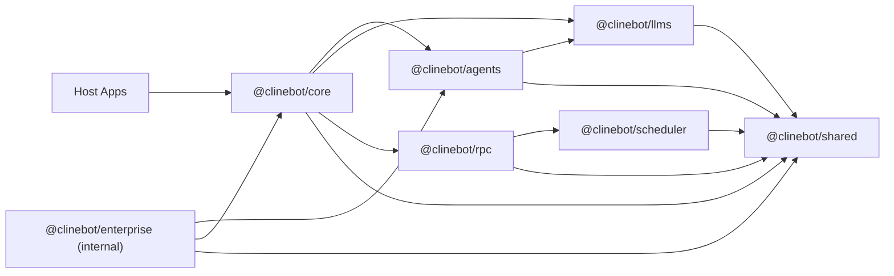

# Cline SDK Architecture

This document is the architecture source of truth for the repository.

It focuses on:

- package boundaries
- dependency direction
- runtime flows
- design constraints

It is not the main onboarding guide and it is not the detailed API reference.

## Layered Model

The workspace is organized as a layered runtime stack.

## Package Responsibilities

### `@clinebot/shared`

Owns reusable low-level contracts and infrastructure:

- shared types and schemas
- path resolution
- hook contracts/engine
- extension registry contracts
- prompt and parsing helpers
- storage path helpers

Design rule:

- `shared` should not depend on higher-level runtime packages.

### `@clinebot/llms`

Owns model/provider runtime concerns:

- provider settings/config resolution
- model catalogs and manifests
- handler creation
- protocol-family execution code

Design rule:

- provider-specific behavior should be isolated here, not spread across `core` or apps.

### `@clinebot/agents`

Owns the stateless runtime loop:

- agent iteration loop
- tool orchestration
- runtime event emission
- hook/extension execution
- context-limit detection and compaction trigger dispatch
- in-memory team/runtime primitives

Design rule:

- `agents` should not own persistent storage or host lifecycle concerns.

### `@clinebot/scheduler`

Owns scheduled execution:

- cron definitions
- execution concurrency/limits
- run history and schedule persistence

Design rule:

- scheduling stays separate from the interactive/runtime composition layer.

### `@clinebot/rpc`

Owns cross-process transport:

- session/task/event routing
- approvals
- schedule execution gateway
- runtime RPC contracts

Design rule:

- RPC should expose and transport runtime capabilities, not re-own business logic that already belongs in `core`.

### `@clinebot/core`

Owns stateful orchestration:

- runtime composition
- session lifecycle
- storage and persistence
- config watching/loading
- default host tool assembly
- plugin discovery/loading
- default context compaction policy
- telemetry integration

Design rule:

- `core` is the app-facing orchestration layer over `agents`.

### `@clinebot/enterprise`

Internal-only enterprise integration layer:

- enterprise identity adapters
- enterprise control-plane sync
- enterprise token/bundle storage
- managed rule/workflow/skill materialization
- claims-to-role mapping
- enterprise telemetry normalization and core bridge helpers

Design rules:

- `enterprise` may depend on `core`
- `core` must not depend on `enterprise`
- enterprise stays optional and internal to this repo

## Runtime Flows

### Local In-Process Runtime

1. Host constructs a runtime through `@clinebot/core`.
2. `@clinebot/core` resolves provider config, tools, watchers, hooks, and telemetry.
3. `@clinebot/core` creates an `Agent` from `@clinebot/agents`.
4. `@clinebot/agents` runs the loop using `@clinebot/llms` handlers.
5. `@clinebot/core` persists state, artifacts, and metadata.

### RPC-Backed Runtime

1. Host connects to or ensures an RPC runtime.
2. `@clinebot/rpc` brokers sessions, events, approvals, and schedules.
3. `@clinebot/core` still owns common session persistence logic.
4. `@clinebot/scheduler` runs behind RPC for schedule-triggered execution.

### Enterprise-Managed Runtime

1. Enterprise bootstrap resolves identity through an `IdentityAdapter`.
2. Enterprise fetches a normalized `EnterpriseConfigBundle`.
3. Enterprise caches the token and bundle through enterprise stores.
4. Enterprise materializes managed rules/workflows/skills under workspace-local `.cline/<plugin>/`.
5. Enterprise optionally derives telemetry config or telemetry services.
6. Hosts pass the prepared result into `@clinebot/core` through the generic `prepare` seam.
7. `@clinebot/core` consumes watcher/extension/telemetry inputs generically.

This keeps enterprise-specific behavior above the published orchestration layer.

## Design Seams

The codebase relies on a few repeated seams instead of one-off integration paths.

### 1. Config Watchers

Core uses file-based discovery and watchers for:

- rules
- workflows
- skills
- agents
- hooks
- plugins

Design implication:

- new instruction sources should usually materialize into files and reuse watcher-based loading instead of inventing parallel in-memory execution paths.

### 2. Runtime Builder Inputs

`DefaultRuntimeBuilder` composes a runtime from generic inputs:

- tools
- hooks
- extensions
- user instruction watcher
- telemetry

Design implication:

- higher-level integrations should prefer feeding those seams rather than patching agent internals directly.

### 2a. Session Startup Bootstrap

`ClineCore.create(...)` exposes a generic `prepare(input)` hook.

Design implication:

- higher-level packages can prepare workspace-scoped runtime state before a session starts
- core stays unaware of enterprise-specific contracts
- cleanup stays at the host boundary rather than inside the agent loop

### 3. Storage Adapters

Stateful persistence should be isolated behind adapter/service layers.

Design implication:

- file-backed, SQLite-backed, RPC-backed, and enterprise-specific persistence should share service logic where possible and isolate backend differences in adapters.

### 4. Extension and Hook System

Extensibility is split deliberately:

- extensions register runtime contributions
- hooks intercept lifecycle stages

Design implication:

- additive runtime behavior should usually enter through these extension points instead of bespoke special-case host code.

### 5. Context Compaction

Context compaction is split across `agents` and `core` on purpose.

- `@clinebot/agents` owns the generic runtime seam:
  - detect when context usage crosses the configured threshold
  - dispatch `context_limit_reached`
  - allow hook/extension handlers to replace message history
- `@clinebot/core` owns the default fallback behavior:
  - inject a default compaction policy for root sessions
  - choose between built-in `agentic` and `basic` strategies
  - keep strategy-specific implementation out of `MessageBuilder`

Design implications:

- compaction is a first-class lifecycle concern, not a prompt-formatting concern
- plugin authors should customize compaction through `onContextLimitReached`
- delegated/subagent flows should inherit compaction behavior through extensions, not through a separate delegated compaction config surface

## Architectural Constraints

### Keep `agents` Stateless

Do not move these concerns into `@clinebot/agents`:

- session persistence
- provider settings storage
- RPC lifecycle
- host-specific approvals
- enterprise policy caching

### Keep `core` Generic

Do not make `@clinebot/core` enterprise-specific.

If a capability is truly generic, add a generic seam to core. If it is enterprise-specific, keep it in `@clinebot/enterprise`.

### Use One-Way Optional Layers

Optional higher-level integrations may depend on lower layers.
Lower layers should not depend on optional feature packages.

That rule is what keeps:

- `enterprise -> core` acceptable
- `core -> enterprise` unacceptable

## Current Internal Enterprise Design

`@clinebot/enterprise` currently integrates with core through three main entrypoints:

- `prepareEnterpriseRuntime(...)`
- `prepareEnterpriseCoreIntegration(...)`
- `createEnterprisePlugin(...)`

Preferred bridge:

- `prepareEnterpriseCoreIntegration(...)`

Why:

- it prepares and materializes enterprise-managed files under `.cline/<plugin>/`
- it returns a valid `AgentExtension`
- it can create a telemetry service from enterprise telemetry settings
- it lets core consume enterprise behavior through existing generic seams and normal watcher discovery

## Publishability Constraint

This repo has both publishable SDK packages and internal workspace packages.

Architectural consequence:

- internal packages must not accidentally become part of the publishable SDK surface
- release automation should only target the intended published packages
- internal code may compose with published packages, but published packages should not take hard dependencies on internal-only workspace layers unless you explicitly intend to publish that integration
